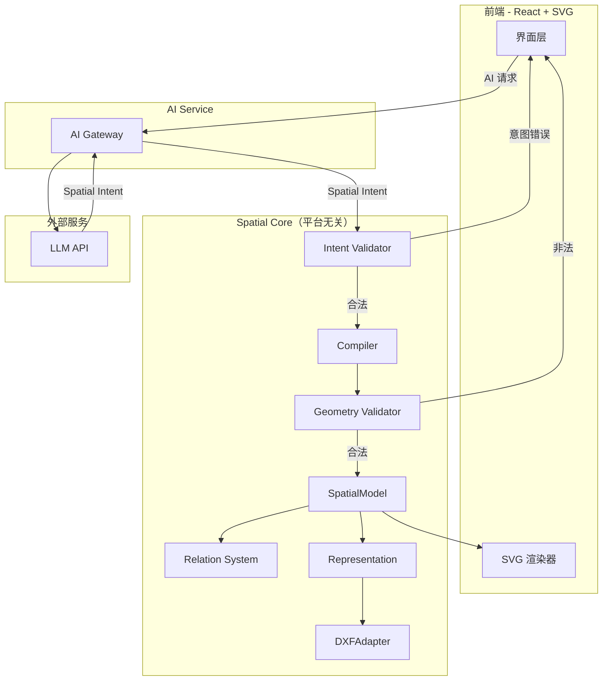

## 1. 架构设计

**核心原则：Spatial Core 是平台无关的核心资产，不依赖 UI。Representation 是 Core 的能力之一。**



Core 内部结构（当前 MVP）：

```
VectorAI Core
├── Intent Validator      <- 意图层验证（LLM 输出是否合理）
├── Compiler              <- 编译为标准协议
├── Geometry Validator     <- 几何层验证（数值合法性）
├── SpatialModel           <- 空间模型（三层结构 + 版本历史预留）
├── Relation System         <- 关系系统（MVP 仅 constraint 类型关系）
└── Representation          <- 表示层（Core 内置）
      ├── DXFAdapter
      ├── SVGAdapter（未来）
      └── STEPAdapter（未来）
```

长期演进愿景 - Spatial Kernel：

```
VectorAI Core
├── Intent Layer
│    └── Intent Validator
├── Spatial Kernel               <- 未来几何核心，日趋复杂
│    ├── Geometry
│    ├── Relation（含 Constraint）
│    └── Solver（未来约束求解）
├── Model Layer
│    └── SpatialModel（含历史版本链）
└── IO Layer
     └── Representation (DXF, SVG, STEP, GLTF)
```

编译流水线：**LLM -> Spatial Intent -> Intent Validator -> Compiler -> Geometry Validator -> SpatialModel**

- LLM 输出宽松的空间意图（可能缺字段、用索引引用实体、参数为字符串等）
- Intent Validator 检查意图合理性（如 `radius: "large"` 是意图错误，非几何错误），在 Compiler 前拦截
- Compiler 规范化为严格协议（分配 ID、转换引用、填充默认值）
- Geometry Validator 校验几何合法性（半径 > 0、坐标有效）
- SpatialModel 存储最终的空间实体 + 关系 + 语义实体

长期愿景：

```
VectorAI Core (C++ 优先 / TS MVP)
         |
  -----------------
  |       |        |
 Web     iOS    CAD Plugin
```

## 2. 技术栈

- **Spatial Core**：TypeScript（独立模块 `src/core/`，无 React 依赖）。长期迁移 C++（工业 CAD 生态主导语言），通过 WASM 供各平台调用
- **前端**：React 18 + TypeScript + Vite + Tailwind CSS 3 + Zustand
- **后端**：Express 4 + TypeScript（ESM 格式），AI Service 层
- **AI Service**：AI Gateway 代理 LLM 调用。未来扩展 Prompt 管理、Few-shot 示例、模型选择、成本控制
- **渲染**：SVG（React 组件，支持原生 DOM 事件交互）
- **表示层**：RepresentationAdapter 模式，Core 内置（DXFAdapter 实现，未来扩展 SVGAdapter / STEPAdapter / GLTFAdapter）
- **测试**：Vitest，测试文件即协议标准案例
- **初始化工具**：vite-init（react-express-ts 模板）

## 3. 项目结构

```
src/
  core/                        <- Spatial Core（平台无关，无 UI 依赖）
    types.ts                   <- 协议类型定义
    intent-validator.ts        <- 意图验证器
    compiler.ts                <- 协议编译器
    validator.ts               <- 几何验证器
    model.ts                   <- SpatialModel 管理
    adapters/
      types.ts                 <- RepresentationAdapter 接口
      dxf.ts                   <- DXFAdapter
    tests/                     <- 测试（即协议标准案例）
      intent-validator.test.ts
      compiler.test.ts
      validator.test.ts
      dxf.test.ts
      examples/                <- 示例 Spatial Intent JSON
        simple_circle.json
        two_holes.json
        bracket.json
  components/                  <- React UI 组件
  hooks/                       <- React hooks
  pages/                       <- 页面
  utils/                       <- 前端工具函数
api/                           <- Express 后端
  services/
    ai-gateway.ts              <- AI Gateway（未来扩展为 AI Service）
  routes/
    ai.ts                      <- AI 路由
```

## 4. 路由定义

| 路由 | 用途 |
|------|------|
| / | 主工作区（单页应用） |

## 5. API 定义

### POST /api/ai/generate

接收自然语言描述与当前画布上下文，经 AI Gateway 调用 LLM，返回 Spatial Intent。编译和验证在前端 Spatial Core 中完成。

```typescript
interface GenerateRequest {
  prompt: string;
  context?: SpatialModel;
  unit?: 'mm' | 'cm' | 'm';
}

interface GenerateResponse {
  success: boolean;
  intent?: SpatialIntent;
  error?: string;
}
```

**AI Service 未来扩展：**
- Prompt 管理（system prompt 模板化）
- Few-shot 示例注入（使用 `core/tests/examples/` 中的标准案例）
- 用户上下文传递（当前画布对象 + 关系）
- 模型选择（不同复杂度请求路由不同 LLM）
- 成本控制（token 计数、速率限制）

## 6. 空间协议类型定义

### 6.1 协议头与模型

协议从第一天起是三层结构：Semantic Layer -> Spatial Model Layer -> Representation Layer。

```typescript
interface SpatialModel {
  protocol: 'VectorAI-Spatial';
  version: string;                      // "0.1"
  metadata: ModelMetadata;
  entities: GeometryEntity[];           // 几何层
  relations: SpatialRelation[];        // 关系层（MVP 仅 constraint 类型）
  semanticEntities?: SemanticEntity[];  // 语义层（MVP 不实现，协议预留）
}

interface ModelMetadata {
  unit: 'mm' | 'cm' | 'm';
  createdBy: 'AI' | 'user' | 'system';
  timestamp: number;
  parentId?: string;                    // 前一版本模型 ID，支持 Undo/History（类 Git，MVP 预留不实现）
}
```

所有 SpatialModel 必须包含协议标识、版本号和 metadata。`parentId` 支持版本链：AI 制图的核心特征是 生成 -> 修改 -> 再生成 -> 撤销，模型天然需要历史追踪。

### 6.2 几何实体

关系不是图形，它是实体间的关联。因此几何实体与关系分离。

```typescript
interface BaseEntity {
  id: string;
  type: EntityType;
  visible: boolean;
  parentId?: string;                   // 预留：父实体 ID，支持组织结构（零件 -> 孔/外轮廓/标注）
  group?: string;                       // 预留：分组名称
}

type EntityType = 'point' | 'line' | 'circle';
// 协议可扩展: 未来增加 'arc' | 'rect' | 'text' | ...

interface PointEntity extends BaseEntity {
  type: 'point';
  x: number;
  y: number;
}

interface LineEntity extends BaseEntity {
  type: 'line';
  start: [number, number];
  end: [number, number];
}

interface CircleEntity extends BaseEntity {
  type: 'circle';
  center: [number, number];
  radius: number;
}

type GeometryEntity = PointEntity | LineEntity | CircleEntity;
```

### 6.3 关系（Relations）

关系是实体间的关联。MVP 阶段所有关系均为约束类型（constraint），未来扩展为包含非数学关系（belongs_to, connected_to）。

```typescript
// 约束类型（当前所有 RelationKind 均为约束）
type ConstraintKind =
  | 'coincident'     // 重合：端点/中心重合
  | 'horizontal'     // 水平：线段水平
  | 'vertical'       // 垂直：线段垂直
  | 'parallel'       // 平行：两线段平行
  | 'perpendicular'  // 正交：两线段垂直
  | 'tangent'        // 相切：两曲线相切
  | 'distance'       // 距离：两实体距离 = value
  | 'radius'         // 半径：圆半径 = value
  | 'angle'          // 角度：两线段夹角 = value
  | 'equal'          // 相等：指定属性相等
  | 'symmetry';      // 对称：关于轴对称

// MVP: 所有关系类型均为约束类型
// 未来: RelationKind = ConstraintKind | 'belongs_to' | 'connected_to' | ...
type RelationKind = ConstraintKind;

type RelationStatus = 'defined' | 'violated' | 'unsolved';

interface SpatialRelation {
  id: string;
  kind: RelationKind;
  entities: string[];                  // 引用实体 ID
  status: RelationStatus;              // 关系状态
  value?: number;                      // distance / radius / angle 的值
  axis?: 'x' | 'y' | string;          // symmetry 的对称轴标识
  property?: string;                   // equal 的属性名（如 "radius"）
}
```

**status 字段说明：**
- `defined`：关系已定义且当前几何满足
- `violated`：关系存在但当前几何不满足（如距离应为 100，实际 80）
- `unsolved`：关系已定义但尚未求解（MVP 阶段所有关系默认 `unsolved`）

关系类型说明：

| 关系类型 | entities 数量 | 附加参数 | 语义 | MVP 实现 |
|----------|-------------|----------|------|---------|
| coincident | >= 2 | - | 点/端点/中心重合 | 仅定义 |
| horizontal | 1 | - | 线段水平 | 仅定义 |
| vertical | 1 | - | 线段垂直 | 仅定义 |
| parallel | 2 | - | 两线段平行 | 仅定义 |
| perpendicular | 2 | - | 两线段正交 | 仅定义 |
| tangent | 2 | - | 两曲线相切 | 仅定义 |
| distance | 2 | value | 两实体距离 = value | ✅ 实现 |
| radius | 1 | value | 圆半径 = value | ✅ 实现 |
| angle | 2 | value | 两线段夹角 = value | 仅定义 |
| equal | >= 2 | property | 指定属性相等 | 仅定义 |
| symmetry | >= 2 | axis | 关于轴对称 | 仅定义 |

### 6.4 空间意图（Spatial Intent）

LLM 输出的中间表示。使用 `params` 字段避免 LLM 字段名混乱（如 r / radius / size 混用）。

```typescript
interface SpatialIntent {
  objects: IntentObject[];
  relations?: IntentRelation[];
  description?: string;
  confidence?: number;                  // AI 置信度 0-1，UI 可展示"设计可信度 87%"
}

interface IntentObject {
  type: EntityType;
  params: Record<string, unknown>;    // 宽松参数，编译器规范化
  reference?: string;                   // 可选名称，供关系引用
}

interface IntentRelation {
  kind: RelationKind;
  entities: (number | string)[];       // 索引或 reference 名称，编译器转为 ID
  value?: number;
  axis?: string;
  property?: string;
}
```

示例：
```json
{
  "confidence": 0.87,
  "objects": [
    {"type": "circle", "params": {"center": [50, 50], "radius": 20}, "reference": "left_hole"},
    {"type": "circle", "params": {"center": [150, 50], "radius": 20}, "reference": "right_hole"}
  ],
  "relations": [
    {"kind": "equal", "entities": ["left_hole", "right_hole"], "property": "radius"},
    {"kind": "distance", "entities": ["left_hole", "right_hole"], "value": 100}
  ]
}
```

### 6.5 语义层（协议预留，MVP 不实现）

**这是未来区别于传统 CAD 的核心护城河。** AI 天然理解语义（"孔"而非"圆"），映射到几何层。从第一天起在 SpatialModel 中预留 `semanticEntities?` 字段。

```typescript
interface SemanticEntity {
  id: string;
  semanticType: string;            // 'hole' | 'bracket' | 'wall' | 'gear' | 'bolt' | ...
  geometryId: string;              // 引用 GeometryEntity
  properties?: Record<string, unknown>;
}
```

三层结构：

```
Semantic Layer（语义层：Hole, Bracket, Gear...）
        |
Spatial Model Layer（空间模型层：Circle, Line, Point + Relations）
        |
Representation Layer（表示层：DXF, SVG, STEP, GLTF...）
```

- **Semantic Layer**：AI 理解的工程语义（"安装孔"而非"半径5的圆"）
- **Spatial Model Layer**：真实几何模型 + 关系
- **Representation Layer**：不同格式的表示方式（DXF/SVG/STEP 是同一模型的不同表示，不是空间层）

MVP 仅在协议中预留字段，不实现逻辑。

## 7. Intent Validator（意图验证器）

在 Compiler 前拦截意图层面的错误。检查 AI 输出是否像一个合理的空间意图请求。

校验规则：
1. `type` 是已知 EntityType
2. `params` 中包含该类型所需的关键字段（如 circle 需要 radius 相关参数）
3. 参数值不是明显非法的类型（如 `radius: "large"` 是意图错误，非几何错误）
4. `kind` 是已知 RelationKind
5. 关系的 `entities` 数组非空

与 Geometry Validator 的区别：
- Intent Validator：检查"AI 输出是否合理"（字段存在性、类型粗判）
- Geometry Validator：检查"几何是否合法"（半径 > 0、坐标有效、关系引用存在）

## 8. 协议编译器（Compiler）

将通过 Intent Validator 的 Spatial Intent 编译为标准 SpatialModel。

职责：
1. 为每个 IntentObject 分配唯一 ID
2. 从 `params` 中提取并规范化字段（确保 number / [number, number] 格式）
3. 填充默认值（visible: true, status: 'unsolved'）
4. 将关系中的索引/引用名转换为实体 ID
5. 输出 `{ entities: GeometryEntity[], relations: SpatialRelation[] }`

## 9. Geometry Validator（几何验证器）

校验编译后的 SpatialModel 几何合法性。

校验规则：
1. 半径 > 0（circle）
2. 坐标为有效数字（非 NaN / Infinity）
3. 线段 start != end
4. 关系引用的实体 ID 存在
5. 关系参数合法（distance >= 0, radius > 0）
6. 关系实体数量匹配（见关系类型表）

## 10. Representation（Core 内置）

表示层是 Spatial Core 的能力之一，采用适配器模式。Geometry 是真实模型，DXF/SVG/STEP 是不同表示方式。

```typescript
interface RepresentationAdapter {
  format: string;
  represent(model: SpatialModel): string;
}

class DXFAdapter implements RepresentationAdapter {
  format = 'dxf';
  represent(model: SpatialModel): string { ... }
}
// 未来: SVGAdapter, PDFAdapter, STEPAdapter, GLTFAdapter
```

### DXF 导出规范

导出 DXF R12 规范文本文件：
- **ENTITIES 段**：GeometryEntity 映射为 DXF 实体
  - POINT -> DXF POINT
  - LINE -> DXF LINE
  - CIRCLE -> DXF CIRCLE（保持 radius，非线段近似）
- 关系不导出（暂不求解，仅保留在协议层）
- 导出原则：保持结构化，圆是圆而非线段近似

## 11. 前端状态模型

```typescript
interface AppState {
  model: SpatialModel;
  selectedId: string | null;

  aiMessages: ChatMessage[];
  aiStatus: 'idle' | 'loading' | 'error';

  canvasTransform: {
    scale: number;
    offsetX: number;
    offsetY: number;
  };

  showGrid: boolean;
  showRelations: boolean;

  // 操作方法
  applyIntent: (intent: SpatialIntent) => string[];   // 编译+验证+存储，返回错误
  updateEntity: (id: string, patch: Partial<GeometryEntity>) => void;
  deleteEntity: (id: string) => void;
  selectEntity: (id: string | null) => void;
  sendPrompt: (prompt: string) => Promise<void>;
  exportDXF: () => void;
}

interface ChatMessage {
  id: string;
  role: 'user' | 'assistant';
  content: string;
  intent?: SpatialIntent;
  confidence?: number;
  timestamp: number;
}
```

## 12. 测试驱动

测试文件即协议标准案例，是空间协议的活文档。

```
core/tests/
  intent-validator.test.ts   <- 意图验证测试
  compiler.test.ts            <- 编译器测试
  validator.test.ts           <- 几何验证测试
  dxf.test.ts                 <- DXF 导出测试
  examples/                   <- 示例 Spatial Intent JSON
    simple_circle.json        <- 单圆（基础验证）
    two_holes.json            <- 双孔 + 关系（equal + distance）
    bracket.json              <- 支架组合（线 + 圆 + 关系）
```

每个示例 JSON 是一个标准 Spatial Intent，用于：
1. 测试 Compiler / Validator / DXFAdapter 的正确性
2. 作为协议文档的活案例
3. 未来 LLM prompt 中的 few-shot 示例

## 13. WASM 迁移路径

当前 MVP 使用 TypeScript 实现 Spatial Core（`src/core/`），无 UI 依赖。

- **MVP**：TypeScript
- **长期**：C++ 优先（工业 CAD 生态、几何库、工业接口均以 C++ 为主导）

迁移步骤：
1. 定义 `ISpatialCore` 接口（intent validate / compile / geometry validate / manage / represent）
2. MVP 阶段：`TsSpatialCore` 实现该接口
3. 迁移阶段：C++ 实现相同逻辑，编译为 WASM
4. 前端通过工厂函数切换实现，上层代码无需修改
5. 同一 Core 可被 Web / iOS / Android / Desktop / CAD Plugin 调用

## 14. 架构演进记录

### v0.1 当前
- Spatial Core: Intent Validator + Compiler + Geometry Validator + SpatialModel + Relation System + Representation
- Spatial Harness: Search + Inspect + Edit + ModelSummary
- AI Service: AI Gateway（文字代理 + 图片感知）
- Spatial Perception Layer: Drawing Parser + Spatial Reconstruction + Confidence System（多模态 LLM）
- 协议: 三层结构 + 版本历史预留 + 实体级 confidence + IntentOperation(create/modify/replace)
- 感知面板: 识别结果列表 + 置信度色标 + 批量确认

### 未来演进方向
- **Spatial Agent Workflow**：Task Planner + Action Executor + Verification Loop + Human Feedback Manager
  - AI 逐步构建 Spatial Model，而非一次性生成
  - 分阶段执行：理解 -> 骨架 -> 特征 -> 尺寸 -> 约束 -> 验证
  - 增量操作（类 git diff），不是重新生成整个模型
  - 验证闭环：AI 提议 -> 几何检查 -> 约束检查 -> 通过/修正（类 CI/CD）
  - Construction Timeline UI：分阶段进度 + 增量预览 + 阶段确认
- **Spatial Kernel**：Geometry Validator + Relation System + Solver 演进为独立内核
- **Relation 扩展**：`RelationKind` 扩展为包含非数学关系（belongs_to, connected_to）
- **AI Service**：完整服务层（Prompt 管理、Few-shot、模型选择、成本控制）
- **Undo/History**：基于 `parentId` 实现版本链
- **Semantic Layer**：Semantic -> Geometry 映射引擎

### Spatial Harness 演进（当前 -> 未来）

```
当前 MVP:
Spatial Harness
├── Search（searchEntities）
├── Inspect（inspectEntity）
├── Edit（applyEdits）
└── ModelSummary（summarizeModel）

未来:
Spatial Harness
├── Task Planner           <- 大目标拆小任务，分阶段执行
├── Context Manager         <- 管理上下文（当前模型状态、历史操作、用户偏好）
├── Spatial Search          <- 按类型/区域/属性/关系查询实体
├── Action Executor         <- 产生空间操作（add/modify/delete），类 git diff
├── Verification Loop       <- AI提议 -> 验证 -> 通过/修正（类CI/CD）
└── Human Feedback Manager  <- 不确定项暴露给用户，批量确认/拒绝
```
