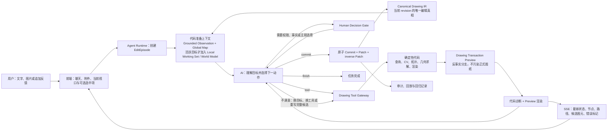
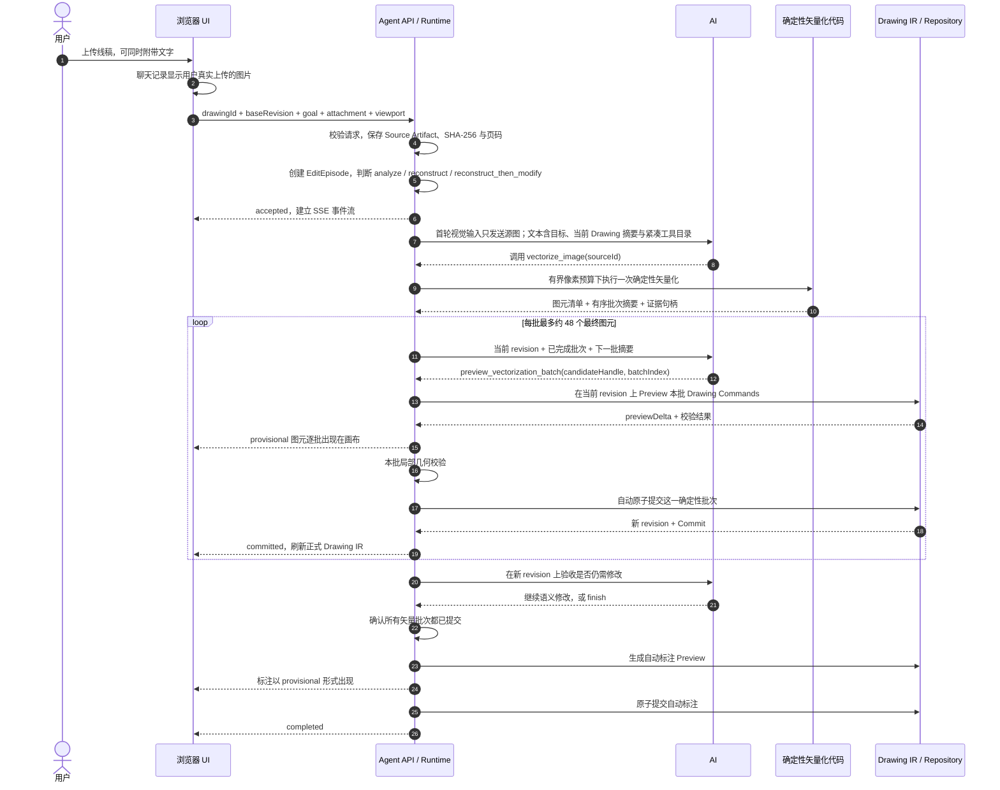
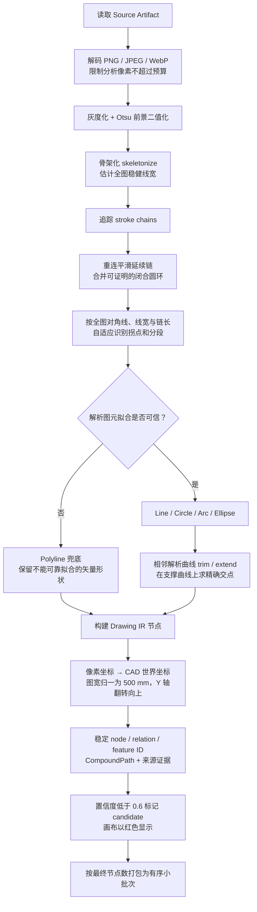
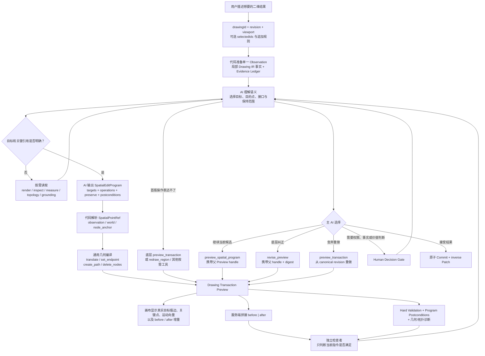
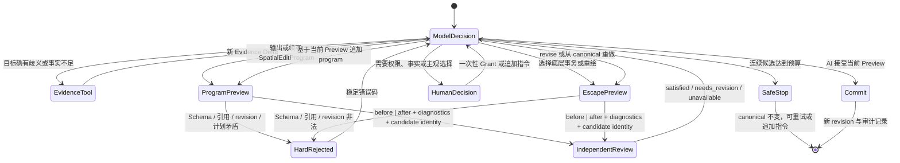
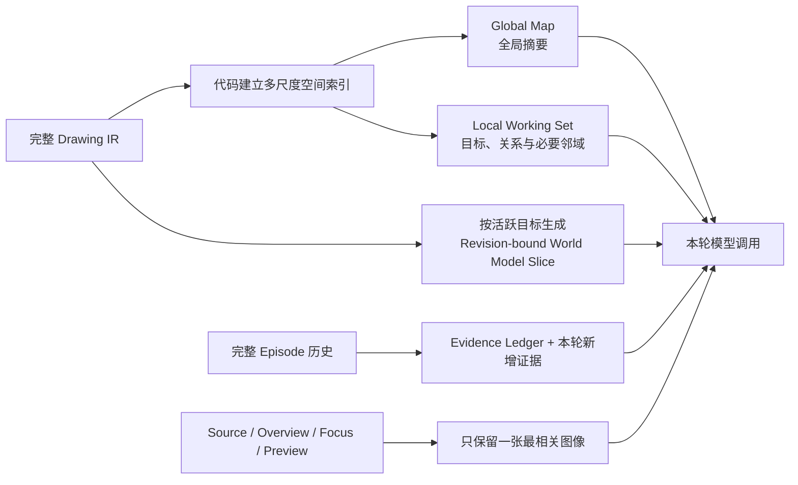
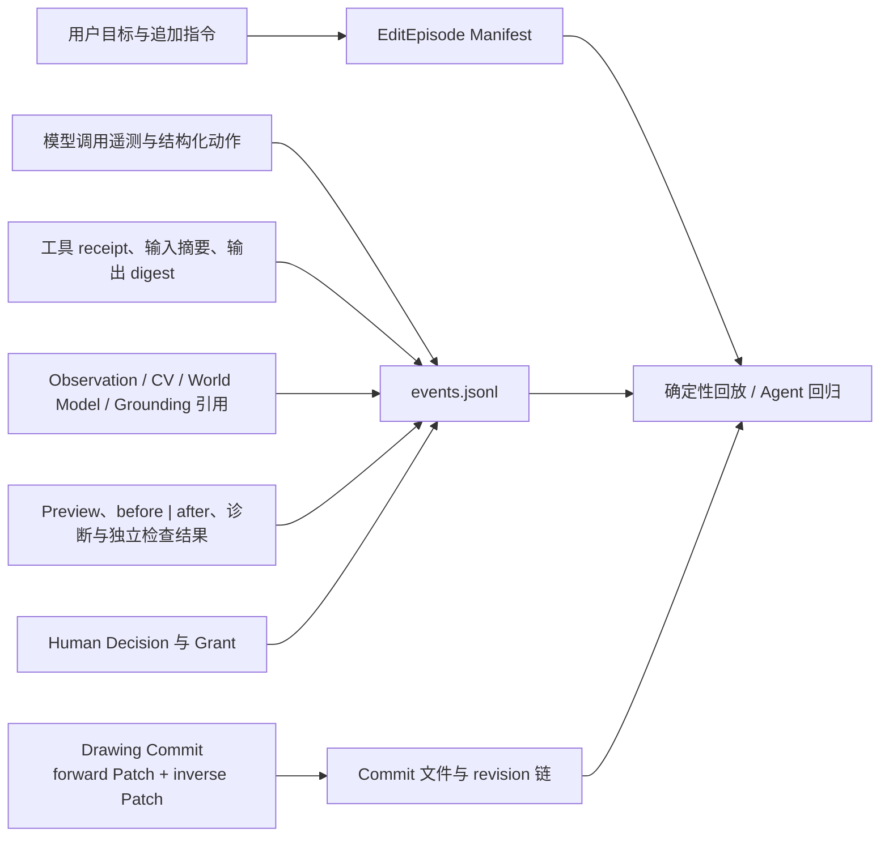

# VectorAI 当前程序执行流程图

> 文档状态：基于当前生产入口与代码核对，不把目标架构冒充成已完成实现
>
> 代码快照：2026-08-15
>
> 关联文档：[产品需求](./prd.md) · [技术架构](./tech-architecture.md)

## 1. 先看一句话

VectorAI 的主循环是：

> **AI 负责理解、选择和验收；代码负责计算、执行和守住 Drawing IR；画布负责把真实动作与候选增量显示出来。**

AI 每一轮只返回一个结构化动作：调用工具、请求用户决定、提交当前 Preview，或结束任务。系统不会向 UI 暴露隐藏思维链；UI 展示的是可审计的动作摘要、工具目的、空间证据、候选 Preview 和诊断结果。

## 2. 两类任务共用的总循环



这里有四个不能混淆的概念：

| 概念 | 是否能直接改正式图纸 | 作用 |
|---|---:|---|
| Observation / 图片 | 否 | 让 AI 看当前图纸、局部或 Preview |
| Grounding / 路径 / Mask | 否 | 证明 AI 正在看什么、考虑什么 |
| Preview | 否 | 在临时 DrawingDocument 上试运行完整事务 |
| Commit | 是 | 以 compare-and-swap revision 原子写入 Drawing IR |

## 3. 场景一：上传一份干净线稿

### 3.1 端到端时序



当前实现的一个重要事实是：**矢量化批次会先在画布显示 Preview，但通过局部确定性校验后由 Runtime 立即提交，不会为每一批额外调用一次视觉模型验收。** AI 会在下一轮看到提交后的新 Drawing revision，并可继续修正。这是当前的速度优先路径，不是一轮模型直接生成整张图。

如果用户同时上传图片和文字，例如“先重建，再把两个孔改成半径 8 mm”，Runtime 会把任务视为 `reconstruct_then_modify`：先确保来源批次全部落入 Drawing IR，但不会用固定工作流阻止 AI 在后续 revision 继续做语义修改。

### 3.2 `vectorize_image` 内部完全由代码完成什么



因此在“上传线稿”这条链中：

| 工作 | AI | 确定性代码 |
|---|---:|---:|
| 决定实际是分析、重建还是继续修改 | 选择下一工具与是否结束 | 输入解释器提供模式证据，并防止来源重建过早结束 |
| 决定调用矢量化以及下一批 | 是 | 校验调用顺序与完成度 |
| 找黑色前景、骨架、链、拐点 | 否 | 是 |
| 拟合直线、圆、圆弧、椭圆 | 否 | 是 |
| 失败时保留 Polyline | 否 | 是 |
| 坐标换算、Y 轴翻转、默认 500 mm 尺度 | 否 | 是 |
| Preview、revision、原子提交、撤销数据 | 否 | 是 |
| 提交后判断是否还需要语义修正 | 是 | 提供新 revision 与观察图 |

## 4. 场景二：发送一条自然语言空间编辑指令

### 4.1 当前任务驱动编辑链路



### 4.2 `SpatialEditProgram` 到底表达什么

它不是把所有可能图形枚举成模板，也不是模型的隐藏思维链。它是一份很短、可审计的一次性动作契约：

```ts
{
  baseRevision,
  targets: [{ description, nodeRefs, visualAnchors?, interfaceRefs? }],
  operations: [
    { kind: 'translate', nodeIds, from, to },
    { kind: 'set_endpoint', nodeId, endpoint, point },
    { kind: 'create_path', geometry, points },
    { kind: 'delete_nodes', nodeIds }
  ],
  preserveNodeRefs,
  postconditions
}
```

空间点有三种来源：

| 引用 | 模型何时使用 | 代码做什么 |
|---|---|---|
| `observation` | 从视觉上选择目标位置 | 校验 observation 所属 drawing/revision，把 `[u,v]` 归一化点反算为世界坐标并处理 Y 轴方向 |
| `node_anchor` | 使用既有圆心、起点、终点或顶点 | 从当前 canonical 或明确父 Preview 中读取精确几何点 |
| `world` | 上下文已提供精确 Drawing 坐标 | 校验 `frameId=document` 并直接使用 |

模型决定“哪一个目标、去哪里、哪些接口需要更新、哪些内容要保持”；代码完成坐标反算、几何变换、端点修改、命令编译、事务和回放。没有任何“部位名称 → 特定工具”或“某动作 → 固定角度”的生产规则。

### 4.3 Preview 反馈 Loop



独立检查者没有工具，不参与规划、授权或 Commit。它接收同视口对照图、当前有效用户指令、确定性诊断和候选身份；Program 摘要只说明“正在检查哪个修改”，不能替代视觉证据。检查结论绑定具体 Preview handle 和 transaction digest，主模型可以保留候选继续改、舍弃重做或确认提交。

Runtime 默认给一次用户指令 3 个语义候选预算，并把当前 `{attempt,max}` 告诉主模型。达到上限时最后一个失败候选不会提交，正式图纸保持原 revision；完整过程仍可审计，UI 提供重试或追加指令。

## 5. 发送给模型的上下文如何被压缩

程序不会每轮把整张大型图纸、全部历史和多张截图一起塞给模型。



- 既有节点在模型上下文里使用 `g1`、`g2` 之类的 revision-bound 短别名；工具执行前由代码还原真实 ID。
- 新 Preview 图优先于旧 Overview；同一轮只使用一个视觉坐标系。
- 没有明确选中项或工具目标的首轮不编译整图 World Model；有活跃目标时，World Model 与完整 Working Set 不在同一轮重复发送。
- 只有相关范围为 `partial` 或 `unknown` 且会影响当前目标/保持接口时，才继续展开 Slice。
- 活跃上下文只保留当前候选 receipt 与最新检查结论；旧候选留在追加式审计中，不随模型轮次重复发送。
- 每次追加模型轮次必须有新的 Evidence Delta、诊断或用户反馈，避免反复读同一份上下文。

## 6. 用户现在能在画布看到什么

| 真实动作 | 当前画布反馈 | 当前接通程度 |
|---|---|---|
| 线稿矢量化批次 | provisional 图元逐批淡入，低置信度标红，提交后切换正式图元 | 已接通 |
| 自动标注 | 标注 Preview 后原子提交，可整体隐藏 | 已接通 |
| AI 观察或考虑一组节点 | 节点轮廓高亮并脉冲，且不改变用户选中状态 | 已接通 |
| `trace_paths` 路径候选 | 候选路径以连线动画显示；当前主要依据路径节点中心投影 | 已接通 |
| Drawing Transaction Preview | 新增/修改图元以 provisional 形式出现，被删除的正式图元暂时隐藏 | 已接通 |
| Preview 诊断 | 相关节点以诊断 Overlay 标记 | 已接通 |
| AI 选择的精确关键点 | `SpatialEditProgram` 的 observation/world/node_anchor 在执行前解析为 planning marker，Preview 后显示真实 resolved point | 已接通 |
| 目标轮廓、接口与运动方向 | Grounding/Program/Preview 统一投影为 target、interface、before/after stroke 与 motion vector | 已接通 |

这些 Overlay 全部是临时证据，`pointer-events: none`，不会污染用户选中状态或成为写权限。

## 7. 当前实现与目标架构的边界

| 能力 | 当前真实状态 |
|---|---|
| Model-led 单动作循环 | 已在生产入口使用 |
| Drawing IR 单一真相、Preview、Commit、revision | 已接通 |
| 确定性线稿矢量化、拟合、500 mm 尺度、Y 轴转换、分批提交 | 已接通 |
| Global Map、Local Working Set、World Model Slice、单视觉工作集 | 已接通 |
| Counterfactual World 与结构诊断 | 已接通 |
| 通用用户授权暂停/恢复 | 已接通 |
| `preview_spatial_program` 默认入口 | 已接通；严格解析、三类空间引用、四个通用操作、Preview、逐操作 receipt、诊断、独立复核与 Commit 共用一条链 |
| 基于当前候选继续修改 | 已接通；新 program 携带父 Preview handle，合成为仍可独立回放的 canonical 事务 |
| `preview_connected_transform` 等既有编译器 | 保留为可选工具，不再按对象类别或指令关键词强制路由 |
| 精确关键点、目标轮廓、接口和 before/after 实时 Overlay | 已接通；执行前解析 observation 引用，执行后与复核阶段使用真实 Preview 差异 |
| 真实复杂语义任务稳定通过 | 仍需用真实浏览器和配置模型做 Golden Case；模型质量限制必须与程序/协议失败分开记录 |

线稿确定性快路还有一个运行条件：服务启动时 Python Vectorization Worker 必须可用；如果它启动失败，`vectorize_image` 不会进入模型工具目录，Runtime 会让 AI 根据剩余 CV/事务工具重新规划，并在服务日志保留明确警告。

## 8. 审计、撤销与回归



本地 MVP 的持久化位置：

- 正式图纸：`.local/vectorai/drawings/`
- Agent 审计与 Commit：`.local/vectorai/runs/`
- 来源图片/PDF：`.local/vectorai/sources/`
- CV 证据：`.local/vectorai/evidence/`
- 局部 crop：`.local/vectorai/crops/`

审计保存模型动作、工具版本、输入/输出摘要、revision、诊断、授权和 Commit，但不保存 API Key、Authorization、图片 base64 或隐藏思维链。

## 9. 关键代码入口

| 流程 | 代码 |
|---|---|
| 前端提交、SSE、Preview 合并与画布状态 | `src/hooks/useStore.ts` |
| Agent HTTP/SSE、暂停、追加指令、用户决定 | `api/routes/agent-runs.ts` |
| Model-led 主循环、批次提交、视觉复核、审计 | `api/services/drawing-agent/model-loop-runtime.ts` |
| 模型 Prompt、结构化动作协议与上下文投影 | `api/services/drawing-agent/model-loop-adapter.ts` |
| World Model 紧凑事实与端点—曲线接触 | `api/services/drawing-agent/world-model-context.ts` |
| 单视觉工作集 | `api/services/drawing-agent/visual-working-set.ts` |
| 模型工具目录与能力说明 | `api/services/drawing-tools/catalog.ts` |
| SpatialEditProgram 协议、坐标解析与通用编译 | `api/services/drawing-spatial-program/` |
| Preview、诊断、空间程序、底层事务与 Commit | `api/services/drawing-tools/drawing-tools.ts` |
| 矢量化、重绘、分批 Preview 与标注候选 | `api/services/drawing-tools/generation-tools.ts` |
| Python 确定性线稿矢量化 | `python/vectorai_vectorizer.py` |
| 像素到 Drawing IR、拟合晋升、连接与批次 | `api/services/drawing-vectorization/build-steps.ts` |
| 二维世界模型、Grounding Ledger 与动作 Proposal | `api/services/drawing-world-model/` |
| 画布图元、路径、点、Preview 与诊断 Overlay | `src/components/Canvas.tsx` |
| Agent 审计落盘 | `api/services/drawing-agent/file-audit-store.ts` |
