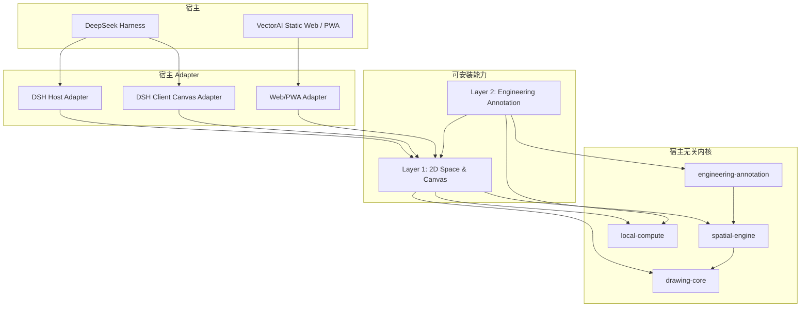

# VectorAI → DeepSeek Harness 插件迁移方案

> 状态：DSH 第一层语义编辑迁移已完成；第二层确定性自动标注已作为独立插件接入。静态 Web/PWA 去除旧 Express Adapter 仍是独立后续阶段，不影响 DSH 本地运行。
>
> 最后验证：2026-08-21
>
> 基线提交：`90d254e`（`feat: establish pre-DSH migration baseline`）
>
> 目标分支：`codex/dsh-plugin-migration`
>
> DSH 交互协议：[`图纸上传、矢量化、分区与标注交互设计`](./superpowers/specs/2026-08-20-dsh-drawing-interaction-design.md)
>
> Auto-safe 规格：[`DSH 语义改图与可撤销提交`](./superpowers/specs/2026-08-21-dsh-semantic-edit-auto-safe-design.md)
>
> 实现架构：[`DSH Semantic Edit Architecture`](./architecture/dsh-semantic-edit.md)

## 1. 结论

VectorAI 将从“React 前端 + 自有 Express/Agent 服务”迁移为一个无云端、Local-first 的二维工程图能力栈：

1. **宿主无关内核**：保存 Drawing IR、事务、空间索引、渲染协议、工程识别和自动标注算法，不依赖 DSH、React、Express、Node 文件系统或模型供应商。
2. **第一层 DSH 插件：2D Space & Canvas**：把内核接入 DSH，提供图纸导入、二维空间查询、事务预览、可交互画布和本地持久化。
3. **第二层 DSH 插件：Engineering Annotation**：只依赖第一层公开的二维能力，提供工程图纸识别、测量、布局、覆盖率检查和自动标注工具。
4. **静态 Web/PWA Adapter**：继续保留 VectorAI 自己的网站；它与 DSH 插件共用同一内核，只替换宿主 Adapter。生产环境不需要 VectorAI Express 服务。

DSH 负责 Agent、模型、会话、工具调度、权限和附件生命周期；VectorAI 不再复制这些能力。VectorAI 负责它真正独有的二维图纸能力。

## 2. 迁移目标与非目标

### 2.1 目标

- 代码全部开源，并能被第三方独立审计、构建和扩展。
- VectorAI 不再运行自有云端、AI Gateway 或 Express 服务。
- 图纸、附件、中间结果和运行记录默认留在用户电脑上。
- 导入、空间计算、预览渲染、识别和标注优先使用浏览器 Worker、WebGL/WebGPU、WASM 与本机 CPU/GPU。
- DSH 和 VectorAI 网站共享 Drawing IR、算法与测试，不形成两套实现。
- 第二层自动标注插件可被替换或单独安装，不能反向污染底层二维能力。
- 迁移期间保持现有功能可运行，通过 Adapter 逐步替换，而不是一次性重写。

### 2.2 非目标

- 不 Fork DSH，也不把 VectorAI 代码直接写入 DSH 仓库。
- 不在第一阶段重写所有几何和 CV 算法。
- 不让 DSH 成为 Drawing Document 的第二份状态源。
- 不通过 localhost 上的 VectorAI Express 服务伪装“本地化”。最终静态 Web 必须能脱离该服务运行。
- 不把 HyperFrames 视频工程纳入此次迁移；它保留为独立宣传素材项目。

## 3. 当前基线

### 3.1 已验证状态

迁移前基线与当前验证结果：

| 检查 | 结果 |
|---|---|
| `pnpm test`（迁移前） | 通过：169 个测试文件、1055 个测试 |
| `pnpm test`（当前） | 通过：216 个测试文件、1304 个测试 |
| `pnpm check`（当前） | 通过 |
| `pnpm build:dsh-space`（当前） | 通过；Host、Client、Annotation 构建成功 |
| 发布面负向扫描 | 通过；无旧 `commit/createPreview/commitPreview/discardPreview` Remote |
| `pnpm lint` | 未通过：2 个 Hooks 警告、1 个未使用函数错误 |
| HyperFrames `npm run check` | 环境中找不到 `hyperframes` CLI；不作为本次基线阻塞项 |

已知 lint 问题位于：

- `src/components/Canvas.tsx`：`annotationDragTick` Hook 依赖警告。
- `src/components/Canvas.tsx`：`entityById` 每次渲染变化警告。
- `src/hooks/useStore.ts`：`mergePartitionSupplements` 未使用错误。

迁移不能掩盖这些问题。Phase 0 会建立新门禁，并把“旧代码已知失败”与“新包必须全绿”分开管理。

### 3.2 当前耦合点

当前代码已经有较强的 Drawing Core，但运行时仍把以下职责混在 `api/`：

- Express 路由和 SSE 运行控制。
- 自建 Agent loop、模型适配器、AI Gateway 和 Human Decision。
- Node 文件系统仓库与审计存储。
- `sharp` 图像处理。
- `node:worker_threads` OpenCV Worker。
- 常驻 Python 矢量化进程。
- Poppler/PDF 命令行渲染。

这些不是同一种迁移问题。算法要提取，宿主能力要适配，自建 Agent 能力要删除，Node 专属实现要换成本地 Web/WASM 实现。

### 3.3 实施进度

- Apache-2.0、NOTICE、pnpm workspace 与迁移分支已经建立。
- Canonical Drawing Document 已迁入 `@vectorai/drawing-core`，共享无头状态位于 `@vectorai/drawing-workspace`。
- 网站与 DSH 已切换到 `@vectorai/drawing-viewer-react`：坐标轴、网格、拖放视口、选择、对象属性和标注都走同一实现。
- DSH Host 使用按 Agent/session 隔离的完整快照和 expected-revision 原子提交；Client 通过 durable attachment ref 加载原图，不传输 base64 快照。
- DSH Client 已从独立 `conversation.view` 标签迁移到会话级 `conversation.workspace`：左侧保留 DSH 会话栏，中间显示共享画布，右侧保留 DSH 原生聊天，桌面端分隔宽度可调，窄窗口自动上下排列。
- 新增宿主无关的 `@vectorai/drawing-spatial`，第一层已公开 revision-bound `world-slice`、node 和 neighbors 查询。
- `@vectorai/drawing-edit-protocol` 已冻结模型可见的 semantic part selection、qualitative spatial intent、preservation goal 与 `numericKey` 协议；revision/task/Observation/Grounding/Preview/Evaluation、事务、operation binding 和 receipt 只在 Host 内部流转。
- `@vectorai/drawing-edit-core` 已实现确定性空间意图求解、transaction apply、inverse 与 canonical digest。模型选择语义部件和空间关系，求解器统一计算候选坐标、旋转、连接、碰撞与最小变形；没有对象类别、动作示例或固定坐标特例。
- 第一层 Host 已接通 `observe → select_parts → preview_spatial_intent/revise → evaluate → finalize`。一次 Host-owned episode 保存全部 lineage；模型不再抄写 task/context/grounding/Preview handle，也不再为定性指令输出 translation/pivot/rotation。Host 根据实际 before/after effect、来源质量、诊断、评审结果和任务策略决定 `blocked | confirmation_required | auto_safe`。
- 正式提交使用本地 durable envelope：operation binding、ledger-first 幂等、forward/inverse transaction、commit record、原子快照替换和补偿式 Undo。空 diff 不增加 revision；同 operation 重试返回原 receipt。
- 浏览器 Remote 已删除裸 `commit/createPreview/commitPreview/discardPreview`。人工属性编辑先由 Host stage，再通过一次性 DSH command 提交；命令响应丢失后按 operationId 对账。Undo 使用相同 staged + receipt 路径。
- Reviewer 通过 DSH one-shot subagent 只读运行；同候选并发评审 single-flight，负面缺陷对同一语义候选保持 sticky，不能用重复评审洗成 auto-safe。确认卡与 Undo 卡也按 operation binding single-flight。
- DSH 第一层插件不启动 VectorAI Express 或云端服务；网站旧 Agent/Express 仍作为迁移兼容 Adapter 保留。
- `@vectorai/engineering-annotation` 和 `@vectorai/plugin-dsh-annotation` 已作为第二层独立包接入：确定性识别 circle/arc/ellipse 标注候选，通过第一层 `runExtensionProgram` 生成 Preview、评估并按相同策略提交，且有禁止深导入的依赖门禁。

## 4. 目标架构



核心依赖方向必须保持单向：

```text
engineering-annotation → spatial-engine → drawing-core
                               ↓
                          local-compute ports

adapter-dsh-* ─┐
adapter-web  ───┴→ public application contracts
```

任何 `packages/*-core` 都不能导入 `@deepseek-ai/*`、React、Express、Node 内置模块或某个模型 SDK。

## 5. 建议 Monorepo 结构

```text
VectorAI/
├── apps/
│   └── web/                         # 静态 VectorAI Web/PWA
├── packages/
│   ├── drawing-core/                # Canonical IR、Command、Patch、事务、校验
│   ├── spatial-engine/              # 查询、索引、World Model、SceneCompiler
│   ├── local-compute/               # Worker/WASM 调度和能力端口
│   ├── importers/                   # DXF/PDF/Image 导入协议及纯算法
│   ├── engineering-annotation/      # 识别、测量、布局、覆盖率、标注计划
│   ├── plugin-space-contracts/      # Layer 1 对外稳定契约
│   ├── plugin-dsh-space-host/       # DSH Host/Cordis 服务与工具
│   ├── plugin-dsh-space-client/     # DSH conversation.workspace 内联画布
│   ├── plugin-dsh-annotation/       # Layer 2 DSH 工具与提示说明
│   ├── adapter-web/                 # 浏览器文件、存储、Worker、下载
│   └── test-contracts/              # 跨 Adapter 的共享契约测试
├── fixtures/                        # 可公开的 DXF/图片/Drawing IR 样例
├── docs/
└── legacy/                          # 过渡期旧 Express；最终删除
```

`plugin-space-contracts` 是两层插件的防火墙。第二层不得从第一层内部目录深层导入，也不得直接读取 DSH session 文件或 Web 存储。

Git 层面先保持一个 monorepo，但第一层和第二层是两个正式、独立安装和独立版本化的插件；第二层不是示例。第三方用法放在 `examples/minimal-space-consumer`，CI 将第二层和示例都作为只依赖公开 contracts 的外部消费者验证。

## 6. 第一层插件：2D Space & Canvas

### 6.1 职责

第一层是通用二维空间平台，不包含“建筑标注规则”之类的领域知识。它提供：

- 创建、打开、导入和导出 Drawing Document。
- Canonical Drawing IR、revision、事务 Preview、Commit、Undo/Redo。
- Bounds、命中测试、邻接、路径、拓扑、局部 World Slice 等空间查询。
- SceneCompiler、视口、选择集、Overlay 和 Preview diff。
- DXF、PDF、图片的本地导入入口。
- 本地文档存储、内容哈希和可回放事务日志。
- DSH 模型可调用的精简空间工具。
- DSH 会话中的可预览、可缩放、可选择二维画布。

### 6.2 公开契约

建议先冻结一组最小、版本化的 TypeScript 契约：

```ts
export interface DrawingRef {
  drawingId: string;
  revision: number;
}

export interface Viewport {
  frameId: string;
  worldBounds: Bounds;
  pixelSize: { width: number; height: number };
}

export interface SpatialQueryService {
  summarize(ref: DrawingRef): Promise<DrawingSummary>;
  query(ref: DrawingRef, query: SpatialQuery): Promise<SpatialQueryResult>;
  worldSlice(ref: DrawingRef, request: WorldSliceRequest): Promise<WorldModelSlice>;
}

export interface DrawingTransactionService {
  preview(ref: DrawingRef, commands: DrawingCommand[]): Promise<PreviewResult>;
  commit(preview: PreviewHandle): Promise<CommitResult>;
  discard(preview: PreviewHandle): Promise<void>;
}

export interface DrawingRenderService {
  compile(ref: DrawingRef, viewport: Viewport): Promise<CompiledScene>;
  compilePreview(handle: PreviewHandle, viewport: Viewport): Promise<CompiledScene>;
}
```

契约规则：

- 所有读取和写入显式绑定 `drawingId + revision`。
- Preview 是候选分支，不直接改变正式状态。
- Scene 是 Drawing IR 的派生结果，不能回写为正式图纸。
- 跨线程、跨 DSH Remote API 的值必须可结构化克隆/序列化。
- 大型二进制通过 opaque handle 或 `ArrayBuffer` 流转，不在事件中保存 base64。
- 错误使用稳定 code，不让 Adapter 的异常文本成为协议。

### 6.3 DSH Host 插件

DSH Host 插件是 Cordis 组合中的进程级能力，负责：

- 注册 `ctx.vectorDrawing` 一类的二维服务。
- 注册模型可调用的高阶工具，不开放裸 transaction/Commit。
- 通过 DSH Remote API 向浏览器 Client 暴露只需要的查询、渲染和交互操作。
- 复用 DSH 的 workspace、权限、Jobs、附件和生命周期。
- 在插件 dispose 时终止自己创建的 Worker、释放 WASM/GPU 资源和刷写本地事务。

第一层 Host 插件不注册第二套模型路由、session、Agent loop 或 HTTP server。

### 6.4 DSH Client 插件

DSH rc.8 提供 session-scoped `conversation.view`，但该插槽只能创建独立标签，不能把插件内容与原生聊天组合在同一会话页。当前兼容 Adapter 以受版本保护、可备份、可重复执行的本地补丁声明 `conversation.workspace`：画布占中间工作区，原生聊天位于右侧，两者共用当前 session。补丁仅接受 rc.8 的已知源码锚点，DSH 版本或结构变化时直接拒绝，而不会猜测性修改宿主。

Client 插件负责：

- 画布 UI、图层、视口、选择、Hover、Overlay、Preview diff。
- 图片/DXF/PDF 的拖放、粘贴和文件选择入口。
- 通过 DSH Client Remote 调用 Host 插件，不直接访问 Host 文件路径。
- 对纯浏览器计算可直接调度 Web Worker/OffscreenCanvas；需要持久化或宿主权限的操作交给 Host。
- 会话切换时绑定相应 DrawingRef；没有图纸时不挂载图纸工作区，也不抢占普通聊天布局。

DSH 当前仍是 release candidate。所有 slot、Remote、Cordis 和 rc.8 布局兼容补丁细节只能存在于 Adapter/启动路径，不能进入业务内核。DSH 提供正式可组合布局 API 后删除该补丁，`conversation.workspace` 注册组件无需改变共享 Viewer。

### 6.5 第一层模型工具边界

首版只开放少量组合度高的工具，避免把每个内部函数变成工具：

| 工具 | 类型 | 作用 |
|---|---|---|
| `drawing_import` | 读/初始化 | 仅在用户明确要求“导入/转换/矢量化为图纸”时，把当前会话的最新图片附件导入为 Drawing；普通参考附件不得触发 |
| `drawing_summarize` | 只读 | 返回单位、bounds、plane/type 计数与 revision |
| `drawing_query` | 只读 | 执行 bounds、node、topology、path 等有界查询 |
| `drawing_observe` | 只读 | 惰性激活当前图纸 episode；Host 内部创建并绑定 Observation/context |
| `drawing_select_parts` | 语义选择 | 模型用 current selection、Observation 归一化区域、候选短键或语义查询描述部件；Host 解析精确节点和接口 |
| `drawing_preview_spatial_intent` | 候选写 | 模型声明通用定性空间目标和保持条件；Host 求解数值并生成一个原子 Preview |
| `drawing_revise_spatial_intent` | 候选写 | 只修订语义目标/保持条件；Host 替换候选并重新求解，每任务最多三个候选 |
| `drawing_evaluate_preview` | 只读/评审 | 运行 hard validators、来源质量和本地 reviewer |
| `drawing_finalize_preview` | 受控正式写 | auto-safe 自动提交；风险候选询问；hard-invalid/deny 永久阻断 |
| `drawing_discard_preview` | 候选写 | 丢弃当前 Host-owned Preview，不需要模型传 handle |
| `drawing_get_operation` | 只读 | 在结果未知时查询当前 Host-owned operation，不需要模型重放 operation ID/digest |
| `drawing_undo_commit` | 受控正式写 | 用户授权后创建补偿式 Undo revision |

模型可见目录不含 `taskId`、`observationId`、`contextId`、`groundingId`、`previewHandle`、candidate/operation digest、裸 Drawing Command、translation、pivot、rotation 或世界坐标。精确数值只有在用户原始指令中被 Host 确定性提取后，才以 `numericKey` 被空间目标引用。旧裸 transaction/Commit 与旧 handle 工具都不属于模型目录或 Typert Remote 发布面。

第一层采用多插件友好的惰性激活，不在每个直接用户回合注入完整固定流水线。图片只被 Host 暂存为可选附件，不产生 `drawing_import` 提示，也不改变本轮路由；DSH 仍把它作为普通多模态上下文交给模型。只有用户明确要求把图片导入为可编辑图纸时，模型才调用 `drawing_import`。已有图纸时只声明“可用但仅在本轮意图涉及图纸时调用 `drawing_observe`”，否则明确要求忽略并继续使用其他插件。每个成功结果只返回当前允许的紧凑下一步，例如 `observed → drawing_select_parts → drawing_preview_spatial_intent → drawing_evaluate_preview`。顺序、revision 和权限由 Host episode 强制，模型上下文压缩不会丢失状态；入口只对 DSH runtime root 生效。

## 7. 第二层插件：Engineering Annotation

### 7.1 依赖与职责

第二层只依赖 `plugin-space-contracts` 和 `engineering-annotation`。它不能：

- 直接操作 React 画布状态。
- 直接访问 OPFS、Node fs 或 DSH attachment 路径。
- 绕过 Preview/Commit 写 Drawing IR。
- 注册独立 Agent loop 或调用 VectorAI 自建 AI Gateway。

它负责：

1. 从第一层获取 revision-bound Drawing facts。
2. 识别工程对象和候选关系，并保留 confirmed/candidate/conflict。
3. 确定性计算测量值与可标注目标。
4. 生成标注布局候选，避免遮挡、越界和重复覆盖。
5. 通过第一层创建 Preview。
6. 运行覆盖率、几何和视觉诊断。
7. 由 DSH Agent 决定修改、请求用户确认或请求第一层 Finalize。

### 7.2 标注流水线

```text
Drawing revision
→ Recognition facts
→ Measurement facts
→ Annotation plan
→ Layout candidates
→ Drawing commands
→ Layer 1 Preview
→ Coverage / collision / validity diagnostics
→ Commit or revise
```

前五步应尽量保持确定性。模型负责解释用户意图、消解真实歧义和选择方案，不负责手算坐标或逐字符拼 Drawing Command。

### 7.3 第二层工具

建议首版工具面：

| 工具 | 作用 |
|---|---|
| `engineering_inspect` | 获取工程对象、尺寸候选、冲突与证据摘要 |
| `engineering_plan_annotations` | 针对范围/规则生成可解释标注计划 |
| `engineering_preview_annotations` | 调用第一层生成标注 Preview |
| `engineering_validate_annotations` | 返回覆盖率、碰撞、越界、重复与缺失诊断 |

`engineering_preview_annotations` 通过第一层内部扩展接口创建 Preview；返回给 root Agent 的只是紧凑 disposition。第二层不能获得裸 Commit、模型可见内部 Ref 或自行铸造提交权限。

## 8. DSH 与 VectorAI 的职责边界

| 能力 | DSH | VectorAI |
|---|---|---|
| 模型配置与路由 | 负责 | 不再实现 |
| Agent loop / session / compaction | 负责 | 不再实现 |
| 工具注册与调用 | 提供框架 | 提供二维工具实现 |
| 权限、审批、Jobs | 负责 | 声明资源需求并遵守结果 |
| 图片附件生命周期 | 负责 DSH 会话附件 | 解码为来源工件，不复制附件系统 |
| Drawing IR / revision / transaction | 不负责 | 唯一真相与实现 |
| 空间查询和 World Model | 不负责 | 负责 |
| 画布和 Preview | 提供 Client slot | 负责插件视图 |
| 工程识别和自动标注 | 不负责 | 第二层插件负责 |
| VectorAI 网站 | 不负责 | 静态 Web/PWA Adapter |

关键原则：DSH session 记录可以引用 `DrawingRef` 和工具 receipt，但不能取代 Drawing transaction log；Drawing log 也不复制完整 DSH 对话。

## 9. VectorAI 网站仍然如何运行

可以继续独立运行，差别只在 Adapter。

```text
同一套 React Canvas + Drawing Core + Spatial Engine
                         │
             ┌───────────┴───────────┐
             │                       │
       DSH Client Adapter       Static Web Adapter
       Remote/Cordis/Slots      OPFS/IndexedDB/Worker
```

网站生产构建是纯静态资源，可部署到任意静态托管或本地打开的 PWA。它通过以下浏览器能力替代 Express：

- File System Access API（可用时）或 `<input type=file>` 导入。
- OPFS 保存大文件、Drawing checkpoint 和不可变来源工件。
- IndexedDB 保存索引、元数据、事务日志和最近项目。
- Web Worker 执行 CPU 密集任务。
- OffscreenCanvas/WebGL2/WebGPU 执行本地渲染和部分图像计算。
- Service Worker 提供离线 App Shell。
- Blob/Object URL 负责下载 DXF、SVG、PNG、PDF 等派生结果。

浏览器不支持的能力由 Capability Detection 降级，而不是请求 VectorAI 云端。例如没有 WebGPU 时回退 WebGL2/Canvas；没有 File System Access API 时使用上传/下载。

## 10. 自有服务端移除表

| 当前实现 | 目标实现 | 迁移策略 |
|---|---|---|
| `api/app.ts` Express | 无 VectorAI Server | 所有调用者迁走后删除 |
| `/api/agent/runs*` + SSE | DSH session/tool/jobs/events | DSH Adapter 替换，不平移旧 HTTP API |
| `api/routes/ai.ts` / AI Gateway | DSH LLM/Agent | 删除 |
| 文件 Drawing Repository | OPFS/IndexedDB 或 DSH workspace store Adapter | 先定义 `DrawingRepository` port，再双实现 |
| 本地审计 JSONL | Drawing transaction store + DSH session log | 各保留自己的事实，引用关联 |
| `sharp` | Canvas/ImageBitmap/WebCodecs/WASM | 按调用点建立 image codec port 后替换 |
| `node:worker_threads` | Web Worker；DSH Host 可有 Node Worker Adapter | Worker 协议保持一致 |
| Python 矢量化进程 | TypeScript/OpenCV.js/Rust-WASM | 先保留算法金样测试，再逐步替换 |
| Poppler `pdftoppm` | PDF.js 或 PDFium-WASM | 浏览器本地解析/栅格化 |
| Node `crypto`/fs/path | Web Crypto + storage/path Adapter | 禁止出现在核心包 |

“本地 DSH Host 进程”不等于 VectorAI 自有服务端。允许 DSH 作为用户主动运行的宿主进程，但 VectorAI 不能再启动自己的 Express 监听端口，也不能依赖 VectorAI 云端才能完成核心功能。

## 11. 当前目录到目标包的映射

| 当前目录 | 目标位置 | 处理方式 |
|---|---|---|
| `src/drawing/*` | `packages/drawing-core` | 优先原样提取并收紧依赖 |
| `src/drawing/scene/*` | `packages/spatial-engine/scene` | 保持共享 SceneCompiler |
| `src/contracts/*` | 对应包的 `contracts` 或 `plugin-space-contracts` | 按所有权拆分，禁止公共杂物箱 |
| `api/services/drawing-application` | `drawing-core/application` | 去 Node 仓库依赖 |
| `api/services/drawing-spatial*` | `packages/spatial-engine` | 提取纯算法；I/O 走 port |
| `api/services/drawing-world-model` | `packages/spatial-engine/world-model` | 保持 revision-bound |
| `api/services/drawing-spatial-program` | `packages/spatial-engine/program` | 保持模型无关编译器 |
| `api/services/drawing-dxf` | `packages/importers/dxf` | 原始字节存储抽象化 |
| `api/services/drawing-annotation` | `packages/engineering-annotation` | 成为第二层核心 |
| `api/services/drawing-cv` | `packages/local-compute/cv` + Adapter | Worker/WASM 化 |
| `api/services/drawing-vectorization` | `packages/local-compute/vectorize` | Python 实现最终退出 |
| `api/services/drawing-render` | `spatial-engine/render` + GPU Adapter | 分离 Scene 与像素后端 |
| `api/services/source-artifacts` | `packages/importers` + storage port | 来源不可变、存储可替换 |
| `api/services/drawing-agent` | DSH 插件工具 + 删除 | 只保留可复用确定性算法 |
| `api/services/agent-runtime` | DSH | 删除自建 loop |
| `api/services/human-interaction` | DSH approval/question | 删除自建实现 |
| `api/routes/*`, `api/app.ts` | DSH/Web Adapter | 最终删除 |
| `src/components/canvas/*` | 共享 Canvas UI 包或 `apps/web` | DSH 与 Web 共用组件，状态接口化 |
| `src/services/*-client.ts` | Adapter 接口 | 移除硬编码 `/api` |

## 12. 本地计算与渲染策略

### 12.1 线程划分

- **UI Thread**：只处理输入、轻量状态和最终合成。
- **Geometry Worker**：空间索引、World Slice、事务验证、SceneCompiler。
- **Raster/CV Worker**：图像解码、阈值、骨架、轮廓、拟合和局部比较。
- **GPU**：大规模矢量渲染、Pick buffer、Overlay 和 Preview diff。
- **Storage Worker**：checkpoint、日志压缩、内容哈希和增量保存。

所有 Worker 消息都使用版本化 envelope，并支持 `AbortSignal` 对应的 cancel id。大数组优先使用 Transferable，避免重复拷贝。

### 12.2 渲染层次

1. SceneCompiler 输出与渲染后端无关的 `CompiledScene`。
2. WebGL2 作为首版通用高性能后端。
3. WebGPU 用于支持设备的加速路径，但不能成为正确性前提。
4. SVG/Canvas 作为小图、打印、诊断和兼容回退。
5. 文字、尺寸和交互控制可保持 DOM/SVG overlay，几何主体走 GPU。

同一 Drawing revision、viewport、compiler version 和 style digest 必须生成可缓存的稳定 Scene key。

## 13. 数据与持久化

每个项目至少包含：

```text
ProjectManifest
├── drawing checkpoints
├── append-only transaction log
├── immutable source artifacts
├── derived cache index
├── annotation profiles
└── schema/compiler versions
```

持久化原则：

- 来源工件按内容哈希不可变保存。
- Drawing checkpoint + append-only transaction log 是正式编辑历史。
- Spatial index、PNG、Pick map 和 World Slice 都是可删除重建的缓存。
- DSH Adapter 保存 `sessionId ↔ projectId/drawingId` 关联；Web Adapter 保存最近项目列表。
- Schema 升级使用显式 migration，不能在读取时静默改写原数据。
- 导出项目包时不包含模型密钥、DSH settings 或机器绝对路径。

## 14. 迁移阶段与退出条件

截至 2026-08-21 的状态：

| 阶段 | 状态 | 说明 |
|---|---|---|
| Phase 0：边界基线 | 完成 | Apache-2.0、workspace 包、strict codec 和依赖门禁已建立 |
| Phase 1：Drawing Core | 完成（DSH 所需范围） | canonical IR、共享 Workspace/Viewer、transaction/inverse 已包化 |
| Phase 2：Spatial/Edit Core | 完成（DSH 所需范围） | 空间查询、高阶程序编译、effect/preserve/postcondition 已接入 |
| Phase 3：第一层 DSH | 完成 | 导入、矢量化、同页画布、语义改图、durable finalize、Undo 已闭环 |
| Phase 4：第二层标注 | 完成首个可用版本 | circle/arc/ellipse 确定性标注与 DSH 工具已接入；更复杂工程规则可迭代扩展 |
| Phase 5：静态 Web/PWA | 未完成 | 当前网站继续使用兼容 Adapter；不属于 DSH 插件运行依赖 |
| Phase 6：删除 Legacy Server | 未完成 | DSH 路径已无 Express/云依赖；仓库旧网站服务端仍保留 |

### Phase 0：仓库与边界基线

工作：

- 建立 pnpm workspace、`apps/`、`packages/` 和依赖边界规则。
- 补充开源 LICENSE、贡献指南、第三方依赖清单和 fixture 授权说明。
- 将现有 lint 问题单独登记；新包从第一天要求 test/check/lint 全绿。
- 建立禁止核心包导入 DSH、React、Express、Node built-in 的架构测试。

退出条件：空包可独立 build/test；依赖方向由自动化门禁保护；现有应用仍可运行。

### Phase 1：提取 Drawing Core

工作：

- 先迁移 `src/drawing`，保持行为不变。
- 定义 clock、id、hash、repository 等 port。
- 让旧 Express 和现有 Web 同时消费新 package。
- 用现有 1055 个测试中的相关测试保护迁移，并增加 package contract tests。

退出条件：Drawing Core 不含宿主依赖；事务/回放/Scene 相关金样与基线一致。

### Phase 2：提取 Spatial Engine 与本地计算端口

工作：

- 迁移 query、world model、spatial program、render protocol。
- 分离纯几何算法与 `sharp`/fs/Worker 实现。
- 建立 Web Worker Adapter，并保留临时 Node Adapter 供对照测试。

退出条件：相同 Drawing 输入在 Node/Web Worker 中产生等价空间查询与 Scene digest。

### Phase 3：第一层 DSH 纵向切片

工作：

- 创建 DSH Host、Client 和 contracts 三个包。
- 在会话级 `conversation.workspace` 注册图纸画布，并与原生聊天同页组合。
- 实现一个来源导入、`drawing_summarize/query`、一个 Preview/Commit 回路。
- 通过 DSH profile 安装本地 workspace 包；rc.8 临时由受版本保护的启动补丁增加组合布局插槽。

退出条件：用户可在 DSH 会话中导入一张图、看到画布、让模型查询 bounds、预览一个事务并提交；关闭 DSH 后数据可恢复。

### Phase 4：第二层自动标注插件

工作：

- 提取 recognition、measurement、layout、coverage、planner。
- 实现 `engineering_*` 工具。
- 第一层提供 Preview，第二层只生成计划和命令。
- 使用真实 DXF fixture 建立确定性回归和视觉快照。

退出条件：第二层可独立安装/卸载；卸载后第一层画布和编辑仍正常；标注结果通过覆盖率与碰撞门禁。

### Phase 5：静态 Web/PWA Adapter

工作：

- 将现有网站切换为与 DSH 相同的 application contracts。
- 接入 OPFS/IndexedDB、Web Worker、Service Worker 和浏览器文件入口。
- 删除前端对 `/api` 的依赖。
- 完成纯静态构建和离线 smoke test。

退出条件：关闭 Express 后，静态网站仍可导入、编辑、自动标注、保存、重开和导出项目。

### Phase 6：退出 Legacy Server

工作：

- 将剩余 Python/Sharp/Poppler 路径迁到 Web/WASM 或明确的可选本地 Adapter。
- 删除 `api/app.ts`、旧 routes、自建 Agent runtime、AI Gateway 和不再使用的环境变量。
- 删除过渡兼容层和双写。

退出条件：仓库生产依赖中不含 Express/CORS/自建 AI Gateway；核心功能不启动 VectorAI 监听端口；DSH 和静态 Web 两条验收链都通过。

## 15. 迁移方法：Strangler + 契约测试

每次只迁移一条能力，并让旧应用通过 Adapter 使用新包：

```text
现有 UI/API caller
      ↓
稳定 application contract
      ↓
  新 package implementation
      ↓
旧 Node Adapter | DSH Adapter | Web Adapter
```

不做大规模复制后再修改。推荐顺序：

1. 为要迁移的现有行为补金样/契约测试。
2. 抽出纯类型和函数，不改变行为。
3. 让原调用方切换到 package export。
4. 增加 DSH/Web Adapter 的同一套 contract tests。
5. 删除旧副本。

每个阶段都保留可回退的 Git commit；不维持长期双写的两份 Drawing 状态。

## 16. 测试与质量门禁

### 16.1 测试层次

- **Core unit**：几何、事务、校验、测量、布局等纯函数。
- **Contract**：同一 Repository/Worker/Host 接口对 Node、DSH、Web Adapter 重复执行。
- **Fixture regression**：DXF lossless manifest、Drawing IR、Scene digest、标注 plan。
- **Visual regression**：固定 viewport 的 canvas/PNG 对比，容差与字体环境显式记录。
- **Plugin integration**：Cordis mount/dispose、Remote schema、工具注册、session 绑定。
- **E2E**：DSH 导入→查询→Preview→Commit；静态 Web 导入→保存→重开→导出。

### 16.2 必须自动化的架构规则

- 核心包禁止 Node built-ins、Express、React 和 `@deepseek-ai/*`。
- 第二层禁止深层导入第一层内部实现。
- 所有正式写入必须经过 transaction service。
- 所有派生缓存都必须可删除重建。
- DSH 插件 dispose 后不得遗留 Worker、端口监听或未刷写事务。
- Web production build 中不得出现 `/api/` 硬依赖。

## 17. 开源发布

根目录已采用 Apache-2.0。对外发布前还必须完成：

- 保持根 LICENSE、各发布包 `license` 字段与源码 SPDX 标识一致为 Apache-2.0。
- 为插件包填写 `license`、`repository`、`exports`、`files` 和 `engines`。
- 审计 `sharp`、OpenCV.js、PDF.js/PDFium、字体、测试图纸和 DXF fixture 的许可证/再分发权。
- 不提交模型密钥、内部网关地址、用户图纸、绝对路径或 DSH settings。
- 给插件协议和 Drawing schema 单独版本号，并写兼容矩阵。
- 发布可复现构建、SBOM 和最小安装示例。

## 18. 主要风险与应对

| 风险 | 应对 |
|---|---|
| DSH rc API 继续变化 | 只在 DSH Adapter 使用其 API；锁版本并做 mount smoke test |
| 浏览器能力/性能不足 | Capability Detection；WebGL2 基线、WebGPU 加速、Worker 分片 |
| Python 矢量化迁移导致精度下降 | 保存合法 fixture 与指标；并行对照后才移除 Python |
| 字体和文本布局不一致 | 内置/明确字体包，记录 font digest，布局与渲染分开验证 |
| OPFS 数据难以迁移或损坏 | checkpoint + append log + schema migration + 项目包导出 |
| 两套宿主产生行为分叉 | 共享 application contracts 和同一套 adapter contract tests |
| 工具过多导致 Agent 上下文膨胀 | 首版固定 12 个工具；语义链只返回短 part/candidate key 与 disposition，内部 handle 留在 Host |
| 第二层绕过底层写入 | 包依赖门禁 + 唯一 transaction service + integration test |

## 19. 首个实施切片

第一个切片只证明架构闭环，不迁移自动标注：

1. 建立 workspace 与 `drawing-core`、`plugin-space-contracts`。
2. 从 `src/drawing` 提取最小 Document/Transaction/SceneCompiler。
3. 创建 DSH Host 插件，提供内存 Repository 和 `drawing_summarize/query/preview/commit`。
4. 创建 DSH Client 插件，在 `conversation.workspace` 显示一个与原生聊天同页的共享 Canvas。
5. 导入一个仓库内合法 DXF fixture。
6. 让 DSH Agent 查询整图 bounds，把一条确定性标注线作为 Preview 显示，然后 Commit。
7. 同一核心通过静态 Web Adapter 跑一个 smoke page。

这个切片的验收不是“自动标注做完”，而是证明以下事实：同一个 Drawing Core 能被 DSH 和静态网站消费；DSH 有真实二维空间与可预览画布；没有 VectorAI Express 服务参与。

### 19.1 2026-08-21 DSH 迁移实施状态

当前 DSH 纵向闭环已完成，代码位于同仓库的以下包：

- `@vectorai/drawing-edit-protocol`：Host-neutral Ref、程序、事务、评审、assessment 和 operation receipt；
- `@vectorai/drawing-edit-core`：纯函数语义编辑编译、effect、inverse 和 canonical digest；
- `@vectorai/plugin-space-contracts`：公共 JSON contract 与共享 Typert 严格 schema；
- `@vectorai/plugin-dsh-space-host`：图片接入、本地矢量化、durable Repository、语义工具、评审和 staged command；
- `@vectorai/plugin-dsh-space-client`：`conversation.workspace` 内联共享画布与 Remote Client；
- `@vectorai/engineering-annotation`：确定性工程标注计划；
- `@vectorai/plugin-dsh-annotation`：第二层 `drawing_auto_annotate` DSH 工具；
- `@vectorai/plugin-dsh-space`：把 Host/Client/Annotation 装入 DSH profile 的 bundle patch。

2026-08-21 最终语义一致性迁移同时完成：旧 Web 的 World Model、几何采样、点解析、Grounding Ledger、原子拓扑图和连接载体变换已经抽到 `@vectorai/drawing-spatial` / `@vectorai/drawing-edit-core`，Web 与 DSH 只保留 Adapter。DSH 模型工具只接收语义部件、定性空间关系、保持条件与可信 `numericKey`；任何 `translation`、`rotationDegrees`、`pivot` 或世界坐标字段都会被 strict schema 拒绝。Host 根据真实几何与接口选择最小变形解，不依赖具体姿态示例或部件名称。

真实 DSH `0.1.0-rc.8` mount smoke 已验证 `vectorai-space-host`、`vectorai-space-client`、严格 TypeRT Remote 路由和共享画布。当前布局由 `scripts/dsh-inline-workspace-patch.mjs` 增加会话级工作区插槽，首次写入自动备份，未知版本/结构拒绝修改。此切片不启动 VectorAI Express/HTTP 服务，也不调用 VectorAI 云端。

当前边界：

- 用户显式导入图片时，Host 使用随包发布的本地 Python/OpenCV clean-line worker，输出解析图元、Polyline 兜底、拓扑关系和 compound-path 特征；普通图片保持参考附件，不运行该 worker；
- Canvas 选择会由 Host 投影成 revision-bound `SelectionProjectionRef`，但只向模型公开“当前选择可用”；语义链沿 `observe → select_parts` 在 Host 内解析精确图元，并自动补齐与未选中结构连接的端点接口；
- Preview 在同页 Canvas 中以 before/after 位移矢量动画展示；视觉评审使用 Host 本地渲染的同视口 1280×720 对比图，而不是模型自报结果，评审通过后才进入 auto-safe/确认提交判定；
- Drawing 状态按 DSH session 哈希键写入 `~/.dsh/vectorai/drawings/`；正式 envelope 同时保存快照、revision、forward/inverse、commit record 和 operation receipt；
- 正式写入只来自 semantic finalize、Host-staged 浏览器编辑或显式 Undo，三条路径都使用 expected revision 和幂等 operation binding；
- Preview 只在内存中，进程重启后可从 canonical Drawing 重新生成；正式状态不受未提交 Preview 影响；
- DXF/PDF 和可选 WASM 是可增加的导入/计算 Adapter，不影响已经完成的图片线稿与语义改图闭环；
- 本地 workspace 安装需把 bundle、Host、Client、Annotation 四个路径加入 profile；发布后由普通包依赖解析。

最终实机验收使用 DSH `0.1.0-rc.8`、Doubao-seed-2.0-lite High 和既有线稿执行“把右手抬起来打招呼”：模型只提交 `[0, 80]` 位移；Host 解析出两个真实接触端点，确定性诊断为空；隔离的只读 reviewer 接收 before/after 图并返回 `satisfied`；assessment 为 `auto_safe`，R5→R6 只产生一笔正式提交。随后通过画布 Undo 生成 R7 补偿提交，语义摘要恢复为提交前的 `sha256:583af28e…e12e`。同轮修复了 rc.8 reviewer 隔离配置：全局工具使用空 allow-list，子作用域的 `structured_output` 保留，不再因把它误判为全局工具而降级为 `unavailable`。

## 20. Definition of Done

整个迁移完成必须同时满足：

- DSH 第一层和第二层可分别安装、升级和卸载。
- 第二层只通过第一层公开契约操作图纸。
- VectorAI 网站是纯静态/PWA，核心功能离线可用。
- 不存在 VectorAI 云端或 Express 服务运行要求。
- Drawing 数据、来源工件和缓存默认只留在本机。
- DSH 与 Web 对同一 fixture 的 Drawing/Scene/Annotation contract tests 一致。
- 关闭宿主后 Worker、GPU、文件句柄和任务正常退出。
- 仓库具有明确开源许可证、依赖合规记录和无密钥发布检查。
- 文档、示例和一键安装流程可由干净机器复现。

## 21. 已确认决策与后续扩展

已确认根许可证使用 Apache-2.0，第一层和第二层先采用同仓库 pnpm workspace 多包发布；第二层不是第一层示例，而是只依赖第一层公开契约的独立可安装插件。

当前 DSH.app 路径已完成“用户显式导入本地图片 → clean-line 矢量化 → 同页可交互画布 → 语义 Grounding → Preview/评审 → auto-safe 或确认提交 → Undo”闭环。普通图片上传不进入这条链路，只作为 DSH 多模态上下文。后续扩展不再改变这一层架构：可以继续增加 DXF/PDF/WASM Adapter、复杂工程标注规则和静态 Web/PWA Adapter；它们分别通过 importer、第二层插件和 Web port 接入。
