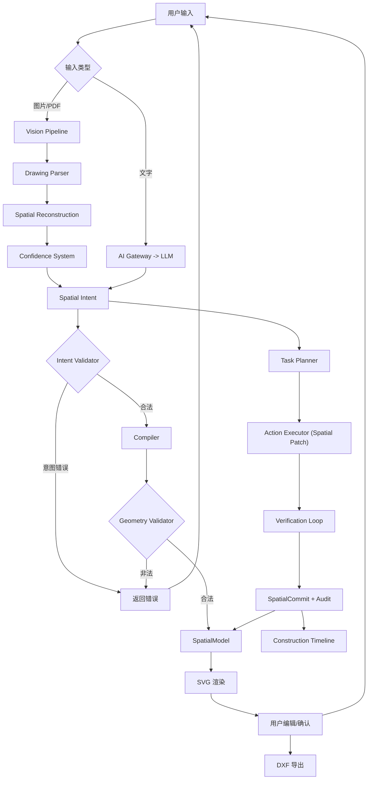

## 1. 产品概述

VectorAI Spatial Protocol MVP v0.1 - AI 原生二维空间协议引擎。

- 用户通过**自然语言或图片/PDF/CAD截图**输入需求，AI 通过**Spatial Agent Workflow** 逐步构建空间模型，而非一次性生成
- 核心资产是 Spatial Core：平台无关的空间协议层，包含 Intent Validator、Compiler、Geometry Validator、SpatialModel、Constraint System、Representation，不依赖 UI
- 协议从第一天起是三层结构：**Semantic Layer -> Spatial Model Layer -> Representation Layer**
- AI 制图的核心特征：**猜测 -> 验证 -> 修正**（类工程设计流程），SpatialModel 支持增量更新和版本历史
- 第一版目标：证明 AI 生成的是结构化空间，而不是图片
- 目标用户：工科学生、CAD 初学者、工程新人

## 2. 核心功能

### 2.1 功能模块

1. **主工作区**：SVG 画布渲染、对象列表、基础参数编辑、关系可视化、DXF 导出
2. **Spatial Perception Layer（空间感知层）**：图片/PDF/CAD截图 -> 输入规范化 -> Vision 分析 -> Spatial Intent
3. **Spatial Agent Workflow（空间智能工作流）**：首版核心能力。AI 逐步构建 Spatial Model，分阶段自动执行，以可审计提交进行增量更新，并带验证闭环

### 2.2 Spatial Agent Workflow 架构

AI 不直接生成最终图纸，而是**逐步构建** Spatial Model。

```
用户输入 / 图片
         |
         ↓
  Spatial Harness
         |
         ↓
  Task Planner（任务规划）
         |
         ↓
  多阶段 Spatial Intent（增量操作）
         |
         ↓
  Action Executor -> Spatial Model 增量更新
         |
         ↓
  Verification Loop（验证闭环）
         |
         ↓
  Render + Human Feedback
```

#### 2.2.1 Task Planner（任务规划器）

大目标拆小任务。

```json
{
  "task": "reconstruct_drawing",
  "steps": [
    { "id": 1, "action": "extract_outline", "description": "识别整体轮廓" },
    { "id": 2, "action": "detect_features", "description": "识别孔/槽/圆角" },
    { "id": 3, "action": "apply_dimensions", "description": "识别尺寸标注" },
    { "id": 4, "action": "build_constraints", "description": "建立约束关系" },
    { "id": 5, "action": "verify_model", "description": "工程验证" }
  ]
}
```

#### 2.2.2 Action Executor（操作执行器）

AI 不直接修改或重新生成整个模型，而是产生可验证的 **Spatial Patch**（类似 git diff）：

```json
{ "type": "entity.add", "entity": { "id": "hole_001", "type": "circle", "center": [50,50], "radius": 5 } }
{ "type": "entity.update", "entityId": "hole_001", "changes": { "radius": 10 } }
{ "type": "entity.delete", "entityId": "line_003" }
```

每个通过验证的 Patch 形成一条不可变 `SpatialCommit`，包含父提交、正向 Patch、逆 Patch、验证报告和置信度。提交历史用于审计、回放、Undo/Redo 和后续版本分支。

#### 2.2.3 Verification Loop（验证闭环）

工程场景与普通 AI 的最大区别 - 类似 CI/CD：

```
AI 提出修改
  ↓
Validator（几何检查）
  ↓
Constraint 检查（约束冲突）
  ↓
通过 → 生成 SpatialCommit 并提交
  ↓
失败 → 反馈结构化错误给 AI → 修正 → 有限重试
```

首版每阶段最多自动修正两次；仍失败时暂停并等待用户处理。未通过验证的临时模型不得提交。

#### 2.2.4 Human Feedback Manager（人工反馈管理）

AI 发现不确定项时主动暴露：
- 尺寸无法确定 -> "继续推测" / "等待人工确认"
- 约束冲突 -> 列出选项供用户选择
- 低置信度结果 -> 首版标红并允许继续自动执行；后续升级为用户确认门禁

#### 2.2.5 自动执行与用户干预

- Agent 默认自动连续执行，每个模型请求和 Patch 提交边界为安全点
- 用户可请求暂停，当前原子操作结束后停止进入下一阶段
- 用户可继续或立即停止；立即停止会取消当前请求且不提交未完成 Patch
- 用户可随时追加指令，系统在下一安全点基于当前模型重新规划剩余步骤
- UI 展示阶段目标、决策摘要、Patch 差异、验证结果和置信度，不展示模型内部隐藏推理原文

### 2.3 图片转 CAD 的分阶段流程

```
Phase 0: 理解    -> 图纸类型、视图数量、单位、标注区域
Phase 1: 骨架    -> 只生成主要轮廓，提示用户确认
Phase 2: 特征    -> 增加孔、槽、圆角
Phase 3: 尺寸    -> 识别长度、半径、角度
Phase 4: 约束    -> 建立平行、对称、相等
Phase 5: 工程验证 -> 检查闭合、尺寸冲突、约束冲突
```

### 2.4 Spatial Perception Layer

```
           User Input
               │
        ┌──────┴──────┐
        │             │
    Text Input    Image Input
        │             │
        ↓             ↓
  AI Gateway    Vision Pipeline
                     │
          ┌──────────┼──────────┐
          │          │          │
   Drawing      Spatial     Confidence
   Parser     Reconstruction  System
          │          │          │
          └──────────┼──────────┘
                     │
                     ↓
              Spatial Intent
                     │
                     ↓
         Spatial Agent Workflow
```

#### Drawing Parser（图纸解析器）
识别图元（线、圆、弧）和标注（R10、50mm、2x）

#### Spatial Reconstruction（空间重建）
恢复设计意图（Vision -> Semantic -> Geometry），而非简单描图

#### Confidence System（置信度系统）
- > 0.8（绿色）：自动进入模型
- 0.6-0.8（黄色）：标黄高亮，进入模型但需关注
- < 0.6（红色）：首版允许进入模型但持续标红；后续升级为等待用户确认

感知结果列表：每项含图元类型、参数摘要和置信度色标。首版保留“全部确认/确认选中”入口，但 Agent 自动流程不以人工确认作为默认门禁。

### 2.5 MVP 边界

**必须完成：**
- AI 文字输入 -> Spatial Intent 生成（含 confidence）
- 图片输入 -> Vision Pipeline -> Spatial Intent 生成
- Intent Validator -> Compiler -> Geometry Validator 流水线
- SpatialModel + SpatialPatch（实体/关系的 add/update/delete 局部操作）
- 几何实体：Point / Line / Circle
- 关系实现：`radius` + `distance`
- SVG Render + 多选 + 拖拽
- DXF Export
- 感知结果面板 + 批量确认
- Agent Workflow：Task Planner + Action Executor + Verification Loop
- 自动连续执行 + 暂停/继续/立即停止/追加指令
- Spatial Patch + SpatialCommit + 本地审计记录
- Undo/Redo（基于正向/逆向 Patch）和快照接口
- 图片与 PDF 输入；PDF 首版采用服务端逐页栅格化并复用 Vision Pipeline
- 低置信度实体/关系/提交标红
- Agent 确定性回放测试与图片/PDF 黄金样例
- 任务接收后 1 秒内显示已受理状态；长流程至少每 30 秒产生一次可见进度回执
- 有界上下文、显式工具注册表和结构化工具回执

**暂不实现（协议预留）：**
- Constraint Solver
- Semantic Mapping
- B-Rep / STEP Export / CAD Plugin / C++ Kernel
- 建筑平面图专用识别规则和大量领域适配（协议保持兼容）
- PDF 矢量对象/文字层原生解析
- 数据库或云端审计存储

### 2.6 页面详情

| 页面名称 | 模块名称 | 功能描述 |
|----------|----------|----------|
| 主工作区 | 顶部工具栏 | 品牌标识、AI 连接状态、DXF 导出、缩放控制 |
| 主工作区 | AI 对话面板 | 文字输入、图片上传/粘贴（先预览后发送）、对话历史、置信度显示 |
| 主工作区 | SVG 画布 | 网格、坐标轴、实体渲染、缩放平移、多选(Ctrl+点击/框选)、关系可视化 |
| 主工作区 | 对象列表 | 扁平列表、类型图标、显示切换、删除 |
| 主工作区 | 参数编辑面板 | 选中实体参数编辑、实时预览 |
| 主工作区 | 底部状态栏 | 鼠标坐标、单位、缩放比例、实体数量 |
| 主工作区 | 感知面板 | 识别结果列表、置信度色标、勾选、全部确认/确认选中/拒绝 |
| 主工作区 | Construction Timeline | 分阶段进度、执行轨迹、Patch 差异、验证/重试、提交历史、暂停/继续/停止/追加指令 |

## 3. 核心流程

**文字路径（MVP）：**
用户输入 -> AI Gateway -> LLM -> Spatial Intent -> Intent Validator -> Compiler -> Geometry Validator -> SpatialModel -> SVG 渲染

**感知路径（MVP）：**
图片 -> Vision Pipeline -> Spatial Intent -> Spatial Core -> 感知面板（置信度+确认）-> SpatialModel -> SVG 渲染

**Agent Workflow 路径（MVP）：**
图片/文字 -> Task Planner（分阶段）-> 每阶段 Action Executor（增量操作）-> Verification Loop（验证闭环）-> SpatialModel 增量更新 -> Construction Timeline + Human Feedback



## 4. 界面设计

### 4.1 设计风格

- **风格定位**：技术蓝图风格，深色专业制图环境
- **主色调**：深海军蓝 `#0a0f1a` + 青色 `#22d3ee`
- **辅助色**：琥珀 `#f59e0b`（选中）、朱红 `#ef4444`（错误）
- **关系色**：紫色 `#a78bfa`
- **置信色**：绿 `#22c55e`（>0.8）/ 黄 `#eab308`（0.6-0.8）/ 红 `#ef4444`（<0.6）
- **字体**：JetBrains Mono + Sora
- **布局**：三栏（左实体列表 + 中画布 + 右AI对话），顶部工具栏 + 底部状态栏

### 4.2 页面设计概览

| 模块 | UI 元素 |
|------|---------|
| 顶部工具栏 | Logo、AI状态、导出、缩放 |
| AI 对话面板 | 文字输入+图片上传、消息气泡、Intent折叠、置信度标签、加载骨架 |
| SVG 画布 | 网格、坐标轴、实体描边、选中虚线、关系连线、框选矩形 |
| 对象列表 | 类型图标、显示切换、删除、选中计数 |
| 参数编辑面板 | 实体参数输入框 |
| 感知面板 | 图片预览、结果列表、置信度色标、勾选、确认按钮 |
| 状态栏 | 坐标、单位、缩放、计数 |
| Construction Timeline | ✓/●/○ 阶段进度、结构化执行轨迹、增量差异、验证结果、提交历史和运行控制 |

### 4.3 首版领域边界

- 优先覆盖二维机械工程图
- 建筑平面图在 Point/Line/Circle/Relation 和表示层保持协议兼容
- 若建筑兼容需要墙体、门窗、房间语义或专用识别规则的大量适配，可延后至独立版本
- 产品中“AI 思考过程”统一表述为“执行轨迹”或“决策摘要”

### 4.4 响应式与视觉细节

桌面优先 1024px+，画布自适应，面板可折叠。网格线、坐标轴、选中虚线流动、关系呼吸动画、置信度色标、低置信度高亮。

Agent 运行时通过进度流持续更新 Construction Timeline。用户不需要等待完整任务完成才看到结果；规划、工具调用、验证、提交和等待心跳都必须形成结构化回执。
