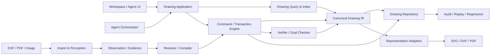

# VectorAI “图纸即代码”系统架构设计

**日期：** 2026-08-08  
**状态：** 已确认，阶段一核心能力已实现，主链迁移进行中
**适用阶段：** MVP 到首版发布  
**取代：** `docs/tech-architecture.md` 中以 SpatialIntent、扁平 SpatialModel 和文字步骤为中心的架构  

## 1. 愿景

VectorAI 的目标是让 AI 像理解、维护和修改代码一样理解、维护和修改真实二维图纸。

代码系统的可靠性来自稳定语法树、符号身份、查询工具、编译器、测试、Diff 和 Commit。VectorAI 对图纸提供对应能力：Canonical Drawing IR、稳定实体 ID、空间与拓扑查询、类型化 Drawing Command、事务化 Patch、分层验证、Drawing Commit、审计回放和回归测试。

AI 负责理解目标、选择工具和处理歧义；几何运算、正式修改、验证、版本记录和导出必须由确定性系统完成。

## 2. 已确认的关键决策

1. 采用“Canonical Drawing IR 为编辑权威、原文件不可变保留、未支持内容透传”的混合方案。
2. 原始 DXF、PDF 和图片是 Source Artifact，证明数据来源，但不是统一编辑协议。
3. 所有正式修改统一经过 Command → Transaction → Verify → Commit。
4. AI 和 UI 不得直接改写 DrawingDocument。
5. MVP 只做二维几何、文字和尺寸；不做 3D、图层编辑、图块编辑和填充编辑。
6. 系统默认自动执行，先产生 Preview Event，再原子提交；低置信度结果可以作为候选提交并标红。
7. 用户可在安全点暂停、继续、停止和追加指令。
8. 默认模型为 `doubao-seed-2.0-lite`；只有模型明确给出低于 0.6 的置信度时才允许使用 `doubao-seed-2.1-turbo` 升级一次。
9. 模型名称不在任务 UI 展示，但进入本地审计。
10. MVP 不承担旧 SpatialModel、SpatialIntent、Commit 或审计格式的兼容成本；开发数据可清理，测试样例一次性转换。
11. MVP 使用本地仓库、单一线性 revision 历史，不实现分支、合并、远程同步和多人协作。
12. 简单文字修改首个 Commit 目标小于 30 秒；活跃任务最多 25 秒必须产生一次进度或 heartbeat。

## 3. 三种“真相”

系统明确区分以下三类数据：

### 3.1 来源真相

Source Artifact 是用户上传的原始 DXF、PDF 或图片。它按内容哈希保存、不可变，回答“数据从哪里来”。

### 3.2 编辑真相

Canonical Drawing IR 是 VectorAI 当前理解和维护的正式图纸，回答“系统认为图纸是什么，以及应该如何修改”。

### 3.3 表示结果

SVG、DXF 和 PDF 是 Drawing IR 的不同表现形式。Adapter 可以产生降级或保真警告，但表示结果不反向成为编辑权威。

## 4. 总体架构



依赖规则：

- Drawing Core 不依赖 AI、React、Express、网络或文件系统。
- Agent 依赖公开工具和 Application 接口，不访问内部数组。
- UI 保存工作区投影与交互状态，不成为第二个 Drawing 权威。
- Importer 和 Perception 只产生 Observation/Evidence，不直接修改正式文档。
- 所有入口最终汇入同一个 Drawing Application。

## 5. 模块边界

### 5.1 Canonical Drawing Core

定义 Drawing IR、稳定身份、几何和标注类型、关系、Feature、纯查询、验证规则和确定性计算。

### 5.2 Drawing Repository

管理 Drawing Package、Source Artifact、Document、Revision、Commit、Snapshot、Source Map、Observation 和 opaque 内容。MVP 使用本地文件实现，但业务只依赖仓库接口。

### 5.3 Import & Perception

按来源选择 DXF 确定性解析、PDF 矢量/栅格混合解析或图片视觉感知。输出统一 Observation 与 Evidence。

### 5.4 Resolver & Compiler

负责 Observation 去重、坐标标定、候选关联、身份分配和 Drawing Command 构建。它不能绕过 Transaction 写入文档。

### 5.5 Drawing Query & Index

提供空间、类型、属性、拓扑、标注、Feature、来源和历史查询。索引是可重建的派生数据，不是持久化真相。

### 5.6 Command / Transaction Engine

接收类型化 Command，检查 revision 与前置条件，编译 Patch，在临时文档上验证，产生 Preview，并原子提交 Commit。

### 5.7 Agent Orchestrator

负责目标理解、执行通道路由、Workflow Graph、工具选择、失败恢复、暂停和追加指令。它不实现几何逻辑。

### 5.8 Verifier / Audit / Regression

验证文档与目标，保存结构化运行记录，并提供确定性回放、运行时回放和模型回归。

### 5.9 Representation Adapter

把 Drawing IR 转为 SVG、DXF 或 PDF，返回输出、Fidelity Report 和 warnings。格式降级只发生在 Adapter。

## 6. Canonical Drawing IR

新的序列化协议命名为 `VectorAI-Drawing`，MVP 初始 `schemaVersion` 为 `1.0`。

```ts
interface DrawingDocument {
  protocol: 'VectorAI-Drawing';
  schemaVersion: '1.0';
  id: DrawingId;
  metadata: DrawingMetadata;
  unitSystem: UnitSystem;
  coordinateFrames: CoordinateFrame[];
  geometry: GeometryNode[];
  annotations: AnnotationNode[];
  relations: DrawingRelation[];
  features: SemanticFeature[];
}
```

### 6.1 Geometry Plane

首版支持：Point、Line、Ray、XLine、Circle、Arc、Ellipse、Polyline 和 Spline。

矩形、正多边形、孔、槽、墙、门窗等不是底层 Geometry 类型。创建工具可以把它们编译成显式几何，并在 Feature Plane 保留设计意图。

### 6.2 Annotation Plane

Text、Dimension、Leader、Tolerance 和 Symbol 与几何分离。MVP 先实现 Text 与 Dimension，其余类型保留协议扩展点但不暴露未实现工具。

Dimension 通过强类型 Anchor 引用几何。OCR 观察值、根据几何计算的值和显示文字分别保存，不能互相覆盖。

### 6.3 Relation Plane

关系分为：

- `topology`：连接、闭合、包含、相交。
- `constraint`：水平、竖直、平行、正交、相切、同心、同值、距离、半径、角度、对称。
- `association`：尺寸、文字和几何的绑定。
- `semantic`：Feature 与几何或标注的组成关系。

每种关系是类型安全联合，拥有自己的字段、适用实体类型和验证规则。

### 6.4 Semantic Feature Plane

Feature 可以引用多个几何、标注和关系。Feature 的状态为 `confirmed` 或 `candidate`。候选语义必须携带置信度和 Evidence 引用，不能冒充已确认事实。

### 6.5 稳定身份

- 实体坐标或尺寸变化不改变 ID。
- 类型发生本质变化时使用 delete + add。
- 用户或 AI 新建对象使用 UUID。
- 导入对象优先基于 Drawing ID、源对象 handle 和稳定来源键生成 ID。
- 进程级递增计数器不得作为正式身份来源。
- 所有引用在提交前执行存在性和类型验证。

### 6.6 坐标与单位

DrawingDocument 明确保存单位和 CoordinateFrame。源坐标、页面坐标、视图坐标和文档坐标之间的变换必须可追踪，不能把归一化图片坐标直接视为毫米坐标。

## 7. Drawing Package 与来源证据

```ts
interface DrawingPackage {
  packageVersion: '1.0';
  sources: SourceArtifact[];
  document: DrawingDocument;
  sourceMap: SourceMapping[];
  observations: ObservationRecord[];
  opaqueRecords: OpaqueSourceRecord[];
  repository: RevisionRepositoryState;
}
```

- `SourceArtifact` 保存不可变原始文件、哈希、格式和页信息。
- `SourceMapping` 连接内部稳定 ID 与 DXF handle、PDF path 或图片区域。
- `ObservationRecord` 保存测量参数、置信度、候选、Evidence 和工具调用引用。
- `OpaqueSourceRecord` 保存尚未支持但需要在导出时保留的源对象。
- `RevisionRepositoryState` 保存当前 revision、Commit 引用和 Snapshot 引用。

媒体正文不写入热上下文或 JSON 事件正文，只通过安全 Artifact ID 引用。

## 8. Drawing Command、Transaction 与 Patch

Command 表达“想做什么”，Patch 表达确定性编译后“具体改了什么”。AI 和 UI 只能提交 Command。

```ts
interface DrawingTransaction {
  id: string;
  baseRevision: RevisionId;
  actor: Actor;
  goalId?: string;
  commands: DrawingCommand[];
  preconditions: DrawingAssertion[];
  postconditions: DrawingAssertion[];
  evidenceRefs: string[];
}
```

执行顺序固定为：

1. 检查 `baseRevision`。
2. 检查前置条件。
3. 把 Command 编译为 Patch。
4. 在临时 DrawingDocument 上应用 Patch。
5. 执行分层文档验证。
6. 检查目标后置条件。
7. 生成 Preview Event。
8. 原子持久化 Commit 和 resulting revision。

任何阶段失败，正式文档都不发生变化。Revision 过期时返回结构化冲突，不采用 last-write-wins。

### 8.1 Preview 与自动执行

- 系统默认自动执行，不等待人工确认。
- Preview 展示受影响实体、修改前后值、warnings 和目标验证结果。
- 用户可在 Preview 后的安全点暂停。
- 低置信度事务作为 candidate Commit 提交并在 UI 标红。
- 目标已经满足时返回 `already_satisfied` Receipt，不生成空 Commit。

### 8.2 Drawing Commit

```ts
interface DrawingCommit {
  id: CommitId;
  parentRevision: RevisionId;
  resultingRevision: RevisionId;
  actor: Actor;
  goalId?: string;
  commands: DrawingCommand[];
  patch: DrawingPatch;
  inversePatch: DrawingPatch;
  validationReport: ValidationReport;
  outcomeReport: GoalOutcomeReport;
  evidenceRefs: string[];
  confidence?: number;
  timestamp: number;
}
```

Commit 必须能在不调用模型的情况下确定性重放。

### 8.3 Undo 与 Redo

MVP 使用追加式历史：Undo 通过 `inversePatch` 创建 Revert Commit；Redo 撤销该 Revert 或重新应用原 Command。未提交的 Preview 直接取消。旧 cursor 模型不再保留。

## 9. Goal 驱动的 Agent Runtime

### 9.1 目标和工作流协议

```ts
interface GoalSpec {
  id: string;
  objective: string;
  scope: DrawingSelector;
  acceptanceCriteria: DrawingAssertion[];
  riskPolicy: RiskPolicy;
}

interface WorkflowNode {
  id: string;
  capability: string;
  dependsOn: string[];
  expectedOutputs: OutputContract[];
  completionCriteria: DrawingAssertion[];
}
```

每个节点执行前后都由确定性工具判断：`already_satisfied`、`ready`、`completed`、`failed` 或 `blocked`。完成条件不能只由模型自行宣称。

### 9.2 双通道执行

Fast Command Lane 处理创建、删除和明确对象修改，流程为理解目标 → 查询对象 → 类型化工具 → Preview → Commit。

Workflow Lane 处理图片/PDF感知、复杂多对象任务和分析后修改，流程为输入意图判断 → 感知/查询 → GoalSpec → Workflow Graph → 工具调用 → 持续验收。

图片和文字联合输入时，由 Input Interpreter 判断分析、重建、分析后修改或把图片作为参考，不要求用户操作业务开关。

### 9.3 Tool Registry

首批工具包括：

- `query_entities`
- `inspect_entity`
- `measure_geometry`
- `query_topology`
- `create_geometry`
- `update_geometry`
- `delete_geometry`
- `create_annotation`
- `preview_transaction`
- `commit_transaction`
- `verify_goal`
- 图纸导入与感知工具

每个工具拥有严格 Schema、能力版本、读写属性、超时策略和 Receipt。关系引用来自查询结果中的稳定 ID，不能只解析当前模型输出内部的 reference。

### 9.4 失败恢复

1. Schema 或参数错误：同模型修正一次。
2. 目标过期或不存在：重新查询当前 revision。
3. 当前节点设计错误：重新规划未完成部分。
4. 模型明确给出 `confidence < 0.6`：允许 Turbo 升级一次。
5. 仍不能安全完成：暂停并保留已验证 Commit。

普通 JSON 错误、工具异常和几何验证失败不会触发 Turbo。

### 9.5 上下文管理

热上下文只包含 GoalSpec、稳定规则、当前 revision、最近 Receipts、已完成目标摘要、当前查询结果、用户选择和必要的局部媒体引用。完整图纸、原图和全部事件历史不重复进入 Prompt。

### 9.6 运行控制

安全点位于工具调用前、Preview 后和 Commit 后。Pause 中止可取消的模型与只读工具调用，但不切断原子提交。新指令在安全点基于最新 revision 合并并重新规划。Stop 从 running 或 paused 都必须确定进入 `stopped`。

UI 展示目标、计划、查询、工具、验证、Commit 和错误原因，不展示模型名称，也不依赖暴露隐藏思维链。

## 10. 图纸导入与感知

### 10.1 DXF

- 使用确定性 Parser 读取原生 CAD 对象。
- DXF handle 进入 Source Map。
- 支持对象转换为 Geometry 或 Annotation Observation。
- 图层、图块、填充等首版不编辑，保存为 opaque records。
- 不使用视觉模型重新识别结构化 CAD 内容。
- 无法解析的对象产生 Import Warning，不静默丢弃。

### 10.2 PDF

- 优先提取矢量路径、文字和页面坐标。
- 矢量内容不可靠时使用页面或局部区域视觉感知。
- 架构支持多页；MVP 每次运行处理一个页面，并明确提示剩余页。
- 页码、页面 CoordinateFrame 和来源区域进入 Source Map。

### 10.3 图片

流水线顺序为页级分析 → 视图分割 → 基准检测 → 局部几何与 OCR → 拓扑 → 尺寸关联 → Resolver → Commands → 分批 Transaction。

图纸不按从上到下或领域对象名称拆解，而按视图、局部区域和拓扑组件处理。

### 10.4 坐标标定

归一化只负责媒体和坐标变换，不负责理解图纸。完整变换链为 source → page → view → document。

缺少可靠比例时，几何进入 provisional CoordinateFrame。解析出可靠尺寸后，通过显式 Transaction 完成标定，并记录 Evidence 和变换来源。

### 10.5 局部失败

- 每个拓扑组件独立形成事务。
- 单个组件失败不回滚其他已验证组件。
- 单个事务必须原子提交。
- 低置信度结果独立提交并标红。
- 尺寸关联不唯一时保留候选，不猜测唯一目标。
- 全图只处理页级信息，详细识别使用局部裁剪和受控并行。

## 11. Representation 与保真度

```ts
interface ExportResult {
  output: Uint8Array | string;
  fidelity: FidelityReport;
  warnings: ExportWarning[];
}
```

每个实体或源对象的导出状态为：

- `native`：目标格式原生无损表达。
- `approximated`：经过明确近似。
- `opaque_passthrough`：未理解但原样保留。
- `omitted`：无法导出，必须报告。
- `blocked`：继续导出可能造成错误，阻止文件生成。

SVG 用于工作区显示，DXF 用于首版 CAD 交换，PDF 用于预览和交付。Core 不执行格式降级。

## 12. 分层验证与错误协议

事务按顺序执行 Schema、Numeric、Reference、Geometry、Topology、Annotation、Semantic 和 Goal Validation。Export Validation 在请求导出时执行，不阻塞与导出无关的普通编辑事务。

验证等级为：

- `error`：阻止 Commit。
- `warning`：允许提交，但必须展示和审计。
- `candidate`：允许候选提交并标红。
- `info`：解释性结果。

```ts
interface DrawingError {
  code: string;
  stage: string;
  retryable: boolean;
  entityIds?: string[];
  evidenceRefs?: string[];
  message: string;
  suggestedAction?: string;
}
```

Agent 依据错误类型和 `retryable` 决定修正、重新查询、重新规划或暂停，不解析错误字符串猜测行为。

## 13. 审计、回放与回归

### 13.1 Run Manifest

记录 Drawing ID、基础 revision、GoalSpec、Source Artifact 哈希、Prompt 模板哈希、模型角色与版本、工具能力版本、IR/Command/Validator 版本、运行配置和时间。

### 13.2 事件流

记录用户指令、结构化计划、重新规划原因、查询与结果引用、工具调用、模型结构化输出、Preview、Patch、验证、Commit、状态变化、耗时、错误和重试决策。

API Key、Authorization、媒体 base64 和隐藏思维链不写入审计正文。

### 13.3 回放模式

- Deterministic Replay：不调用模型，重放 Commit。
- Runtime Replay：使用录制的结构化模型输出与工具结果验证运行时。
- Model Regression：重新调用当前模型，比较 Goal Outcome、几何误差、实体集合和工具轨迹，不要求文本字节一致。

### 13.4 测试体系

- Core 类型与 Validator 单元测试。
- Command → Patch → inversePatch 属性测试。
- 合法 Commit 序列确定性回放测试。
- Tool Schema 契约测试。
- Agent 状态机和失败注入测试。
- DXF、PDF、Image 黄金样例测试。
- 文字修改、图片重建、分析后修改完整场景测试。
- 首次回执、首个 Commit、感知阶段和导出性能测试。
- 导出再导入的几何与标注语义一致性测试。

`test1.jpg` 保持本地测试文件，不纳入提交或破坏。

## 14. 本地持久化

MVP 本地仓库至少分离保存：

- Source Artifact 媒体正文。
- Drawing Package metadata。
- 当前和周期性 Drawing Snapshot。
- 追加式 Drawing Commit。
- Observation/Evidence。
- Agent Event Log。
- Export Fidelity Report。

文件名和引用使用安全 ID。Document revision 与 Commit 使用临时文件加原子替换持久化。审计事件可以异步排队，但 Commit 成功前必须保证核心 revision 已持久化。

## 15. 性能预算

- HTTP 接受任务小于 1 秒。
- 首个可见状态事件小于 1 秒。
- 活跃任务最长 25 秒发送一次进度或 heartbeat。
- 简单文字修改首个 Commit 目标小于 30 秒。
- 只读查询和独立视图感知可以受控并行。
- 审计写入和非关键 OCR 不阻塞 Commit 主链。
- 热上下文使用索引和局部查询，不发送完整文档。

## 16. MVP 明确不做

- 任何 3D 实体、曲面、网格、B-Rep 或 STEP。
- 图层、图块、外部引用和填充的可编辑语义。
- DWG 原生读写。
- 完整参数化约束求解器。
- 分支、合并、远程同步和多人协作。
- 旧 SpatialModel、SpatialIntent、Commit 或审计数据的生产兼容。
- UI 展示模型名称或隐藏思维链。

## 17. 当前项目诊断

1. `SpatialModel` 把几何、标注和语义混在同一扁平集合。
2. `EntityPatch` 只完整覆盖 Point、Line 和 Circle，而 Core 已声明更多图元。
3. Harness、Agent Prompt、DXF Adapter 和部分 UI 上下文仍只识别 Point、Line 和 Circle。
4. `TaskStep` 只有 action 和 description，没有依赖、完成条件和允许能力。
5. SpatialIntent 的关系引用主要解析当前输出对象，不能可靠引用现有文档实体。
6. Agent 失败后重复相同执行契约，没有先重新查询或重新规划。
7. Stop 从 paused 状态可能停留在 `stopping`。
8. 旧 `/api/ai/*`、前端本地执行和 Agent Runtime 形成多套修改链路。
9. Zustand 与服务端 Runtime 同时持有完整模型，权威不唯一。
10. 当前审计可以保存事件和 Commit，但不能完整复现模型与工具行为。
11. 当前 DXF Adapter 只输出 Point、Line 和 Circle，且没有 Fidelity Report。
12. 当前图片坐标转换不能替代可靠的工程单位标定。

这些问题说明失败根因是架构契约不完整，不是单独的坐标归一化或 Prompt 问题。

## 18. 无兼容包袱的迁移计划

迁移采用分阶段主链替换。每完成一条新主链就删除对应旧入口，不长期维护双协议或 Feature Flag。

### 实施状态（2026-08-08）

| 范围 | 状态 | 已验证边界 |
| --- | --- | --- |
| 阶段一：Drawing Core V1 基础能力 | 已实现 | Canonical DrawingDocument、稳定 ID、完整查询、类型化 Command、原子 Transaction Preview、可逆 Patch、分层 Validator、线性 In-memory Repository、Revert Commit 和确定性 Replay 已落地；Drawing Core 测试、全项目测试、类型检查与生产构建通过。 |
| 阶段一：应用主链切换与旧 Core 删除 | 未完成 | 当前 UI、Agent Runtime、感知和旧审计仍引用 SpatialModel/SpatialIntent；在 Drawing Application Service 接管对应入口前不得删除旧实现，也不得把阶段一整体标记为验收完成。 |
| 阶段二至阶段五 | 未开始 | 按下述阶段顺序分别制定实施计划和验收门槛。 |

### 阶段一：替换 Drawing Core

实现 DrawingDocument、稳定 ID、Drawing Query、类型化 Command、Transaction、Patch、inversePatch、分层 Validator、In-memory Repository 和 Revert Commit。

一次性转换测试 fixtures，删除旧类型、编译器和 cursor 历史实现。

验收：所有手动 CAD 操作只能通过 Transaction 修改文档。

### 阶段二：统一 Application 与本地仓库

建立 Drawing Application Service，统一承接 UI 编辑、AI 工具、感知提交、Revert、导入和导出。服务端本地仓库成为权威，Zustand 只保存工作区投影、选择和当前 revision。

验收：刷新页面后恢复 Document、revision 和 Commit 历史。

### 阶段三：重建 Agent Runtime

实现 Tool Registry、Fast Command Lane、GoalSpec、Workflow Graph、Runner、Recovery、Run Control 和 Progress。加入 `already_satisfied`、重新查询、重新规划和确定停止。

删除旧 SpatialIntent 执行器、旧 Agent execute 路径和前端 `executeNextStep`。

验收：简单文字修改在 30 秒内形成首个可审计 Commit，重复步骤不会修改已满足目标。

### 阶段四：重建导入与感知

实现 Source Artifact Store、DXF Importer、PDF 按页解析与栅格回退、Image Observation Pipeline、Source Map、Resolver、坐标标定和拓扑组件事务。

删除图片直接生成 SpatialIntent 的旧接口。

验收：图片和文字联合输入可以先分析，再基于重建后的 revision 修改图纸。

### 阶段五：表示、审计与回归闭环

完成显式二维图元 SVG Renderer、DXF Import/Export、PDF Export/Preview、Fidelity Report、结构化审计、三种 Replay、黄金样例、性能预算和 UI Preview/Commit Diff。

验收：同一 Commit 序列可确定性重放；导出不能静默丢失未支持内容。

## 19. 迁移完成条件

- 不再存在旧 SpatialIntent 主链。
- 所有修改都经过 Command → Transaction → Verify → Commit。
- Core 不依赖 AI、Express、React 或文件系统。
- Agent 不直接操作 DrawingDocument 数组。
- UI 不维护第二份权威模型或历史。
- 图纸输入保留 Source Artifact、Observation 和 Source Map。
- 低置信度、失败和格式降级可见且可审计。
- Pause、追加指令、Stop 和 Revert 有真实流程回归。
- 简单文字修改首个 Commit 满足 30 秒目标。
- 图片/PDF分析后修改可以分步完成。
- 本地仓库可以恢复当前 revision 并确定性重放历史。

## 20. 实施组织

本文件是北极星系统架构，不作为单一超大实施计划。五个迁移阶段分别建立实施计划和验收门槛，按阶段一到阶段五顺序推进。

开发继续在当前主流程进行，不新增分支管理，不使用子 Agent。每个阶段采用测试先行和小步提交，但完成后直接删除已被替代的旧协议和入口。
