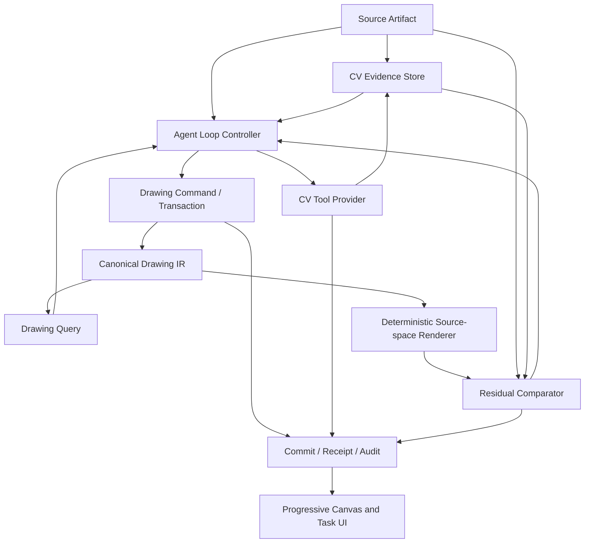

# Agent 驱动的 CV 观察反馈闭环设计

**日期：** 2026-08-09
**状态：** 已确认，等待实施计划
**基准图：** `test1.jpg`
**替代范围：** 本设计替代“模型分区读取后一次性汇总并提交”的图片感知主流程；Canonical Drawing IR、Command、Transaction、Commit 和审计主链保持不变。

## 1. 目标

第一版必须让 AI 像维护代码一样逐步理解、维护和修正二维图纸，而不是把一次模型输出分批播放成“过程”。

系统必须形成真实闭环：

1. AI 观察来源图纸和当前 Drawing IR。
2. AI 创建允许重叠的观察区域，并按需调用 CV 工具获取证据。
3. AI 对 Drawing IR 提出局部增量修改。
4. 几何引擎重绘修改结果并与来源证据比较。
5. AI 根据差异继续创建、更新、改类型、合并、拆分或删除图元。
6. 局部验证通过后立即提交；后续发现错误时用新 Commit 继续修正。
7. 直到验收条件满足、用户暂停或明确达到预算，任务才结束当前运行。

`test1.jpg` 是 MVP 发布门槛，不是演示样例。架构、模型提示和工具协议只有在 test1 金标回归通过后才算有效。

## 2. 非目标

- 不引入 AutoCAD、外部 CAD 文档模型或第二套编辑权威。
- 不让 CV 直接写入正式 Drawing IR。
- 不要求 CV 在 Agent 开始工作前完整分析整张图。
- 不把所有像素、边缘点或轮廓采样点放入模型上下文。
- 不做 3D、图层、图块或填充编辑。
- 不以一次模型调用完成复杂图纸为目标。

## 3. 数据权威与职责边界

系统保留三种不同性质的数据：

| 数据 | 权威性 | 作用 |
|---|---|---|
| Source Artifact | 不可变来源真相 | 保存原始图片/PDF及坐标系 |
| CV Evidence Store | 可版本化观察证据 | 保存边缘、轮廓、端点、交点、拟合候选和残差 |
| Canonical Drawing IR | 唯一编辑真相 | 保存正式二维几何、文字、尺寸和关系 |

“几何引擎”是 VectorAI 自有 Drawing Core 的确定性能力集合，不是外部 CAD：

- 校验 Drawing IR 参数和引用；
- 将类型化 Command 编译为 Patch；
- 执行事务和生成可逆 Commit；
- 拟合图元参数；
- 查询和验证拓扑；
- 将 Drawing IR 渲染到来源坐标系供差异比较。

AI 负责选择目标、调用工具、解释证据和决定修改；CV 提供眼睛和尺子；几何引擎负责精确表达；反馈控制器负责循环和收敛。

## 4. 总体架构



依赖规则：

- Drawing Core 不依赖 CV、模型、React、Express 或媒体格式。
- CV Tool Provider 不访问或修改 DrawingDocument。
- Agent 只能通过类型化工具读取证据和修改 Drawing IR。
- Residual Comparator 只产生验证结果和下一步候选区域，不提交图纸。
- UI 是事件投影，不是运行状态或 Drawing IR 的第二权威。

## 5. CV 作为 Agent 工具

CV 不是固定前处理步骤，而是 Agent Tool Registry 中的一组只读或计算型工具。第一版工具契约为：

### `inspect_source_overview`

生成低分辨率全图摘要、前景范围、粗粒度连通组件、候选视图和证据密度图。它必须快速返回，不能等待全分辨率轮廓分析。

### `create_observation_region`

根据 AI 给出的来源坐标范围、目的、目标槽位和分辨率创建观察区域。区域允许重叠、嵌套和重复观察。

### `cv_extract_evidence`

在指定区域提取边缘、连通轮廓、端点、交点及少量图元候选。默认只返回 Evidence handle、边界框、摘要和置信度；采样点保存在 Evidence Store。

### `cv_fit_primitive`

针对指定 Evidence handle 和图元类型执行确定性参数拟合。支持 `point`、`line`、`ray`、`xline`、`circle`、`arc`、`ellipse`、`polyline` 和 `spline`。返回拟合参数、误差、覆盖范围和异常点比例。

### `render_region`

将当前 revision 或候选 Patch 按来源坐标系渲染到指定区域。它必须能够分别渲染主体几何、构造线、文字和尺寸。

### `compare_region`

比较来源证据与当前渲染，返回遗漏边缘、错误新增边缘、拓扑断裂、标注不匹配、各指标变化和建议关注范围。

### `apply_drawing_patch`

使用现有 Command → Transaction → Verify → Commit 主链应用局部修改。它不是 CV 工具，但必须和 CV Receipt 使用同一 Agent run、slot lineage 和审计序列。

工具响应必须有严格上限。超出像素、轮廓数、采样点数、内存或时间预算时，返回分页句柄和结构化 `budget_exceeded`，不得截断后声称完整。

## 6. Web 产品中的执行位置

Agent Runtime 当前运行在本地 Express 服务，因此权威 CV 工具也运行在服务端 Worker 边界中。第一版使用 Node Worker Threads 承载 OpenCV.js/WASM Provider：

- CV 计算不阻塞 HTTP、SSE 或 Node 主事件循环；
- 浏览器刷新或关闭不会中断 Agent 任务；
- WASM 和 Provider 延迟加载，按 Source Artifact 哈希缓存结果；
- Provider 接口不暴露 OpenCV 类型，未来可替换为原生 OpenCV 或独立服务；
- 浏览器只接收有界 Evidence Overlay 和进度事件，不保存权威 CV 状态。

如果运行环境不支持 Worker 或 WASM，任务返回明确能力错误并保留现有 Drawing revision，不静默退回一次性模型猜测。

## 7. AI 规划的重叠观察区域

`ObservationRegion` 是观察窗口，不是无重叠分区，也不拥有图元：

```ts
interface ObservationRegion {
  id: string;
  sourceId: string;
  bounds: [number, number, number, number];
  purpose: 'inventory' | 'geometry' | 'topology' | 'annotation' | 'verification';
  targetSlotIds: string[];
  parentRegionId?: string;
  resolutionLevel: number;
  attempt: number;
}
```

规则：

- AI 根据当前 Goal、全图摘要、Drawing IR 和残差自行创建区域。
- 区域可以重叠、扩大、缩小、移动或嵌套，不要求覆盖面积之和等于整张图。
- 识别目标是完整图元或拓扑组件，而不是完成某一矩形切片。
- 轮廓触及区域边缘时只形成 `partial` Evidence，不能直接把完整圆误提交为局部圆弧。
- AI 可以扩大区域看到完整图元，也可以将多个重叠区域的 Evidence 关联到同一槽位。
- 所有 Evidence 创建时立即保存 source-space 坐标变换，禁止把 crop 归一化坐标直接写入 Drawing IR。

为防止无界调用，工具层而非模型负责强制单次像素、结果数量、嵌套深度、并发和总预算。

## 8. 图元槽位、身份与修订

`ObservationSlot` 表示“来源中被持续观察的同一个潜在对象”，其身份跨区域和多轮运行保持稳定：

```ts
interface ObservationSlot {
  id: string;
  sourceId: string;
  evidenceRefs: string[];
  candidateTypes: Array<{ type: GeometryType; score: number }>;
  drawingEntityIds: string[];
  status: 'unobserved' | 'candidate' | 'committed' | 'conflict' | 'rejected';
  revision: number;
}
```

同一槽位可以经历：

- `create`：首次建立正式图元；
- `update`：坐标或参数修正；
- `retype`：观察语义改变；在 Drawing Core 内编译为 delete + add，同时通过 slot lineage 保持来源连续性；
- `merge`：多个槽位或实体合并为一个图元；
- `split`：一个槽位拆成多个实体；
- `delete/reject`：删除已提交错误或拒绝候选。

已提交错误不是异常终止条件。修正必须产生新的 Drawing Commit，不得覆盖历史或只修改预览层。

## 9. 真实反馈循环

Agent Loop Controller 使用以下状态机：

```text
OBSERVE
  → SELECT_TARGET
  → ACQUIRE_EVIDENCE
  → PROPOSE_PATCH
  → PREVIEW_AND_RENDER
  → COMPARE
  → COMMIT_LOCAL_RESULT
  → SELECT_TARGET
```

`COMPARE` 后允许：

- 接受局部结果并 Commit；
- 修改参数后重新预览；
- 改变图元类型；
- 合并或拆分槽位；
- 删除早期错误 Commit 中的实体；
- 扩大、移动或新增重叠观察区域；
- 在明确触发条件下升级模型；
- 用户暂停或预算耗尽时保存可恢复状态。

只有新增 Observation 而没有改变 Drawing IR 或残差的操作不算修复轮次。连续修复轮次必须记录修改前后指标，防止 UI 将重复读取包装成进展。

局部验证后即可提交，不要求整图完成。任务级 `completed` 必须同时满足验收目标、覆盖状态和未解决冲突要求；否则只能是 `running`、`paused`、`budget_exhausted` 或 `failed`。

## 10. 验证与残差

不能用一个总像素相似度作为唯一目标，否则水印、文字和尺寸线会污染主体几何。比较器分别输出：

1. **Geometry recall**：来源主体轮廓有多少被当前 IR 解释。
2. **Geometry precision**：当前 IR 是否产生来源中不存在的边缘。
3. **Fit error**：图元采样点到来源证据的距离分布。
4. **Topology**：连接、闭合、相交、相切、同心和对称关系是否成立。
5. **Annotation**：文字、尺寸值、单位、箭头和目标关联是否匹配。
6. **Residual regions**：仍需观察或修复的位置及严重度。

每个指标必须绑定 source-space mask、Evidence refs、Drawing revision 和 Comparator 版本。模型不能直接覆盖计算结果。

低置信度、证据冲突或尚未验证的局部结果允许作为 candidate Commit 标红。候选仍是正式可审计 revision 的一部分，但不能计入 test1 发布验收的通过项。

## 11. 模型职责与升级

`doubao-seed-2.0-lite` 负责常规目标选择、区域规划、证据解释和 Patch 决策。以下任一条件满足时，单个冲突槽位允许升级到 `doubao-seed-2.1-turbo`：

- 连续两个有效修复轮次残差没有下降；
- 两种以上图元类型拟合接近且影响拓扑；
- merge/split/retype 选择无法由确定性验证区分；
- 局部修改改善像素拟合但破坏已验证拓扑；
- Lite 明确返回低置信度。

JSON 格式错误、工具超时、坐标越界和程序异常不触发 Turbo，应由协议校验、重试或代码修复处理。

## 12. UI 与持续回执

左侧画布展示真实 Drawing revision 和当前候选 Patch：

- 新建、更新、改类型、合并、拆分、删除使用统一克制的状态颜色；
- 低置信度和冲突保持红色；
- 可选显示来源图、Evidence Overlay、当前渲染和残差区域；
- 每次 Commit 后画布保留结果，后续修正直接更新或删除对应实体；
- 画布网格使用覆盖整个 viewport 的 SVG 重复 Pattern，拖动期间只更新 Pattern offset 和世界变换，禁止有限网格露出黑区。

右侧任务面板展示用户可理解的真实行为，例如“观察轮廓 C17”“将圆改为圆弧”“合并 C21/C22”“局部误差下降”。不显示模型名称、隐藏思维链或原始 CV 点集。

HTTP 接受和首个状态事件目标小于 1 秒；活跃任务最长 25 秒必须产生一次真实进度或 heartbeat。30 秒回执不等于承诺 30 秒完成复杂图纸。

## 13. 错误处理与恢复

- CV 工具错误只影响当前观察请求，不回滚已验证 Commit。
- 无效 Evidence 保留错误 Receipt，但不进入槽位。
- 来源坐标越界在工具边界拒绝，不能进入 Resolver。
- 达到局部预算时保存 region、slot、evidence、residual 和 next-action checkpoint，可继续运行。
- 页面刷新后服务端 Run 继续；客户端通过 SSE 重连和审计序列恢复投影。
- Agent 误提交后必须通过后续 Commit 修正，不能篡改旧 Commit。
- 连续三次不同修正策略仍不改善同一槽位时暂停该槽位并升级/报告，不无限循环。

## 14. 审计与可回归性

每次工具调用保存：

- tool name、capability version 和参数摘要；
- source、region、slot、evidence handles；
- 输入/输出内容哈希和有界结果摘要；
- 耗时、预算、错误和重试；
- 调用前后 Drawing revision；
- Patch、Preview、Commit 和 inversePatch；
- Comparator 指标前后变化；
- 模型角色、模型版本和触发升级原因。

媒体正文、完整像素数组、完整采样点和隐藏思维链不写入事件日志；它们由 Source/Evidence Store 按哈希引用。

回归分三层：

1. 确定性单元测试：CV 工具契约、坐标变换、拟合、比较、槽位合并和状态机。
2. Recorded Runtime Replay：使用录制的模型与 CV Receipt 重放工具轨迹和 Commit。
3. Live Model Regression：重新调用当前模型完成 test1 金标验收。

## 15. test1 完美复用发布门槛

### 15.1 金标资产

实施第一步必须建立版本控制内的 test1 金标包：

```text
fixtures/test1/
├── source-manifest.json       # test1.jpg 内容哈希、尺寸和坐标标定
├── expected-drawing.json      # 人工复核的 Canonical Drawing IR
├── source-masks/              # 主体、构造线、文字、尺寸、水印/忽略区
├── expected-topology.json
├── expected-associations.json
└── seeded-errors/             # 圆/圆弧误型、重复图元、漏图元等初始状态
```

金标只描述 MVP 支持范围内的真实图纸内容。边框、水印、压缩噪声和非图纸来源标记进入显式 ignore mask，不能通过删减主体图元来降低门槛。

### 15.2 “完美复用”的可执行定义

一次 test1 Live Model Regression 只有同时满足以下条件才通过：

- 金标范围内 geometry、text 和 dimension 的实体级 precision 与 recall 均为 100%。
- 每个实体的图元类型与金标一致；不存在用大量短线或点模拟本可显式表达的圆、圆弧、椭圆或折线。
- 端点、圆心、半径和轮廓投影误差在来源原始分辨率上不超过 1 像素；角度误差不超过 0.5 度。
- 主体几何容差扩张 1 像素后的 edge F1 不低于 0.995，且任何低于门槛的区域必须在报告中可定位。
- 闭合、连接、相交、相切、同心和对称等金标拓扑全部通过。
- 尺寸文字、数值、单位、箭头与目标图元关联全部与金标一致；冲突或歧义数量为 0。
- 候选、未解决槽位、越界 Evidence 和未解释主体残差数量为 0。
- Agent 至少产生一次局部 Commit；在 seeded error 用例中必须真实产生 update/retype/merge/split/delete 中的相应修复 Commit，并使残差下降。
- UI 审计可以逐轮回放观察区域、CV 调用、Patch、重绘、比较和修正，不得只播放最终批次。
- 任务在上述条件未满足时不得进入 `completed`。

浮点和栅格化容差是为了处理抗锯齿与数值表示，不得降低实体、类型、拓扑和标注的 100% 要求。门槛不得为了让当前模型通过而放宽；只有人工复核发现金标本身错误时才能通过独立 Commit 修改金标。

### 15.3 稳定性与性能

- 相同 Source Artifact、工具版本、Prompt 和模型配置连续三次 Live Regression 均须通过实体、类型、拓扑和关联门槛。
- Deterministic Replay 必须逐字节得到相同 Drawing revision 和 Commit 链哈希。
- 首个状态事件小于 1 秒；运行期间最长 25 秒有一次进度；首次可见 CV 概览或 Drawing Patch 目标小于 30 秒。
- 性能预算失败不能以降低识别门槛解决，应通过缓存、按需证据、区域预算和上下文压缩优化。

## 16. 实施边界与顺序

本设计作为一个主项目分为六个可独立验收的实施阶段：

1. 建立 test1 金标包、评分器和当前失败基线。
2. 修复无限网格，并建立服务端 CV Provider、Evidence Store 与有界工具协议。
3. 实现 AI 重叠观察区域、稳定槽位和按需证据上下文。
4. 实现来源坐标渲染、分层残差比较和真实 Agent Loop Controller。
5. 接通增量 Patch、Commit 修正、SSE/UI 投影、暂停继续和审计回放。
6. 运行 test1 Live Regression，依据失败证据修正系统，直到发布门槛全部通过。

任何阶段都不能以硬编码 test1 图元、读取金标作为模型上下文或为单张图片添加专用识别分支来通过测试。test1 是验收数据，不是生产输入提示。

## 17. 已确认决策

- 局部验证后即可提交；整图未完成不阻止已验证局部 Commit。
- 提交错误允许发生，但必须通过后续可审计 Commit 修正。
- CV 是 AI 主动调用的工具，不是固定的一次性前处理。
- 图像观察区域由 AI 决定，允许重叠和嵌套，以完整图元为中心。
- CV 原始大数据留在 Evidence Store，模型只读取有界摘要和按需细节。
- Canonical Drawing IR 始终是唯一编辑权威。
- `test1.jpg` 完美复用是第一版发布门槛。
