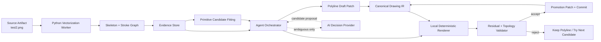

# 干净线稿矢量化与 CAD 图元提升设计

> 状态：MVP 基线已实现，`test2.png` 真实网页验收通过
>
> 日期：2026-08-09
>
> 首个基准：`test2.png`
>
> 适用范围：二维干净线稿到 Canonical Drawing IR 的增量转换

## 1. 决策摘要

第一版不让视觉大模型直接一次性生成整张 CAD，也不把传统 CV 的全部检测结果一次性提交到画布。系统采用“保真矢量底稿 + 可验证的图元提升”流程：

1. 从干净线稿提取单像素中心线和拓扑图。
2. 把所有有效笔画先转换为可见的 `POLYLINE`，快速形成完整、可回退的矢量底稿。
3. 按连通区域和笔画链逐步拟合 `LINE`、`CIRCLE`、`ARC`、`ELLIPSE`，自由曲线可提升为 `SPLINE`。
4. 每次提升都在局部重新渲染并与源图比较；只有几何误差、覆盖率和拓扑检查通过后，才用规范图元替换对应 Polyline。
5. 无法可靠拟合的部分永久允许保留为 Polyline；系统不为了“看起来像 CAD”而丢失真实笔画。
6. AI 负责提出候选、处理歧义和规划观察区域；确定性几何算法负责坐标、拟合、验证、提交和回滚。

这个设计的核心不是一次识别正确，而是保证任意中间状态都可见、可审计、可回归，并且每次修改都有局部证据。

### 1.1 2026-08-09 实现基线

当前生产路径已落地为常驻 Python NDJSON Worker、Evidence Store、Polyline draft、解析图元 promotion、Drawing Preview/Commit、checkpoint 和主运行审计。运行参数与网页一致，`maxPixels=4_000_000`；`test2` 实测如下：

| 指标 | 结果 |
|---|---:|
| 中心线 Worker 返回 | 765 ms |
| 完整像素回归总耗时 | 4.54 s |
| 网页完整任务 | 18 s |
| 中心线链 / Polyline draft | 68 / 68 |
| 规范图元 promotion | 59 |
| 最终类型 | 34 Line、24 Arc、1 Circle、9 Polyline |
| 边缘 Precision / Recall / F1 | 99.9997% / 99.9798% / 99.9897% |
| 双向距离 P95 | 0 px |
| 越界、空底稿、假大圆 | 0 |
| 真实网页增量步骤 | 127 |

基准产物由 `npm run benchmark:test2` 写入 `.local/vectorai/baselines/test2/report.json` 和 `result.svg`。网页验收确认 y 方向、500 mm 默认宽度、画布比例和主体结构正确；公开任务面板不显示模型名称。高覆盖但仍残留少量抗锯齿碎片时，只有 Precision、Recall、F1 同时越过严格门限且拓扑/关联无错误才允许收敛，避免把已经正确的矢量图继续交给模型破坏。

## 2. 背景与当前问题

当前 Node 侧 OpenCV.js Worker 主要通过 Otsu 二值化和 `findContours(RETR_LIST, CHAIN_APPROX_NONE)` 提取轮廓。对于有线宽的黑色笔画，轮廓算法通常会沿笔画两侧各追踪一次，而不是得到笔画中心线。这会导致：

- 一个圆可能变成内外两个圆；
- 直线可能变成细长的闭合多边形；
- 交叉处拓扑不稳定；
- 后续拟合容易产生大圆、短线和散点等假图元；
- CV 结果直接落画布后，用户无法看到 AI 的逐步判断和修正过程。

因此，本设计不继续围绕轮廓结果增加修补规则，而是把干净线稿识别路径切换为中心线和拓扑驱动的架构。现有 OpenCV.js Provider 保留用于快速预处理、概览和降级，不再作为干净线稿规范图元生成的主要依据。

## 3. 目标与非目标

### 3.1 目标

- `test2.png` 中所有有效笔画最终都由规范图元或保真 Polyline 表达，不静默丢失。
- 初始矢量底稿和后续每次提升都作为真实 Drawing Patch 流式显示。
- 同一输入、相同算法版本和配置得到稳定的 evidence ID、候选排序和 Drawing IR。
- 每个规范图元都能追溯到源像素、笔画链、拟合参数、验证指标、提交和逆向 Patch。
- 服务端在预热后尽快给出首次状态，且最长不超过 30 秒没有可见回执。
- 算法和模型均可替换，但 Canonical Drawing IR、Patch/Commit 和审计协议保持稳定。

### 3.2 非目标

- 本阶段不处理照片、阴影、彩色背景和复杂扫描噪声到干净线稿的生成；它们由未来的 `CleanLineProvider` 负责。
- 不识别三维信息、图层、图块和填充。
- 不在本阶段推断墙、门、窗等建筑语义。
- 不要求每条曲线都被强制拟合成解析图元。
- 不让 Python Worker 或 AI 模型直接修改 DrawingDocument。

## 4. 数据权威与架构原则

系统维持四类彼此分离的数据权威：

1. **Source Artifact**：不可变的原始图片及其哈希。
2. **Evidence Store**：版本化的像素、骨架、拓扑、链和候选拟合证据。
3. **Canonical Drawing IR**：画布中当前已接受的二维图元和约束数据。
4. **Audit Log**：工具调用、决策、Patch、验证结果、回滚和 Commit。

Evidence 不是 Drawing IR。CV 或 AI 只能产生证据和候选，只有 Agent Orchestrator 能在验证后创建 Drawing Patch。渲染器只读取 Drawing IR，不直接渲染 Evidence Store，以避免“预览看起来成功、内部数据却不可维护”的分裂状态。

## 5. 总体架构



### 5.1 运行位置

- 浏览器只负责交互、画布渲染和流式任务展示，不运行重型 CV。
- Node API 是任务、会话、Agent、Patch、Commit、审计和超时的唯一协调者。
- 本地 Python Worker 负责骨架化、拓扑提取、曲线拟合和数值优化。
- Python Worker 在服务器启动时预热，通过受限的本地协议接收图片引用和参数，返回结构化证据；它不能访问 DrawingDocument，也不能自行提交结果。
- 现有 `DrawingCvProvider` 继续作为可替换边界。新增 Python 实现时，不把 Python 类型泄漏到 Agent 和 IR 层。

### 5.2 Provider 分工

建议将现有 Provider 能力收敛为以下职责：

```ts
interface DrawingCvProvider {
  inspectOverview(input: InspectOverviewInput): Promise<DrawingOverview>;
  vectorizeStrokes(input: VectorizeStrokesInput): Promise<StrokeGraphResult>;
  proposePrimitives(input: ProposePrimitivesInput): Promise<PrimitiveCandidateSet>;
  measureResidual(input: MeasureResidualInput): Promise<ResidualReport>;
}
```

- `OpenCvWorkerProvider`：快速概览、基础二值化、降级路径。
- `PythonVectorizationProvider`：生产主路径的骨架图、笔画链、拟合和残差度量。
- `CleanLineProvider`：未来把原图变成干净线稿；`test2` 基准不依赖它。
- `CandidateDecisionProvider`：可选 AI 能力，只处理低置信度候选、跨链合并和拆分歧义。

## 6. 开源组件评估

| 组件 | 许可证 | 适用能力 | 决策 |
|---|---|---|---|
| OpenCV | Apache-2.0 | 二值化、形态学、Hough、椭圆拟合、图像度量 | 采用；Python 侧为主，OpenCV.js 保留快速路径 |
| scikit-image | BSD-3-Clause | `skeletonize`/`thin`、RANSAC、Line/Circle/Ellipse Model、轮廓和简化 | 采用，作为中心线和稳健拟合基础 |
| skan | BSD-3-Clause | 骨架像素图、分支、端点、节点和路径统计 | 已评估；MVP 使用项目内确定性追踪器，复杂骨架基准需要时再引入 |
| SciPy | BSD-3-Clause | 最小二乘、优化、B-spline 拟合 | 采用 |
| Sharp | Apache-2.0 | Node 侧图片解码、尺寸读取和快速预处理 | 保留现有用途 |
| DeepLSD | MIT | 噪声或断裂场景中的直线候选 | 作为可选模型 Provider，不进入 `test2` 基线硬依赖 |
| diffvg | Apache-2.0 | 可微渲染和参数细化 | 后续可选实验，不阻塞 MVP |
| Deep Vectorization of Technical Drawings | MPL-2.0 | 技术图清理、patch 预测、迭代细化、合并的研究参考 | 只借鉴架构；环境较旧且清理模型不完整，不作为生产依赖 |
| Vitruvion | 未发现明确许可证 | 草图到图元和约束的研究参考 | 许可证澄清前不分发、不复制代码或权重 |
| PHT-CAD | 仓库当前缺少可用实现 | 点、线、圆、弧预测的研究方向 | 仅跟踪，不作为依赖 |

开源算法覆盖数据化主干，AI 以可插拔 Provider 进入。这样 `test2` 基准可在没有外部模型的情况下稳定回归，也能在后续对复杂图纸引入模型增强。

## 7. 处理流水线

### 7.1 源图标准化

输入图片解码后只生成派生视图，不改写 Source Artifact：

- 保留原始宽高、通道、EXIF 方向和哈希；
- 生成灰度和二值分析图；
- 估计背景色、前景极性和中位线宽；
- 高分辨率图可生成分析尺度，但所有坐标必须可无损映射回源像素空间；
- 记录阈值、缩放、内核和算法版本。

`test2` 为干净黑白线稿，默认优先使用全局阈值；局部阈值只作为检测到不均匀背景后的降级策略。

### 7.2 单像素骨架与拓扑图

对二值前景做骨架化，得到单像素中心线。再把骨架转换为无向拓扑图：

- 度为 1 的像素聚类为端点；
- 度大于 2 的相邻像素聚类为交点；
- 端点、交点和闭环锚点形成 `StrokeNode`；
- 节点之间的有序像素路径形成 `StrokeChain`；
- 没有端点的闭环必须单独识别，不能因为没有“头脚”而遗漏。

短毛刺只在满足两个条件时裁剪：长度小于 `max(3px, 1.5 × medianLineWidth)`，并且裁剪后局部源图覆盖率没有显著下降。被裁剪的原始像素和理由仍写入 Evidence Store。

```ts
type StrokeGraph = {
  sourceHash: string;
  pipelineVersion: string;
  coordinateSpace: "source-pixel-y-down";
  medianLineWidthPx: number;
  nodes: StrokeNode[];
  chains: StrokeChain[];
};

type StrokeChain = {
  id: string;
  nodeIds: [string, string] | [string];
  closed: boolean;
  samples: Array<{ x: number; y: number }>;
  bbox: { x: number; y: number; width: number; height: number };
  sourcePixelCount: number;
};
```

Evidence ID 由 `sourceHash + pipelineVersion + stable geometry key` 派生，禁止使用随机 UUID 破坏回归稳定性。

### 7.3 初始 Polyline 矢量底稿

骨架图完成后，系统先创建覆盖全部有效 StrokeChain 的 Polyline Drawing Patch。它是第一个完整可见状态，也是所有后续失败的回退状态。

- Polyline 点列使用基于线宽的 Douglas-Peucker 简化；完整采样仍保留在 Evidence Store。
- 单个预览 Polyline 最多 256 个顶点；超过限制时按曲率低点拆成连续片段，并用 `continuationGroupId` 保持关联。
- 闭环 Polyline 保持闭合标记。
- 交点共享拓扑节点，避免视觉相接但内部坐标不一致。
- 初稿分批提交，每批最多 25 个图元或一个连通分量，先到先显示。

Polyline 底稿不是“低质量临摹层”，而是合法的 Canonical Drawing IR。后续规范化只替换证据足够强的局部。

### 7.4 候选图元拟合

每条链或相邻链组并行产生多个候选，不先假定它一定属于某一图元：

```ts
type PrimitiveCandidate = {
  id: string;
  sourceChainIds: string[];
  type: "LINE" | "CIRCLE" | "ARC" | "ELLIPSE" | "SPLINE" | "POLYLINE";
  geometry: unknown;
  fitErrorMeanPx: number;
  fitErrorP95Px: number;
  coverageRatio: number;
  topologyViolations: string[];
  complexityCost: number;
  provider: string;
  providerVersion: string;
};
```

候选规则如下：

- **LINE**：正交残差足够小，方向稳定；多条近共线链可在交点关系不被破坏时合并。
- **CIRCLE**：闭环或跨链组合具有接近完整的角覆盖，中心和半径稳定，不能只凭三点拟合成大圆。
- **ARC**：角覆盖明显小于完整圆，且端点与拓扑节点一致；跨越交点的弧不能未经验证直接合并。
- **ELLIPSE**：圆候选不通过但椭圆残差显著更低，轴比、方向和覆盖范围稳定。
- **SPLINE**：自由曲线平滑连续，解析图元均不合适，且相对 Polyline 能显著减少控制点而不超出误差预算。
- **POLYLINE**：始终存在的保真候选，是所有强制拟合失败后的合法结果。

候选排序同时考虑误差、源像素覆盖、拓扑一致性和模型复杂度。复杂度更低的解析图元只有在不牺牲几何忠实度时才获优先。

### 7.5 跨链合并和竞争

图元可能被交点、抗锯齿断点或骨架噪声拆成多条链，因此拟合不是严格的一链一图元。系统先生成局部邻接候选，再在有边界的搜索中竞争：

- 只搜索 bbox 相邻、端点距离和切线方向满足门限的链；
- 允许区域重叠，不要求把整张图切成互斥方块；
- 同一源链同一时刻只能被一个已接受规范图元消费；
- 多个候选重叠时，选择总残差更低、拓扑违规更少、表达更简洁的组合；
- 搜索规模超过预算时停止扩展，保留 Polyline，不能因超时随意提交。

### 7.6 局部渲染验证

每个候选在提交前进入源像素坐标系的确定性验证：

1. 仅渲染候选影响的 bbox，并按估计线宽扩边。
2. 比较源二值前景、当前 Polyline 渲染和候选渲染。
3. 计算双向距离、覆盖率、漏画率、多画率、端点漂移和拓扑变化。
4. 候选必须不劣于当前 Polyline 基线；若它减少图元复杂度，允许在配置的微小等价误差内接受。
5. 验证失败则拒绝 Patch，保留原 Polyline 并尝试下一候选。

默认几何门限按分析尺度计算：

- `fitErrorP95 <= max(1.5px, 0.5 × medianLineWidthPx)`；
- 端点漂移不得超过 `max(2px, medianLineWidthPx)`；
- 拓扑违规为零；
- 覆盖率不得低于当前 Polyline 超过可配置的 `0.5%`；
- 圆的角覆盖不足 `330°` 时不得直接提升为完整 Circle，除非跨链闭合和渲染验证同时通过。

这些门限必须进入版本化配置和审计记录，不能散落为不可追踪的魔法数字。`test2` 建立基线后，可根据误差分布调参，但不得为单张图加入文件名或像素位置特判。

### 7.7 增量图元提升

一次提升是一个原子 Drawing Transaction：

1. 读取当前 IR 版本和目标 Polyline。
2. 创建删除或裁剪旧 Polyline 的 Patch。
3. 创建新增规范图元的 Patch。
4. 对 Patch 应用后的局部结果执行验证。
5. 通过后 Commit，并通过事件流立即显示。
6. 失败时应用 inverse Patch 或放弃未提交事务。

提升粒度为一个候选或一个紧密耦合的候选组。界面不做伪动画，而是随着真实 Commit 展示“底稿出现 → 直线替换 → 圆弧替换 → 局部修正”的过程。用户暂停时，已提交状态保持有效；新增指令从当前 IR 版本继续。

## 8. AI 的使用边界

### 8.1 适合 AI 的部分

- 原始照片或脏扫描到干净线稿的生成和修复；
- 断裂、遮挡或噪声场景中的候选直线和曲线提议；
- 两个确定性候选分数接近时的类型判断；
- 跨链是否属于同一图元，以及应合并、拆分还是重分类；
- 根据当前残差图选择下一观察区域；
- 后续的几何约束和工程语义推断。

### 8.2 不交给 AI 的部分

- 骨架化、坐标变换和单位换算；
- 圆心、半径、弧角和交点的最终数值计算；
- 几何和拓扑合法性；
- 残差指标；
- Drawing Patch、Commit、回滚和审计。

AI 输出只能作为 `PrimitiveCandidate` 或决策建议。确定性 Validator 始终拥有否决权。低置信度 AI 建议在 UI 中标红，并保留证据供后续用户确认。

### 8.3 调用路由

基线先运行确定性算法。只有满足以下任一条件才调用 AI：

- 前两名候选综合分差低于版本化门限；
- 链的合并或拆分会改变拓扑；
- 连续两轮确定性尝试都没有降低局部残差；
- 源区域存在明显遮挡、断裂或非均匀噪声。

AI 路由、输入裁剪、返回候选、置信度和最终采纳结果全部写入审计日志。模型名称属于服务端审计元数据，不显示在用户任务面板。

## 9. 坐标与单位

- Evidence Store 统一使用源图片像素坐标：左上角原点、x 向右、y 向下。
- 拟合和源图残差比较始终在该坐标系完成，避免中途多次翻转造成上下颠倒。
- 只有候选通过验证并生成 Drawing Command 时，才转换为 Canonical Drawing IR 的世界坐标：左下或工程约定原点、y 向上。
- 无尺寸标注时沿用产品约定：整页图像宽度映射为 500 mm，高度按宽高比计算。
- 坐标变换矩阵、默认单位来源和缩放因子必须随 Commit 审计；以后识别到真实尺寸时，通过显式的重标定事务更新，不静默改写历史。

## 10. 性能与反馈预算

用户体验预算按“持续可见进展”设计，而不是只看最终总耗时：

- API 接受任务并返回 task ID：目标 1 秒内；
- Python Worker 随本地服务器预热，避免首次调用安装或加载基础依赖；
- 首个状态事件：目标 1 秒内；
- `test2` 首个可见 Polyline 批次：目标 5 秒内；
- `test2` 完整 Polyline 底稿：目标 10 秒内；
- 任意运行阶段不得超过 25 秒没有 heartbeat、Patch 或可解释状态，以满足 30 秒回执要求；
- 每批初稿最多 25 个图元或一个连通分量；每次提升默认一个图元或一个耦合组；
- 以 `sourceHash + pipelineVersion + configHash` 缓存标准化图、骨架、图和候选；
- Agent 上下文只传当前 bbox 的摘要和 evidence ID，原始长点列通过工具按需读取，避免大图把上下文撑满。

超出单轮预算时，任务保存游标并继续下一轮，不把“分析不完”当成失败，也不一次性把未验证候选塞入画布。

## 11. 审计、回归与可恢复性

每轮工具调用至少记录：

- task/run/step ID；
- Source Artifact 哈希；
- Provider、算法和配置版本；
- 输入的 node、chain、bbox 和 evidence ID；
- 候选参数及完整评分；
- 本地渲染前后的残差报告；
- 采纳、拒绝或升级到 AI 的原因码；
- Drawing Patch、inverse Patch、父 IR 版本和 Commit ID；
- 耗时、超时、重试和缓存命中。

任务失败或服务重启后从最后一个已提交 Commit 和未完成游标恢复。Evidence Store 内容按哈希复用；未通过验证的候选不能在恢复时自动变成已接受结果。

## 12. `test2` 验收标准

`test2.png` 是第一条强制回归基准。基线不依赖 AI，必须满足：

1. **完整性**：所有主要可见笔画均由 `LINE/CIRCLE/ARC/ELLIPSE/SPLINE/POLYLINE` 之一表达，不因无法拟合而消失。
2. **无双边轮廓**：线宽轮廓不能被当作两条独立 CAD 线重复提交。
3. **无明显假图元**：不得出现源图没有的大圆、跨区域长线或孤立散点。
4. **增量可见**：先出现真实 Polyline 底稿，随后能看到至少两类解析图元通过真实 Patch 被逐步提升；不是任务结束后的客户端回放。
5. **局部单调**：每个已接受提升都通过局部残差和拓扑验证，不能让对应区域比提升前更差。
6. **可回退**：任一提升的 inverse Patch 可恢复到此前 Polyline 状态。
7. **确定性**：同一图片、版本和配置重复运行，Evidence ID、候选排序和最终 IR 在允许的浮点误差内一致。
8. **可审计**：任一点选图元都能反查源链、拟合指标、验证报告和 Commit。
9. **性能**：开发机预热条件下，目标 5 秒内出现首批图元、10 秒内出现完整底稿；任何情况下 30 秒内必须有状态或可见进展。
10. **可量化**：回归输出图元数、类型分布、源覆盖率、双向距离 P95、总耗时和每次提升结果；本地运行产物存放在 `.local/vectorai/baselines/test2/`，不提交媒体和临时产物。

验收不要求把所有自由曲线拟合成完美圆弧。正确的 Polyline 比错误的 Circle 或 Arc 更优先。

## 13. 测试策略

### 13.1 单元测试

- 开放链、闭环、交点和多分支的骨架图构建；
- 短毛刺裁剪和覆盖保护；
- Douglas-Peucker 简化不越过误差预算；
- Line/Circle/Arc/Ellipse/Spline 候选拟合；
- 不完整圆不能误判为完整 Circle；
- 相邻共线链、跨断点弧的合并；
- 坐标 y 轴翻转和 500 mm 默认单位转换；
- 稳定 ID 和版本化配置。

### 13.2 合成夹具

- 单圆、断裂圆、相切圆和同心圆；
- 直线交叉、T 型交点和近共线断线；
- 圆角矩形、椭圆和不同角覆盖的弧；
- 平滑自由曲线和带尖点曲线；
- 线宽变化、轻微噪声和单像素毛刺。

合成夹具同时保存源几何真值，用于验证中心、半径、角度、端点和拓扑误差。

### 13.3 集成与回归测试

- Node 与 Python Worker 的协议、版本协商、超时、取消和进程重启；
- Provider 降级时不产生未验证的 Drawing Patch；
- SSE 或现有任务事件流能按 Commit 顺序显示真实增量；
- 暂停、继续和追加指令从正确 IR 版本恢复；
- `test2` 的指标快照和渲染差异回归；
- 审计日志能够离线重放出相同的候选决策和 Patch 顺序。

## 14. 迁移顺序

本项目仍处于 MVP，不保留错误架构的兼容包袱。迁移按以下顺序完成：

1. 新增稳定的 StrokeGraph、PrimitiveCandidate 和 ResidualReport 契约及测试。
2. 引入预热的 PythonVectorizationProvider 和受限本地协议。
3. 用中心线和拓扑路径替换干净线稿的 `findContours` 主路径。
4. 接入完整 Polyline 初稿的分批 Drawing Patch。
5. 接入确定性候选拟合、竞争和局部验证。
6. 接入原子提升事务、inverse Patch 和真实流式 UI。
7. 建立 `test2` 回归基线并调优通用门限。
8. 删除或禁用会把轮廓直接自动提升为规范图元的旧路径。
9. 最后增加 AI CandidateDecisionProvider；它不能成为基线通过的前置条件。

## 15. 主要风险与应对

| 风险 | 应对 |
|---|---|
| 骨架在交点产生毛刺或错误分支 | 线宽感知裁剪、局部覆盖保护、保留原始证据 |
| 一个完整圆被拆成多条弧 | 闭环检测、跨链角覆盖和共同圆参数竞争、局部渲染验证 |
| 多条无关曲线被合成大圆 | 邻接搜索边界、角覆盖要求、拓扑门限、候选 bbox 外多画惩罚 |
| Polyline 点数太大 | 完整采样存 Evidence，IR 使用误差受控简化和连续分片 |
| Python 引入冷启动和部署复杂度 | 本地常驻预热、版本握手、健康检查、OpenCV.js 快速降级 |
| AI 产生不稳定几何 | AI 只提候选，数值重算和确定性 Validator 强制把关 |
| 调参只对 `test2` 有效 | 合成夹具、线宽归一化门限、禁止文件名和位置特判 |
| 复杂图纸一次处理不完 | 连通区域游标、重叠局部观察、缓存、分轮和持续 heartbeat |

## 16. 完成定义

本设计实现完成的标志不是“成功调用了 CV”，而是：

- `test2` 能先形成完整、正确方向和合理尺度的 Polyline 矢量底稿；
- Agent 能基于同一份 Evidence 逐个提出、验证、提交或拒绝规范图元提升；
- 画布真实显示这些增量 Commit；
- 错误候选不会污染画布，已提交提升可以回退；
- 全流程能够通过确定性回归和审计重放解释。

在本设计文档确认后，下一步应单独编写实施计划，把迁移拆成可测试的小阶段，并以 `test2` 的可视化回归作为每个阶段的门禁。

## 17. 参考资料

- [OpenCV License](https://opencv.org/license/)
- [scikit-image morphology：skeletonize / thin](https://scikit-image.org/docs/stable/api/skimage.morphology)
- [scikit-image measure：几何模型与 RANSAC](https://scikit-image.org/docs/stable/api/skimage.measure.html)
- [skan：Skeleton Analysis](https://github.com/jni/skan)
- [DeepLSD](https://github.com/cvg/DeepLSD)
- [diffvg](https://github.com/BachiLi/diffvg)
- [Deep Vectorization of Technical Drawings](https://github.com/Vahe1994/Deep-Vectorization-of-Technical-Drawings)
- [Vitruvion](https://github.com/PrincetonLIPS/vitruvion)
- [PHT-CAD](https://github.com/yuwen-chen616/PHT-CAD)
- [Engineering drawing processing and vectorization system](https://www.sciencedirect.com/science/article/pii/0734189X90901118)
- [P-RENDER: A Mechanism for Geometric Reconstruction of Engineering Drawings](https://www.sciencedirect.com/science/article/pii/S1077314296900193)
- [Autodesk Raster Design vectorization tools](https://help.autodesk.com/cloudhelp/2026/ENU/AutoCAD-RasterDesign/files/GUID-C324644D-CB2B-4F31-8817-A3EFE8763FEC.htm)
- [nanoCAD Recognition](https://nanocad.com/learning/online-help/nanocad-platform/recognition-tab/)
