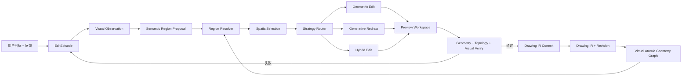

# Region-First Spatial Editing 设计

> 日期：2026-08-11
>
> 状态：已实现并进入确定性回归；真实模型质量独立验收
>
> 上游架构：`2026-08-11-vector-native-spatial-agent-engine-design.md`

## 1. 背景与问题

VectorAI 旧版视觉语义编辑曾先把“右手”等语义绑定到完整 Drawing IR `nodeId`，再生成节点级意图。这种方式适合完整图元就是正确编辑单位的任务，但不能可靠处理跨图元或只占图元一部分的语义部件，因此已经被本设计替换。

`test2` 的“把人物右手抬起来”暴露了边界：右手下方连接线和身体左侧竖线由同一个五顶点 Polyline 表达。模型选择完整右臂时，如果只选圆弧和上侧手臂线，会留下断开的下侧边界；如果整体选择该 Polyline，又会误改身体轮廓。问题不是单纯模型能力不足，而是系统要求模型在理解语义前先服从既有图元边界。

本设计把选择顺序反转：

1. 模型先在连续二维空间中选择“右臂区域”，不考虑图元边界。
2. 确定性系统把语义区域解析为完整图元、局部线段、共享边界和保护区域。
3. 只有实际修改涉及共享图元时，Preview 事务才物化拆分。
4. 工程几何、生成式重绘和混合编辑最终都落为 Drawing IR 增量事务。

## 2. 产品目标

### 2.1 核心目标

- AI 的理解范围不受当前 Drawing IR 图元切分方式限制。
- 完整图元仍是优先编辑单位，但不再是唯一编辑单位。
- 工程图优先保持解析几何、精度、拓扑和尺寸一致性。
- 卡通发型、表情、装饰等创意修改允许局部生成式重绘后再矢量化。
- 用户不需要理解或切换内部编辑策略，系统自动选择并持续显示业务进度。
- 自动拆分直接进入 Preview，不要求用户逐点确认。
- 用户反馈进入同一个编辑上下文，模型能基于原始目标、区域、拆分、Preview、Diff 和失败历史重新规划。
- 正式结果始终是可验证、可撤销、可审计、可回放的 Drawing IR Commit。

### 2.2 非目标

- 不把 Mask、生成图片或前端画布状态变成正式图纸真源。
- 不预先拆碎整张 Drawing IR。
- 不为不同模型或不同图纸领域建立多套事务协议。
- 不在 UI 暴露模型名称或“几何/生成式”技术开关。
- 不引入 3D、图层、图块或填充编辑。

## 3. 设计原则

1. **语义区域先于图元选择**：AI 先回答“哪里是右臂”，系统再回答“它跨越哪些图元”。
2. **虚拟拆分、按需物化**：子图元首先是 revision-bound 引用，只有候选事务真正修改它们时才创建 Drawing Command。
3. **AI 决定语义，内核执行几何**：模型决定区域、部件归属和视觉目标；确定性工具负责求交、拆分、吸附、拟合和验证。
4. **统一 Preview Workspace**：所有策略先进入同一种可替换 Preview，不直接写正式 Drawing IR；这里是运行期候选工作区，不是 Git 或用户可见分支。
5. **完整审计、有界热上下文**：所有历史持久化；模型每轮只接收当前有效状态和压缩失败摘要。
6. **策略可替换，事务不可绕过**：模型和生成器可以替换，Drawing IR、版本、验证和审计边界不变。

## 4. 总体架构



新增的核心单元为：

- `SemanticRegion Model Adapter`：输出与图元无关的语义区域、轮廓、锚点和置信度。
- `Virtual Atomic Geometry Graph`：按需把几何解释为可引用参数片段和邻接关系，不改正式 IR。
- `Region Resolver`：计算区域与虚拟原子几何的覆盖、穿越、共享边界和不确定部分。
- `Strategy Router`：自动选择精确几何、生成式重绘或混合编辑。
- `Preview Workspace`：保存多版本候选事务、拆分计划和渲染结果。
- `EditEpisode Store`：保存跨多轮模型调用和用户反馈的完整上下文。

## 5. SemanticRegion：连续空间中的语义选择

```typescript
interface SemanticRegion {
  id: string;
  drawingId: DrawingId;
  revision: RevisionId;
  label: string;
  sourceViewIds: string[];
  maskHandle: string;
  worldContours: Vec2[][];
  positiveSeeds: Vec2[];
  negativeSeeds: Vec2[];
  anchors: SemanticAnchor[];
  confidence: number;
  evidenceRefs: string[];
}

interface SemanticAnchor {
  id: string;
  role: string;
  point: Vec2;
  confidence: number;
}
```

Mask 保留模型最自然的像素级选择，`worldContours` 提供可计算的世界坐标边界。两者必须绑定相同 Drawing revision 和 Observation transform。Mask 正文使用 handle 保存，不进入审计 JSON 或模型文字上下文。

SemanticRegion 可以包含多个不相连轮廓和洞，支持“头发但不包含眼睛”“右臂及手掌但不包含身体”等正负区域。模型不输出 nodeId 也能完成第一阶段选择。

## 6. Virtual Atomic Geometry Graph：不污染 IR 的子图元层

```typescript
interface AtomicSegmentRef {
  id: string;
  revision: RevisionId;
  nodeId: GeometryId;
  kind: 'vertex-range' | 'parameter-range' | 'whole-node';
  vertexRange?: readonly [number, number];
  parameterRange?: readonly [number, number];
  start: Vec2;
  end: Vec2;
  bounds: Bounds2D;
  adjacentSegmentIds: string[];
}
```

- Point 和完整落入区域的几何可直接形成 whole-node 原子段。
- Polyline 使用顶点区间；区域边界落在单个 segment 内时再附加局部参数范围。
- Line、Circle、Arc、Ellipse 和 Spline 都支持参数区间，不预先生成碎片节点。
- 交点、端点、切点、明显转折点和区域边界交点可以成为候选切分点。
- 原子段 ID 由 `revision + nodeId + range` 确定性派生，仅在该 revision 有效。

该图按目标区域和邻接 padding 惰性构建并缓存。全图不因一次语义编辑永久增加大量节点。

## 7. Region Resolver

```typescript
interface SpatialSelection {
  regionId: string;
  revision: RevisionId;
  wholeNodes: GeometryId[];
  partialSegments: AtomicSegmentRef[];
  crossingNodes: GeometryId[];
  protectedNodes: DrawingNodeId[];
  boundaryAnchors: SpatialBoundaryAnchor[];
  uncertainParts: SelectionCandidate[];
  splitPlan: VirtualSplitPlan[];
}
```

Resolver 对每个相关图元给出以下分类：

- `inside`：完整位于区域内，可整体修改。
- `outside`：完整位于区域外，进入保护集合。
- `crossing`：穿过区域边界，形成一个或多个局部片段及虚拟拆分计划。
- `shared-boundary`：同时构成目标部件与保护部件的轮廓，必须保留外侧片段。
- `uncertain`：Mask、向量边界或拓扑证据矛盾，进入低置信度候选。

Resolver 不判断“这是不是右臂”；它只确定给定区域如何映射到精确几何。语义错误由视觉反馈修正，求交和拆分错误由确定性验证阻止。

## 8. 自动策略路由

```typescript
interface SpatialEditStrategy {
  mode: 'geometric-edit' | 'generative-redraw' | 'hybrid-edit';
  regionId: string;
  preserveRegionIds: string[];
  boundaryAnchorIds: string[];
  requiredGuarantees: SpatialGuarantee[];
  primaryReason: string;
  fallbackMode?: SpatialEditStrategy['mode'];
}
```

### 8.1 Geometric Edit

适用于工程图、尺寸敏感图纸，以及平移、旋转、缩放、连接、对齐、孔槽修改等解析任务。

执行顺序：物化必要拆分 → 保留保护片段 → 变换/变形/重建目标片段 → 吸附边界锚点 → 拟合解析图元 → 验证。

### 8.2 Generative Redraw

适用于增加发型、改变卡通表情、增加装饰或自由形轮廓。

执行顺序：渲染带上下文 padding 的局部 crop → 使用 SemanticRegion 作为 edit mask → 生成局部候选 → 去背景并线稿化 → 矢量化 → 与边界锚点和保护区域对齐 → 编译为局部替换事务。

生成图片只是证据和候选，不进入正式状态。不能可靠拟合的部分允许保留为 Polyline/Spline candidate。

### 8.3 Hybrid Edit

适用于“增加自然形握把但保留安装孔”“增加帽子但不能遮挡眼睛”等同时包含创意与工程约束的任务。

确定性层先锁定保护区域和硬锚点，生成式模型只获得剩余自由区域；生成结果矢量化后仍必须通过相同保护和拓扑验证。

### 8.4 路由行为

- 用户不操作策略开关。
- Agent 自动选择主策略和回退策略。
- UI 只显示“正在进行精确几何调整”“正在生成局部外观”等业务状态。
- 用户反馈可以触发同一策略修正，也可以让 Agent 切换策略。

## 9. Preview Workspace 与按需物化

```typescript
interface PreviewCandidate {
  id: string;
  episodeId: string;
  baseRevision: RevisionId;
  regionVersionId: string;
  selectionVersionId: string;
  strategy: SpatialEditStrategy;
  splitCommands: DrawingCommand[];
  editCommands: DrawingCommand[];
  previewDocumentHandle: string;
  beforeViewHandle: string;
  previewViewHandle: string;
  diffViewHandle: string;
  verification: PreviewVerification;
  status: 'active' | 'rejected' | 'superseded' | 'committed';
}
```

共享图元的实际拆分只发生在 Preview Workspace：

1. 编译器将虚拟片段转换为删除/更新/创建 Command。
2. 未修改片段应保留几何内容，并获得可追踪的 lineage。
3. Preview 发布给前端，同时后端渲染 before/preview/diff。
4. 用户反馈或验证失败时，候选标记为 superseded/rejected，不写正式仓库。
5. 只有最新 active Preview 可以提交。

若用户反馈到来时结果已经提交，系统创建新的纠正 Commit，不修改已有历史。

拆分后的稳定身份遵循确定性规则：若只有一个保护片段承载原图元已有关系/标注锚点，该片段保留原 nodeId，目标片段获得新 ID；若多个片段分别承载有效引用，则事务显式创建新 ID、迁移引用并用 split lineage 记录 `oldNodeId → fragmentIds + parameterRanges`。禁止依靠数组顺序或模型自行决定 ID 继承。

## 10. EditEpisode 与完整反馈上下文

```typescript
interface EditEpisode {
  id: string;
  drawingId: DrawingId;
  baseRevision: RevisionId;
  originalGoal: string;
  regionVersions: SemanticRegionReference[];
  selectionVersions: SpatialSelectionReference[];
  strategyDecisions: SpatialEditStrategy[];
  previewVersions: PreviewCandidateReference[];
  feedbackTurns: UserFeedbackTurn[];
  acceptedCommitIds: CommitId[];
  status: 'planning' | 'previewing' | 'revising' | 'committed' | 'stopped';
}
```

用户追加“手臂再高一点”或“头发再短一点”时，当前模型上下文至少包括：

- 原始目标与最新用户反馈。
- 当前 Drawing revision。
- 当前有效 SemanticRegion、SpatialSelection 和边界锚点。
- 最新 Preview、Diff 和验证缺陷。
- 仍未满足的目标与保护规则。
- 已拒绝方案的压缩摘要。

完整旧 Preview、Mask、模型返回、事务和渲染保存在 Episode 审计中，通过 handle 按需读取；不把无限历史全部塞入单次 Prompt。

## 11. 验证规则

### 11.1 通用确定性验证

- SemanticRegion、AtomicSegmentRef、SpatialSelection 和 Preview 必须绑定同一 base revision。
- 实际修改只能位于授权区域及边界容差内。
- 区域外节点内容哈希不变。
- 拆分后所有片段覆盖原图元，禁止丢段、重叠或方向错乱。
- lineage 能从新片段追溯到原始 nodeId 和参数范围。
- 引用、关系、annotation 和 feature 成员保持有效或随事务显式迁移。
- 不产生非有限坐标、异常零长度、意外自交或重复残留。

### 11.2 工程几何验证

- 要求连接的边界锚点在容差内相接。
- 目标闭合轮廓不能产生意外悬空端点。
- 圆、弧、直线等解析图元优先保留；降级为 Polyline/Spline 必须记录 Fidelity Warning。
- 尺寸或拓扑关系涉及被拆图元时必须迁移或明确阻止提交。

### 11.3 生成式验证

- 新内容不得侵入 protectedRegions。
- Crop 边缘与原图不存在可见接缝。
- 旧目标像素/图元残留已处理。
- 矢量化结果与生成候选在像素容差内一致。
- 低置信度自由曲线以 candidate 标红，不伪装为解析工程几何。

### 11.4 视觉验证

视觉验收必须同时看原目标、SemanticRegion、before、preview、diff 和确定性报告。Preview 验证和整图验收使用相同 revision、annotation plane 配置和目标语义，避免两个模型阶段看到不同画面后得出矛盾结论。

## 12. 错误处理

- Region ambiguous：增加 detail crop、正负 seed 或边界提示后重新分割。
- Region stale：drawing revision 变化时丢弃区域解析结果，重新观察，不套用旧 Mask。
- Split ambiguous：保留多个低置信度 split candidate，先预览最高置信度方案，不直接修改正式文档。
- Topology violation：把具体悬空端点、丢失片段和关系迁移问题反馈给修复轮。
- Generative seam：扩大 crop padding 或切换为 Hybrid Edit。
- Vectorization loss：保留 Spline/Polyline candidate 或重新生成，不虚构圆弧参数。
- User feedback：立即使当前 Preview 失去提交资格，在安全点基于同一 Episode 重新规划。
- Model timeout：保留 Episode 和最新 Preview；心跳继续显示，不清空可恢复上下文。

## 13. 审计与上下文管理

每个 Episode 持久化：

- 用户原始目标和所有 feedback turn。
- Region mask/contour/anchors、模型角色、prompt hash 和原始返回。
- Atomic graph 版本、区域求交结果和虚拟 split plan。
- 策略选择及理由。
- 每个 Preview 的 Commands、before/preview/diff、验证报告和状态变化。
- Commit lineage、前后 revision、耗时与用户控制事件。

媒体正文继续保存在 handle store，不进入 JSONL。审计回放不调用模型也能重新构建 Atomic Graph、Region Resolution、Preview 和 Commit，发现非确定性差异即失败。

## 14. UI 与进度事件

用户不看到内部策略开关或模型名称。任务面板使用业务阶段：

- 正在选择目标区域。
- 正在解析区域边界。
- 正在拆分共享轮廓。
- 正在进行精确几何调整。
- 正在生成局部外观。
- 正在把候选转换为可编辑图形。
- 正在验证预览。
- 已根据反馈重新规划。
- 修改已提交。

画布只显示当前 active Preview。历史 Preview、拆分原因和验证结果可在任务详情中查看，不同时堆叠在画布上。

## 15. 性能设计

- `POST /api/agent/runs` 继续快速返回 runId。
- Mask、crop、diff 和 Atomic Graph 使用 revision-bound handle/cache。
- Atomic Graph 只构建目标区域及邻接 padding，不扫描并拆分整张复杂图纸。
- Region Resolver 使用空间索引过滤候选图元。
- 首先发布低成本区域 Overlay，再异步完成拆分和高质量 Preview，让用户尽早看到 AI 选择范围。
- 25 秒 heartbeat 继续独立于模型和生成任务；30 秒为体验目标而非几何正确性硬门槛。
- 模型热上下文只携带最新有效区域、Preview、反馈和未解决问题。

## 16. 测试与回归门槛

### 16.1 确定性单元测试

- Line/Polyline/Arc/Ellipse/Spline 的参数片段引用和区域求交。
- Polyline 顶点拆分、曲线参数拆分和 lineage 完整性。
- 区域外内容哈希、关系迁移、锚点吸附和 stale revision。
- 多轮 Preview supersede、用户反馈和纠正 Commit。

### 16.2 test2 工程几何黄金场景

目标：“把人物右手抬起来打招呼，保持其他图形不变并保持手臂闭合连接。”

必须证明：

- 模型先选择连续右臂区域，而非直接猜 nodeId 集合。
- Region Resolver 识别手掌、上侧手臂线，以及与身体共用 Polyline 的局部下侧片段。
- 共享 Polyline 在转折点按需拆分，身体竖线内容保持不变。
- 修改后的上下边界与手掌、肩部/身体锚点连接，不存在意外悬空端点。
- 区域外图形不变，事务可逆、可回放。
- 用户反馈“手再高一点”能复用同一 Episode 生成第二版 Preview。

### 16.3 创意重绘黄金场景

目标：“给角色增加卷发，但不遮挡眼睛和脸部轮廓。”

必须证明：

- Agent 自动选择 Generative Redraw 或 Hybrid Edit，UI 无策略开关。
- 头部外围是生成区域，眼睛和脸部是保护区域。
- 生成结果经过线稿化、矢量化、边界对齐和 Drawing IR Preview。
- 用户反馈“头发短一点”复用第一次生成和区域上下文，不从零开始。
- 最终结果可编辑、可撤销、可回放。

### 16.4 发布门槛

- 系统门禁与具体模型供应商门禁分离。
- 不接受模型自报“已连接/已完成”，必须从 IR、拓扑、Preview 和 Diff 计算。
- 所有成功事务都能从 base revision 精确回放。
- 失败测试保留 Episode、runId、区域、拆分、Preview 和模型结果用于回归。

## 17. 迁移策略

- 明确对象、明确 ID 的 Fast Command Lane 保留。
- 视觉语义修改已经切换到 region-first SemanticRegion → SpatialSelection。
- 区域解析后的语义摘要直接来自 SpatialSelection、lineage 和 EditEpisode，不再维护 VisualFeatureGraph 主协议。
- 旧 node-first 视觉修改主链、适配器和编译器已经删除，不维护双路径或 Feature Flag。
- Drawing IR、SceneCompiler、Application、Repository、Commit、审计和前端事务投影继续复用。

实施分三条可独立验收的垂直链：

1. SemanticRegion + Virtual Atomic Graph + Region Resolver + test2 几何编辑。
2. EditEpisode + 多版本 Preview + 用户反馈重新规划。
3. Generative Redraw/Hybrid Edit + 发型黄金场景。

## 18. 完成定义

本设计完成时必须满足：

1. AI 可以先选择任意连续二维语义区域，不依赖已有图元边界。
2. 系统能把区域解析为完整节点、局部参数片段、共享边界和保护区域。
3. 子图元默认虚拟存在，只有修改时才在 Preview 中物化拆分。
4. 工程、生成式和混合策略由 Agent 自动选择，用户无需操作技术开关。
5. 用户反馈复用完整 EditEpisode 上下文并生成新的 Preview 版本。
6. test2 右臂修改保持上下边界闭合连接，身体共享轮廓不被破坏。
7. 发型等创意修改能重绘、矢量化并落为可编辑 Drawing IR。
8. 所有结果可验证、可撤销、可审计、可回放。
