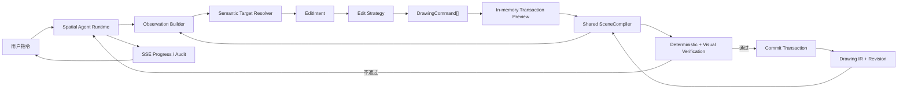

# Vector-Native 二维空间 Agent 引擎设计

> 日期：2026-08-11
>
> 状态：待用户书面复核
> 基线提交：`1d0f8c9 chore: checkpoint visual drawing agent experiments`

## 1. 产品定义

VectorAI 不是单一的“图片转 CAD”或“AI 画图”工具，而是一个 AI 与真实二维空间交互的引擎：AI 同时读取精确向量数据与视觉渲染结果，理解二维形状及其任务语义，通过工具修改 Drawing IR，并使用确定性验证和视觉反馈形成可审计的闭环。

首个目标场景是：用户在已经向量化的二维线稿上输入“把图形右手抬起来打招呼”，系统能定位正确部位、生成局部增量修改、保持外部连接、在后端预览并校验结果，然后自动提交；用户能持续看到过程、暂停并追加指令。

## 2. 已确认的产品决策

1. Drawing IR 是前后端唯一的正式状态真源。
2. AI 拥有图纸的完整控制能力，可创建、修改、删除和局部重绘任何二维图元。
3. AI 的正式结果必须落为 Drawing IR 增量事务；生图、局部栅格重绘和视觉判断只能作为候选或证据。
4. 前后端共享同一套场景编译规则，分别使用适合自身环境的输出适配器。
5. AI 的预览、差异渲染和主要验证 loop 在后端完成，不依赖前端截图回传。
6. 默认自动执行；用户可观察进展、随时暂停、停止或追加指令。
7. 首版只处理二维几何、文字和尺寸，不处理 3D、图层、图块和填充。
8. 本地服务和本地存储仍是 MVP 部署边界。

## 3. 架构不变量

### 3.1 状态不变量

- `DrawingDocument + ordered DrawingTransaction[]` 能确定性重建任意已提交版本。
- 前端不得维护第二套业务图纸模型；本地 UI 状态只包含视口、选择、悬停和临时预览。
- 后端 AI 不得直接改 repository 文件；所有写入必须经过 Command → Preview → Verify → Commit。
- 每个事务必须携带 `baseRevision`，版本不一致时禁止静默覆盖并重新观察。

### 3.2 智能与机制分离

- AI 负责意图理解、语义目标定位、策略选择、候选设计和视觉判断。
- 确定性内核负责坐标变换、路径编译、空间查询、约束检查、事务应用、回放和持久化。
- 模型能力增强时，可以减少固定工作流和启发式规则，但不得绕过事务、审计和版本边界。

### 3.3 视觉不是状态真源

- PNG、SVG、Mask、ID Buffer 和差异图均由指定 Drawing revision 派生。
- 局部 AI 生图若被采用，必须重新向量化、匹配边界锚点并编译为 DrawingCommand。
- 视觉验收不能替代文档合法性、引用完整性、拓扑和事务范围校验。

## 4. 总体架构



系统由六个相互隔离的单元构成：

1. Drawing Kernel：Drawing IR、命令、事务、查询、验证、回放。
2. Scene Compiler：把 Drawing IR 编译为平台无关的渲染场景。
3. Render Adapters：把同一 RenderScene 输出为前端 SVG、后端 PNG、语义 Mask、节点 ID Buffer 和差异图。
4. Observation Builder：组合向量上下文、整体图、局部图、接地信息和版本元数据。
5. Spatial Agent Runtime：组织观察、语义理解、候选编辑、预览、校验和重试。
6. Audit/Eval：记录输入、模型返回、工具调用、事务、渲染版本、验收结果和性能指标。

## 5. 共享 SceneCompiler

### 5.1 目的

前端当前使用 React/SVG 单独解释 Drawing IR，后端使用独立采样器生成 Mask 和 PNG。读取同一数据不代表渲染语义一致；圆弧方向、样条、文字基线、尺寸箭头和线宽可能逐渐漂移。

`SceneCompiler` 必须是无 React、DOM、Sharp 和 Node 文件系统依赖的纯 TypeScript 模块。它只负责把 DrawingDocument 编译为规范显示列表。

### 5.2 核心类型

```typescript
interface RenderScene {
  drawingId: DrawingId;
  revision: DrawingRevision;
  rendererVersion: string;
  worldBounds: Bounds2D | null;
  primitives: ScenePrimitive[];
  nodeIndex: Record<string, SceneNodeIndex>;
}

type ScenePrimitive =
  | ScenePath
  | SceneText
  | SceneMarker;

interface ScenePath {
  kind: 'path';
  key: string;
  nodeId: DrawingNodeId;
  plane: 'geometry' | 'construction' | 'annotation';
  commands: PathCommand[];
  styleRole: SceneStyleRole;
}

type PathCommand =
  | { op: 'M' | 'L'; point: Vec2 }
  | { op: 'A'; center: Vec2; radiusX: number; radiusY: number; rotation: number; start: number; end: number; counterClockwise: boolean }
  | { op: 'Q'; control: Vec2; end: Vec2 }
  | { op: 'C'; control1: Vec2; control2: Vec2; end: Vec2 }
  | { op: 'Z' };
```

SceneCompiler 保留解析后的路径语义，不提前栅格化。前后端适配器必须消费同一组 PathCommand、可见性、样式角色和世界坐标变换。

### 5.3 输出适配器

- `SvgSceneAdapter`：前端交互绘制和后端 SVG 序列化共同使用。
- `RasterSceneAdapter`：后端通过 SVG/Sharp 或后续 Skia 实现 PNG 预览。
- `SemanticMaskAdapter`：输出 geometry、construction、annotation、text 平面。
- `IdBufferAdapter`：为每个可见节点生成稳定、无歧义的像素 ID 与 palette。
- `DiffSceneAdapter`：输出修改前、修改后、增加、删除和移动区域。

适配器可以独立优化，但不得重新解释 DrawingNode 的几何语义。

## 6. 后端视觉观察包

AI 不再依赖用户当前视口作为唯一图像。每次观察由后端从指定 revision 生成：

```typescript
interface VisualObservation {
  drawingId: DrawingId;
  revision: DrawingRevision;
  rendererVersion: string;
  vectorDigest: DrawingContextDigest;
  views: ObservationView[];
  grounding: GroundingEntry[];
  featureGraph?: VisualFeatureGraph;
}

interface ObservationView {
  purpose: 'overview' | 'target-detail' | 'user-viewport' | 'before' | 'preview' | 'diff';
  worldToImage: AffineTransform;
  worldBounds: Bounds2D;
  width: number;
  height: number;
  imageHandle: string;
  idBufferHandle?: string;
}

interface GroundingEntry {
  label: string;       // 例如 G031
  nodeId: DrawingNodeId;
  rgb: [number, number, number];
  imageBounds: PixelBounds;
  worldBounds: Bounds2D;
  zOrder: number;
  clipped: boolean;
}
```

默认包括自动 fit 的全图概览和目标区域细节图；用户视口只是附加上下文。Grounding 必须同时提供短标签、nodeId、精确颜色、像素范围、世界范围和裁剪状态，不能只依赖视觉模型猜测颜色与包围框。

缓存键必须包含：`drawingId + revision + viewSpecHash + selectionHash + rendererVersion + styleProfile`。用户改变视口或选择时，不得错误复用旧快照。

## 7. 向量语义理解

“右手”“门洞”“主轮廓”不是基础 CAD 图元。引擎使用任务级 `VisualFeatureGraph` 把临时语义绑定到稳定图元 ID：

```typescript
interface VisualFeatureGraph {
  revision: DrawingRevision;
  features: VisualFeature[];
  anchors: FeatureAnchor[];
  relations: FeatureRelation[];
}

interface VisualFeature {
  featureId: string;
  role: string;
  nodeIds: DrawingNodeId[];
  confidence: number;
  evidence: FeatureEvidence[];
}
```

该图默认只存在于当前 run 的可审计上下文中，避免首版建立庞大的固定本体。经用户确认或多次稳定复用的语义，可通过正式 feature transaction 写回 Drawing IR。

模型理解二维形状时必须同时使用：

- Drawing IR 的精确参数和稳定 ID。
- 确定性空间查询：连接、相交、包含、邻近、闭合、边界和对称候选。
- 全图与局部视觉渲染。
- ID Buffer/标签接地。
- 当前任务、用户选择和历史事务。

## 8. 高层 EditIntent 与编辑策略

视觉模型不直接承担完整低层 DrawingCommand 生成。它先输出任务级编辑意图：

```typescript
interface EditIntent {
  operation: 'transform' | 'deform' | 'local-redraw' | 'replace' | 'annotate';
  targetFeatureIds: string[];
  targetNodeIds: DrawingNodeId[];
  anchors: EditAnchor[];
  preserveNodeIds: DrawingNodeId[];
  preserveRules: PreserveRule[];
  desiredRelations: DesiredRelation[];
  confidence: number;
  evidenceRefs: string[];
}
```

运行时按能力从低成本到高自由度选择策略：

1. 精确变换：平移、旋转、缩放、镜像和刚性组合。
2. 约束变形：移动局部顶点或控制点，固定连接锚点并重新拟合曲线。
3. 局部向量重绘：AI 提供轮廓/骨架/控制点候选，确定性拟合器生成图元。
4. 局部栅格重绘回退：只编辑目标 crop，再调用现有线稿矢量化管线，将结果对齐锚点并替换局部 Drawing IR。

AI 可以删除并重绘目标区域，但编译器必须证明区域外图元未被修改、外部锚点已连接、旧目标残留已处理。

## 9. 预览、验证与反馈 loop

### 9.1 执行顺序

```text
Observe revision N
→ Resolve semantic target
→ Propose EditIntent
→ Compile DrawingCommand[]
→ Apply to in-memory preview N'
→ Render before / preview / diff
→ Deterministic verification
→ Visual verification
→ Commit as revision N+1 or re-observe
```

AI 不需要等待前端截图。后端 SceneCompiler 直接从内存预览生成视觉上下文，前端只接收结构化事件和增量事务。

### 9.2 确定性验证

每次候选至少检查：

- DrawingDocument schema 和数值合法。
- 所有引用、关系、feature 成员和 annotation 目标有效。
- `baseRevision` 未过期。
- 实际改动位于允许目标集合或授权局部区域。
- `preserveNodeIds` 内容哈希未变化。
- 外部锚点连续，禁止产生非有限坐标、零长度异常或无界几何。
- 删除旧部件时不存在重复残留。

### 9.3 视觉验证

视觉验收模型同时接收目标、before、preview、diff、grounding 和确定性报告，输出：

```typescript
interface VisualAcceptance {
  satisfied: boolean;
  confidence: number;
  targetFeatureIds: string[];
  changedAsRequested: boolean;
  unrelatedChanges: DrawingNodeId[];
  defects: VisualDefect[];
  repairHint?: string;
}
```

视觉结果只能与确定性结果合取：确定性验证失败时禁止提交；视觉低置信度或发现缺陷时进入下一轮观察和修复。低置信度候选继续在 UI 中以红色呈现。

### 9.4 提交策略

- 纯数值、无需视觉语义判断的精确命令，可以在内存预览和确定性验证通过后自动提交，视觉复核仅作提交后诊断。
- 由自然语言视觉目标驱动的修改（包括姿态、外观、删除、替换和局部重绘）必须在提交前完成 before/preview/diff 视觉验收。
- 每个 loop 只提交一个边界清楚的局部事务，避免整图巨型提交。
- 用户暂停或追加指令时，在最近安全点冻结当前 preview，不提交半成品。

## 10. Agent Runtime 与工具边界

运行时只负责 orchestration，不保存几何业务规则。推荐通用工具集：

- `drawing.summarize`
- `drawing.query`
- `drawing.inspect`
- `drawing.spatialRelations`
- `drawing.renderObservation`
- `drawing.previewTransaction`
- `drawing.verifyPreview`
- `drawing.commitTransaction`
- `drawing.discardPreview`
- `drawing.vectorizeRegion`

模型可以自由选择工具和循环次数，但受统一 deadline、决策次数、事务次数、区域大小和重复无进展检测约束。模型升级只改变策略质量，不改变工具协议和 Drawing IR。

模型调用返回值必须是 call-scoped 结果，例如 `{ parsed, rawReply, modelMeta }`；禁止通过共享 adapter 上的可变回调记录审计，避免并发 run 串写。

## 11. 前后端同步与交互

前端首次打开图纸时获取 DrawingDocument snapshot，此后主要消费有序事务：

```text
Drawing snapshot at revision N
+ Transaction N+1
+ Transaction N+2
+ ...
```

SSE 至少公开以下用户可见阶段，但不展示内部模型名称：

- `observing`：读取图纸和构建视觉上下文。
- `grounding`：定位目标图元或语义部件。
- `designing`：形成编辑候选。
- `previewing`：后端已经生成事务预览。
- `verifying`：执行向量和视觉校验。
- `committed`：事务已落入 Drawing IR。
- `revising`：验收失败，正在修正。

前端可以立即用事务预览绘制过程，无需等待 PNG；后端生成的视觉图只用于 AI、审计和必要的调试面板。

## 12. 性能设计

MVP 性能目标：

- `POST /api/agent/runs` 在 1 秒内返回 `202 + runId`。
- 运行期间不超过 10 秒没有 SSE heartbeat，不超过 30 秒没有可见状态回执。
- 后端 AI loop 不依赖浏览器往返。
- SceneCompiler 对未变化 revision 复用编译结果。
- 小事务只重算受影响节点、空间索引和 dirty region。
- 先生成低分辨率 overview，再按需生成高分辨率目标 crop。
- 图像、Mask 与 ID Buffer 使用 handle 存储，模型上下文只携带必要视图。
- 无新几何变化、无新视觉证据或相同缺陷连续出现时提前停止重复 loop。

性能指标必须进入 audit：scene compile、raster render、model latency、preview、deterministic verify、visual verify、commit 和首个可见回执时间。

## 13. 错误处理

- Revision stale：丢弃 preview，读取新 revision 后重新观察，不自动套用旧坐标。
- Grounding ambiguous：扩大局部图、增加标签或调用空间查询；低置信度时不得破坏性提交。
- Render failure：保留 Drawing IR 和候选事务，使用 typed error 结束当前轮，不提交。
- Model protocol failure：有限 schema repair；原始返回进入对应 run 审计。
- Visual disagreement：保留确定性报告和差异图，进入 repair loop；达到预算后以 candidate 状态结束。
- User pause/stop：AbortSignal 中止模型或渲染任务，在安全点保留可恢复上下文。
- Renderer mismatch：交叉适配器黄金测试失败即阻止发布，不能通过视觉模型容错掩盖。

## 14. 审计与可回归性

每一轮记录：

- runId、drawingId、baseRevision、用户指令和选择。
- 模型角色、模型配置摘要、prompt hash、原始返回和解析结果。
- Observation 的 rendererVersion、viewSpec、图像 handle 和 grounding。
- VisualFeatureGraph、EditIntent 和置信度。
- DrawingCommand、preview handle、确定性报告和视觉报告。
- commit receipt、前后 revision、耗时、暂停/追加指令事件。

回放模式默认不调用模型：读取已记录的模型结果和工具回执，重新编译场景、执行事务和验证输出，发现非确定性差异即失败。

## 15. 测试与发布门槛

### 15.1 SceneCompiler

- 每种 MVP 图元、文字和尺寸都有结构化 golden RenderScene。
- 前端 SVG 与后端 SVG 序列化使用相同 PathCommand。
- 浏览器截图与后端 PNG 在固定字体、尺寸和 transform 下满足像素容差。
- Arc 方向、ellipse 旋转、spline、Y 轴翻转、文字和尺寸标注有专门回归。

### 15.2 事务与同步

- snapshot + transactions 与 repository 最新 DrawingDocument 完全一致。
- Undo/redo、暂停、追加指令、stale revision 和 replay 有确定性测试。
- 前端收到重复 SSE/transaction 时保持幂等。

### 15.3 视觉编辑黄金场景

使用 test2 派生的已向量化线稿建立“右手抬起来打招呼”基准，至少验证：

- 真实视觉模型获得 overview、detail、grounding 和向量摘要。
- 正确定位角色右手对应的 feature/node 集合。
- 旧手臂不重复残留。
- 肩部锚点连接，区域外 node 内容哈希不变。
- before/preview/diff 验收在提交前发生。
- 至少一次真实失败反馈能驱动第二轮修改，而不是脚本预设验收结果。
- 最终结果由 Drawing IR 增量事务产生并可回放。

### 15.4 性能门槛

- 自动化记录首个回执、首次 observation、首次 preview 和最终完成耗时。
- 任何超过 30 秒无可见回执的真实流程测试失败。
- 相同 revision/viewSpec 的重复观察必须命中缓存。

## 16. 迁移边界

MVP 不保留不合适的旧视觉编辑兼容路径。迁移完成后删除：

- `text_only` 导致已有图纸无法获得视觉上下文的分支。
- 仅依赖前端 viewport 的后端视觉输入。
- Drawing IR → 前端 SVG 与 Drawing IR → 后端 raster 两套独立几何解释。
- 模型直接从截图输出完整低层坐标事务的默认路径。
- 只看提交后单张图片、替代确定性验证的视觉验收。
- 共享 adapter 可变 `onRawReply` 审计回调。

旧导入、CV 和线稿矢量化能力保留为 Agent 工具及局部重绘回退能力，不再主导统一工作流。

## 17. MVP 完成定义

当且仅当以下条件全部满足，第一版二维空间视觉编辑引擎才算完成：

1. Drawing IR 是前后端唯一正式状态，所有 AI 修改均为增量事务。
2. 前后端消费同一 SceneCompiler，核心几何渲染不存在重复解释。
3. 后端能独立生成 AI 所需的 overview、detail、grounding、preview 和 diff。
4. 模型能结合向量数据与视觉图定位任务级二维语义。
5. “右手抬起来”可删除或局部重绘目标图元，并保持外部锚点和区域外图形。
6. 每次视觉语义提交前后均有确定性与视觉证据，失败会驱动真实 repair loop。
7. 整个流程可暂停、追加指令、审计和确定性回放。
8. 运行中每 30 秒内至少有一次用户可见回执。
