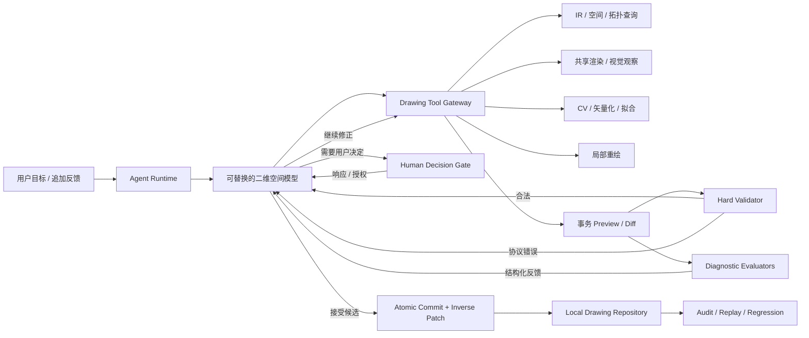

# 模型主导的二维空间 Agent 与 Human Decision Gate 设计

> 状态：已确认设计
>
> 日期：2026-08-12
>
> 适用阶段：VectorAI MVP 架构迁移

## 1. 决策摘要

VectorAI 的目标是让 AI 像编辑代码一样理解、维护和修改二维空间。模型应拥有 Drawing IR 的完整编辑能力，而不是先由一套低智能 Harness 固定选区、授权范围和编辑方式，再要求模型在狭窄范围内完成任务。

新架构采用“模型主导、工具辅助、事务兜底”：

- 模型负责观察、理解、规划、选择对象、决定编辑方式、生成修改、检查 Preview 和继续修正。
- Harness 提供真实 Drawing IR、统一渲染、空间/CV/拓扑/矢量化工具、原子事务、版本控制、审计、回放和撤销。
- 查询结果、视觉包络、语义锚点、Mask 和拓扑路径都是证据或工具结果，不是不可扩大的写权限。
- 模型可以在同一事务中新增、删除、更新或重建 `geometry`、`annotation`、`relation` 和 `feature`。
- 标注是次要数据，不能阻止几何编辑；约束是模型需要理解的语义，不强制编辑策略。
- 只有协议非法、版本冲突和缺失必要用户授权会阻止事务。
- 其他几何、拓扑、视觉和风格问题形成结构化反馈，由模型在 Loop 中自行处理。

## 2. 为什么需要迁移

当前主链把多个本应是“辅助模型判断”的组件变成了“替模型做决定”的强门禁：

1. 视觉接地先产生搜索包络和稀疏锚点。
2. 拓扑解析器将它们收敛成唯一选区。
3. 确定性授权阻止模型修改选区之外的内容。
4. Strategy Router 可以覆盖模型选择的编辑模式。
5. Validator 依据不完整选区判断候选是否合法。

真实回归已经证明，这种结构会把正确意图编译成错误动作：当目标部件的实际语义边界与拟合图元、拓扑连通或自动标注不一致时，模型无法修正 Harness 的错误决定。增加更多对象特例、动作提示或固定阈值只会扩大历史包袱。

需要保留的不是这些决策门禁，而是它们背后的有价值能力：全局拓扑、路径追踪、局部拆分、解析几何、重绘、矢量化和验证。它们应被改造成模型可调用、可观察、可组合的工具。

## 3. 设计原则

### 3.1 Drawing IR 仍是唯一编辑真相

- 模型不能用一张生成图片直接覆盖正式图纸。
- 所有正式修改都必须编译为 Drawing Commands，并经过 Preview 和原子 Commit。
- 前端、后端、模型观察和导出共享同一 Drawing IR 与 SceneCompiler。
- 每个 Commit 保存正向 Patch、逆向 Patch、base revision、actor、证据和审计引用。

“模型拥有完整编辑权”表示模型可以决定任意合法 Drawing Command，而不是绕过 Drawing IR 仓库直接写文件。

### 3.2 工具提供能力，不替模型裁决

- 视觉 grounding 返回可能区域、像素证据和坐标映射。
- 拓扑工具返回连接、路径、接口、交叉、闭合和间隙信息。
- 空间查询返回节点、局部参数、关系和 Feature。
- 重绘与矢量化返回可编辑候选。
- 验证返回事实、错误和警告。

这些结果都进入模型上下文。除协议安全外，Harness 不把任一结果提升为模型不可推翻的编辑决策。

### 3.3 模型自由选择编辑方式

模型可以在每一轮自由组合：

- 直接创建、更新或删除 Drawing IR 图元。
- 平移、旋转、缩放或数值重算解析图元。
- 拆分、合并、延长、裁剪、重拟合或更换图元类型。
- 删除局部后直接重建新的几何与关系。
- 调用局部图像重绘，再矢量化回 Drawing IR。
- 混合确定性几何与生成式重绘。

系统不再用自动标注、约束、对象类型或语言关键词强制路由策略。

### 3.4 验证优先反馈，少量问题才阻断

验证输出分为三类：

| 等级 | 示例 | 行为 |
|---|---|---|
| `error` | Schema 非法、NaN、引用不存在、base revision 过期 | 拒绝 Preview 或 Commit，返回模型修复 |
| `decision-required` | 删除已有约束、修改用户锁定资源、覆盖外部文件 | 进入 Human Decision Gate |
| `warning` | 新悬空端点、约束受影响、局部差异较大、样式或尺度异常 | 保留 Preview，反馈模型继续修正或标红提交 |

warning 不得自动改写模型的选区、命令或编辑策略。

### 3.5 用户只处理权限、事实与价值判断

模型能够自行解决的几何问题不打断用户。只有继续任务需要用户的权限、缺失事实或主观选择时，才请求 Human Decision。

## 4. 总体架构



### 4.1 模块边界

1. **Drawing Core**：协议、Command、Patch、Transaction、Validation、Repository、SceneCompiler。
2. **Drawing Tool Gateway**：向模型暴露版本化工具；不保存第二份图纸状态。
3. **Agent Runtime**：维护 Episode、模型 Loop、工具调用、进度、安全点和重试。
4. **Diagnostic Evaluators**：计算拓扑、视觉、约束、标注、尺度和局部差异；只返回证据。
5. **Human Interaction Service**：统一管理用户决策、追加指令、暂停、恢复和授权。
6. **Audit Store**：保存可回放事实，不保存隐藏思维链和媒体正文。

## 5. Agent 主循环

固定 workflow DAG 改为模型驱动的有界工具循环：

```text
创建 EditEpisode
→ 读取用户目标、Drawing 摘要和当前 revision
→ 模型选择下一项工具
→ Runtime 执行并返回 receipt + 结构化结果
→ UI 显示最新真实动作与画布 Overlay/Preview
→ 模型继续观察、查询或编辑
→ 生成原子事务 Preview
→ 硬校验 + 诊断评估 + 统一渲染
→ 独立检查者比较 before | after 并返回 Review Evidence
→ 主模型基于图纸事实与 Review Evidence 决定修正、请求用户决定或提交
→ Commit / 等待用户 / 暂停 / 失败
```

Runtime 只施加服务级预算，例如最大单次媒体像素、工具超时、并发和 Episode 总资源。预算是稳定性保护，不包含对象、动作或语义规则。

### 5.1 模型能力与调用可靠性

- 空间理解、工具规划和 Drawing IR 事务生成使用 `COMPANY_AI_SPATIAL_MODEL`；独立结果复核使用 `COMPANY_AI_REVIEW_MODEL`，且复核意见不是 Commit 门禁。
- `planner / decision / repair` 是审计兼容角色，不代表不同推理等级；生产运行将三者解析到同一高级空间模型。
- 超时、网络或供应商传输失败只触发同一模型重试，不能降级到轻量模型。单次调用软上限默认 120 秒，Episode 总上限默认 15 分钟。
- Schema、revision、引用、数值和确定性几何诊断可在本地快速执行，但不得把轻量模型引入为候选的空间裁决者。
- 模型是可替换能力边界；这些策略不把供应商名称写入 Drawing IR、任务协议或 UI。

### 5.2 模型动作协议

模型每轮只输出一个显式动作：

```ts
type DrawingAgentAction =
  | { type: 'tool'; toolCallId: string; tool: DrawingToolName; input: unknown }
  | { type: 'request-human-decision'; request: HumanDecisionDraft }
  | { type: 'commit'; previewHandle: string; summary: string; confidence?: number }
  | { type: 'finish'; summary: string };
```

模型不输出隐藏的“自动授权”。所有写操作通过工具产生 Preview handle；Commit 只能引用当前 revision 上仍有效的 Preview。

## 6. 模型工具集

### 6.1 观察与查询

- `render_drawing`：生成 overview、viewport、focus 和 diff 视图，带世界坐标映射。
- `query_nodes`：按 plane、ID、类型、范围、关系或 Feature 查询。
- `inspect_nodes`：读取完整节点、引用、关系、标注和来源证据。
- `measure_geometry`：距离、角度、包围盒、相交、最近点和闭合度。

### 6.2 拓扑与路径

- `build_topology`：为当前 revision 构建或读取全局拓扑图。
- `trace_paths`：从一个或多个种子沿连接路径追踪，可提供停止点和方向线索。
- `find_interfaces`：返回候选连接接口、分支度和局部间隙。
- `inspect_fragment`：按节点参数范围读取局部图元。
- `materialize_split`：在候选事务中按参数范围拆分，并生成 lineage。

拓扑服务可以报告不确定性和候选路径，但不返回 `accepted authorization`。模型可以根据视觉、向量和其他工具结果选择、修正或放弃路径。

### 6.3 编辑与生成

- `preview_transaction`：对四个 IR plane 执行任意合法 Drawing Commands。
- `redraw_region`：模型提供编辑意图、Drawing IR 世界坐标轮廓和可选关注节点；服务端统一渲染当前图纸、生成 Mask 并返回干净线稿候选。
- `vectorize_image`：把局部或全图候选转换为解析图元与 Polyline/Spline 兜底。
- `fit_geometry`：拟合 Line、Circle、Arc、Ellipse、Polyline 或 Spline。
- `recompute_annotations`：重算、重关联、标记冲突或删除派生标注。
- `evaluate_preview`：返回硬校验、诊断、约束影响和渲染句柄。

`redraw_region` 不要求模型传输 PNG/Base64。服务端通过同一 SceneCompiler 和 world/image 变换生成输入图、Mask 与保护 Mask。Mask 是生成输入，不是事务写权限；模型可以在看到重绘结果后决定实际删除、更新和新增哪些 IR 节点。

## 7. 自由 Drawing Transaction

现有 `DrawingCommand` 已覆盖四个 plane，继续作为唯一修改语言：

```text
geometry.create / update / delete
annotation.create / update / delete
relation.create / update / delete
feature.create / update / delete
history.revert
```

### 7.1 事务要求

每个候选事务包含：

- `baseRevision`
- `actor` 与 `episodeId`
- 有序 Commands
- 结构性 Preconditions / Postconditions
- Evidence refs
- 可选 `lineage`
- 可选 `decisionGrantRefs`
- 模型摘要与候选置信度

同一事务可以删除原图元并创建完全不同类型或 ID 的图元。Lineage 描述来源关系，不要求一对一 ID 稳定：

```ts
interface DrawingLineageRecord {
  sourceIds: string[];
  resultIds: string[];
  operation: 'preserve' | 'transform' | 'split' | 'merge' | 'replace' | 'redraw';
  sourceRanges?: Array<{ nodeId: string; range: [number, number] }>;
  evidenceRefs: string[];
}
```

### 7.2 原子性与回滚

- Preview 在临时 DrawingDocument 上完成。
- Commit 使用 compare-and-swap revision，禁止 last-write-wins。
- 成功 Commit 同时持久化 Patch 和 inverse Patch。
- 失败不改变正式文档。
- Undo 恢复几何、标注、关系、Feature 和被用户授权解除的约束。

## 8. 标注、约束与锁定内容

### 8.1 标注

- 标注不能选择或强制编辑模式。
- 几何变化后，关联标注可以在同一事务内更新、重新关联、标记 `conflict` 或删除重建。
- 标注不一致是 warning；悬空引用仍属于协议 error，因此模型必须更新或移除引用。
- 自动标注是派生能力，可以通过工具重新计算。

### 8.2 约束

- 约束进入模型上下文和 Preview impact report。
- 几何编辑导致约束 `violated` 或 `unsolved` 时，系统向模型返回事实，不强制改成 geometric-edit。
- 模型可以重新满足、更新、替换或提议解除约束。
- 删除、放宽或改变已有用户约束的含义需要有效 Human Decision Grant。

### 8.3 用户锁定

用户明确锁定的节点、区域或策略由独立 Interaction Policy 表示。修改锁定内容和解除约束使用同一 Human Decision Gate，不在拓扑模块中实现专用弹窗。

## 9. Human Decision Gate

### 9.1 统一请求协议

```ts
type HumanDecisionKind =
  | 'grant-permission'
  | 'choose-option'
  | 'confirm-intent'
  | 'provide-context'
  | 'accept-risk';

interface HumanDecisionRequest {
  id: string;
  episodeId: string;
  revision: string;
  candidateId?: string;
  transactionDigest?: string;
  kind: HumanDecisionKind;
  question: string;
  reason: string;
  options: Array<{
    id: string;
    label: string;
    description?: string;
    effect?: DecisionEffect;
  }>;
  recommendedOptionId?: string;
  affectedResources: Array<{
    plane?: 'geometry' | 'annotation' | 'relation' | 'feature' | 'external';
    ids?: string[];
    action?: string;
  }>;
  previewHandle?: string;
  expiresWhenRevisionChanges: true;
}
```

`DecisionEffect` 可以产生一次性 `PermissionGrant`、补充事实、选择方案或接受风险。模型摘要必须说明用户在决定什么，不能展示隐藏思维链。

### 9.2 响应与授权

```ts
interface HumanDecisionResponse {
  requestId: string;
  selectedOptionId: string;
  additionalInstruction?: string;
  decidedAt: number;
}

interface PermissionGrant {
  id: string;
  requestId: string;
  episodeId: string;
  revision: string;
  transactionDigest: string;
  actions: string[];
  resourceIds: string[];
  effect: 'allow' | 'deny';
  scope: 'candidate';
}
```

MVP 的 Grant 只对一个候选事务有效：revision、事务摘要、资源或动作变化后自动失效。首版不提供“永久允许”。

### 9.3 状态机

```text
running
→ waiting_for_user
→ running       用户响应且任务继续
→ paused        用户主动暂停
→ stopped       用户终止
→ completed     Commit 或只读任务完成
→ failed        不可恢复的系统错误
```

等待期间保存完整 Episode、Preview、工具证据和请求。用户追加文字既可以回答请求，也可以作为 `additional-instruction` 改变目标；Runtime 依据引用关系区分，但统一进入 Human Interaction Event Log。

### 9.4 何时不询问

以下情况由模型自行处理，不弹窗：

- 普通断线、错误方向、样式漂移或几何拟合失败。
- 可撤销的常规增删改。
- 自动标注重算。
- 模型可以通过更多观察或工具调用消除的歧义。
- 单纯因为自报置信度低。

## 10. Preview、诊断与提交

### 10.1 Hard Validator

只负责：

- Drawing IR Schema、有限数值和基本几何合法性。
- 节点与关系引用完整性。
- Command Preconditions。
- base revision 与 Preview handle 有效性。
- Human Decision Policy 所需 Grant 是否存在并精确匹配。

### 10.2 Diagnostic Evaluators

返回可组合的结构化事实：

- 新增或消失的端点与闭合路径。
- 拓扑连接、分支和间隙变化。
- 约束满足状态和标注影响。
- before/preview/diff 的视觉目标达成度。
- 区域外变化、尺度异常、样式变化和可疑伪影。
- 与用户目标、追加反馈和历史缺陷的关系。

Diagnostic 结果不拥有修改候选的权限。模型可以修正、解释接受或请求用户接受风险。

### 10.3 自动提交

默认自动执行。模型在看到当前 Preview、硬校验和诊断后发出 `commit`：

- 没有 error 和缺失 Grant 时原子提交。
- 仍有 warning 且模型认为可接受时，以 candidate/低置信度状态提交并在 UI 标红。
- 视觉或结构未达目标时继续 Loop，不需要用户重复不变量。

## 11. UI 与实时交互

- 任务状态贴近输入框，只显示最新真实动作。
- 画布实时显示模型查询点、拓扑路径、Mask、受影响节点和当前 Preview。
- Overlay 表示“模型正在查看或考虑”，不表示硬选区。
- 运行时发送按钮切换为暂停；用户可随时追加指令。
- `waiting_for_user` 显示一张紧凑 Decision Card，包含问题、影响、推荐项和 Preview 入口。
- UI 不显示模型名称或隐藏推理；显示模型动作摘要、工具调用目的、事实结果和修改 Diff。
- 30 秒是可见反馈目标，不是候选正确性的强超时；长工具持续发送真实阶段或 heartbeat。

## 12. 审计、回放与上下文

每个 EditEpisode 记录：

- 用户目标、追加指令和 Human Decision 请求/响应。
- 模型角色、配置摘要、Prompt hash 和原始结构化动作。
- 每个工具的版本、输入摘要、revision、结果句柄、耗时和 receipt。
- Observation、坐标变换、拓扑/CV/矢量化证据。
- 每个事务的 Commands、lineage、before/preview/diff、诊断和模型决定。
- Permission Grant 及其精确作用域。
- Commit、Patch、inverse Patch 和最终状态。

Replay 分为：

1. **确定性事务回放**：不调用模型，从起始 revision 重放出相同文档。
2. **Agent 回归回放**：将历史 Observation 与工具结果注入当前模型，比较工具选择、事务和最终视觉结果。

不保存 API Key、Authorization、媒体 base64 或隐藏思维链。

## 13. 失败处理

- **协议错误**：返回精确 JSON path 和可接受格式，模型有界修复。
- **revision 过期**：废弃 Preview，重新观察；Human Grant 随之失效。
- **工具超时**：保留 Episode 和阶段，模型可重试、换工具或缩小输入。
- **生成服务失败**：作为工具错误返回模型，不自动切换为几何旋转。
- **诊断未收敛**：模型可更换策略、升级模型、请求用户接受风险或结束为失败。
- **用户拒绝授权**：模型基于拒绝重新规划，不把拒绝当系统错误。
- **模型重复相同失败候选**：Runtime 返回候选摘要相同的事实，模型必须换策略或结束；不静默重复。

## 14. 迁移设计

### 14.1 保留并改造

- `src/drawing/`：继续作为稳定内核，扩展 transaction metadata、lineage 和 decision grants。
- `atomic-graph.ts`、`topology-part-resolver.ts`：改造成无授权语义的 Topology Query Service。
- `split-materializer.ts`：变成模型工具，不再依赖固定 SpatialSelection 主链。
- `spatial-validator.ts`：拆成 Hard Validator 扩展与 Diagnostic Evaluators。
- `drawing-generation/`、`drawing-vectorization/`：作为独立模型工具保留。
- `drawing-vision/`、共享 SceneCompiler：继续提供 revision-bound 观察和 Diff。
- EditEpisode、Audit Store、进度和暂停恢复：扩展为通用工具 Loop 与 Human Interaction 状态。

### 14.2 删除主链责任

- 删除“视觉包络等于后续唯一编辑上下文”的强制流水线。
- 删除 `TopologyAuthorization` 对模型写范围的硬限制。
- 删除 Dimension/constraint 强制 `geometric-edit` 的 Strategy Router 逻辑。
- 删除生成失败自动回退几何旋转的逻辑。
- 删除必须先得到 accepted SpatialSelection 才能设计的前置条件。
- 删除把 locality、protected hash、boundary 或 dangling endpoint 一概作为事务拒绝条件的旧耦合。
- 删除固定 planner workflow DAG 对下一工具的限制；保留目标、预算和可审计动作。

### 14.3 不保留双主链

MVP 不维护旧授权链 Feature Flag。新工具 Loop、事务门禁和核心回归通过后，直接删除旧 runtime 入口和过时协议，避免两个系统产生不同事实。

## 15. 测试与自验证

### 15.1 单元测试

- 四个 plane 可在同一事务中原子增删改并正确生成 inverse Patch。
- Lineage 支持 split、merge、replace 和 redraw。
- Hard Validator 只拒绝协议、引用、revision 和缺失 Grant。
- 约束影响、悬空端点、区域差异等只产生 Diagnostic warning。
- Human Decision 请求、响应、Grant 匹配、过期和拒绝状态机。
- Topology Query 返回路径与不确定性，不生成写授权。

### 15.2 集成测试

- 模型可以先查拓扑、发现路径不完整，再扩大查询并重建部件。
- 关联自动标注不会迫使模型使用 geometric-edit。
- 模型可删除原图元并创建不同类型/ID 的替换图元。
- 删除已有 constraint 会进入 `waiting_for_user`；同意后当前候选可提交，拒绝后模型重新规划。
- Revision 变化使 Preview 和 Permission Grant 同时失效。
- 用户追加指令在同一 Episode 中继续，不丢失前一轮 Preview 和缺陷上下文。

### 15.3 回归基准

- `test2` 的“抬起角色自身右手”只作为通用多接口部件编辑回归：应能选择或重建完整双边轮廓，保持连接并避免修改身体其他结构。
- `test1` 验证复杂来源重建、逐步可见和后续自由编辑。
- 增加工程图约束解除、重叠路径局部修改、自由形新增和大图分步工具调用样例。
- 生产代码和提示词继续扫描测试图坐标、对象、动作和方向特例。

### 15.4 设计级失败回放

对已知失败运行按新主链重放：

1. 自动尺寸标注不再覆盖模型提出的 hybrid/redraw 选择。
2. 拓扑追踪发现上缘间隙时只报告证据，不固定错误三节点选区。
3. 模型可继续查询第二条轮廓或直接重绘整个语义部件。
4. Preview 的方向、双接口、悬空端点和全图视觉结果同时反馈模型。
5. 模型修正后提交；若需要删除约束，进入 Human Decision Gate。

这个回放证明新架构移除了已知错误的强制路径，但最终在线效果仍必须通过真实模型、真实浏览器和 Drawing IR 回归验收，不能仅靠文档宣称完成。

## 16. MVP 完成定义

新架构迁移完成必须同时满足：

1. 生产 runtime 不再依赖 Spatial Authorization 或强制 Strategy Router 才能编辑。
2. 模型可以调用查询、拓扑、渲染、重绘、矢量化、Preview、诊断和 Commit 工具形成多轮 Loop。
3. 四个 Drawing IR plane 由同一事务统一维护。
4. Human Decision Gate 能暂停、显示 Preview、保存响应并恢复同一 Episode。
5. 标注不阻止编辑；约束解除需要精确的一次性授权。
6. 每个 Commit 可撤销、可确定性回放、可关联完整工具证据。
7. `test1`、`test2` 与工程图回归在浏览器真实流程中跑通，画布能显示真实工具与 Preview 过程。
