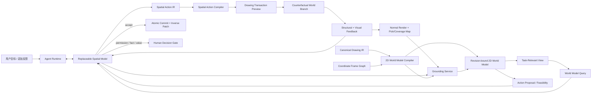

# 二维世界模型与空间动作编译器设计

> 状态：已确认设计
>
> 日期：2026-08-13
>
> 决策：采用方案 2——二维世界模型 + 空间动作编译器
>
> 范围：视觉语义 Grounding、二维拓扑、空间动作、模型上下文、Preview 反馈与回归

## 1. 决策摘要

VectorAI 不再把系统定义成“AI 直接操作一组 Drawing IR 图元”，而定义成：

> AI 通过可查询、可定位、可执行、可反馈的二维世界模型理解并控制 Drawing IR。

Drawing IR 仍是唯一编辑真相。二维世界模型是绑定 revision 的派生表示，不建立第二份可独立写入的图纸。模型负责语义理解、对象选择、设计目标、动作选择和 Preview 验收；程序负责坐标、精确几何、拓扑、约束求解、动作编译、事务和诊断。

三维场景图、任务驱动语义地图和时空世界模型的补充调研进一步确认了该方向，并增加四项约束：语义粒度必须随任务变化、局部世界必须显式说明是否读取完整、Preview 必须可作为反事实世界查询、Grounding 判断必须保留可修订的证据历史。这四项都是现有世界模型的按需投影或元数据，不增加四个固定串行阶段。

本设计解决的核心问题不是某个“抬手”样例，而是视觉语义与真实二维结构之间存在的普遍错位：

- 一个语义对象可能只覆盖一个图元的局部参数区间。
- 一个图元可能同时属于多个语义对象。
- 两个对象可能在画面上重叠，但不能因像素或包围盒相交而共同修改。
- 视觉模型可以判断“是什么”，却不应负责手算世界坐标、交点和精确切分参数。
- 工程图与自由图形需要不同编辑能力，但应共享同一感知、事务和反馈基础设施。

## 2. 当前链路的问题

当前代码已经具有 Drawing IR、统一渲染、事务、Preview、语义区域、采样原子段和审计，这些能力继续保留。但当前空间链路仍有四个结构性缺口。

### 2.1 语义区域仍由通用模型直接画坐标

`SemanticRegionProposal` 要求模型给出归一化轮廓、洞和锚点。模型一旦在高分辨率画面中给错数值坐标，后续程序只能把错误轮廓确定性地映射到错误世界位置。

### 2.2 原子图不等于平面世界模型

当前 `GeometryTopologyGraph` 主要采样图元并聚类端点。它没有完整表达：

- 解析曲线交点和重叠区间。
- 由交点诱导的原子边。
- 有方向的半边与闭合面。
- 原始图元参数区间到派生原子边的双向历史。
- “几何相交”与“设计上连接”之间的区别。

因此沿连接遍历时，错误种子可能扩散到相邻结构；相反，一条包含多个语义部位的原图元又可能无法只选择其中一段。

### 2.3 选区解析过早收敛成唯一答案

现有链路把搜索区域、稀疏锚点、端点吸附和图遍历收敛成一个唯一目标，再围绕它生成授权和修改。它缺少“多个语义候选 + 多种几何支持映射 + 多种可执行动作”供模型比较。

### 2.4 模型动作与 Drawing Commands 之间缺少编译层

模型目前要么给出较低层几何设计，要么直接产生 Drawing Commands。系统能验证结果，却不能先为模型提供带影响范围、接口、可行性和代价的动作候选。

## 3. 设计原则

### 3.1 一份真相，多个派生视图

- Canonical Drawing IR 是唯一正式、可提交的编辑状态。
- 拓扑原子、面、Mask、语义对象、ID Buffer、测量和动作候选全部是 revision-bound Evidence。
- 派生表示过期后重建，不用派生状态静默覆盖 Drawing IR。

### 3.2 语义对象不等于图元

模型看到的是部位、房间、轮廓、构件、标识或用户表达的任意对象；Drawing IR 存储的是几何、标注、关系和 Feature。两者通过多对多支持映射连接，不能强制一一对应。

### 3.3 模型做选择与设计，程序做精确计算

模型优先选择候选对象、目标关系、设计意图和编辑策略。程序计算坐标变换、交点、参数范围、闭合面、约束解、Drawing Commands 和结构诊断。

### 3.4 能力候选不是写权限

程序可以提出最可能成功的变形、约束求解、替换、重绘或混合方案，但不能替模型决定语义对象和最终设计。模型始终可以组合能力、调整候选，或直接提交合法的底层事务。

### 3.5 分析切分不污染正式图纸

平面世界模型可以在交点、折点或语义边界处建立任意细的原子边。只有某次编辑真正需要修改局部参数区间时，才把必要切分物化为 Drawing IR Commands。未参与修改的原图元不因分析而永久碎片化。

### 3.6 交叉不自动等于连接

世界模型同时记录几何 incidence 和 authored topology：

- `incidence` 表示两条曲线在同一世界位置相交、重叠或接触。
- `connected` 表示路径允许在此处跨图元继续，来源可以是共享端点、显式 relation 或带证据的推断。

模型和路径工具可以查询两者，但路径遍历不得默认穿过所有视觉交叉点。

## 4. 总体架构



新增或重构的主要边界是：

1. `CoordinateFrameGraph`：管理 source、page、view、observation 和 document world 坐标之间的显式变换。
2. `WorldModelCompiler`：从 Drawing IR 派生平面 Arrangement、空间索引和基础事实。
3. `GroundingService`：把自然语言视觉指代转成有限语义候选，并映射到世界模型支持集。
4. `WorldModelQuery`：向模型提供紧凑、可分页、可引用的场景和局部结构。
5. `ActionProposalService`：给出多种可执行候选及影响分析，不替模型选择。
6. `SpatialActionCompiler`：把空间目标编译为原子 Drawing Transaction Preview。
7. `TaskRelevantView`：按当前任务临时组织语义对象、部件与上下文，不把任务期理解写成永久本体。
8. `CounterfactualWorldBranch`：让模型在提交前查询候选事务造成的几何、拓扑和语义变化。

## 5. 二维世界模型

二维世界模型由三张互相映射的图和一个坐标框架图组成。

### 5.1 Authoring Graph

Authoring Graph 是 Drawing IR 的只读图视图：

```text
DrawingDocument
├── geometry
├── annotations
├── relations
├── features
└── coordinateFrames / unitSystem
```

它保存稳定 Node ID、正式关系、Feature、来源 lineage 和用户约束。只有 Drawing Transaction 可以修改这张图。

### 5.2 Planar Arrangement Graph

Arrangement Graph 是 revision-bound 派生缓存：

```ts
interface ArrangementGraph {
  drawingId: string;
  revision: string;
  compilerVersion: string;
  inputDigest: string;
  frameId: string;
  vertices: ArrangementVertex[];
  halfEdges: ArrangementHalfEdge[];
  faces: ArrangementFace[];
  sourceSpans: SourceSpan[];
  diagnostics: ArrangementDiagnostic[];
}

interface SourceSpan {
  id: string;
  sourceNodeId: string;
  parameterRange: readonly [number, number];
  halfEdgeIds: string[];
  derivation: 'analytic' | 'polyline-exact' | 'sampled-fallback';
  tolerance: number;
}
```

要求：

- 对 Line、Circle、Arc、Ellipse 和 Polyline 优先使用解析或分段精确相交。
- Spline 在没有可靠解析核时使用带明确误差的自适应采样，并保留原参数区间。
- 顶点记录交点、端点、重叠端和推断接触点来源。
- 半边记录方向、双向边、左/右面、来源参数范围和几何切向。
- 面记录外环、洞、面积、包围盒和包含关系。
- `incidenceEdges` 与 `connectedEdges` 分开存储。
- 所有派生 ID 绑定 revision；跨 revision 通过 SourceSpan 和 lineage 重定位，不假设原子 ID 永久稳定。

Arrangement Graph 不要求首轮一次编译整张复杂图纸。它支持按重叠区域和相关组件构建 `WorldModelSlice`，边界使用 halo，并按 SourceSpan 去重。

### 5.3 Semantic Grounding Graph

Grounding Graph 保存模型当前理解中的对象假设：

```ts
interface SemanticEntityHypothesis {
  id: string;
  drawingId: string;
  revision: string;
  label: string;
  referringExpression: string;
  observationRefs: string[];
  regionRefs: string[];
  supports: Array<{
    kind: 'node' | 'source-span' | 'half-edge' | 'face';
    ref: string;
    weight: number;
    role: 'interior' | 'boundary' | 'interface' | 'context';
  }>;
  excludedSupports: string[];
  interfaceRefs: string[];
  confidence: number;
  provenance: GroundingProvenance;
  supersedes?: string[];
}
```

语义对象具有以下规则：

- 一个对象可以覆盖多个图元和局部 SourceSpan。
- 一个图元或 SourceSpan 可以支持多个语义对象。
- 支持集有权重和角色，不用单个包围盒决定归属。
- `excludedSupports` 明确记录处于区域内但不属于目标的重叠对象。
- 默认只在当前 EditEpisode 内存在；只有模型或用户明确提升时，才写成持久 Feature/association relation。
- Grounding 不产生编辑授权，只产生 Evidence。

Grounding 使用追加式 Evidence 记录而不是反复复制完整对象：

```ts
interface GroundingEvidenceEvent {
  id: string;
  episodeId: string;
  drawingId: string;
  revision: string;
  hypothesisId: string;
  kind: 'proposed' | 'selected' | 'refined' | 'rejected' | 'superseded' | 'promoted';
  evidenceRefs: string[];
  supportDelta?: { added: string[]; removed: string[] };
  reasonCode: string;
  createdAt: string;
}
```

当前 Grounding 状态由事件折叠得到，模型上下文只接收最新候选和相对上一轮的 Evidence Delta；完整历史留在审计和回归中。revision 改变后通过 lineage、SourceSpan 和局部重查生成新假设，并用 `supersedes` 关联旧假设，不能假设旧语义 ID 永久正确。

### 5.4 Task-Relevant View：按任务形成语义粒度

三维场景图研究表明，正确的语义粒度取决于当前任务，而不是固定对象分类。二维图纸中的“右臂”“外轮廓”“房间边界”“同轴孔组”都可能只在某次任务中成立。系统因此不预先要求 Drawing IR 永久保存完整部件本体，而是从 Semantic Grounding Graph、Arrangement 和当前目标按需投影 `TaskRelevantView`：

```ts
interface TaskRelevantView {
  id: string;
  episodeId: string;
  drawingId: string;
  revision: string;
  goalDigest: string;
  entities: SemanticEntityHypothesis[];
  relations: Array<{
    kind: 'part-of' | 'contains' | 'boundary-of' | 'interface-with' | 'context-for';
    from: string;
    to: string;
    confidence: number;
  }>;
  abstraction: 'detail' | 'part' | 'object' | 'region';
  evidenceDigest: string;
}
```

规则：

- `TaskRelevantView` 是查询投影，不是第四份可写图纸，也不新增永久 plane。
- 同一 SourceSpan 可以在本任务中属于“手臂”，在另一任务中属于“角色外轮廓”；两者不冲突。
- 模型可以 `expand` 查看更细 SourceSpan/HalfEdge，也可以 `contract` 为部件、对象或区域摘要。
- 程序使用邻接、包含、接口、视觉相似度和任务相关性提出分组；模型负责选择、合并、排除或命名。
- 任务结束后默认只保留 Evidence/审计。只有模型或用户明确要求复用，才把稳定关系提升为 Authoring Graph 的 Feature/association。
- 系统不为每个点、像素或原子边永久保存稠密语义 embedding；需要时由 Grounding Provider 生成局部候选并缓存引用。

### 5.5 Coordinate Frame Graph

任何空间引用必须带 frame 或绑定 Observation：

```ts
type SpatialReference =
  | { kind: 'semantic-entity'; entityId: string }
  | { kind: 'node'; nodeId: string }
  | { kind: 'source-span'; sourceSpanId: string }
  | { kind: 'half-edge'; halfEdgeId: string }
  | { kind: 'face'; faceId: string }
  | { kind: 'interface'; interfaceId: string }
  | { kind: 'observation-point'; observationId: string; normalized: [number, number] }
  | { kind: 'world-point'; frameId: string; point: [number, number] };
```

模型默认使用稳定引用和 Observation 上的归一化提示，不接收仿射公式，也不自行处理 Y 轴翻转。Runtime 在 Receipt 中记录输入引用、变换链和解析结果。

## 6. 无坐标优先的视觉 Grounding

### 6.1 两类渲染输出

统一 SceneCompiler 对同一 revision、同一视口生成：

1. `Visual Observation`：供模型观察的正常图、Focus 图或 Preview/Diff。
2. `Pick Map`：隐藏的整型 ID 渲染通道，把像素映射到 Node、SourceSpan 或 HalfEdge。

重叠结构不依赖一张图存下所有层：

- Pick Map 返回当前绘制顺序最上层命中。
- `CoverageIndex` 使用向量空间索引和命中半径返回同一区域内所有候选，并保留层叠顺序、距离和覆盖比例。
- 语义候选 Overlay 使用编号或稳定颜色显示有限候选，模型选择候选 ID，而不是复写像素坐标。

### 6.2 Grounding 过程

```text
模型描述目标语义
→ Grounding Service 查询 IR、Arrangement、Pick Map 和 CoverageIndex
→ 生成多个 SemanticEntityHypothesis
→ UI/模型看到候选描边、接口和排除项
→ 模型选择、合并、排除或请求局部放大
→ 必要时增加正点、负点或关系提示再次 Grounding
→ 得到语义对象与精确支持集
```

已有向量图纸优先使用 Pick Map 和世界模型，不调用通用分割模型。以下场景才调用 SAM 2 或等价的可提示分割工具：

- Source 仍是栅格图，尚未矢量化。
- 目标是现有 IR 中不存在的新视觉对象。
- 用户要求自由重绘，需构造生成 Mask。
- 向量证据无法区分语义重叠，需要像素级辅助证据。

分割 Mask 仍需通过 CoverageIndex/Arrangement 映射成支持集；Mask 相交不能直接变成删除或修改列表。

### 6.3 视觉反馈是 Grounding 协议的一部分

模型选中候选后，前端立即显示真实 Overlay：

- 语义候选轮廓。
- 选中的 SourceSpan/HalfEdge 描边。
- 保持接口和排除结构。
- 当前动作影响范围。

Overlay 来源于后端 Evidence Event，不根据固定 UI 阶段伪造。模型可以观察这张新图并修正 Grounding，然后才进入编辑编译。

## 7. World Model Query 与上下文

模型不接收完整世界模型。`WorldModelQuery` 根据当前决策投影：

1. `Global Map`：单位、bounds、类型计数、组件和区域密度。
2. `Semantic Candidates`：有限对象候选、支持摘要和差异。
3. `Local Arrangement Slice`：目标、接口、邻域、面和来源参数范围。
4. `Constraint/Relation Slice`：与候选直接相关的正式关系和约束。
5. `Evidence Delta`：上一动作后新增或变化的事实。
6. `Active Tool Contracts`：当前少量工具契约。
7. 一张最相关 Observation。

每个 Slice 包含 drawing、revision、frame、compiler version、input digest 和 continuation token。模型可以继续查询、扩大区域或沿路径读取，复杂图纸不随节点总数线性增加单轮上下文。

Slice 还必须说明“系统对当前范围知道多少”，避免把尚未读取误认为空白：

```ts
interface WorldModelKnowledgeState {
  state: 'resolved' | 'partial' | 'unknown' | 'stale';
  scopeDigest: string;
  unresolvedBoundaryRefs: string[];
  continuationToken?: string;
  reason?: string;
}
```

- `resolved` 只表示当前查询范围内、当前 compiler 能处理的 Drawing IR 已检查完，不代表语义判断绝对正确。
- `partial` 表示结果可立即使用，但还有边界、分页或相邻组件没有展开。
- `unknown` 表示 Source 尚未矢量化、能力不支持或缺少必要证据；缺失对象不能解释为不存在。
- `stale` 表示 revision、frame、compiler version 或 input digest 已变化，引用必须重定位。
- 只有当未解析范围与当前目标、保持接口或预期影响相交时才继续展开，不能为了声明整图完整而阻塞局部编辑。

## 8. 空间动作与可供性

### 8.1 Spatial Action IR

模型默认输出高层、可验证的空间程序：

```ts
interface SpatialActionProgram {
  id: string;
  baseRevision: string;
  targetRefs: SpatialReference[];
  goal: {
    description: string;
    desiredRelations?: DesiredSpatialRelation[];
    targetPose?: SpatialPoseGoal;
  };
  preserve: {
    refs: SpatialReference[];
    interfaceRefs: string[];
    constraintIds: string[];
  };
  method: 'auto' | 'transform' | 'deform' | 'solve' | 'replace' | 'redraw' | 'hybrid';
  evidenceRefs: string[];
  confidence: number;
}
```

这不是封闭动作语言。模型始终可以：

- 调用更多查询或设计工具。
- 组合多个 Action Program。
- 要求程序加载新的 Compiler Capability。
- 直接调用 `preview_transaction` 提交合法 Drawing Commands。

### 8.2 Action Proposal Service

给定语义对象和目标后，程序生成若干 `ActionProposal`：

```ts
interface ActionProposal {
  id: string;
  method: SpatialActionProgram['method'];
  targetSupportRefs: string[];
  requiredSplits: SourceSpan[];
  fixedInterfaces: string[];
  affectedNodeIds: string[];
  feasibility: 'ready' | 'ambiguous' | 'requires-relaxation' | 'unsupported';
  cost: {
    commandCount: number;
    solverVariables: number;
    expectedVisualChangeRatio: number;
  };
  diagnostics: string[];
}
```

Proposal 的作用类似二维世界中的 affordance：告诉模型当前状态下哪些动作能执行、会影响什么、需要什么条件。它只排序和解释，不自动覆盖模型意图。

### 8.3 Spatial Action Compiler

Compiler 使用可替换后端：

- `RigidTransformCompiler`：平移、旋转、缩放和镜像。
- `ParametricSplitCompiler`：按 SourceSpan 参数范围进行虚拟切分和必要物化。
- `ConstraintSolveCompiler`：根据固定接口、几何约束和目标关系求解坐标。
- `ReplacementCompiler`：删除或替换任意目标支持集。
- `RedrawCompiler`：局部生成、矢量化、来源映射与接口重接。
- `HybridCompiler`：保留解析边界，重绘内部自由结构。
- `RawTransactionCompiler`：验证模型直接给出的 Drawing Commands。

所有后端统一输出：

- `baseRevision`
- 有序 Drawing Commands
- lineage
- preconditions/postconditions
- affected supports/nodes
- preserved interface/constraint report
- diagnostics
- Preview recipe

Compiler 不直接 Commit，只产生 Preview 候选。

### 8.4 Counterfactual World Branch

Preview 不只保存 Commands 和一张候选图，而是以 `baseRevision + transaction digest` 标识一条只读反事实分支：

```ts
interface CounterfactualWorldBranch {
  id: string;
  baseRevision: string;
  transactionDigest: string;
  resultingDocumentHandle: string;
  affectedScope: {
    nodeIds: string[];
    sourceSpanRefs: string[];
    bounds: [number, number, number, number];
  };
  knowledge: WorldModelKnowledgeState;
  arrangementDeltaHandle: string;
  semanticSupportDeltaHandle: string;
  diagnosticHandle: string;
  observationHandle: string;
}
```

该分支复用事务引擎已经产生的临时 DrawingDocument，只增量重建受 Patch 影响的空间索引、Arrangement 分片和语义支持映射。模型可以查询“新增/删除了哪些边”“哪些闭环或接口改变”“目标外发生了什么”，不需要为每个 Preview 全量编译整张世界模型。分支不会成为正式 revision；Commit 后由正式 Drawing IR 重新派生，放弃或替换 Preview 时可直接释放。

## 9. Agent Loop 与真实进度

```text
创建 EditEpisode
→ 解释用户目标并读取 Global Map
→ 构建当前 WorldModelSlice 与 Visual Observation
→ 生成并展示 Grounding candidates
→ 模型选择/修正 Semantic Entity
→ 映射 SourceSpan/HalfEdge/Face 与接口
→ 生成 Action Proposals
→ 模型选择方案或写新的 Spatial Action Program
→ Compiler 生成 Drawing Transaction Preview
→ 统一渲染 before / preview / diff
→ 结构诊断 + 视觉验收
→ 模型继续修正、请求用户决定或 Commit
```

上面是能力闭环，不是每次必须逐项执行的固定 Workflow。Runtime 使用证据驱动的升级策略：

### 9.1 快速路径

满足以下条件时，把初始观察、局部 Slice、Semantic candidates 和 Action Proposals 并行构建后合并成一次紧凑决策输入：

- 用户给出稳定引用、当前明确选择，或局部 Grounding 只有一个明显候选。
- 目标与保持接口所在范围为 `resolved`，或未解析边界与本次影响范围不相交。
- Compiler 存在 `ready` Proposal，且不需要解除用户约束。
- 当前 revision 的相关缓存可复用。

模型可以在同一次决策中选择语义候选和 Spatial Action Program；程序随即编译并渲染 Counterfactual Preview。明确数值操作且确定性 postconditions 足够时可以直接提交；视觉设计、重绘或语义目标仍需要一次 Preview 视觉验收。正常任务不为了建立完整语义层级、读取整图或证明全局正确而额外调用模型。

### 9.2 按需升级

只有下列证据实际阻碍当前动作时才升级：

1. 候选歧义：增加 Pick/Coverage、局部放大或局部开放语义证据。
2. `partial/unknown` 与目标或保持边界相交：展开相邻 Slice，不扫描无关区域。
3. Action 不可行或需要放宽约束：换 Compiler Proposal，必要时请求 Human Decision。
4. Counterfactual Preview 出现目标未达成、拓扑破坏或意外范围：只重算受影响分支并重新规划。
5. 同一候选无改善：停止重复调用，改变证据、方法或明确失败。

升级是单调增加相关证据，不是每次从 overview 重新开始。Runtime 将 Slice、Grounding、Arrangement、Observation 和 Preview 派生结果按 revision/input digest 缓存。

### 9.3 调用与延迟原则

- 不以“绝对完整”作为执行前置条件；只要求当前动作依赖的事实足够。
- 不使用独立模型分别完成意图、Grounding、动作选择和格式修复；兼容时合并为一次结构化决策。
- 坐标、拓扑、候选差异、影响范围、约束和 postconditions 由程序预计算，避免模型反复推导。
- 只发送最新 TaskRelevantView、Evidence Delta 和一张最相关 Observation，不重放完整 GroundingHistory。
- 确定性只读工具可以并行；模型调用、写事务和需要前序视觉结果的步骤保持串行。
- 30 秒是可见反馈目标，不是强制终止。超过目标时发布真实状态、可暂停点和已完成证据。
- 清晰局部任务在首个 Preview 前以一次模型决策为基线；语义/重绘任务通常只再增加一次 Preview 视觉验收。额外轮次记录 `escalationReason`、新增 Evidence refs 和诊断变化。
- GroundingHistory、可重建的 Counterfactual 派生缓存和大体积审计媒体异步落盘，不占据首个 Preview 的同步关键路径；revision、事务、授权和必要 Evidence 索引仍同步持久化。

UI 只显示最新真实事件，不显示固定流程文案。核心事件包括：

```text
grounding.candidates-created
grounding.candidate-selected
grounding.supports-resolved
world-model.slice-expanded
action.proposals-created
action.program-selected
action.compile-started
action.preview-ready
verification.completed
transaction.committed
human-decision.requested
```

每个事件可以携带 Overlay、Observation 或 Preview handle。发送按钮在运行中显示暂停/停止；失败状态提供基于同一 Episode 的重试，不丢失 Evidence Ledger。快速路径可以跳过没有实际发生的事件，UI 不伪造阶段完整性。

## 10. 复杂图纸的渐进世界模型

大图纸采用全局索引 + 局部精确编译：

- 全局保存节点 bounds、显式 relation、端点索引、类型和组件摘要。
- 模型先在 overview 上选择语义范围。
- Arrangement 按带 halo 的重叠区域或相关组件惰性编译。
- 同一 SourceSpan 在多个区域出现时按来源参数和交点签名去重。
- 路径跨出 Slice 时返回 continuation，不猜测终点；模型或工具继续扩展。
- 后台可以预取相邻 Slice，但不能阻塞当前局部 Preview。
- revision 变化只失效受 Patch 影响的空间索引和 Arrangement 分片。

这满足“区域允许重叠，以区域内图元为准”的要求，同时避免一次把复杂图纸全部送给 CV 或模型。

## 11. 约束与 Human Decision

- 约束是 Authoring Graph 中的正式设计关系，不是固定 Harness 规则。
- 模型选择保留哪些约束和接口，求解器负责计算满足它们的几何解。
- 求解无解时返回冲突约束、自由度和可放宽选项，不自动修改目标。
- 删除、放宽用户约束或修改锁定资源时进入通用 Human Decision Gate。
- 自动标注、候选 Mask 和系统推断不能阻止模型编辑。

## 12. 错误处理

- `GROUNDING_AMBIGUOUS`：返回有限候选、差异、局部放大和正/负提示选项。
- `GROUNDING_UNSUPPORTED`：保留栅格语义对象，建议 redraw/vectorize，不伪造向量支持集。
- `WORLD_MODEL_STALE`：revision 改变，失效相关 Slice 并按 Patch 增量重建。
- `WORLD_MODEL_INCOMPLETE`：只有相关未解析边界阻碍当前动作时返回 continuation；无关 `partial/unknown` 不作为错误。
- `ARRANGEMENT_INEXACT`：标记采样误差和受影响 SourceSpan；不能静默升级为精确事实。
- `ACTION_INFEASIBLE`：返回失败后端、约束冲突和其他 Proposal。
- `ACTION_AMBIGUOUS`：返回多个 Preview 或需要模型选择的自由参数。
- `PREVIEW_INVALID`：只拒绝 Schema、数值、引用、revision 或权限非法的候选。
- `COUNTERFACTUAL_STALE`：base revision、transaction digest 或相关派生缓存已改变，废弃该 Preview 分支并基于当前 revision 重编译。
- `NO_PROGRESS`：依据 Grounding、Action Program 和 Preview digest 检测重复，不依据固定任务阶段。

以上错误均不改变 Canonical Drawing IR。

## 13. 审计与回归

每个 Episode 形成 Grounding Ledger：

- 用户目标和追加反馈。
- Observation、Pick Map 与 Coverage 查询摘要。
- Semantic Entity candidates、选择、排除项、置信度、Evidence Delta 与 supersedes 关系。
- TaskRelevantView 的粒度、临时 part-of/contains 关系及提升决定。
- WorldModelSlice 的 `resolved/partial/unknown/stale` 状态和继续读取理由。
- Entity 到 SourceSpan/HalfEdge/Face 的支持映射。
- Action Proposals 与模型选择。
- Spatial Action Program、Compiler version 和输入 digest。
- Preview Commands、lineage、Counterfactual World Branch、结构诊断和视觉判断。
- 用户决定、Commit 和 inverse Patch。

回归评分分离为：

1. `Grounding Precision/Recall`：目标语义候选是否正确。
2. `Support Mapping Precision/Recall`：是否选择正确 SourceSpan/原子边，是否误选重叠结构。
3. `Action Compilation Validity`：Commands、引用和 revision 是否合法。
4. `Preservation Fidelity`：目标外像素、图元、关系和接口是否保持。
5. `Goal Satisfaction`：Preview 是否达到用户意图。
6. `Loop Convergence`：模型调用数、重试数、首个真实 Overlay 和最终 Preview 时间。
7. `Evidence Efficiency`：进入模型的字节数、视觉数量、无关 Slice 展开量、确定性计算时间和每次升级带来的诊断改善。

效率回归额外断言：清晰局部任务首个 Preview 前不超过一次模型决策；任何后续模型调用都有明确升级原因和非空 Evidence Delta；异步审计失败不能污染 Drawing IR，但必须产生可重试诊断。

`test2` 抬手只作为第一个通用基准。回归集必须增加：局部图元区间、视觉重叠、闭合轮廓、工程约束、自由重绘、文字/尺寸和复杂图纸渐进读取。

## 14. 开源能力采用策略

采用“接口先行，按能力替换”，不把产品协议绑定到某个库：

- CGAL Arrangement 作为点/半边/面和 curve history 的架构参考；其 2D Arrangement 包为 GPL，MVP 不直接嵌入闭源主程序。
- TypeScript MVP 优先评估 MIT 许可的 `@flatten-js/core`，用于 Line/Circle/Arc/Polygon 相交、距离和空间关系；通过 `GeometryKernel` 接口隔离。
- 多边形 Mask、布尔和 offset 需要时评估 Clipper2，不把它用于解析圆弧真相。
- 参数约束通过 `ConstraintSolver` 接口接入；优先做 PlaneGCS/FreeCAD 求解器的 Node/WASM 或服务端技术验证，不自研完整约束求解器。
- SAM 2 或同类分割模型作为 `RasterGroundingProvider`，只在像素语义确实需要时调用。
- 不引入 OpenUSD 作为 Drawing IR；只借鉴“authoring 与 composed/derived view 分离、关系稳定引用、非破坏性 Preview layer”的概念。

## 15. 与现有代码的迁移关系

### 15.1 保留

- `src/drawing/` 的 Drawing IR、Command、Patch、Transaction、Preview、Repository 和 SceneCompiler。
- Agent Runtime、Tool Registry、Provider Adapter、Human Decision Gate、Audit Store。
- Global Map、Local Working Set、Evidence Ledger、单视觉输入和工具契约懒加载。
- 现有几何采样、拆分、变形、重绘、矢量化和诊断能力，作为 Compiler 或 Kernel 的初始实现。

### 15.2 升级

- `GeometryTopologyGraph` 升级为 `WorldModelCompiler + ArrangementGraph`，加入交点、SourceSpan、半边、面和两类连接语义。
- `SemanticRegion` 升级为 `SemanticEntityHypothesis`，支持多候选、多对多支持和显式排除项。
- Grounding Renderer 增加 Pick Map、CoverageIndex 和候选 Overlay。
- `SpatialEditDesign` 升级为 `SpatialActionProgram + ActionProposal`。
- `SpatialEditCompiler` 拆成统一 Compiler 接口和多个后端。

### 15.3 删除

切换完成后直接删除：

- 要求模型手绘完整目标轮廓才能继续的主链协议。
- “区域相交即目标”的选择逻辑。
- 稀疏锚点一轮解析为唯一授权选区的假设。
- 端点采样图作为最终拓扑真相的假设。
- 任何针对人体、建筑、某个动作、测试图坐标或固定阈值的生产规则。

MVP 不同时维护新旧两条生产主链。旧类型只可短期存在于迁移适配器和回归 fixture，切换后删除。

## 16. 分阶段交付边界

### 阶段 A1：Arrangement 技术尖峰

- 在独立 `GeometryKernel` 接口后比较现有算法、`@flatten-js/core` 和必要的服务端/WASM 方案。
- 用 Line/Arc/Circle/Polyline 的交点、重叠、切线接触、闭合面和 SourceSpan history fixture 验证精度、性能与许可边界。
- 只产出可替换 Kernel、基准和采用决策，不接入生产 Agent 主链。

### 阶段 A2：二维世界模型基础

- 定义 Frame、Arrangement、SourceSpan、Semantic Entity 和 Slice 契约。
- Slice 从第一版起携带 `resolved/partial/unknown/stale`，但只实现当前任务需要的局部完整度计算。
- 为当前支持图元建立精确交点、原子边、来源历史和 incidence/connected 区分。
- 保持现有 Drawing IR 与 UI 行为不变，先完成确定性回归。

### 阶段 B：无坐标 Grounding

- 增加 Pick Map、CoverageIndex、候选 Overlay 和多候选 Grounding 工具。
- 增加 Episode-scoped TaskRelevantView 与追加式 Grounding Evidence Event；不建立全图永久语义本体。
- 模型从“画轮廓和锚点”迁移到“选择、合并、排除语义候选”。
- Canvas 展示真实 Grounding Event。

### 阶段 C：空间动作编译

- 定义 Spatial Action Program 和 Action Proposal。
- 把现有 transform/split/replacement/redraw 接到统一 Compiler。
- 接入约束求解技术验证和 Raw Transaction escape hatch。
- 复用临时 DrawingDocument 建立 Counterfactual World Branch，并优先完成受影响范围的增量拓扑/接口查询。

### 阶段 D：闭环与旧链删除

- Runtime 使用 World Model → Grounding → Action → Preview → Verify 主链。
- 完成 Grounding Ledger、分层评分和复杂图纸渐进 Slice。
- 固化快速路径、按需升级条件和 Evidence Efficiency 回归，避免新能力变成固定调用链。
- 删除旧 SemanticRegion/唯一授权链和相关提示词。

每个阶段都必须产生可独立回归的工作软件，不等待全部阶段完成后才首次预览。

## 17. MVP 成功标准

- 模型无需手算 affine、Y 轴翻转、交点、最近点或切分参数。
- 模型可以选择只属于某个语义对象的局部 SourceSpan，即使它与其他语义对象共享原图元。
- 重叠结构不会仅因包围盒、Mask 或曲线相交而自动进入修改集。
- 所有 Grounding、支持映射、Action、Preview 和 Commit 都有真实 UI Event 和审计记录。
- 模型可以选择程序给出的动作候选，也可以组合工具或直接提交底层事务。
- 工程图的精确编辑和自由图形的生成式重绘共享同一世界模型、事务和反馈 Loop。
- 大图纸通过重叠 Slice 渐进读取，单轮上下文不随整图规模线性增长。
- 新模型接入只替换 Grounding/Planning/Verification Provider，不重写 Drawing Core。
- 明确、局部、可执行的任务走快速路径，不因完整世界建模或完整审计历史增加固定模型轮次。
- `partial/unknown` 只在与目标或保持范围相交时触发继续读取，缺少无关区域的完整性不阻塞 Preview。
- Preview 的 Arrangement、语义支持和诊断按受影响范围增量派生，不为每个候选全量重建整图。

## 18. 研究依据

- [CGAL 2D Arrangements](https://doc.cgal.org/latest/Arrangement_on_surface_2/index.html)：平面点/边/面细分与原始曲线历史映射。
- [FreeCAD Sketcher](https://github.com/FreeCAD/FreeCAD-documentation/blob/main/wiki/Sketcher_Workbench.md)：图元、约束、自由度与求解器分工。
- [SketchGraphs](https://arxiv.org/abs/2007.08506)：大规模真实 CAD 草图的图元—约束关系图表示。
- [GUI-Actor](https://arxiv.org/abs/2506.03143)：避免通用模型直接回归稠密数值坐标的候选区域 Grounding。
- [GUI-Cursor](https://arxiv.org/abs/2509.21552)：使用渲染反馈进行多步空间定位。
- [SAM 2](https://ai.meta.com/research/sam2/)：可由点、框和 Mask 交互修正的通用分割工具。
- [SayCan](https://say-can.github.io/)：语义有用性与环境可执行性分离。
- [NLMap-SayCan](https://nlmap-saycan.github.io/)：开放词汇、可查询的场景表示。
- [VoxPoser](https://voxposer.github.io/)：模型表达目标与约束，规划器计算真实执行轨迹。
- [Hydra++](https://hydra-plusplus.github.io/)：同时保留可推理的场景层级与可操作的精确对象几何。
- [Clio](https://arxiv.org/abs/2404.13696)：根据当前任务动态选择开放语义场景图的粒度和保留范围。
- [SayPlan](https://sayplan.github.io/)：折叠全局图、按需展开任务相关子图，并用场景图模拟反馈迭代规划。
- [ConceptGraphs](https://concept-graphs.github.io/)：由多视图基础模型证据构造紧凑、开放词汇的对象关系图。
- [Khronos](https://github.com/MIT-SPARK/Khronos)：可随新观测修订的时空场景状态和证据历史。
- [OctoMap](https://octomap.github.io/)：多分辨率空间中显式区分已占用、空闲与未知，避免把未观测误认为空白。
- [LERF](https://www.lerf.io/)：连续多尺度开放语义场适合产生局部相关性证据，但不替代具有边界的可编辑结构。
- [OpenUSD](https://openusd.org/release/intro.html)：authoring、派生/组合视图和稳定关系的分层思想。
- [SVG 2 Coordinates](https://www.w3.org/TR/SVG/coords.html)：显式 viewport、user coordinate system 与变换。
- [ROS tf2](https://docs.ros.org/en/jazzy/p/tf2/generated/doxygen/html/index.html)：带时间/状态的坐标框架树与确定性变换。
