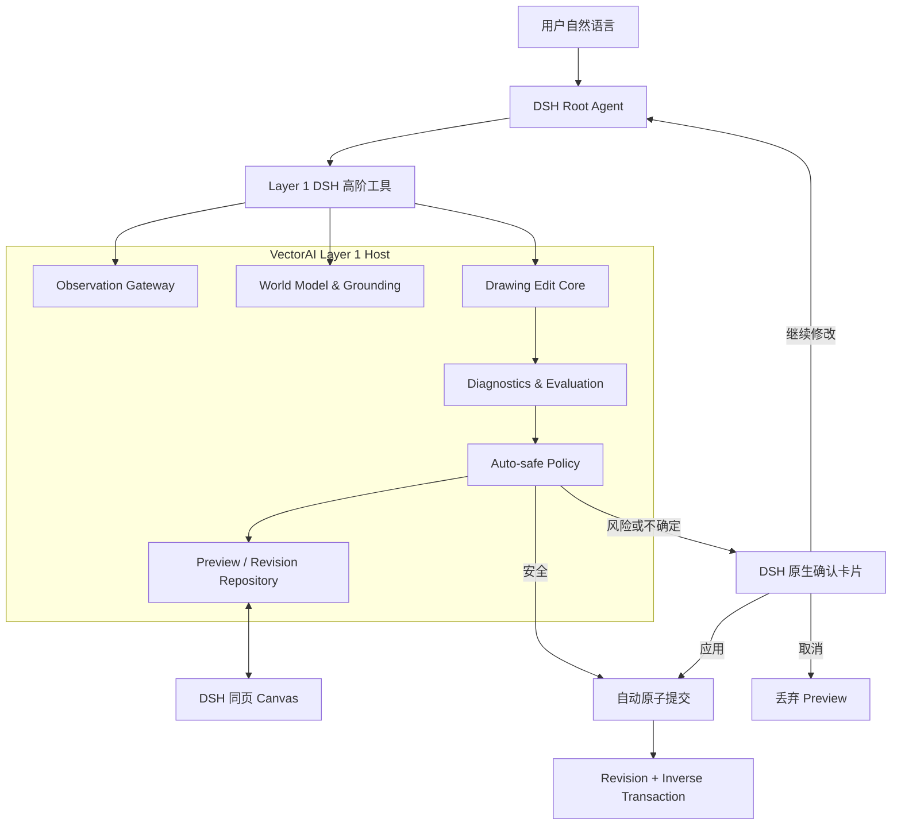

# DSH 原生语义改图与 Auto-safe 提交设计

> 状态：总方案已确认，书面规格待审阅
>
> 日期：2026-08-21
>
> 目标分支：`codex/dsh-plugin-migration`
>
> 默认提交策略：`auto-safe`
>
> 上位架构：`docs/dsh-plugin-migration.md`

## 1. 决策摘要

VectorAI 的核心语义改图链路采用 **DSH 原生 Agent 编排 + VectorAI 本地语义编辑内核 + Host 权威 Preview/Commit**：

- DSH 负责聊天、模型、Agent loop、工具调度、会话、取消和向用户提问。
- VectorAI 第一层插件负责图纸观察、二维 World Model、语义落图、空间程序编译、连通变形、确定性诊断、Preview、Revision、Undo 和本地持久化。
- VectorAI 不再运行自己的 Express、AI Gateway、模型 SDK、SSE Agent Runtime 或云端服务。
- 模型只表达目标、证据、空间意图和保护条件，不直接生成大批底层坐标或任意 `node.update` 批次。
- 默认使用 `auto-safe`：安全策略全部通过时自动提交一个可撤销 Revision；可由用户接受的风险或不确定性升级为 DSH 原生人工确认，硬边界失败则 blocked。
- 通用语义改图属于第一层 2D Space；第二层 Engineering Annotation 只能通过第一层公开契约创建和提交标注候选。
- VectorAI 网站继续复用同一个本地内核，只替换为 Web/PWA Adapter。

推荐方案取代两种不采用的方向：

1. 不整体搬迁旧 `ModelLedDrawingAgentRuntime`，因为它会在 DSH 内复制模型路由、Agent loop、会话和流式协议。
2. 不让 DSH 模型直接调用底层事务并手写全部坐标，因为这会重新引入坐标方向、拓扑范围和引用幻觉。

## 2. 目标与非目标

### 2.1 目标

- 在 DSH 中支持“把右手抬起来打招呼”这一类自然语言语义改图。
- 恢复旧 Web 生产链路中的观察、World Model、Grounding、空间程序、连通变形、Preview 诊断和视觉复核能力。
- 所有几何、拓扑、矢量化、诊断、渲染和文件操作在用户电脑上执行。
- 正式 Drawing 在任何 Preview、检查或模型失败时都保持不变。
- 一条用户指令可自动产生多个内部候选，但最多提交为一个原子 Revision。
- 自动提交必定可撤销，撤销仍保持 Revision 单调递增。
- DSH、网站和未来第三方宿主共享相同编辑内核、协议和回归测试。
- 第一层不包含“手臂”“打招呼”“工程尺寸”等对象或领域特判。

### 2.2 非目标

- 本阶段不承诺任意复杂连续轮廓都能完成自然骨骼变形。
- 本阶段不实现像素生成式修图或云端图像生成。
- 不把语义标签永久写死在 Canonical Drawing IR；Grounding 是绑定 Revision 的任务态证据。
- 不把 DSH 的安全 Approval 当作业务语义确认协议。
- 不在第一层实现工程识别、尺寸规则或自动标注策略。
- 不在迁移完成前删除仍作为回归基线的网站旧链路。

## 3. 当前事实与迁移边界

当前第一层已经具备：

- 图片本地矢量化和 Canonical Drawing 导入。
- `drawing_summarize`、revision-bound `drawing_query` 和有界 `world-slice`。
- Host 权威的 Preview、opaque handle、diff、Commit/Discard 和 expected-revision 校验。
- `conversation.workspace` 中与 DSH 原生聊天同页的共享画布。
- 网格、坐标轴、缩放、拖动、选择、属性和 Preview diff。

当前缺失的是：

- 模型可消费的 revision-bound 图形观察结果。
- 从视觉语义到精确 Node/SourceSpan/HalfEdge/Face/Interface 的落图。
- 高层 `SpatialEditProgram` 到 Host-neutral `DrawingTransactionCommand` 的编译，以及它到当前 workspace command 的适配。
- 基于 Preview 的诊断、before/after 观察和修订 lineage。
- Host 强制执行的 `auto-safe` / 人工升级 / Undo 状态机。

当前 Repository 尚没有 durable commit log、inverse transaction、Undo 或幂等 Commit。因此在 Phase 2 完成并通过故障注入测试前，产品不得真正启用语义 finalize；配置名可以存在，但判定必须返回 `AUTO_SAFE_UNAVAILABLE` 并进入 blocked，只允许 Preview、Replace 和 Discard，人工确认也不能覆盖。

旧 Web 生产链路中的语义理解由多模态模型结合观察图、Grounding 和 World Model 完成，不是关键词规则。旧代码中的成熟 connected transform 主要覆盖 circle/ellipse carrier 与开放 line connector；它是第一阶段的等价迁移基线，不等同于任意人物轮廓变形器。

## 4. 总体架构



依赖方向固定为；箭头表示“依赖”：

```text
@vectorai/drawing-edit-core ─┬→ @vectorai/drawing-edit-protocol
                             └→ @vectorai/drawing-spatial → @vectorai/drawing-core
@vectorai/drawing-edit-protocol → @vectorai/drawing-core
@vectorai/plugin-space-contracts → @vectorai/drawing-edit-protocol

plugin-dsh-space-host ──────┬→ @vectorai/drawing-edit-core
                            └→ @vectorai/plugin-space-contracts
plugin-dsh-space-client ─────→ @vectorai/plugin-space-contracts
adapter-web ────────────────┬→ @vectorai/drawing-edit-core
                            └→ @vectorai/plugin-space-contracts
plugin-engineering-annotation → @vectorai/plugin-space-contracts
```

`@vectorai/drawing-edit-protocol` 只保存 JSON-safe types、strict codecs、错误联合、版本，以及可独立重放的 Host-neutral `DrawingTransactionCommand` 判别联合，不含实现；它不能引用 workspace/DSH 命令类型。`plugin-space-contracts` 选择性重导出它。`drawing-edit-core` 不得依赖 DSH、React、Express、Node 文件系统或任何模型供应商 SDK。哈希、ID、时间、渲染和持久化通过端口注入。

## 5. 第一层组件

### 5.1 Observation Gateway

把 Canonical Drawing 或当前 Preview 渲染成模型和用户看到的同一坐标系观察结果：

- overview 或有界 region。
- 可选 Node ID、轮廓、端点、拓扑接口、当前选择和 Preview delta overlay。
- 明确的 `worldToImage` / `imageToWorld` 变换。
- 绑定 `drawingId + revision + viewport + contentDigest` 的 opaque observation handle。
- Host-neutral protocol 只返回 `ObservationArtifactRef`（opaque id、digest、MIME、basis）；DSH Adapter 再把它写入 AttachmentStore，并在 DSH 专属 tool presentation 中映射为携带 `ImageAttachmentRef` 的 image content block。DSH bearer 类型不进入 `drawing-edit-protocol`；Session 日志只保存 durable ref，不保存原始 base64 或 Host 路径。
- rc.8 的 AttachmentStore 本身不验证 Session owner，因此第一层另有 session-scoped ObservationStore，把 attachment ref 绑定到 `sessionId + EditBasis + contentDigest + rendererVersion`；任何读取先校验这条 ledger，不能把 attachment ref 当作 bearer authority。

Observation 是派生证据，不是第二份 Drawing，也不授予写权限。

### 5.2 World Model 与 Grounding

Grounding 采用任务驱动、按需展开：

1. DSH 模型从观察图理解“人物自己的右手”等语义。
2. 模型提交少量 observation point/bounds、角色、保护证据和可选 Node 引用。
3. 本地引擎把证据吸附到拓扑和几何原子。
4. 输出 revision-bound `GroundedTargetHandle`，包含精确 writable effect scope、interfaces、protected scope、bounds 和歧义状态。

区域相交本身不构成写权限。已有对象的最终写集合只能来自精确解析出的 Node、SourceSpan、HalfEdge、Face 或 Interface。Writable scope 细化到允许的 node fields、source ranges、half-edge/interface ids 和 endpoint slots；仅命中同一个 node id 不能授权重写该节点的其他路径区间或字段。生命周期操作使用单独的 exact scope：`CreationScope` 限定允许的 node kind、parent/container、world bounds、接口和最大数量；`DeletionScope` 限定明确 node ids 以及 Host 预计算并展示的 cascade closure。没有 lifecycle scope 的 create/delete 是 blocked，不会因为 Program 写了一个 opcode 就获得权限。

Canvas selection 只是 grounding hint。DSH Client 通过只读 Remote `projectSelection(expectedDrawingRef, boundedNodeIds)` 请求 Host 生成绑定 `sessionId + drawingId + revision + selectionDigest` 的 `SelectionProjectionRef`；Host 逐项验证节点存在、可见和属于当前 Drawing，stale/foreign/超限返回 rejected 而不是 ref。SelectionProjection 可以缩小 query/observation 范围，但永远不产生 writable/lifecycle scope，也不能替代模型证据或用户权限。

Grounding 状态为：

- `exact`：唯一目标且上下文完整。
- `ambiguous`：存在多个合理目标。
- `truncated`：查询预算不足以证明目标边界完整。
- `unresolved`：证据无法吸附到可编辑结构。

只有 `exact` 可进入 `auto-safe` 自动提交。

### 5.3 Drawing Edit Core

新增 `@vectorai/drawing-edit-protocol` 与 `@vectorai/drawing-edit-core`。前者冻结协议，后者从旧 Web/API 中提取并净化以下纯算法：

- observation/world/node anchor point resolver。
- geometry sampling、atomic graph 和拓扑索引适配。
- task-relevant World Model compiler。
- Grounding ledger 与 `TopologyPartResolver`。
- `SpatialEditProgram` parser/compiler。
- connected transform 和 interface reattachment。
- Preview delta 与确定性 diagnostics。

模型默认提交高层程序：

```ts
interface SpatialEditProgram {
  baseRef: DrawingRef;
  targetHandle: string;
  summary: string;
  objective: string;
  operations: SpatialOperation[];
  preserveScopes: EffectScopeRef[];
  postconditions: SpatialPostcondition[];
  evidenceRefs: string[];
}
```

Legacy `preserveNodeIds` 只在迁移 adapter 中映射为整节点 preserve scope；新协议直接支持 node field、SourceSpan、HalfEdge、Interface、endpoint slot、CreationScope 和 DeletionScope。

第一阶段操作保持通用且有限：

- `rigid_transform`：平移/旋转已解析的目标图元组。
- `connected_transform`：移动 carrier 并重定位已解析接口的连接端。
- `set_endpoint`：调整开放几何端点。
- `create_path`：创建 line/polyline。
- `delete_nodes`：删除明确节点。

生产协议不存在 `raise_right_hand`、`wave` 或其他对象/动作专用 opcode。模型把自然语言翻译成通用目标、空间操作、保护集合和后置条件。

第一阶段复用现有 circle/ellipse + line connected transform。后续在同一 strategy port 下增加 path-group rigid transform、更多 carrier/connector 类型和连续路径 articulation，不改变 DSH 工具或第二层契约。

### 5.4 Diagnostics 与 Evaluation

Preview 创建后执行两类检查：

1. **硬校验**：Schema、有限数值、引用完整、Drawing IR 有效、base revision、handle 和 digest。
2. **候选诊断**：非预期修改、保护对象变化、新断连、悬空端点、方向翻转、面积塌缩、异常拉伸、约束和标注引用影响。

`drawing_evaluate_preview` 创建绑定当前 Preview digest 的 review packet，并通过 DSH 的 one-shot subagent seam 启动独立 reviewer。Reviewer 使用专用 persona、固定 output schema、`maxDepth` 和 capability-checked provider，只接收完成判断所需的目标、before/after、诊断和候选摘要。

DSH rc.8 的公开 one-shot seam 没有 pre-publication setup hook，`toolFilter` 也不能证明 child-scoped contribution 已被移除；因此本设计不虚构一个事后可完成的“最终工具集断言”。Adapter 引入 `ReviewerProviderPort`：部署配置必须证明 reviewer 不继承 parent context，且发布后的有效能力只有结构化输出通道——普通模式只允许 `structured_output`；若使用 Code Mode，只允许 `run_code`，其 nested dispatch registry 仍只能到 `structured_output`。任何绘图读写、Finalize、Remote 或通用工具都不得出现。Provider 无法给出这项 attestation 时，reviewer 结果只能是 `unavailable`，候选不得进入 auto-safe；不能靠已经发布后才返回的 local Agent handle 补做安全检查。每次 review run 都在 `finally` 中执行 `run.dispose()`。

Evaluation record 包含：

- before/after 同视口观察图。
- affected nodes 与 topology/interface delta。
- 确定性诊断。
- 程序目标、保护集合和后置条件结果。
- reviewer 的 `satisfied | needs_revision | unavailable`、缺陷和理由。

Evaluate request 不接受模型再次提交自由 `objective`。TaskStore 以 `rootUserMessageDigest` 绑定 exact bounded user-instruction projection（root 文本规范化内容与附件 content digests）；这是 reviewer 的 authoritative objective。`SpatialEditProgram.objective` 只是模型的有界声明，Host 只做 schema/digest 绑定，不声称能用字符串规则判断它与自然语言语义等价。Review packet 必须同时包含 authoritative instruction 与 declared objective，reviewer 显式判断 alignment；mismatch 作为 sticky defect。这样模型不能通过 Evaluate 时“换题”，也不能让自由 objective 取代用户指令。

Reviewer 结果写入 session-scoped append-only ReviewLedger，并同时按 candidateDigest 与 candidateRiskKey 索引。`needs_revision` 或非空 defect 会以 defectId+scopeDigest 进入 task/risk lineage；后续 `satisfied`、改 summary、换 opaque handle 或仅生成新 candidateDigest 都不能覆盖。新候选必须在 durable normalized output 中以 `resolvedDefects[{defectId, scopeDigest, evidenceDigests, resolver}]` 逐项给出确定性 closure evaluator 或 reviewer 的解决证据，scope 不匹配或 evidence 为空不能清账；未解决项继续使其至少 confirmation_required。纯 `unavailable` 且没有 defect 时允许在固定 provider/version 下有界重试一次，更换 provider/version不得清空既有缺陷。

每个 candidate/provider 最多一个 admitted review run；并发 evaluate join 同一 run，已获得 terminal satisfied/needs_revision 时不重复抽样，只有上述 unavailable retry 例外。Finalize 在 session-state lock 下要求 ReviewLedger 没有该 candidate/risk lineage 的 in-flight run，并使用 ledger 聚合终态；review completion 也在同锁下追加结果并递增 epoch，因此延迟返回的 negative review 不能在 auto-safe Commit 之后落地。当前 Evaluation 是聚合视图，不是 last-write-wins record。

Reviewer 由 DSH 管理模型与 Session，VectorAI 不持有模型 SDK。DSH subagent provider、图片能力或结构化输出不可用时，evaluation 为 `unavailable`，不会伪造通过。Root Agent 读取 evaluation 后选择 revise 或 finalize；最终 finalize 必须在 root Agent 执行，因为 DSH 子 Agent 不能直接向用户提问。

### 5.5 Preview、Revision 与 Undo

正式 Drawing 是唯一权威状态。状态机为：

```text
Committed(N)
  -> Grounded(base=N)
  -> Preview(handle, digest, base=N)
  -> Evaluated(handle, evaluationId)
  -> Revised(new handle) | Discarded | Finalizing
  -> AutoCommitted(N+1) | ConfirmedCommit(N+1) | AwaitingHuman | Blocked | Discarded
  -> Reverted(N+2)
```

规则：

- 一个 Session 只有一个当前 Preview；新候选替换旧候选并记录 lineage。
- 一条用户任务可在内存中修订多个候选，但每个新候选都合成为一份可从 canonical base revision 独立重放的完整事务；Preview lineage 不是持久化 DAG。
- 已存在当前 Preview 时，任何 replace/revise 必须提交精确的 `replacesHandle + replacesDigest`；不匹配返回 `PREVIEW_NOT_CURRENT`。新候选完全编译并验证成功后才原子替换，失败时旧 Preview 保持当前。
- Commit 使用 compare-and-swap，revision、handle 或 digest 变化即失败。
- Finalize/Commit 使用 Host 生成的幂等键；相同键重试返回同一 receipt，不得重复增加 revision。
- 每次 Commit 同时持久化 forward transaction、inverse transaction、目标摘要和来源策略。
- Undo 不回退 revision 数字，而是把 inverse transaction 作为新事务提交。
- Session dispose 或进程退出可以丢弃未提交 Preview，不影响正式 Drawing。
- 空 diff 返回 `already_satisfied`，不得创建无意义 Revision。
- 空 diff 仍把 terminal no-effect receipt 写入 operation ledger；响应丢失后的相同 operation 重试返回同一 receipt，但 revision 不增长。
- `AwaitingHuman` 的“应用”进入 confirmed commit，“继续修改”回到 revise，“取消”记录回答并 Discard；取消不是持久 deny。重启丢失 Preview 后，旧问题答案不能恢复权限或提交，必须 fail closed。
- 成功的 interactive edit 或任何其他正式 Commit 都使旧 Preview、Evaluation 和 grant 失效；active Drawing replacement 不在本规格内。

所有会改变 current task/Preview/Evaluation/policy 或正式 Drawing 的操作共享一个 Host `sessionStateEpoch` 和固定锁序：session-state lock → per-drawing write lock → durable storage。新 task/handoff、preview create/replace/revise/discard、evaluation create/replace、handoff discard、`drawing_require_review`、`/drawing-policy review`、interactive commit 和 Undo/revert 都在 session-state lock 下 CAS 并递增 epoch；需要正式写入的操作再按顺序取得 drawing lock。Finalize 不在提问期间持锁；得到 auto-safe 资格或人工答案后重新取得上述锁，在 durable ledger-first 之后重读 task policy、epoch、current handle/digest/evaluation 与 revision，并持锁越过 commit point。若降级或新 task 已先完成线性化，旧 finalize 必须 stale/fail closed；若 finalize 已越过 commit point，后到的操作基于新 Revision 继续。这样既避免长时间锁住 UI，也不给 policy/task/Undo 切换留下 TOCTOU 或反向锁序窗口。

### 5.6 句柄链

跨工具只传递 session-scoped opaque handle 和有界摘要，不传完整候选 Drawing：

```ts
interface EditTaskRef {
  id: string;
  rootUserMessageId: string;
  rootUserMessageDigest: string;
  baseRef: DrawingRef;
  initialBasis: EditBasis;
  commitPolicy: 'auto-safe' | 'review';
  stateEpoch: number;
  candidateBudget: number;
}

type EditBasis =
  | { kind: 'canonical'; ref: DrawingRef }
  | {
      kind: 'preview';
      baseRef: DrawingRef;
      previewHandle: string;
      previewDigest: string;
    }
  | {
      kind: 'carried-candidate';
      handoffId: string;
      taskId: string;
      originTaskId: string;
      baseRef: DrawingRef;
      candidateDigest: string;
    };

interface ObservationArtifactRef {
  id: string;
  contentDigest: string;
  mimeType: 'image/png' | 'image/webp';
  basis: EditBasis;
}

interface SelectionProjectionRef {
  id: string;
  sessionId: string;
  drawingRef: DrawingRef;
  selectedNodeIds: string[];
  selectionDigest: string;
}

interface ObservationRef {
  id: string;
  taskId: string;
  basis: EditBasis;
  artifact: ObservationArtifactRef;
  contentDigest: string;
  viewport: Viewport;
  rendererVersion: string;
  overlaySchemaVersion: string;
}

interface ContextRef {
  id: string;
  taskId: string;
  observationId: string;
  basis: EditBasis;
  completeness: 'complete' | 'truncated';
  continuation?: string;
}

interface GroundingRef {
  id: string;
  taskId: string;
  contextId: string;
  basis: EditBasis;
  status: 'exact' | 'ambiguous' | 'truncated' | 'unresolved';
  scopeDigest: string;
  candidates: Array<{
    id: string;
    bounds: Bounds;
    summary: string;
    evidenceRefs: string[];
  }>;
  riskFlags: string[];
  writableScopeDigest: string;
  lifecycleScopeDigest: string;
  protectedScopeDigest: string;
}

interface PreviewRef {
  handle: string;
  taskId: string;
  digest: string;
  baseRef: DrawingRef;
  groundingId: string;
  stateEpoch: number;
  finalizeOperationId: string;
  finalizeOperationBindingDigest: string;
  parentHandle?: string;
}

interface EvaluationRef {
  id: string;
  taskId: string;
  previewHandle: string;
  previewDigest: string;
  stateEpoch: number;
  diagnosticDigest: string;
}
```

没有 active Drawing 时，`agent/pre-step` 不创建伪造 `baseRef` 的 EditTaskRef。它只在 DSH Adapter 内创建绑定 `sessionId + rootUserMessageId + source attachment digest`、并携带 Host-generated `genesisOperationId + genesisOperationBindingDigest` 的 `ImportIntentRef`。`drawing_import` 在写入前生成 DrawingRef 与第一个 EditTaskRef（canonical basis、固定 task id/policy/budget/epoch），把该 task 连同 genesis 与 operation receipt 原子持久化，成功后再发布到 TaskStore；发布前崩溃可从 receipt 重建同一个 task，不能重置 id 或候选预算。若同一 session 已进入更新的 root user task，旧 task 只作为 receipt 返回 `task-expired`，不得重新激活，新的 direct user message 按正常规则创建 task。导入失败时不产生 Drawing、Task 或 receipt；响应丢失时用 Host 返回的 genesis operation/binding 查询原 receipt，模型不自行计算 digest。

已有 active Drawing 时，`agent/pre-step` 根据最新 root user message id 和当前 DrawingRef 在 Host 创建一次 EditTaskRef；同一用户任务的所有工具必须沿用该 task id。候选次数和 commit policy 存在 Host TaskStore，模型不能通过重建 handle 重置预算。用户问题卡片中的“继续修改”仍属于同一 task。

新的直接用户消息创建新 task 时，Host 必须在一个 session 临界区内处理旧的 current Preview，不能让它继续占用旧 task lineage：若存在候选，Host 把其不可变 candidate snapshot 与未解决 ReviewLedger defect lineage 一起放入 session-scoped handoff store，生成不可 finalize 的 `carried-candidate` basis，随后使旧 Preview handle、Evaluation、问题和 grant 全部失效。新 task 可以基于该 basis observe → build context → ground → compile 出具有完整新 task lineage 的 Preview，但不能把旧 Grounding/Preview 伪装成新 task handle，也不能继承旧评估或权限；carried defect 仍需逐项解决证据，不能借新 task 清除。commit policy 取当前 Session policy 与旧 task policy 中更严格者。这样“再高一点”可以继续基于当前候选；无关的新指令则调用 `drawing_discard_handoff(taskId, handoffId, candidateDigest)`，经精确 CAS 后删除 handoff/相关 defect lineage并把 task `initialBasis` 切回 canonical。若没有候选，`initialBasis` 直接指向 canonical。该 handoff 不改变正式 Drawing，也不消耗候选预算；任何 finalize 都要求新 task 自己生成的 Preview 与 Evaluation。

每个下游 handle 都验证完整上游 lineage。新 Preview 会使旧 Evaluation 失效；Revision、active Drawing、renderer version 或 overlay schema version 变化会使相关 Observation → Context → Grounding → Preview → Evaluation 链失效。

`truncated` 必须先用 Context continuation 扩展工作集；`ambiguous` 返回有界候选，模型可以在下一次 `drawing_ground_targets` 中携带 candidate id 与 evidence delta 继续收敛。只有完整、精确的 editable scope 能编译 Preview；从歧义候选中选定的 scope 会带 `semantic-selection-unconfirmed` risk flag，必须人工确认，不能自动提交。

Candidate digest 使用 canonical serialization，但只覆盖 Preview 创建时已经不可变的 candidate semantics：baseRef、`semanticProgramProjection(program)`、canonical compiled commands、`semanticProjection(resultingDocument)`、actual effect、forward/inverse transaction，以及 Grounding 的 writable/lifecycle/protected scope content digests、risk flags 和声明。`semanticProgramProjection` 包含规范化 objective/operations/preserve/postconditions 与已验证 evidence content digests，但排除自由 summary/展示文案、targetHandle/evidenceRef 等 session-scoped opaque ids；`semanticProjection` 排除 `createdAt/updatedAt/committedAt` 等 metadata timestamps、Session/UI 状态和 revision bookkeeping。task policy、diagnostics、reviewer outcome、evaluator/policy version、grant 和随机 handle 也不进入 candidate digest，避免 Preview → Evaluate → Policy downgrade 形成循环或自失效。另行计算 assessment/evaluation digest，覆盖 `candidateDigest + task policy snapshot + sessionStateEpoch + evaluator/policy manifest versions + diagnostics/postconditions/reviewer aggregate`；grant digest 再绑定 assessment digest 与规范化人工答案。后者变化使 Evaluation/Grant 失效，但不会改写 immutable candidate identity。

Host 另计算不受文案/随机 handle/模型自由 objective 影响的 `candidateRiskKey = digest(baseRef, rootUserMessageDigest, resultingSemanticDigest, effectDigest, writable/lifecycle/protectedScopeDigests)`，用于跨候选继承 reviewer 风险。

### 5.7 Durable Commit Envelope

初始导入单独保存 genesis record，它只允许在没有 active Drawing 时创建 `DrawingRef`，不伪装成可逆 node transaction：

```ts
interface DrawingGenesisRecord {
  kind: 'genesis';
  genesisOperationId: string;
  genesisOperationBindingDigest: string;
  importIntentId: string;
  sessionId: string;
  drawingRef: DrawingRef;
  initialTask: EditTaskRef;
  sourceArtifactRef: string;
  sourceArtifactDigest: string;
  resultingSemanticDigest: string;
  snapshotIntegrityDigest: string;
  createdAt: number;
}

type GenesisTaskResult =
  | { status: 'active'; task: EditTaskRef }
  | {
      status: 'expired';
      expiredTaskId: string;
      rootUserMessageId: string;
      currentTaskId?: string;
    };

type DrawingImportResult =
  | {
      status: 'initialized';
      receipt: DrawingGenesisReceipt;
      drawingRef: DrawingRef;
      task: Extract<GenesisTaskResult, { status: 'active' }>;
    }
  | {
      status: 'replayed';
      receipt: DrawingGenesisReceipt;
      drawingRef: DrawingRef;
      task: GenesisTaskResult;
    };
```

Drawing 创建后的正式写入使用判别联合，不能给不同 mode 填 dummy 字段：

```ts
interface CommitRecordBase {
  commitId: string;
  operationId: string;
  committedAt: number;
  sessionId: string;
  drawingId: string;
  parentRef: DrawingRef;
  resultingRef: DrawingRef;
  resultingSemanticDigest: string;
  snapshotIntegrityDigest: string;
  forward: DrawingTransactionCommand[];
  inverse: DrawingTransactionCommand[];
  reasonCodes: string[];
  actor: string;
  source: string;
}

interface AutoSafeSemanticCommitRecord extends CommitRecordBase {
  mode: 'auto-safe';
  undoOperationId: string;
  undoOperationBindingDigest: string;
  candidateDigest: string;
  assessment: DurablePolicyAssessment;
  evaluation: DurableReviewEvidence;
}

interface ConfirmedSemanticCommitRecord extends CommitRecordBase {
  mode: 'confirmed';
  undoOperationId: string;
  undoOperationBindingDigest: string;
  candidateDigest: string;
  assessment: DurablePolicyAssessment;
  evaluation: DurableReviewEvidence;
  grant: DurableCandidateGrantReceipt;
}

interface InteractiveCommitRecord extends CommitRecordBase {
  mode: 'interactive';
  undoOperationId: string;
  undoOperationBindingDigest: string;
  effectDigest: string;
  authority: DurableInteractionAuthorityReceipt;
}

interface RevertCommitRecord extends CommitRecordBase {
  mode: 'revert';
  targetCommitId: string;
  effectDigest: string;
  authority: DurableUndoAuthorityReceipt;
}

type CommitRecord =
  | AutoSafeSemanticCommitRecord
  | ConfirmedSemanticCommitRecord
  | InteractiveCommitRecord
  | RevertCommitRecord;

interface DurableCandidateGrantReceipt {
  decisionId: string;
  questionDigest: string;
  answerDigest: string;
  sessionId: string;
  drawingId: string;
  baseRef: DrawingRef;
  previewHandle: string;
  candidateDigest: string;
  assessmentDigest: string;
  policyVersion: string;
  effectDigest: string;
  exactActions: string[];
  exactResourceIds: string[];
  effect: 'allow';
  scope: 'candidate';
  consumedByOperationId: string;
  consumedByOperationBindingDigest: string;
}

interface DurableEvaluatorReceipt {
  evaluatorId: string;
  evaluatorVersion: string;
  mandatory: boolean;
  outcome:
    | 'pass'
    | 'info'
    | 'candidate'
    | 'warning'
    | 'decision-required'
    | 'hard-error'
    | 'unavailable';
  evidenceDigest: string;
}

interface DurablePolicyAssessmentBase {
  schemaVersion: string;
  assessmentDigest: string;
  candidateDigest: string;
  lineageBindingDigest: string;
  sessionId: string;
  drawingId: string;
  baseRef: DrawingRef;
  taskId: string;
  rootUserMessageDigest: string;
  stateEpoch: number;
  previewHandle: string;
  evaluationDigest: string;
  policyVersion: string;
  evaluators: DurableEvaluatorReceipt[];
  effectDigest: string;
  writableScopeDigest: string;
  lifecycleScopeDigest: string;
  protectedScopeDigest: string;
  inverseDigest: string;
}

type DurablePolicyAssessment = DurablePolicyAssessmentBase &
  (
    | {
        disposition: 'blocked';
        hardDenyReasonCodes: string[];
        nonOverridableReasonCodes: string[];
      }
    | {
        disposition: 'confirmation-required';
        riskReasonCodes: string[];
        requiredExactActions: string[];
        requiredExactResourceIds: string[];
      }
    | {
        disposition: 'auto-safe';
        qualificationReasonCodes: string[];
      }
  );

interface DurableReviewEvidence {
  schemaVersion: string;
  evaluationDigest: string;
  candidateDigest: string;
  rootUserMessageDigest: string;
  authoritativeInstruction: {
    projectionVersion: string;
    normalizedBoundedText: string;
    attachmentContentDigests: string[];
  };
  declaredObjectiveDigest: string;
  beforeSemanticDigest: string;
  afterSemanticDigest: string;
  rendererVersion: string;
  diagnostics: Array<{
    code: string;
    severity: 'info' | 'candidate' | 'warning' | 'decision-required' | 'hard-error';
    evaluatorId: string;
    evidenceDigest: string;
  }>;
  postconditions: Array<{
    id: string;
    kind: 'safety' | 'goal' | 'quality';
    outcome: 'pass' | 'fail' | 'unavailable';
    evidenceDigest: string;
  }>;
  reviewer: {
    providerId: string;
    providerVersion: string;
    personaVersion: string;
    outputSchemaVersion: string;
    reviewPacketDigest: string;
    beforeArtifactContentDigest: string;
    afterArtifactContentDigest: string;
    renderManifest: {
      beforeBasis: { drawingRef: DrawingRef; semanticDigest: string };
      afterBasis: {
        baseRef: DrawingRef;
        candidateDigest: string;
        semanticDigest: string;
      };
      viewport: Viewport;
      worldToImage: [number, number, number, number, number, number, number, number, number];
      pixelSize: { width: number; height: number; deviceScale: number };
      overlays: string[];
      overlaySchemaVersion: string;
      rendererVersion: string;
      backgroundMode: 'transparent' | 'canvas';
    };
    viewportRenderManifestDigest: string;
    normalizedOutput: {
      outcome: 'satisfied' | 'needs-revision' | 'unavailable';
      reasonCodes: string[];
      defects: Array<{
        defectId: string;
        code: string;
        scopeDigest: string;
        boundedReason: string;
        evidenceDigests: string[];
      }>;
      resolvedDefects: Array<{
        defectId: string;
        scopeDigest: string;
        evidenceDigests: string[];
        resolver: 'deterministic-closure-evaluator' | 'reviewer';
      }>;
    };
    outputDigest: string;
  };
}

type DurableAuthorityOrigin =
  | { kind: 'dsh-command'; commandDigest: string }
  | {
      kind: 'dsh-question';
      decisionId: string;
      questionDigest: string;
      answerDigest: string;
    }
  | { kind: 'web-event'; eventIntentDigest: string };

interface DurableInteractionAuthorityBase {
  schemaVersion: string;
  authorityReceiptDigest: string;
  sessionId: string;
  drawingId: string;
  expectedCurrentRef: DrawingRef;
  effectDigest: string;
  operationId: string;
  operationBindingDigest: string;
}

type DurableInteractionAuthorityReceipt = DurableInteractionAuthorityBase &
  (
    | {
        origin: { kind: 'dsh-command'; commandDigest: string };
        intentId: string;
        intentDigest: string;
      }
    | {
        origin: { kind: 'web-event'; eventIntentDigest: string };
        webEditDigest: string;
      }
  );

interface DurableUndoAuthorityReceipt {
  schemaVersion: string;
  authorityReceiptDigest: string;
  origin: DurableAuthorityOrigin;
  sessionId: string;
  drawingId: string;
  targetCommitId: string;
  expectedCurrentRef: DrawingRef;
  inverseEffectDigest: string;
  operationId: string;
  operationBindingDigest: string;
}
```

上述均有 strict codec、unknown-field rejection、版本门禁与 schema-declared collection normalization：resource/evidence id 等集合型数组去重排序；forward/inverse commands、polyline vertices、spline points 等语义有序数组严格保序，绝不能为“canonical”而排序。三个 assessment 分臂字段互斥。`auto-safe` Commit 只能绑定 disposition=`auto-safe` 且无 grant；`confirmed` 只能绑定 disposition=`confirmation-required`，且 grant 的 action/resource/effect/assessment 精确覆盖 risk/requirement 分臂；带 hard deny/non-overridable reasons 的 blocked assessment 永远不能进入 CommitRecord。Interactive/Undo authority 分别精确绑定 intent effect 或 target/ref/inverse/op，durable receipt 只记录来源摘要，不保存可重放的 runtime token。

`SelectionProjectionRef.selectedNodeIds` 有固定上限，超限必须先由 Client/Host 生成有界 selection summary。`DurableReviewEvidence` 内嵌 canonical bounded authoritative instruction projection（规范化文本 + attachment content digests）及 root digest、candidate/before/after semantic digests、完整 renderManifest 及其 digest、renderer/evaluator/provider versions、规范化 diagnostics/postconditions 和 reviewer structured output；它不能只引用可能被清理的 DSH Session message。DSH `ImageAttachmentRef` 只用于当次模型/UI presentation，不能成为 durable 审计记录的唯一引用。重放必须用 manifest 的 basis/viewport/transform/pixel/overlay/options 重新渲染，并验证 before/after artifact content digest。

Genesis 也是正式写入，不能绕过幂等协议。`ImportIntentRef` 同时携带 Host 生成的 `genesisOperationId`、`genesisOperationBindingDigest` 与 source digest；`drawing_import` 必须先查 session-level operation ledger，再取得 session creation lock，并在锁内先重查 operation：同 operation + 同 binding/source 返回原 DrawingRef/Genesis receipt 及同一个 initial task（若 lineage 已过期则明确标记），同 operation + 不同 binding 返回 `IDEMPOTENCY_KEY_REUSED`，ledger absent 但已有 active Drawing 才返回 `IMPORT_REPLACEMENT_REQUIRED`。初始 snapshot、DrawingRef、initial EditTask seed、GenesisRecord 和 operation receipt 必须原子写入，因此并发导入、崩溃和成功后响应丢失不会产生第二张图、重置预算或留下不可查询的半初始化状态。

Canonical snapshot、revision、GenesisRecord/CommitRecord、operation receipt、assessment/evaluation evidence 和 grant consumption 必须在同一个原子持久化单位中成功，或由 WAL 恢复为完整旧状态/完整新状态，不能引用会随 Session/Preview 消失的临时记录，也不能出现“图已改变但没有 inverse/receipt”。第一版本可以把 snapshot、transaction log 和 operation ledger 放在同一个 envelope 中，按 write temp → fsync temp → atomic rename → fsync parent directory 的顺序落盘，并在启动时校验/恢复；只 fsync 临时文件而不持久化目录项不算满足 durability。后续改为 WAL 不能改变公开语义。

Commit 在写入前冻结 `committedAt`，重放时用该值确定性设置 persisted document 的 metadata updatedAt；Genesis 同理使用 createdAt。`resultingSemanticDigest` 只哈希上述 semanticProjection，`snapshotIntegrityDigest` 哈希包含冻结 metadata/revision 的 exact persisted snapshot。no-effect 不更新时间或 revision。重放验收分别比较 semantic digest 与 exact snapshot integrity digest，不能用一个含糊的“document digest”混用两种语义。

对该实现，commit point 定义为 envelope 的 atomic rename/manifest CAS：在它之前失败保证正式 Drawing 不变；rename 之后即使 parent-directory fsync、回执发送或取消失败，也不能再声称“未提交”。Host 必须停止复用相关 Preview/intent，重读并校验 envelope/operation ledger；能证明 terminal receipt 时返回它，暂时不能证明则返回 `COMMIT_OUTCOME_UNKNOWN` 并阻止该 Drawing 的后续写，直到 fsync 重试或启动恢复解析为完整 N/N+1。只有 parent directory fsync 成功才可向调用者确认 durable success。

所有正式写操作都使用 Host 生成的 operation id 与 canonical `operationBindingDigest`，binding 是 strict 判别联合：

```ts
type DurableOperationBinding =
  | { mode: 'genesis'; importIntentId: string; sourceArtifactDigest: string }
  | { mode: 'semantic'; candidateDigest: string }
  | {
      mode: 'interactive';
      intentDigest: string;
      expectedCurrentRef: DrawingRef;
      effectDigest: string;
    }
  | {
      mode: 'undo';
      targetCommitId: string;
      expectedCurrentRef: DrawingRef;
      inverseEffectDigest: string;
    };

interface DurableOperationReceiptBase {
  schemaVersion: string;
  operationId: string;
  operationBindingDigest: string;
  sessionId: string;
  completedAt: number;
}

interface DrawingGenesisReceipt extends DurableOperationReceiptBase {
  mode: 'genesis';
  status: 'committed';
  drawingRef: DrawingRef;
  resultingSemanticDigest: string;
  snapshotIntegrityDigest: string;
  initialTask: EditTaskRef;
}

interface SemanticOperationReceipt extends DurableOperationReceiptBase {
  mode: 'semantic';
  status: 'committed';
  commitMode: 'auto-safe' | 'confirmed';
  drawingId: string;
  commitId: string;
  parentRef: DrawingRef;
  resultingRef: DrawingRef;
  resultingSemanticDigest: string;
  snapshotIntegrityDigest: string;
  undoOperationId: string;
  undoOperationBindingDigest: string;
}

interface InteractiveOperationReceipt extends DurableOperationReceiptBase {
  mode: 'interactive';
  status: 'committed';
  drawingId: string;
  commitId: string;
  parentRef: DrawingRef;
  resultingRef: DrawingRef;
  resultingSemanticDigest: string;
  snapshotIntegrityDigest: string;
  undoOperationId: string;
  undoOperationBindingDigest: string;
}

interface UndoOperationReceipt extends DurableOperationReceiptBase {
  mode: 'undo';
  status: 'committed';
  drawingId: string;
  commitId: string;
  targetCommitId: string;
  parentRef: DrawingRef;
  resultingRef: DrawingRef;
  resultingSemanticDigest: string;
  snapshotIntegrityDigest: string;
}

interface NoEffectOperationReceipt extends DurableOperationReceiptBase {
  mode: 'semantic' | 'interactive';
  status: 'no-effect';
  drawingId: string;
  currentRef: DrawingRef;
  effectDigest: string;
}

type DurableOperationReceipt =
  | DrawingGenesisReceipt
  | SemanticOperationReceipt
  | InteractiveOperationReceipt
  | UndoOperationReceipt
  | NoEffectOperationReceipt;
```

`DurableOperationReceipt` 同样使用完整 strict codec；`pending/recovering/absent/digest-mismatch` 是 lookup view，不伪装成 durable terminal receipt。Genesis、semantic finalize、interactive 和 undo 都必须先做可选快速 lookup，再按各自固定锁序进入写锁，并在任何 Preview/intent/authority/revision 检查之前 ledger-first 重查：同 operation + 同 binding digest 返回原 terminal receipt，同 operation + 不同 binding digest 返回 `IDEMPOTENCY_KEY_REUSED`，absent 才继续。operation receipt 与正式写同 envelope 原子持久化；并发调用和成功后响应丢失对每个 mode 都遵循 exactly-once，不能只给 semantic/genesis 特例。

`finalizeOperationId` 在 Preview 创建时由 Host 生成并返回。Finalize 可以先做一次快速 ledger lookup，但按 session-state → per-drawing 顺序取得两把锁后，进入 drawing write lock 的第一步必须再次按 operation id 查询 durable ledger，并由 envelope 对 operation id 施加原子唯一约束；这两次查询都早于锁内 policy epoch、Preview、grant 和 current revision 检查：

- 同 operation id + 同 candidate digest 已提交或已判定 no-effect：返回原 Commit/no-effect receipt。
- 同 operation id + 不同 digest：返回 `IDEMPOTENCY_KEY_REUSED`。
- 没有记录：才进入当前 Preview 的评估和 Commit 临界区。

这样即使 Commit 已成功但工具响应丢失，重试也不会得到误导性的 `PREVIEW_NOT_FOUND` 或再次增加 Revision。Host 另提供只读 `drawing_get_operation`/Remote 查询入口处理 `COMMIT_OUTCOME_UNKNOWN`。

Operation lookup 的 `admitted` 只表示 CommandRuntime handler 已同步登记但底层尚未结束，`pending` 表示当前进程已持有 write lock；二者都不是 durable reservation。底层结束后通常返回 durable `committed`、`no-effect` 或 `absent`。commit point 后尚未完成 parent-dir fsync/恢复时必须返回独立 `recovering{quarantinedDrawing,retryHint}`，不能伪装 pending 或 absent；该 Drawing 在恢复完成前不开放任何新写。进程崩溃时，原子 envelope/WAL 恢复决定最终状态，不保留悬空 admitted/pending，并在恢复完成后把 recovering 收敛为 terminal receipt 或 absent-old-state。

Undo 必须显式绑定 `{ targetCommitId, expectedCurrentRef, undoOperationId }`：

- `undoOperationId + undoOperationBindingDigest` 由原 Commit receipt 生成并作为 opaque pair 返回，不由模型自报或计算。
- 必须有当前用户发起的 Undo authority；root Agent 身份或当前 prompt 本身不构成该证明。DSH 中 Undo 按钮提交固定 `/drawing-undo <targetCommitId> <undoOperationId> <undoOperationBindingDigest>`，CommandRuntime handler 验证 direct-user provenance 和 Host-issued opaque tokens 后铸造 authority，不调用 Commit Remote。模型可见的 `drawing_undo_commit` 每次都必须通过 root `userQuestions` 对精确 target/ref 再确认，并用 Host-minted decision/question/answer digest 严格校验固定单选 labels `{撤销, 取消}`，不接受 custom，之后才铸造一次性 authority；子 Agent、无 provider、取消或 malformed answer 全部 fail closed。
- 当前存在 Preview 时拒绝 Undo，必须先显式 Discard。
- `expectedCurrentRef` 必须等于目标 Commit 的 `resultingRef`；存在后续 Commit 时返回 `UNDO_CONFLICT`，不做隐式 selective undo。
- 目标 Commit 的 mode 必须是 `auto-safe | confirmed | interactive`；target 为 `revert` 时返回 `UNDO_TARGET_IS_REVERT`，绝不能把 RevertRecord 保存的 inverse 当作第二次 Undo 执行。
- inverse 要在当前 revision 上重新 apply 并通过硬校验，然后作为新的 `revert` Commit 写入；revert 自身也保存 inverse。
- 相同 undo operation 重试返回同一 revert receipt。首版 Redo 是明确非目标；未来必须另行设计独立 redo tool/authority/operation binding，不能通过再次调用 Undo 暗中实现。

## 6. DSH 工具面

### 6.1 模型可见工具

| 工具 | 作用 | 正式写入 |
|---|---|---|
| `drawing_import` | 仅在无 active Drawing 时初始化；已有图时返回 `IMPORT_REPLACEMENT_REQUIRED` 且不修改状态 | 初始化 |
| `drawing_summarize` | 获取 Drawing 概要和 revision | 否 |
| `drawing_query` | 有界查询 Node、neighbors、world-slice | 否 |
| `drawing_observe` | 创建 overview/region 观察图和坐标映射 | 否 |
| `drawing_build_context` | 从 Observation 与 seeds/bounds 构建有预算、可判定完整性的任务 World Model | 否 |
| `drawing_ground_targets` | 将语义证据解析为精确目标 handle | 否 |
| `drawing_preview_program` | 编译高层空间程序并创建 Preview | 否 |
| `drawing_evaluate_preview` | 返回 before/after 与诊断并创建 evaluation | 否 |
| `drawing_revise_preview` | 基于当前 Preview 创建新的完整候选 | 否 |
| `drawing_require_review` | 将当前 task 单向降级为 `review`，不能反向开启 auto-safe | 否 |
| `drawing_finalize_preview` | 执行 auto-safe；必要时询问用户；通过后提交 | 是 |
| `drawing_discard_preview` | 丢弃当前候选 | 否 |
| `drawing_discard_handoff` | 以 handoffId+digest CAS 丢弃新 task 继承的 carried candidate，并把 task basis 切回 canonical | 否 |
| `drawing_get_operation` | 按 Host operation id 查询 durable Commit 结果 | 否 |
| `drawing_undo_commit` | 显式撤销目标 Commit，以 inverse transaction 创建恢复 Revision | 是 |

### 6.2 内部端口

现有 `drawing_preview_transaction` 变为 Host 内部能力和受信任扩展端口，不作为普通 DSH 模型默认工具。现有 `drawing_commit_preview` 不再直接向模型暴露；模型只能通过 `drawing_finalize_preview` 进入正式写入。

高阶工具只适配 Host-neutral `SemanticEditPort`。裸命令编译和 Repository Commit 分别收敛为 `RawTransactionCompilerPort` 与 `RepositoryCommitPort`，二者不得从模型工具目录、第二层 contracts 或 Host 包公共根导出。

第二层插件可以调用公开的程序化 Preview service，但不能获得 finalize authority、内部 Repository 或裸 Commit 引用；它只把 Preview/Evaluation handle 返回 root Agent，由第一层 finalize。

所有正式写入口都必须收敛到同一个 Host durable commit/history/idempotency core，但不同宿主使用不同且不可互换的 authority：

- DSH semantic finalize 只接受注册的 `drawing_finalize_preview` 工具执行闭包创建的不可序列化 `RootFinalizeAuthority`，并同时验证 `exec.agent` 是精确 live root；wire 输入、模型参数和第二层插件都不能携带该 authority。
- DSH genesis import 同样只接受注册的 `drawing_import` 工具闭包创建的 `RootGenesisAuthority`、精确 live root 和匹配当前 root message 的 ImportIntent；子 Agent 或 Remote 不能初始化 Drawing。
- DSH Client Remote 不暴露 semantic finalize 或 Preview Commit，candidate grant 也不进入 wire contract。
- DSH 的 policy、Undo 和后续明确交互编辑可以由 Host direct-user command handler 铸造 `DshUserCommandAuthority`；Client 按钮只能向会话提交 `/drawing-*` 用户命令，不能通过 Remote 传 authority 或正式写数据。
- Web Adapter 在同一浏览器事件处理闭包中铸造独立的 Web user-interaction/automation authority，不能伪装 DSH root。
- 第二层只能请求第一层 root finalize，不能自行铸造 authority。

这里的 authority 是模块和 wire 边界，不是对恶意同进程插件的沙箱。DSH rc.8 的 `ToolExecutionInput.agent` 可由同进程调用者提供，公共 ToolRuntime 也会生成有效 `exec.token`，所以 `private brand + exec.token` 不能证明调用一定来自 Agent loop。本阶段明确把已安装的同进程 Cordis 插件视为 trusted computing base；`dsh-client-remote` 模块不得依赖或接收 ToolRuntime dispatch、Finalize service、RepositoryCommitPort 或 authority factory，并由依赖图与负向 contract test 固化。若未来要运行不受信任的同进程插件，必须先由 DSH 提供 loop-minted、调用者不能自报的 origin capability，不能把当前 authority 夸大为进程内安全隔离。

网站在 Canvas 中直接编辑属性属于单独的 `commitInteractiveEdit` 权限域：只接受 Web event-closure authority 和交互编辑白名单，存在语义 Preview 时拒绝提交，并且不能接受 Preview handle。DSH 第一版不通过 Remote 开放这个入口；DSH 交互编辑必须提交 direct-user command 并进入 Host handler。两者都复用相同 durable history/idempotency core 和写锁，成功后使所有旧 Preview/Evaluation/grant 失效。

DSH 同页 Canvas 的交互编辑采用“两步 intent”，避免恢复旧 Remote Commit：

1. 受信任 Client UI 的真实 gesture 通过只可暂存的 Remote `stageInteractiveEdit(expectedCurrentRef, InteractiveEditProgram)` 创建 session-scoped immutable `InteractiveEditIntentRef{intentId, intentDigest, operationId, operationBindingDigest, expectedCurrentRef, effectDigest, expiresAt}`。Program 是 strict 白名单（例如 schema 允许的属性修改/明确选择删除/有界 transform），Host 在暂存时编译 actual effect、forward/inverse 并硬校验；该 Remote 不改变 Canonical Drawing，也不返回 authority。
2. Client 随即向 Session 提交固定语法 `/drawing-apply-intent <intentId> <intentDigest> <operationId> <operationBindingDigest>`。CommandRuntime handler 验证 direct-user provenance，先按 operation/binding 做 ledger lookup，再在 session-state → drawing lock 内 ledger-first 重查；ledger absent 时才 CAS intent/session/ref/digest/expiry、确认不存在 semantic Preview、重新计算 effect/inverse/硬校验并写入 `InteractiveCommitRecord`。intent 单次消费与 Commit/receipt 原子记录；即使响应丢失或进程重启后 intent 已消费，命令重试仍可在读取 intent 前由 operation ledger 返回原 receipt。

Remote/模型不能直接提交 intent，命令字符串也不携带 edit payload 或 authority。Phase 0 gate 期间若 stage+command 两端没有同时注册并通过 capability probe，交互控件保持 read-only；不能回退到 legacy Remote Commit。

rc.8 CommandRuntime 会用 invocation signal 的 `withAbort` 提前结束对 handler Promise 的等待，所以 apply-intent/undo durable write 不能依赖 `command/done` 可靠表达 commit-point 后结果。Handler 在任何 await 前同步注册 process-local `admitted{operationId,bindingDigest}`，直到底层工作真正结束才清除/转 terminal；Client 从 intent/Commit receipt 保存原始 operation+binding tokens。命令一旦派发，任何 abort、transport error 或 `command/done:error` 都按 outcome unknown 处理，Client 用同 tokens 调 `drawing_get_operation`；若仍 admitted/pending/recovering 则继续对账，terminal 返回 receipt，absent 时只能用同一命令 tokens 安全重试，不能生成新 operation 或宣称未提交。该约束同时适用于 `/drawing-apply-intent` 与 `/drawing-undo`。

`drawing_import` 只有在没有 active Drawing 时可以创建 genesis record；已有图纸时 fail closed。跨 source/drawing identity 的替换涉及 workspace-level identity、来源和坐标系事务，不属于本语义编辑规格，必须另行设计，不能用 node command 或 semantic finalize 假装支持。`drawing_undo_commit` 要求 root/user-originated authority、精确目标和 durable core，不能由子 Agent 自动触发。

### 6.3 DSH 原生确认

`drawing_finalize_preview` 在 root Agent 工具调用中执行：

- 所有调用首先验证 `exec.agent` 是精确 live root，并在工具执行体内铸造不可序列化 `RootFinalizeAuthority`；子 Agent 即使候选满足 auto-safe 也只能得到 `ROOT_FINALIZE_REQUIRED`。
- auto-safe 通过时直接原子提交，不弹卡片。
- auto-safe 不通过时，工具调用 `ctx.userQuestions.ask({ agent: exec.agent, signal: exec.signal, ... })`；`agent` 不得省略。Canvas 保持显示候选，并提供“应用 / 继续修改 / 取消”。
- “应用”只能覆盖 auto-safe 风险项，不能覆盖硬校验错误或 stale revision。
- “继续修改”把用户补充意见作为工具结果返回 root Agent，并保留或替换当前 Preview。
- “取消”丢弃 Preview。
- 没有 UI provider、提问被取消或 Agent 已失效时 fail closed，正式 Drawing 不变。

Finalize 输入不提供 `force`、`approved`、`humanDecision` 或任何可由模型伪造的 policy 字段。DSH rc.8 的 `userQuestions.ask` 只返回 answers，不提供可直接信任的 request/answer ref，而且 option 没有 id、`selected` 回显 label。Host 因此在提问前自铸 `decisionId`，冻结当次 exact label→enum 映射和 `multiSelect:false`：候选预算尚有余量时为 `{应用: apply, 继续修改: revise, 取消: cancel}`；第三个候选已耗尽预算时只提供 `{应用: apply, 取消: cancel}`，并提示继续修改需发送新的聊天指令。prompt、labels/options、预算状态、candidate binding、actual effect 和展示摘要全部纳入 `questionDigest`。有 revise 选项时，返回值只接受：`selected` 恰为一个 exact label 且没有 custom；或 `selected=[]` 且有非空、有长度上限的 custom，后者规范化为 `revise(custom)`。预算耗尽时 custom/未知 label 一律 fail closed。answer id 必须精确等于 decision id；重复 answer、多选或 custom 与 selected 同时出现也全部拒绝。Host 对规范化答案计算 `answerDigest`。人工答案只在同一次 root finalize 调用内部消费；只有 confirmed Commit 才把 decision/question/answer digest 作为 grant receipt 与 Commit 原子持久化。

提问本身也必须线性化。PendingDecision 是判别联合：semantic 分臂绑定 `{finalizeOperationId, taskId, previewHandle, candidateDigest, assessmentDigest, stateEpoch}`；undo 分臂绑定 `{undoOperationId, undoOperationBindingDigest, targetCommitId, expectedCurrentRef, stateEpoch}`。Host 在 session-state lock 下为精确分臂创建 `{decisionId, binding, attempt}` 后才调用 UI，随后释放锁：同 purpose+operation+binding 的并发工具调用 join 同一个 in-flight promise，不得弹第二张卡；同 operation + 不同 binding 返回 `IDEMPOTENCY_KEY_REUSED`；同目标已有不同 decision 时返回 `DECISION_IN_FLIGHT`。答案返回后重新取得 session-state lock，以 decision id + 全部 binding 做一次 CAS；apply/cancel/revise（Undo 只有 apply/cancel）只有一个终态能胜出，其他调用返回同一终态。并发 direct `/drawing-undo` command 若 binding 精确匹配，可以在同锁下以 command authority CAS 为 apply 并取消卡片；迟到的 UI cancel 不能覆盖它。

`NO_PROVIDER`、ask abort/throw、Agent disposal 也必须在同锁下把 in-flight CAS 为 `transient-failed(reason)`，明确无 grant并让本批 joiner 获得同一失败；不能留下 rejected promise 或直接无序删除。只有对应 semantic/undo binding 与 epoch 仍完全相同时，后续显式工具调用才可把 transient-failed CAS 为至多一次的新 decision attempt；provider 仍不可用则终止为 unavailable，要求新用户指令。task/Preview/target invalidation 在同锁下把 decision 标成 invalidated 并取消 UI run；abort 与迟到 answer 竞态只认第一个终态，迟到答案不能铸 grant。进程崩溃会丢弃未提交 PendingDecision，不能恢复 grant 或提交；confirmed grant 仍只在 durable Commit 中落盘。

Session 默认 commit policy 存在 Host `CommitPolicyStore`；本方案初始值为 `auto-safe`。DSH 中只有注册的 `/drawing-policy auto-safe|review` CommandRuntime handler 能在验证 direct-user command provenance 后修改持久 Session 值，网站由 Web event-closure authority 修改；rc.8 的 slash command 不开启 Agent turn，因此不能假设 `agent/pre-step` 会看到它。每个 EditTaskRef 在创建时快照该值。命令切到 `review` 时在共享 session-state lock 下同时把 current task（若存在）原子地单向降级为 review并递增 epoch；命令切到 `auto-safe` 只影响后续新 task，绝不能升级 current task。模型的 `drawing_require_review` 走同一把锁和 epoch。自然语言“先给我看看”由 DSH Agent 解释后调用该工具，但这条自然语言识别属于 Agent best-effort；需要硬保证时使用 direct command/同页“仅预览”控件。Finalize 只读取 Host TaskStore 中的 task policy，不读取 live Session policy，也不相信 program 自报策略。

DSH security approval 只处理工具授权，不承担语义改图确认；这样不会因 DSH 的 `ask/never` 权限策略改变业务安全语义。

安全资格与写权限是两个独立判定：

- auto-safe qualification 判断候选能否静默自动提交。
- interaction authority 判断当前 Agent/用户是否有权修改锁定资源、改变约束含义或接受风险。

人工选择“应用”时，Host 把经过严格校验的规范化答案映射为一次性 candidate grant。Grant 只存在于 Host 内部，精确绑定 Host-minted decision id、question/answer digest、session、drawing、baseRef、preview handle、candidate digest、policy version，以及 Host 从 actual effect 推导的 effect digest、actions/resource ids；消费记录绑定 operation id，并与 Commit 原子持久化。Grant 不通过 Remote 或工具参数传播，revision 变化、候选替换或重复使用都会失效；显式 deny 始终优先于 allow。

### 6.4 Phase 0 冻结的 strict codecs

Phase 0 必须冻结完整 request/result 判别联合，而不只是 Ref 形状：

| 能力 | Request 必需字段 | Result 必需字段 |
|---|---|---|
| import（DSH Adapter codec） | `importIntentId, genesisOperationId, genesisOperationBindingDigest`；source/session 由 Host ledger 注入 | `initialized(receipt, drawingRef, activeTask)` \| `replayed(receipt, drawingRef, activeTask \| expiredTaskId/currentTaskId?)` \| `rejected` \| `outcome-unknown` |
| project selection（DSH Client Remote） | `expectedDrawingRef, boundedNodeIds` | `projected(SelectionProjectionRef) | stale | rejected`；零写权限 |
| observe | `taskId, basis, viewport, overlays, selectionProjectionId?` | protocol: `ObservationRef, ObservationArtifactRef, safe summary`；DSH Adapter 另附 `ImageAttachmentRef` presentation |
| build context | `observationId, seeds/bounds, budget, continuation?` | `ContextRef, bounded facts, completeness` |
| ground | `contextId, objective, roles, evidence, exclusions, previousGroundingId?, selectedCandidateId?, evidenceDelta?` | `GroundingRef, candidate summaries, next action` |
| preview | `groundingId, SpatialEditProgram, replacesHandle?, replacesDigest?` | `PreviewRef, diff, receipts` |
| evaluate | `previewHandle, previewDigest` | `EvaluationRef, diagnostics, postconditions, before/after refs, review evidence`；objective 由 Host 从 candidate/task 读取 |
| revise | `currentHandle, currentDigest, evaluationId, replacement/continuation program` | 新 `PreviewRef, diff, lineage` |
| require review | `taskId` | `task policy = review` |
| finalize | `previewHandle, previewDigest, finalizeOperationId, finalizeOperationBindingDigest, evaluationId` | `committed | already-satisfied | root-required | needs-revision | discarded | rejected | outcome-unknown` |
| discard | `previewHandle, previewDigest` | `discarded` |
| discard handoff | `taskId, handoffId, candidateDigest` | `discarded, canonicalBasis` |
| operation lookup | `operationId, operationBindingDigest` | `admitted | pending | recovering(quarantinedDrawing,retryHint) | committed(receipt) | no-effect(receipt) | absent | digest-mismatch` |
| undo | `targetCommitId, expectedCurrentRef, undoOperationId, undoOperationBindingDigest` | `reverted(receipt) | already-reverted(receipt) | rejected | outcome-unknown` |
| stage interactive（DSH Client Remote） | `expectedCurrentRef, InteractiveEditProgram` | `staged(InteractiveEditIntentRef) | stale | rejected | capability-unavailable`；零正式写入 |
| apply interactive（CommandRuntime） | exact `/drawing-apply-intent <intentId> <intentDigest> <operationId> <operationBindingDigest>` | `committed(receipt) | already-satisfied(no-effect receipt) | replayed(receipt) | stale | rejected | outcome-unknown` |
| apply undo（CommandRuntime） | exact `/drawing-undo <targetCommitId> <undoOperationId> <undoOperationBindingDigest>` | `reverted(receipt) | replayed(receipt) | rejected | outcome-unknown` |

所有 codec 使用 strict unknown-field rejection，但按权限/生命周期拆成六个 request family，不能强迫它们伪造同一 task：

- semantic chain（observe → context → ground → preview → evaluate → revise/finalize/discard，以及 carried-basis discard）必须携带同一个 task lineage；handoff discard 另以 handoffId+digest CAS。
- import 只绑定 ImportIntent、root message、session/source ledger 和 genesis operation，不存在预先 EditTask。
- operation lookup 绑定 Host execution scope 的 session、operation id 与 mode-discriminated operationBindingDigest；它不依赖可能已丢失的 Preview/TaskStore，ledger receipt 自带 mode/drawing/ref。
- undo 绑定 target commit、expected current ref、undo operation 与独立 user authority，不要求 semantic task。
- interactive stage/apply 绑定 session、intent、expected current ref、effect/operation binding 与 direct command authority，不要求 semantic task，也不能接受 Preview handle。
- selection projection 是独立只读 Client hint family，绑定 expected DrawingRef 和 Host session scope；它不携 task/authority，也不能产生 effect scope。

Session、actor、authority、policy assessment、human answer 和 grant 均由 Host execution scope 注入，不接受 wire 自报；Finalize schema 明确不存在 `force`、`approved`、`humanDecision`、raw commands 或 `autoSafe`。

`projectSelection`、InteractiveEditProgram/Intent 和 command token codec 都是 DSH Adapter/Client contracts，不进入 provider-neutral semantic protocol，也不向第二层插件重导出。Apply-intent parser 要求恰好四个 Host-issued opaque token，Undo parser 要求恰好三个；两者拒绝额外参数、未知字段和 operation/binding mismatch，interactive 另拒绝过期 intent。Client capability probe 只有在 stage Remote 与 CommandRuntime handler 的 codec/version 同时匹配时才启用对应控件。

## 7. Auto-safe 策略

### 7.1 判定结果与优先级

Host 对自己保存的不可变 Preview 和实际 before/after effect 重新计算判定，不接受模型传入 `autoSafe: true` 一类可信标志。结果只有三种：

- `blocked`：协议、状态或明确 deny 不允许提交，人工确认也不能覆盖。
- `confirmation_required`：候选结构合法，但需要用户授予权限或接受风险。
- `auto_safe`：无需询问即可提交。

优先级固定为：硬边界或明确 deny → interaction authority → auto-safe qualification。Permission grant 只解除“能不能做”的权限门；确认后的提交记为 `confirmed`，不会被重新标记为 `auto_safe`。反过来，`auto_safe` 也不能绕过权限要求。

### 7.2 不可人工覆盖的 Blocked 条件

出现任一条件即 `blocked`：

- Schema、有限数值、引用、precondition、base revision、current handle、candidate digest 或 evaluation lineage 无效。
- Grounding 为 `unresolved`，没有可信 editable scope。
- 实际 diff 超出 Grounding 保存的 node-field/source-range/half-edge/interface/endpoint writable scope，或 create/delete 超出精确 CreationScope/DeletionScope。
- 实际 effect 与 Grounding/Program 的 protected or preserve scope 相交，或任一受保护 scope 的 canonical semantic digest 改变。
- 出现未声明/越界的 create/delete、拓扑变化、约束变化或未包含在 DeletionScope 中的级联 effect。
- 结构/安全 postcondition 失败；目标质量类 postcondition 才可进入人工风险决定。
- 必需的硬 evaluator、durable history、inverse transaction、幂等 ledger 或原子持久化能力不可用。
- inverse transaction 无法生成、无法 dry-run 或不能恢复完整四个 plane。
- interaction policy 存在精确 deny。

Blocked Preview 可以留在 Canvas 供定位问题，但只能被 Replace/Discard，不能显示“仍然应用”。Phase 2 完成前，语义 finalize 因 durable prerequisites 缺失而处于 blocked，不得用人工确认绕过。

### 7.3 自动提交的必要条件

以下条件必须全部满足：

1. `baseRef` 仍是最新正式 Drawing。
2. Preview handle、digest 和 evaluation id 相互匹配且均为当前值。
3. Grounding 状态为 `exact`、上下文没有截断且 `riskFlags` 为空。
4. 实际 effect 是 Grounding 保存的 node-field/source-range/half-edge/interface/endpoint writable scope 的子集。
5. 所有 protected/preserve scopes 的 canonical semantic digest 未变化，actual effect 与这些 scope 无交集。
6. 没有 create/delete，也没有任何拓扑重构或约束含义变化；已声明且 exact-scoped 的这类变更仍只能 confirmation_required，未声明/越界则 blocked。
7. 对实际 before/after effect 而非仅对命令列表执行硬校验；候选诊断中没有 warning/error 或未知 code。
8. 所有 mandatory safety postconditions 均已计算且通过；任一缺失/不可计算属于 blocked。Goal/quality postcondition 缺失或未通过属于 confirmation_required。
9. DSH 独立 reviewer 对绑定同一 digest 的 before/after 返回 `satisfied`，没有未解决 defect。
10. inverse transaction 已生成且通过 dry-run。
11. policy 与 evaluator 版本均为 Host 已注册版本，assessment 绑定 session、drawing、base revision、sessionStateEpoch、handle、digest 和这些版本。

这里的“安全”表示修改有界、结构有效、证据一致且可撤销，不表示模型的视觉语义判断绝对正确。

Diagnostics 按已注册 manifest 解释：只有已知 `info` 保留自动资格；`candidate`、`warning`、未知 code 或非硬性 evaluator unavailable 进入人工确认；`decision_required` 进入 interaction authority；hard error 进入 blocked。空 diagnostics 不能代替缺失的 mandatory evaluator。

`source-quality` 是 mandatory evaluator；它的 strict result 只允许：

```ts
type SourceQualityEvaluation =
  | { outcome: 'confirmed'; evidenceDigest: string }
  | {
      outcome: 'candidate';
      reasonCodes: Array<'drawing-provisional' | 'affected-node-candidate'>;
      evidenceDigest: string;
    }
  | {
      outcome: 'invalid';
      reasonCodes: Array<
        | 'required-association-ambiguous'
        | 'required-association-conflict'
        | 'grounding-evidence-missing'
        | 'grounding-unresolved-or-truncated'
      >;
      evidenceDigest: string;
    };
```

映射来自现有 canonical facts，而不虚构枚举：`Drawing.provisional=true` 或 actual-effect 节点的 `NodeQuality.status='candidate'` → candidate/confirmation_required；非 provisional 且受影响节点均为 `confirmed`、所需 association 为 `resolved`、Grounding evidence 完整 → confirmed；canonical `associationStatus='ambiguous' | 'conflict'`、证据缺失或 Grounding unresolved/truncated → invalid/blocked。evaluator 缺失、未知状态或模型自报置信度都不能代替该结果。

### 7.4 自动升级为人工确认

出现任一情况即升级：

- Grounding 已收敛为完整 scope，但带 `semantic-selection-unconfirmed` 等可由用户检查的语义 risk flag。
- Program 明确声明且 actual effect 被 exact CreationScope/DeletionScope 完整包含的创建、删除、拆分、合并、replace/redraw 或约束放宽；未声明或越界仍是 blocked。
- 修改触及已明确列出、可通过 exact grant 授权的额外资源；声明为 preserve 的资源变化仍属于 blocked。
- 出现 `candidate`、`warning`、未知诊断或非硬性 evaluator unavailable。
- 目标质量类 postcondition 未完全满足，但结构/安全 postcondition 全部通过。
- semantic review 为 `needs_revision`、`unavailable` 或仍有 defect。
- 当前 EditTask 快照或单向降级后的 policy 为 `review`；自然语言“先预览”只有在 Agent 已调用 `drawing_require_review` 后才成为 Host-enforced 条件。
- 独立 reviewer 不可用，但所有硬 evaluator、事务、权限和可撤销能力正常；此时由用户直接检查 Canvas Preview。

硬校验失败不会弹“仍然应用”，而是拒绝候选并返回可恢复错误。

### 7.5 自动修订预算

一次用户任务最多允许三个语义候选：

- 预算绑定 Host EditTaskRef 和 root user message id，不随 Preview/Grounding handle 重建而重置。
- 前两个失败可由 Agent 根据诊断自动修订。
- 第三个候选若为 `confirmation_required`，保留 Preview 并只提供“应用 / 取消”；若为 `blocked`，只能丢弃或保留错误 overlay 等待新指令，不能在当前 task 再修订或弹“仍然应用”。
- 预算耗尽后任何 preview/revise 编译尝试返回 `CANDIDATE_BUDGET_EXHAUSTED` 且不创建第 4 个候选；需要新的直接用户指令创建新 task，旧候选再按 carried-candidate handoff 规则处理。

### 7.6 用户可见行为

- 安全提交：Canvas 更新正式 Revision，聊天显示简短 receipt 和“撤销”。
- 风险升级：Canvas 保持 Preview diff，聊天显示 DSH 原生确认卡片和具体原因。
- Blocked：Canvas 可以保留不可提交候选与硬错误 overlay，Agent 只能修订或丢弃，不展示“应用”。
- Undo：生成新的恢复 Revision，保留完整审计历史。
- 用户可以按单次任务或 Session 在 `auto-safe` 与 `review` 间切换；首版默认 `auto-safe`。

## 8. “把右手抬起来打招呼”参考流

```text
用户指令
→ DSH Agent 调 drawing_observe(overview, topology overlay)
→ drawing_build_context 构建有界且完整性可判定的任务 World Model
→ 模型按人物自身左右提交右手 observation anchors
→ drawing_ground_targets 返回 hand carrier、arm connector、shoulder interface 与保护集合
→ 模型提交 connected_transform + preserve torso/opposite arm + interface postconditions
→ drawing_preview_program 在本地生成完整候选
→ diagnostics 检查连通、形变、范围和保护对象
→ drawing_evaluate_preview 让 DSH one-shot reviewer 检查 before/after
→ root Agent 读取绑定候选的 review evidence
→ drawing_finalize_preview
   ├─ 全部通过：auto-safe 提交 Revision N+1
   └─ 目标/结构存在风险：Canvas 显示候选并请求用户决定
```

Golden 验收至少证明：

- “人物右手”与观察者画面左右的关系解析正确。
- 目标手部按指令向上移动。
- 手臂/肩部接口保持连通。
- 躯干和另一只手保持不变。
- 正式 Drawing 在 finalize 前不变。
- 安全候选不弹确认并可 Undo。

该样例只作为回归数据，生产代码、工具描述和策略不得包含手臂或打招呼特判。

## 9. 错误与恢复

错误使用稳定 code，至少包含：

- `DRAWING_REQUIRED`
- `DRAWING_STALE`
- `OBSERVATION_EXPIRED`
- `OBSERVATION_REVISION_MISMATCH`
- `GROUNDING_AMBIGUOUS`
- `GROUNDING_TRUNCATED`
- `GROUNDING_UNRESOLVED`
- `SPATIAL_PROGRAM_INVALID`
- `SPATIAL_REFERENCE_UNRESOLVED`
- `SPATIAL_PROGRAM_PRESERVE_CONFLICT`
- `PREVIEW_STALE`
- `PREVIEW_EXISTS`
- `PREVIEW_NOT_CURRENT`
- `PREVIEW_DIGEST_MISMATCH`
- `EVALUATION_STALE`
- `REVIEWER_UNAVAILABLE`
- `AUTO_SAFE_ESCALATED`
- `AUTO_SAFE_UNAVAILABLE`
- `CANDIDATE_BUDGET_EXHAUSTED`
- `HUMAN_REVIEW_UNAVAILABLE`
- `UNDO_CONFLICT`
- `UNDO_TARGET_IS_REVERT`
- `ROOT_FINALIZE_REQUIRED`
- `IDEMPOTENCY_KEY_REUSED`
- `COMMIT_OUTCOME_UNKNOWN`
- `IMPORT_REPLACEMENT_REQUIRED`

恢复原则：

- 解析、编译和硬校验失败不创建部分 Preview。
- stale ref 要求重新 query/observe/compile，绝不把旧程序套到新 revision。
- 诊断或语义复核失败保留正式 Drawing；Agent 可以修订 Preview 或从 canonical 重做。
- 工具和 Remote 操作响应 DSH cancellation signal。进入 durable commit point 前观察到取消，保证零提交；进入 commit point 后不能声称取消成功，若结果无法返回则报告 `COMMIT_OUTCOME_UNKNOWN` 并按 operation id 查询。
- 本地进程崩溃后恢复最后正式 Revision；未提交 Preview 可以安全丢弃。
- Commit 进入临界区后重新计算权限与 auto-safe assessment，防止检查到写入之间的状态变化；随后只允许完整原子 Commit 或完整旧状态。
- commit point 前的持久化失败保持正式 Drawing 不变并保留当前 Preview 供重试；commit point 后的 fsync/回执失败属于 outcome unknown，先按 operation binding 查询/恢复，不能保留并盲目重用 Preview，也不能声称零提交。

## 10. DSH、网站与第二层边界

### 10.1 DSH Adapter

- Host 使用 Cordis 生命周期注册工具、服务和 session cleanup。
- `agent/pre-step` 只注入当前 DrawingRef、Host 已验证且 revision-bound 的 SelectionProjection 摘要和可用高阶工具提示，不复制旧系统 Prompt，也不直接信任 Client 传来的 selection ids。附件 intake 不能只检查 `source.kind === 'user'`，因为 rc.8 one-shot 子 Agent prompt 也使用该 kind；它必须同时匹配当前 task/import intent 的 rootUserMessageId，并由运行时证明消息属于精确 live root 或 unowned external input，而不是任何 child/subagent run。tool result、plugin injection、subagent report 和 observation/reviewer 图片一律忽略，防止生成的 before/after 被误当成新图纸导入。
- Observation 通过 tool content block 进入模型上下文；Canvas slot 本身不会自动被模型看到。
- Client 继续使用 `conversation.workspace`，显示正式快照、Preview delta、Grounding overlay、诊断和 Undo 状态。
- VectorAI 插件不启动 HTTP server。
- 来源图片只通过带 digest 的 opaque attachment/artifact ref 读取，并由 session-scoped intake/source ledger 校验当前 session/project 绑定；Prompt、Session event、工具结果和审计不得保存完整 base64、Host 绝对路径或来源正文。

### 10.2 Web/PWA Adapter

网站使用相同 `drawing-edit-core` 和 `plugin-space-contracts`：

- Web Adapter 提供文件选择、OPFS/IndexedDB、Worker/OffscreenCanvas 和模型宿主端口。
- 网站不调用 VectorAI Express；若网站接入其他 Agent，只需实现同一高阶工具/应用服务契约。
- DSH 与网站不能各自实现另一套 Grounding、Spatial Program 或 auto-safe policy。

### 10.3 Engineering Annotation

第二层插件：

- 只依赖公开 Drawing query、observation、Preview、evaluation 和 `requestFinalize` 通知契约；正式 finalize 仍由第一层 root 工具执行。
- 可以生成确定性的 annotation program，但不能深层导入 Repository 或裸 Commit。
- 标注的自动提交也经过 auto-safe；创建/删除标注默认触发人工确认，后续可为纯派生标注增加单独受测策略。
- 第二层卸载后，已提交标注仍由 Canonical Drawing 和第一层 Viewer 正常显示。

## 11. 迁移阶段

### Phase 0：契约冻结与回归基线

- 新建 `@vectorai/drawing-edit-protocol`，冻结 `DrawingRef`、Observation、Context、Grounding、SpatialEditProgram、Preview/Evaluation、operation、finalize 和 undo 的完整 strict codec。
- 把旧 Web 的真实生产 E2E 与 fixture/benchmark 明确分离。
- 建立依赖门禁，禁止新内核导入 Express、DSH、React、Node fs 和模型 SDK。
- 从模型工具、Client Remote、第二层 contracts 和 Host 公共根移除裸 Commit/Repository/Storage 导出。
- 增加原子 write-path capability gate：Phase 2/3 的 durable finalize 与 command-based interactive edit 未同时 ready 前，旧 Remote/模型 Commit 全部注销，Client 编辑控件进入明确 read-only/Preview-only 状态；cutover 在一次插件注册事务中“移除旧写入口 + 注册新写入口”，不能让 legacy Remote commit 与新 finalize 并存，也不能出现 UI 仍可点击但后台走旧写路径。

### Phase 1：提取纯语义编辑内核

- 新建 `@vectorai/drawing-edit-core`，只依赖 protocol/spatial/core 与注入端口。
- 迁入 point resolver、World Model、Grounding ledger、TopologyPartResolver、Spatial Program compiler、connected transform 和 diagnostics。
- 在 protocol 冻结 canonical `DrawingTransactionCommand` codec；workspace adapter 把它映射为当前内部 command，不能把 `DrawingWorkspaceCommand` 泄漏回公共协议。
- 使用注入的 ID/digest/time port 去除宿主耦合。

### Phase 2：扩展 Host Preview 状态

- 增加 Preview lineage、evaluation record、forward/inverse transaction 和 Undo。
- 增加 commit idempotency key、candidate-scoped grant 和冲突安全的事务日志。
- 增加 before/after 本地渲染端口。
- 实现 auto-safe policy 与稳定错误码。

### Phase 3：接入 DSH 高阶工具

- 实现 observe、build context、ground、preview program、evaluate、revise、finalize 和 undo。
- 实现 EditTaskStore、三候选预算和 session/task commit policy；模型只能把 task 降级为 review。
- 隐藏模型可见的裸 transaction/commit 工具。
- 使用 DSH one-shot subagent + structured output 实现独立 reviewer。
- 使用 root Agent `userQuestions` 实现风险升级；验证 reviewer/question provider 缺失、取消和无 provider 时 fail closed。

### Phase 4：同页交互完善

- Canvas 显示目标、接口、保护集合、motion 和 Preview delta。
- 实现 read-only `projectSelection` Remote，把现有 workspace 本地 selection 变成 Host 验证、revision-bound 的 SelectionProjectionRef。
- 实现 stageInteractiveEdit + `/drawing-apply-intent` 两步协议；在 capability probe 通过前属性/删除/变形控件保持 read-only，禁止回退 legacy Remote Commit。
- 安全提交显示 receipt/Undo；风险候选显示诊断和确认状态。
- 保持现有网站一致的视口、选择和属性行为。

### Phase 5：旧 Web 能力等价验收

- 通过“抬右手”真实 DSH 端到端回归。
- 证明安全候选自动提交、歧义候选人工升级、Undo 可恢复。
- 证明 VectorAI 没有启动 Express 或自有云端服务。
- 等价验收通过后，网站旧 Agent Runtime 只保留兼容期，随后由 Web Adapter 替代。

### Phase 6：通用变形扩展

- 在 strategy port 下增加 path-group、更多 carrier/connector 和连续路径 articulation。
- 使用新的公开回归图纸扩展能力，不向生产代码加入对象特判。
- 第一层核心稳定后再实现第二层 Engineering Annotation 插件。

## 12. 测试与门禁

### 12.1 纯算法

- Point resolver 的 observation/world/Y 轴转换。
- Grounding 吸附、拓扑边界、保护集合和截断检测。
- Spatial Program parser/compiler 与 preserve conflict。
- Connected transform 的接口共点、最小形变、翻转和塌缩诊断。
- Forward/inverse transaction 属性测试。

### 12.2 Repository 与策略

- Preview → Evaluate → AutoCommit 唯一路径。
- 幂等 finalize 重试只产生一个 Revision 和一份 receipt。
- no-effect finalize 写入可查询的 terminal receipt 但不增加 Revision；响应丢失重试仍返回同一 already-satisfied 结果。
- 两个相同 operation/digest 的并发 finalize 在 write lock 内 ledger-first，最终返回同一 Commit receipt。
- 并发 confirmation 对同 operation+binding 只创建一张卡并 join 同一 PendingDecision；apply/cancel/revise 终态 CAS 只能一个胜出，不同 binding/decision 不能复用。
- PendingDecision 覆盖 provider missing→mount→单次 retry、ask abort/throw/agent dispose 与迟到答案竞态；transient failure 不留 rejected promise/grant，binding/epoch 变化后不可重试。
- semantic 与 Undo question 都 single-flight；两个相反答案或 direct undo command 与迟到 cancel 并发时只认同一 decision CAS 的第一个有效终态。
- genesis/semantic/interactive/undo 四种 mode 做统一表驱动 exactly-once：same op+same binding 返回同一 terminal receipt，same op+different binding 拒绝，commit 后响应丢失可在临时 handle/intent 已消失时 lookup。
- 四种 write result strict union 覆盖各自 terminal/replay/rejected/outcome-unknown；semantic/interactive 另覆盖 no-effect，未知或不适用分臂必须 codec 拒绝。
- 两个相同 genesis operation/source digest 的并发 import 只创建一个 Drawing；响应丢失后先查 ledger 并返回原 Genesis receipt，不会误报 replacement。
- genesis replay 在原 lineage 仍当前时恢复同一 task id/budget；已有更新 root task 时只返回 expiredTaskId，semantic codec 拒绝把 expired task 当 activeTask 使用。
- stale revision/handle/digest/evaluation 全部 fail closed。
- 当前 Preview replacement 使用 handle+digest CAS；replacement 失败保留旧 Preview。
- auto-safe 判定矩阵逐条覆盖。
- `blocked | confirmation_required | auto_safe` 的优先级、deny 优先和“grant 不升级 auto-safe”逐条覆盖。
- source-quality evaluator 覆盖 Drawing provisional、NodeQuality confirmed/candidate、association resolved/ambiguous/conflict、Grounding evidence missing/unresolved/truncated 和 unknown；缺失 evaluator 绝不以空 diagnostics 获得 auto-safe。
- reviewer defect 按 candidateRiskKey+defect scope 跨候选 sticky；重复 evaluate、后续 satisfied、仅换 summary/opaque handles 或无解决证据的新 candidateDigest 都不能 review-shopping 回 auto-safe。纯 unavailable 只允许固定 provider/version 的一次有界重试。
- Review packet/risk key 始终绑定 Host rootUserMessageDigest；改变模型 declared objective 不会换掉 authoritative instruction、清除 defect 或绕过 alignment review。
- resolved defect 必须逐项绑定 defectId+scopeDigest+非空 evidenceDigests+resolver；仅回显 id、跨 scope 证据或空 evidence 不能清除 sticky risk。
- 同 candidate/provider 的并发 evaluate single-flight；Finalize 遇到 admitted in-flight review 必须等待/拒绝，延迟 negative 不能晚于 auto-safe Commit 落地。
- writable scope 覆盖 node field、SourceSpan、HalfEdge、Interface 和 endpoint slot；lifecycle scope 覆盖 node kind/container/bounds/count 与删除 cascade closure；任一越界字段、区间、创建或删除必须 blocked。
- Client selection 只有经过 Host revision-bound projection 才能作为 grounding hint；stale/foreign ids 被丢弃，selection 本身永不授予 writable/lifecycle scope。
- `projectSelection` 覆盖 fresh/stale/foreign/超限与 revision 竞态；没有 ProjectionRef 时 observe 不得回退为直接信任 raw Client ids。
- protected/preserve scope 使用同样粒度，任一交集或 canonical semantic change 必须 blocked。
- Program 明确声明的 create/delete、完整 scope 上的 selected-semantic risk、warning 和非硬 reviewer unavailable 升级人工确认；未声明 effect、unresolved/truncated scope 和硬 evaluator 缺失保持 blocked。
- 相同幂等键搭配不同 digest 必须拒绝；写入后响应丢失能查询已提交结果。
- Preview/ImportIntent/InteractiveIntent/Commit receipt 都返回 Host-minted operationBindingDigest；`COMMIT_OUTCOME_UNKNOWN` 后调用者无需自行哈希即可 lookup。
- Undo 生成新 Revision，重复 Undo 和并发 Commit 不破坏正式 Drawing。
- 崩溃和取消不产生部分提交。
- 从初始快照按冻结 createdAt/committedAt 重放 transaction log，分别得到相同 resultingSemanticDigest 与 exact snapshotIntegrityDigest。
- durable review renderManifest 可从 before/after basis 复现 viewport/transform/尺寸/overlay/options，并得到相同 artifact content digests。
- DSH Session message/附件引用清理后，Commit envelope 内的 bounded authoritative instruction projection、content digests 和 reviewer evidence 仍可独立审计。
- 每个持久化故障点重启后只能看到完整 N 或完整 N+1；分别覆盖 commit point 前后取消。
- 故障注入单独覆盖 rename 前、rename 后/parent-dir fsync 前与 dir-fsync 失败：rename 后只能返回 terminal receipt 或 `COMMIT_OUTCOME_UNKNOWN`，绝不能误报 unchanged。
- live dir-fsync failure 后连续 operation lookup 返回 recovering/quarantine 直到收敛为 terminal/old-state；恢复完成前同 Drawing 的任何新写都被拒绝。
- Undo 覆盖同 operation 重试、不同 operation 重复撤销、active Preview、后续并发 Commit 和 stale target。
- Undo 与 preview create/replace 并发时也遵守 session-state → drawing 锁序；Preview 先线性化则 Undo 拒绝，Undo 先提交则 Preview 只能基于新 Revision。
- Undo target 为 revert mode 必须返回 `UNDO_TARGET_IS_REVERT`；首版没有任何通过重复 Undo 实现的隐式 Redo 路径。
- 模型仅凭 root 身份不能静默 Undo；只有 direct CommandRuntime authority 或绑定精确 target/ref 的已验证 root question answer 可以提交 revert。
- 任一 candidate-semantic 字段变化都会改变 candidate digest；交换非交换 command/vertex 顺序也必须改变。summary、opaque refs、task policy/reviewer/evaluator/grant 不改变 candidate identity（后几项只改变 assessment/grant），timestamp/UI 字段不改变 semantic digest但会影响 exact snapshot integrity。
- EditTask candidate budget 不能通过重建 Preview/Grounding handle 重置；task review 降级不能被模型重新开启 auto-safe。
- 第三个候选后任何同 task preview/revise 都返回 `CANDIDATE_BUDGET_EXHAUSTED`；第三候选 confirmation 无 revise/custom，blocked 也不产生第 4 候选。
- `/drawing-policy review` 立即单向降级 current task；`/drawing-policy auto-safe` 不改变既有 task，`review` task 不能被 live Session 反向升级。
- 并发测试覆盖 policy downgrade/new task/preview replacement 与 finalize 的固定锁序：前者先完成线性化时旧 finalize 必须 stale/fail closed；finalize 先越过 commit point 时后续操作只能基于新 Revision。
- 新 direct-user task 只能获得不可 finalize 的 carried-candidate basis；旧 Preview/Grounding/Evaluation/问题/grant 全失效，新 task 必须重建完整 lineage 并重新 evaluate。
- discard handoff 需要 taskId+handoffId+candidateDigest CAS，成功后 task 明确回到 canonical；stale/foreign handoff 零修改。
- malformed、重复、多选、未知 answer id/label 或 selected 与 custom 同时出现的 question answer 全部 fail closed，不能铸造 grant。

### 12.3 Contract 与依赖

- strict codec round-trip 和拒绝未知字段。
- Host、Client、Web Adapter、第二层作为公开 contracts 的外部消费者构建。
- `drawing-edit-protocol` 只含 provider-neutral ObservationArtifactRef；`ImageAttachmentRef` 和 ImportIntent tool codec 保留在 DSH Adapter。
- CI 禁止 `drawing-edit-core` 依赖 `@deepseek-ai/*`、Express、React、Node fs 和模型 SDK。
- 模型默认工具目录中不存在裸 `drawing_commit_preview`。
- Client Remote 不存在无需 finalize grant 的 Preview Commit；Host 包公共根不导出 RepositoryCommitPort。
- DSH RootFinalizeAuthority、DshUserCommandAuthority 和 Web event-closure authority 不能通过 wire、模型输入或公开 contracts 互相序列化、伪造或重放；同进程插件属于明确列出的 trusted computing base。
- DSH Client Remote 包不能依赖 ToolRuntime dispatch、Finalize service、RepositoryCommitPort 或 authority factory，并在运行时 service surface 中拿不到这些能力。
- interactive stage Remote 只能创建有界 intent 且零正式写入；apply command 携 Host-minted operation/binding 并在 intent lookup 前 ledger-first，对 intent/ref/digest/expiry 做 CAS；Commit 后 intent 已消费或进程重启的重试仍返回原 receipt。
- DSH adapter codec 拒绝 stage unknown fields、过期 intent、缺失/额外 command token、intent digest 与 operation binding mismatch；capability/version 任一侧缺失时控件保持 read-only。
- rc.8 CommandRuntime abort/transport-error 故障测试覆盖 commit point 前后：Client 保留原 operation/binding，观察 admitted→pending/recovering/terminal 或 absent 后同-token 重试；绝不依据 `command/done:error` 宣称 Undo/interactive 未提交。

### 12.4 DSH 同页 E2E

- 图片导入后模型能获得 observation image 和有界 World Model。
- Preview 与聊天同页显示，目标/接口/delta 与实际候选一致。
- 安全候选不询问用户并产生可撤销 Revision。
- 风险候选保持 Preview 并由 DSH 原生卡片询问。
- 子 Agent 不能直接 finalize 风险候选，必须回到 root Agent。
- 子 Agent/Remote 不能消费 ImportIntent 或铸造 RootGenesisAuthority；genesis 只由精确 root tool execution 初始化。
- 具备 attestation 的 Reviewer provider 下，有效能力仅为 `structured_output`（或只可 nested dispatch 到它的 `run_code`），没有绘图写工具；输出绑定准确的 Preview digest且 run 始终 dispose。provider 无法证明隔离时只能返回 `unavailable`，不得 auto-safe。
- Observation/Evaluation tool-result 图片不会被 intake 重新绑定为 pending import。
- `source.kind='user'` 的 reviewer/subagent prompt 也不会进入 intake；只有匹配 rootUserMessageId 且 runtime owner 为精确 root/unowned external input 的图片可创建 ImportIntent。
- Client Remote 既不能导入 Commit/Finalize authority，也不能获得 ToolRuntime dispatch 以间接调用 finalize；依赖边界和运行时 service surface 都有负向测试。
- 无 active Drawing 的 import 可以初始化；active Drawing 上再次 import 返回 `IMPORT_REPLACEMENT_REQUIRED` 且零修改。
- 不连接 VectorAI Express 或 VectorAI 云端即可完成完整流程。

## 13. 兼容与取代关系

本设计继承：

- `2026-08-20-dsh-spatial-query-preview-foundation-design.md` 的 revision-bound query 和 Host 权威 Preview。
- `2026-08-20-dsh-inline-drawing-workspace-design.md` 的聊天同页 Canvas。
- `2026-08-15-task-driven-spatial-edit-program-design.md` 的高层空间程序和无对象特判原则。
- `2026-08-14-independent-preview-review-loop-design.md` 的候选绑定 before/after Evidence。
- `2026-08-12-model-led-drawing-agent-and-human-decision-gate-design.md` 的显式目标、证据和 Revision 冲突控制。

本设计取代以下旧决策：

- VectorAI 自己运行模型主循环、AI Gateway、SSE Run 和独立 reviewer SDK。
- 将裸 `preview_transaction`/`commit_preview` 作为 DSH 模型默认工具。
- 每个语义候选都必须人工确认。
- 诊断只作为提示而不能参与自动提交策略。新规则是：诊断不阻止创建 Preview，也不等于永久权限；candidate/warning/非硬 unavailable 阻止 `auto-safe` 并升级人工，hard error 直接 blocked 且不能人工覆盖。

## 14. 完成定义

第一层语义改图迁移只有同时满足以下条件才算完成：

- DSH 中自然语言可以驱动 revision-bound 观察、Grounding、空间程序、Preview、复核和 finalize。
- “把右手抬起来打招呼”在旧 Web 已支持的结构范围内通过真实回归。
- safe 候选自动提交，可接受的 risk/uncertain 候选人工升级，hard-invalid/deny 候选 blocked；所有 genesis 之后的 semantic/interactive Commit 可 Undo。
- 模型不能直接绕过 finalize 写入正式 Drawing。
- DSH Canvas 与网站共享同一 Viewer、Edit Core、contracts 和策略测试。
- VectorAI 不运行 Express、云端服务或模型供应商 SDK。
- 第二层插件只能通过第一层公开接口工作。
