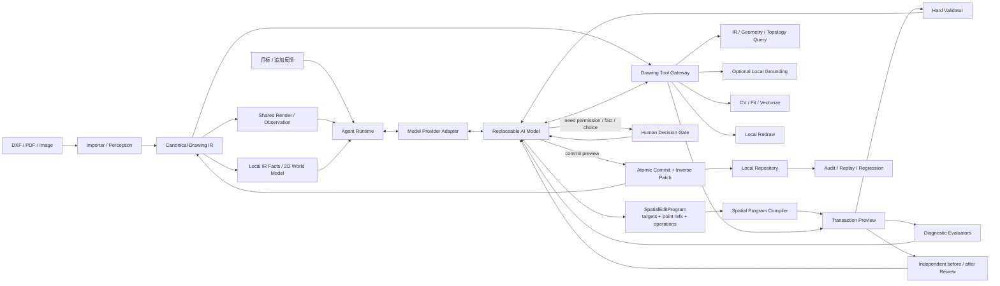

# VectorAI 技术架构：模型主导的二维空间 Agent

> 状态：当前权威技术文档
>
> 更新日期：2026-08-16
>
> DXF 导入：[`DXF 保真导入与确定性识别`](./superpowers/specs/2026-08-16-lossless-dxf-import-and-deterministic-recognition-design.md)
>
> 默认编辑设计：[`任务驱动空间编辑程序`](./superpowers/specs/2026-08-15-task-driven-spatial-edit-program-design.md)
>
> 主循环与授权：[`模型主导的二维空间 Agent 与 Human Decision Gate`](./superpowers/specs/2026-08-12-model-led-drawing-agent-and-human-decision-gate-design.md)
>
> 二维世界模型：[`二维世界模型与空间动作编译器`](./superpowers/specs/2026-08-13-2d-world-model-and-spatial-action-compiler-design.md)
>
> 空间交互帧：[`通用精确空间交互帧`](./superpowers/specs/2026-08-14-general-spatial-interaction-frame-design.md)
>
> 基础内核：[`图纸即代码系统架构`](./superpowers/specs/2026-08-08-drawing-as-code-system-architecture-design.md)

## 1. 架构目标

VectorAI 建立 AI 视觉语义与真实二维空间之间的可操作映射，让模型像编辑代码一样读取、修改、验证和维护图纸。

核心分工是：

- 模型负责需要视觉与智力的决策：理解语义目标、选择任务节点与关键点、声明目标关系、观察 Preview 和修正；只有歧义时才选择 Grounding 候选。
- Drawing Core 负责唯一真相：协议、坐标、事务、revision、Patch、回滚和持久化。
- 2D World Model 负责派生现实：坐标框架、交点、原子边、半边、面、来源参数区间、语义支持映射和可查询局部 Slice。
- Spatial Program Compiler 负责把模型声明的目标、空间引用、通用操作和保持契约编译成精确 Drawing Commands。
- Tool Gateway 负责执行能力：渲染、空间查询、拓扑、CV、拟合、重绘、矢量化和诊断。
- Model Provider Adapter 负责把统一内部动作映射到供应商支持的 Function Calling、JSON Schema 或 JSON Mode。
- Human Interaction Service 负责需要用户权限、事实或价值判断的暂停与恢复。

系统不再用低层 Harness 预先固定模型只能修改的选区或编辑方法。任何查询或感知结果都是证据，只有 Drawing Transaction 能改变正式状态。

## 2. 三种真相

| 类型 | 载体 | 职责 |
|---|---|---|
| 来源真相 | Source Artifact：DXF、PDF、图片及内容哈希；DXF Lossless Manifest | 证明数据来源与原生引用结构 |
| 编辑真相 | Canonical Drawing IR：`VectorAI-Drawing` v1.0 | 正式查询、修改、验证和版本化 |
| 派生表示 | SVG、PNG、Mask、DXF、PDF | 显示、模型观察和交付 |

派生表示不能直接覆盖 Drawing IR。图片、Mask、模型回复和工具结果都是 revision-bound Evidence，不是第四份图纸状态。

## 3. 总体架构



依赖规则：

- `src/drawing/` 不依赖 AI、React、Express、网络或文件系统。
- 前端与后端共用 SceneCompiler 和 Drawing IR 类型，不维护第二套几何解释。
- Importer、CV、模型和生成服务只产生 Evidence、Tool Result 或 Drawing Commands。
- Tool Gateway 不保存独立 Drawing Document，所有调用显式绑定 drawing ID 与 revision。
- 所有写入最终汇入 Drawing Application 的事务路径。
- 模型直接选择任务相关节点与稳定空间引用；程序解析 observation/world/node_anchor，执行通用几何运算并生成 Drawing Commands。局部 SourceSpan、原子边、接口和候选只在需要时查询。
- 二维世界模型只按 revision 从 Drawing IR 派生，不保存可独立写入的第二份图纸状态。
- 语义对象和 Drawing 图元是多对多关系；区域相交、Mask 相交或几何 incidence 均不自动构成共同修改授权。
- 语义层级按当前任务动态投影；局部世界显式记录读取完整度；Preview 作为只读反事实世界分支供模型查询。这些能力按证据触发，不构成固定串行 Workflow。

## 4. Canonical Drawing IR

```text
DrawingDocument
├── geometry      Point / Line / Ray / XLine / Circle / Arc / Ellipse / Polyline / Spline
├── annotations   Text / Dimension
├── relations     topology / constraint / association / semantic
├── features      CompoundPath 与持久语义 Feature
├── coordinateFrames / unitSystem
└── metadata
```

关键约束：

- 模型拥有四个 plane 的完整合法编辑能力。
- 坐标变化可以保留稳定 ID；类型变化或自由重建可以 delete + create。
- Lineage 记录来源关系，不强求旧节点与新节点一对一或同类型。
- `source → page → view → document` 仿射变换完整保存。
- 拓扑关系来自共享端点、显式关系或带证据的容差连接；视觉交叉不自动等于连接。
- candidate 节点保留置信度和 Evidence，UI 统一标红。

## 5. 来源重建与自适应矢量化

### 5.1 导入策略

- DXF：原始字节按 SHA-256 不可变保存；线性 group-pair 扫描生成 Lossless Manifest，保留 HEADER、所有 SECTION、实体 handle/owner、BLOCK 定义、INSERT 引用图、未知实体和 CAXA XDATA/私有组码。
- DXF 画布投影：递归展开可达 INSERT 的仿射变换，将 Point、Line、Circle、Arc、Ellipse、Polyline、Spline、Text、Dimension 投影为 Drawing IR；节点 Evidence 保存来源 handle 与完整 INSERT path。未支持实体只记录诊断，不伪造几何。
- DXF 导入通过 `POST /api/drawings/:drawingId/imports/dxf` 绕过 Agent，在一笔系统事务中替换四个 plane，因此失败不产生半成品，成功结果可 Undo/审计。配套工程文档只生成 confirmed/candidate/conflict 识别事实，不自动推断工程语义。
- PDF：优先提取矢量路径和文字；不可靠页面转入栅格感知。
- 图片：页级分析 → 清洁线稿 → 骨架/轮廓链 → 解析图元与 Polyline/Spline 兜底 → Drawing Transaction。

### 5.2 增量重建

每条来源链在进入事务前完成拟合：候选有效时生成 Line、Circle、Arc、Ellipse；候选无效时保留 Polyline/Spline。多 piece 链生成多个节点，并以 CompoundPath 和 lineage 保存逻辑整体。

链按最终节点数装入小批次。每批独立 Preview、校验、Commit、检查点和审计，因此复杂图纸能逐步显示、暂停和恢复。自动尺寸标注在几何重建后批量生成，不影响几何事务策略。

### 5.3 尺度无关算法

使用全图对角线 `D`、稳健线宽 `W` 与当前链弧长 `L` 生成无量纲阈值。分段由父子拟合误差、最短相对跨度和复杂度惩罚共同决定。算法记录实际尺度、候选点、拟合误差和接受理由，不使用样例坐标或固定像素特例。

来源重建的确定性算法不限制后续 Agent。模型可以通过工具重新拆分、合并、拟合或重建导入结果。

## 6. Agent Runtime

### 6.0 DSH 生产工具边界

DSH 第一层使用 Host-owned semantic episode。模型可见工具固定为：

```text
drawing_import / drawing_summarize / drawing_query
drawing_observe / drawing_select_parts / drawing_confirm_selection
drawing_preview_spatial_intent / drawing_revise_spatial_intent
drawing_evaluate_preview / drawing_finalize_preview / drawing_discard_preview
drawing_get_operation / drawing_undo_commit
```

`drawing_observe` 只在本轮用户确实要处理已有图纸时惰性激活。Host 从可信 session、runtime-root user message 和当前 DrawingRef 创建 Task/Observation/Context，并把它们保存在 EpisodeStore。后续模型调用不携带 `taskId`、`observationId`、`contextId`、`groundingId`、`previewHandle`、candidate/operation digest 或 revision。

模型通过 `drawing_select_parts` 使用 current canvas selection、Observation 归一化点/区域、短候选 key 或 semantic query 选择部件；Host 把选择折叠为 GroundingLedger 和精确节点/接口。模型随后提交通用 `SpatialIntentRequest`：direction、relative position、alignment、topology、preservation goal，以及对可信用户原文数值的 `numericKey` 引用。模型协议不接受 translation、pivot、rotation 或世界坐标。

一个语义部件可以由互不连续的图元组成，连通性不参与语义归属判定。进入求解器后，Host 会再按已验证拓扑把运动范围分解为 `carrier + connector interfaces + fixed anchors`：若一个选中组包含唯一闭合载体，且其余选中图元都能被证明是该载体的开放连接器，则只刚体移动载体，并重算连接器的接触端；固定端保持不动。无法证明这种角色关系时，整组才作为普通刚体处理。该分解只依赖几何类型、端点接触和 Grounding scope，不依赖“手、手臂、打招呼”等对象或动作特判。

`@vectorai/drawing-edit-core` 的确定性 solver 从真实几何生成有界候选，按目标残差、移动/变形代价、碰撞和拓扑代价稳定排名，再编译一组 forward/inverse Commands。多个部件共享一次求解、一个 Preview 和一个 Commit。Evaluation/Finalize 在 Host 内解析当前候选并重算三态 assessment；模型只收到 compact disposition 和下一工具，不负责重放内部 lineage。上下文压缩不会影响 EpisodeStore。

### 6.1 EditEpisode

每个任务建立 EditEpisode：

- 原始目标与追加指令。
- 当前 drawing/revision、工具证据和 Preview。
- 模型动作、诊断、Human Decision 和 Commit 历史。
- 预算、暂停点、恢复状态和最终结果。

### 6.2 模型动作

```ts
type ModelVisibleSpatialAction =
  | { type: 'select-parts'; parts: SemanticPartSelection[] }
  | { type: 'preview-intent'; intent: SpatialIntentRequest }
  | { type: 'revise-intent'; revision: SpatialIntentRevision }
  | { type: 'evaluate-current' }
  | { type: 'finalize-current' }
  | { type: 'discard-current' };
```

模型每轮选择一个动作。Runtime 验证 strict schema、从当前 Episode 解析内部状态、执行工具、记录 receipt，并把紧凑 disposition 送回模型。Commit、Undo、operation binding 和 handle 是 Host durable protocol，不是模型 action 字段。

### 6.3 服务预算

Runtime 只施加通用资源限制：

- 单次图像像素和响应大小。
- 工具、模型与 Episode 总超时。
- 只读工具并发与写事务串行。
- 重复候选检测和最大无进展轮数；MVP 一次指令默认最多复核 3 个语义候选。

预算不包含人体、建筑、动作、左右、图元类别或测试图规则。

Runtime 同时遵守“最小充分证据”原则：

- 不以完整读取整图、构造完整语义本体或消除所有不确定性作为 Preview 前置条件。
- 初始观察、空间索引、局部 Drawing IR 事实和确定性诊断在依赖允许时并行执行。
- 明确任务优先由模型一次选择目标与 SpatialEditProgram；只有相关歧义、不完整、程序表达力不足或 Preview 失败才增加轮次。
- 每次升级必须增加与当前目标相关的新证据或改变动作方法；无改善的同候选重复调用被 `NO_PROGRESS` 截止。

### 6.4 模型选择策略

- 空间理解、工具规划和 Drawing IR 事务生成使用可配置的主空间模型；修改结果复核使用角色独立的检查模型。两者共享协议但不共享职责。
- 主模型调用超时或传输失败时重试同一模型，不用较弱模型否决空间结果；单次调用默认上限 120 秒，Episode 默认上限 15 分钟。
- 快速前置检查由确定性的 Schema、revision、引用、数值和几何诊断完成，不让轻量模型对空间候选作权威判断。
- 模型仍是可替换边界；服务配置通过 `COMPANY_AI_SPATIAL_MODEL` 和 `COMPANY_AI_REVIEW_MODEL` 分别选择实现，任务 UI 不显示供应商或模型名称，审计内部保留实际配置。

### 6.5 上下文工作集协议

模型不再在每一轮重复接收整图节点清单、全部历史工具输出和多张互相竞争的截图。每个 revision 建立三层上下文：

1. **Global Drawing Map**：单位、整图 bounds、四个 plane 的计数、几何类型计数、多尺度重叠区域统计和拓扑组件摘要。区域是检索范围，不是互斥切块，也不拥有图元。
2. **Local Working Set**：本轮目标、显式 relation/feature 邻接和空间邻域中的精确 Drawing IR 节点。每个节点标明 `target | relation | neighbor`；相交或邻近只提供上下文，不构成共同修改授权。
3. **Evidence Ledger**：revision-bound 工具 receipt、诊断、用户决定和未被 Working Set 覆盖的精确节点事实。重复 `render_drawing` media、`views` 与 `vectorDigest` 不进入文本上下文。

DSH Ledger 输出只保留当前语义阶段、part/candidate 短键、目标摘要、诊断与下一工具；Preview handle、已解析坐标、affected IDs、Commands 和 operation receipt 留在 Host EpisodeStore/durable envelope。下一轮通过当前 session 恢复候选，因此模型上下文压缩或工具结果丢弃不会破坏链路。

同一 revision 的活跃 Ledger 只保留当前候选 Preview receipt；被替换候选及其模型动作、工具 receipt 和复核结果仍完整追加到审计日志。这样模型获得的是当前可操作状态，不会随着失败候选数量线性增长。

既有节点可以在只读查询中使用 revision-bound 短别名；语义写工具只使用 Episode-local `partKey`/candidate key，不能直接以节点别名形成写命令。revision 改变后，selection projection、候选 key、Grounding 和旧节点事实全部失效并重建。

空间索引采用重叠式多尺度区域树。跨区域 Line、Circle、Arc、Polyline 或 Spline 始终保留为同一个完整节点，可以被多个区域查询命中；系统不会为了上下文分区而切碎图元。

### 6.6 二维世界模型与局部 Slice

每个 revision 从 Drawing IR 派生三张互相映射的只读图：

1. **Authoring Graph**：几何、标注、关系、Feature、约束和 lineage 的正式图视图。
2. **Planar Arrangement Graph**：解析交点、原子边、半边、面和 `source node + parameter range` 历史映射。
3. **Semantic Grounding Graph**：当前 Episode 的语义对象候选、视觉证据、支持集、排除项和接口。

模型只读取与当前决策相关的 `WorldModelSlice`：Semantic Entity candidates、局部 Arrangement、相关关系/约束、Evidence Delta 和 continuation。事实包中的 Anchor、Interface、Path、Measurement 继续保留，但它们变成 World Model 的查询投影，而不是与拓扑平行的另一套核心状态。

一个语义对象可覆盖多个节点和局部 SourceSpan，一个节点也可以同时支持多个语义对象。Arrangement 中的分析切分不会自动改写 Drawing IR；只有事务真正编辑局部参数区间时才物化必要切分。几何相交 `incidence` 和设计连接 `connected` 分开保存，路径工具不会默认穿越所有视觉交叉点。

Semantic Grounding Graph 可以按当前目标投影 `TaskRelevantView`，临时表达 `part-of/contains/boundary-of/interface-with/context-for`。模型可在 detail、part、object 和 region 粒度之间 expand/contract；投影默认只在 Episode 内有效，不要求把“手臂”“房间组”之类的任务期理解永久写进 Feature。当前状态由追加式 Grounding Evidence Event 折叠得到，模型只读取最新候选和 Evidence Delta，完整历史保留在审计中。

所有 Slice 绑定 drawing、revision、frame、compiler version 和 input digest，并带 `resolved | partial | unknown | stale` Knowledge State。`partial/unknown` 只有在未解析边界与目标、保持接口或预期影响相交时才触发扩展；未读取不能解释为空白，无关区域不阻塞局部动作。模型协议不接受无空间标签的裸坐标；视觉提示使用 `observationId + normalized point` 或候选 ID，Runtime 确定性解析坐标和 SourceSpan，Prompt 不展示仿射公式或要求模型处理 Y 轴翻转。

### 6.7 快速路径与按需升级

正常快速路径：

```text
并行准备 Observation + Local Drawing IR Facts
→ 一次模型决策输出 SpatialEditProgram
→ 后端解析空间引用并编译 Preview
→ 独立检查者比较 before | after
→ 主模型读取检查结论
→ Commit
```

只有以下情况按需升级：目标无法区分；相关 Knowledge State 不是 `resolved`；四个首版操作无法表达所需几何；需要解除约束；Preview 目标未达成、破坏接口或出现意外范围。升级可选择局部 Grounding、拓扑、底层事务或重绘，并沿用同一 Episode 和当前证据，不从 overview 重启。

来源矢量化批次等确定性导入路径在局部硬校验后可以省略检查模型；由主模型发起的语义写入 Preview 默认交给独立检查者。该判定基于动作能力，不基于对象或指令关键词。

清晰局部任务以一次模型决策到首个 Preview 为默认性能基线；语义/重绘候选通常增加一次独立复核。只有主模型根据复核意见决定修改时才产生额外编辑轮次。Runtime 记录复核结果、Evidence refs 与前后诊断 digest；Grounding Evidence、反事实派生缓存和大体积审计媒体在必要元数据入账后异步持久化，不阻塞 Preview；Commit、inverse Patch、revision CAS 和授权记录仍保持同步原子性。

没有用户选中项、工具目标或当前候选时，首轮不编译也不内联完整 World Model，只发送 Grounded Observation 与 Global Map。出现活跃节点后才构造 bounded World Model；该轮 Working Set 只保留别名、plane、类型、相关性和 bounds，精确几何由 World Model 表达。后续未重复投影 World Model 的无状态调用再恢复 Working Set 节点事实，既避免同轮重复，也不假设模型保留上一轮记忆。

### 6.8 Observation 引用与按需 Grounding

SceneCompiler 为同一 revision 和视口产生 Observation。模型用 `observationId + [u,v]` 表达视觉点，后端校验 drawing/revision 后通过保存的 `worldToImage` 确定性逆变换；模型无需看到或手算仿射公式。精确既有点使用 `node_anchor`，确定的文档坐标使用 `frameId=document`。

目标存在歧义时，Pick Map 与 CoverageIndex 才按局部区域返回 Node、SourceSpan/HalfEdge 候选、层叠顺序、距离和覆盖比例。Grounding Service 生成有限 `SemanticEntityHypothesis`，模型选择、合并或排除候选并观察真实 Overlay。Source 栅格、现有 IR 中不存在的新对象或自由重绘时，可以调用 SAM 2 或等价的 `RasterGroundingProvider`。

Mask 只提供像素证据和生成输入，必须映射回 World Model 支持集；Mask/包围盒相交不能直接成为删除或修改列表。

### 6.9 单视觉工作集与 Source 按需读取

单次模型动作至多携带一个视觉坐标系：`preview > target-detail > user-viewport > overview`。新的相关图像替换旧图，不累计发送。

- 带附件任务首次用 Source 图建立语境，成功后不在每轮重复传输。
- 模型可调用 `create_observation_region` 与 `inspect_source_crop` 请求重叠局部区域；crop 以 media handle 存储，Runtime 在下一轮读取并作为唯一图像交给模型。
- 同一 crop 成功消费一次；传输失败重试时仍保留，避免无状态模型丢失视觉输入。
- Source、Drawing observation 和 Preview 均带明确坐标契约；模型只选择绑定 Observation 的归一化引用，程序负责解析为 Drawing 世界坐标。

### 6.10 模型调用可观测性

每次空间模型调用产生审计安全的 `model_call` 事件：transport、角色、attempt、revision、序列化请求字节数、图像数量/解码字节/像素数、HTTP 状态、TTFB、总耗时、provider request/completion ID、finish reason，以及 input/output/cached/reasoning tokens（供应商提供时）。

HTTP 200 但正文为空不再统一报成“网络失败”。例如 `finish_reason=length` 且 reasoning tokens 用尽会标记为 `MODEL_EMPTY_CONTENT`，从而区分传输、排队、响应格式和推理预算问题。审计不保存密钥、base64 图片或隐藏思维链。

只需要当前 revision 的 Application 读取使用按 drawing ID 定位的 `getCurrentCheckpoint` 快路径；`summarize/query/inspect/render/observe`、当前 Preview/Execute 前检查以及测量/拓扑只读工具不加载完整 Commit 列表，也不预加载本地其他图纸。只有显式 `open`、旧 revision 所有权判断、Commit 审计保存和回放读取本图历史。新写入快照带 SHA-256 内容摘要：校验通过后可以跳过每次全量事务回放；无摘要的旧快照仍首次完整回放，下次写入自动升级。MVP 仍使用单文件快照；长期的 checkpoint + append-only Commit log 属于后续存储演进，不影响当前 Drawing IR/事务协议。

### 6.11 上下文预算基线

上下文预算是可回归的协议，而不是对某张图的手工裁剪。`pnpm benchmark:agent-context` 读取本地最大 Drawing 快照，但不调用外部模型，它构造真实工具目录、工作集、观察图和序列化请求，输出冷读、空间索引、渲染、Prompt、Schema 和图像指标。

2026-08-15 本地真实目标工作集基线：3,194 条历史 Commit、96 个四平面节点；冷读当前 checkpoint 约 2.7 ms，空间索引约 9.4 ms，局部 World Model 约 9.9 ms，观察渲染约 22.9 ms。单轮 Dynamic Context 约 24.7 KB，只包含 21 个工作集节点和 1 张 1,048,576 像素观察图；4 个首轮 Active Tool 的 strict response schema 约 11.6 KB。没有明确目标的首轮会省略 World Model 与精确 Working Set，因此更小。

当前回归门禁：100+ 节点的紧凑局部上下文不超过 16 KB；本地真实目标工作集 Dynamic Context 不超过 32 KB；首轮 Active Tool Schema 不超过 12 KB；两者合计不超过 48 KB；单轮图像数不超过 1。工具 schema 使用共享 `$defs`，目录按 `build_world_slice → ground_semantic_entities → propose_spatial_actions` 的真实前置条件逐步开放。预算不能通过删除目标精确事实或收窄模型写权限来达成。

### 6.12 Model Provider Adapter

Runtime 使用统一内部动作，不直接假设供应商支持 OpenAI strict JSON Schema。每个 endpoint/model 配置并审计以下能力：vision、native tools、strict JSON Schema、JSON Object、最大输出 tokens 与 thinking 参数。

传输按能力选择：

1. Native Function Calling，只发送当前 Active Tool Contracts。
2. 小型顶层动作 JSON Schema，不嵌入全部工具输入分支。
3. JSON Object + 本地严格校验。

供应商明确拒绝某种协议时立即使用已配置的兼容策略，不重复三次相同 400。输入上下文、输出预算和 reasoning budget 分别记录；`finish_reason=length` 不归类为普通网络失败。

## 7. Drawing Tool Gateway

所有工具版本化并返回统一 receipt：tool call ID、输入摘要、revision before/after、结果句柄、受影响节点、状态、耗时和可重试建议。

Runtime 根据当前 revision、是否存在 Preview、来源附件和已完成读取选择有界的 Active Tool Catalog；每个活跃工具携带严格输入契约。目录只裁剪当前不可用或已完成的能力，不规定下一步必须调用哪个工具，也不按对象类别路由。

### 7.1 观察与查询工具

- `render_drawing`
- `ground_semantic_entities`
- `refine_semantic_entity`
- `inspect_world_slice`
- `query_nodes`
- `inspect_nodes`
- `measure_geometry`

渲染支持 overview、viewport、focus、before、preview 和 diff，并保存 world/image 坐标映射。前端画布与后端模型观察使用同一 SceneCompiler。Grounding 工具返回多个语义候选、多对多支持映射、排除项和 Overlay handle，不返回唯一写授权。

### 7.2 拓扑与路径工具

- `build_world_slice`
- `trace_paths`
- `find_interfaces`
- `inspect_fragment`
- `materialize_split`

World Model 按 `revision + frame + compiler version + input digest` 缓存；复杂图纸按重叠 Slice 和相关组件惰性编译。拓扑工具返回 SourceSpan、HalfEdge、Face、路径、接口、局部间隙、参数范围和不确定性，不生成 `authorizationId`，也不决定最终哪些内容可写。

模型可以反复调用工具：从视觉种子追踪路径、发现断裂、扩大查询、提供第二接口、选择另一候选或放弃拓扑并重绘。

### 7.3 CV、拟合与生成工具

- `inspect_source_overview`
- `create_observation_region`
- `inspect_source_crop`
- `extract_cv_evidence`
- `read_cv_evidence`
- `fit_geometry`
- `redraw_region`
- `vectorize_image`
- `recompute_annotations`

`redraw_region` 只接收模型给出的编辑意图与 Observation-bound 归一化区域；Host 解析为内部 Drawing 世界范围并选择可选关注节点。统一 SceneCompiler 渲染无标注的当前图纸，生成像素 Mask、保护 Mask 和 image/world 反变换，再调用可替换的生图模型。Mask 仅指导图像生成与候选矢量化，不是 Drawing Transaction 写权限；实际 IR effect 仍进入统一 Preview/assessment。

生成失败作为工具错误返回模型，不自动回退旋转、缩放或其他几何模板。

### 7.4 事务与评估工具

- `drawing_preview_spatial_intent`
- `drawing_revise_spatial_intent`
- `drawing_evaluate_preview`
- `drawing_finalize_preview`
- `drawing_discard_preview`
- `drawing_get_operation`

`drawing_preview_spatial_intent` 是 DSH 已明确任务的默认写入口。它严格解析 `SpatialIntentRequest`，由 Host 读取当前 Episode 的 Drawing、Observation、Grounding 与用户数值证据，求解通用关系并复用 Preview、Counterfactual、诊断、统一渲染和审计链路。失败是原子的，并返回稳定可恢复错误码。

底层 `SpatialEditProgram`、connected transform 与 raw transaction compiler 仍作为 Host/受信任扩展 API，供 Web Adapter、交互式画布和第二层标注插件复用；它们不发布到 DSH 模型工具目录。Preview handle 绑定 base revision、Commands digest、resulting document、诊断和过期条件，但只在 Host 内出现。

每个有效 Preview 同时暴露 `CounterfactualWorldBranch`。它直接复用事务引擎中的临时 DrawingDocument，只对 Patch 影响的 bounds、SourceSpan、Arrangement 分片和语义支持做增量失效与重建，提供结构化 delta 和统一渲染，不复制或全量编译整张图纸。模型按需查询分支；快速路径不要求为了形式完整读取所有 delta。

## 8. Drawing Transaction 与 Lineage

DSH 模型默认表达一次 Host-current 的 `SpatialIntentRequest`：

```ts
interface SpatialIntentRequest {
  summary: string;
  goals: Array<Direction | RelativePosition | Alignment | Topology | ExplicitNumericKey>;
  preserve: Array<PartShape | Connectivity | Anchor | Topology | ProtectedScope | MinimumDeformation>;
}
```

`subject` 只引用本 Episode 中已经由 Host 解析的 `partKey`；数值目标只能引用 Host 从当前 root user instruction 提取的 `numericKey`。求解器生成候选 transform，检查目标残差、保持范围、连接、保护集合、碰撞和拓扑，再把选中候选编译为内部 `SpatialEditProgram` 与 Commands receipt。未被实际 effect 覆盖的节点必须保持 canonical semantic equality。

该层类似编译器而不是权限系统：它负责精确坐标与基础几何运算，权限仍由 Host 对实际 diff 另行判断。后续只根据真实任务频率增加通用目标/约束，不为某个对象或示例添加专用 opcode。

现有 Drawing Commands 继续作为唯一修改语言：

```text
geometry.create / update / delete
annotation.create / update / delete
relation.create / update / delete
feature.create / update / delete
history.revert
```

扩展事务 metadata：

```ts
interface DrawingTransactionMetadata {
  episodeId: string;
  summary: string;
  confidence?: number;
  lineage?: DrawingLineageRecord[];
  decisionGrantRefs?: string[];
}
```

`DrawingLineageRecord` 支持 `preserve | transform | split | merge | replace | redraw`，保存 source IDs、result IDs、可选参数范围和 Evidence refs。

事务在临时 DrawingDocument 上执行。Commit 使用 compare-and-swap revision 并原子保存 Patch 与 inverse Patch。失败不改变正式状态；Undo 恢复四个 plane 和本次事务解除的约束。

## 9. Validation 与 Diagnostic 分离

### 9.1 Hard Validator

只拒绝：

- Drawing IR Schema、数值和基本几何非法。
- 节点、关系、标注或 Feature 引用不存在。
- Command precondition/postcondition 失败。
- base revision 或 Preview handle 过期。
- Human Interaction Policy 要求的 Permission Grant 缺失或不匹配。

### 9.2 Diagnostic Evaluators

返回结构化 warning 或 decision-required：

- 新增/消失端点、闭合度和拓扑连接变化。
- 局部间隙、分支、相交和尺寸变化。
- 约束影响与标注冲突。
- before/after 视觉目标达成度。
- 区域外差异、样式、尺度和伪影。

Diagnostic 不修改候选，不强制缩小选区、不强制切换编辑方式。模型根据结果继续修正、解释接受或请求用户决定。

### 9.3 Independent Preview Reviewer

语义写入 Preview 产生后，Runtime 使用共享 SceneCompiler 在同一视口分别渲染正式 revision 与候选结果，再由 Host 左右拼成一张 `before | after` 图。独立检查模型只接收当前有效用户指令、这张对照图、有界确定性诊断和候选语义摘要；内部 Preview handle、transaction digest、operation binding 与精确节点集合不进入 reviewer prompt。检查者不接收写工具，也不参与规划、授权或提交。

检查结果在 Host durable envelope 内绑定 revision、Preview 和事务摘要；模型可见投影不暴露这些字段：

```ts
interface PreviewReviewEvidence {
  revision: RevisionId;
  previewHandle: string;
  transactionDigest: string;
  status: 'satisfied' | 'needs_revision' | 'unavailable';
  reason: string;
  defects: DrawingPreviewDefect[];
  reviewedAt: number;
}
```

该结果通过 `currentPreviewReview` 进入主模型下一轮上下文。它是第三方复核意见而不是 verification receipt：`needs_revision` 和 `unavailable` 都保留当前 Preview；主模型可以结合 Drawing IR、用户指令和其他证据继续修改或确认提交。

主模型同时收到 `{attempt,max}` 候选预算，可自主选择继续当前 Preview、从 canonical 重做或接受结果。连续 3 个候选均未通过时，Runtime 以 `PREVIEW_REVIEW_ATTEMPTS_EXHAUSTED` 安全结束本轮：不 Commit、不改 canonical，并向 UI 明确显示可重试或追加指令。该边界防止无改善循环，不替检查者作语义判断。

## 10. 标注、约束与 Interaction Policy

### 10.1 标注

标注永远不参与编辑模式路由。几何变化后，模型可调用工具重算、重关联、标记 conflict 或删除重建标注。引用悬空属于 IR error；尺寸变化或布局不佳属于 diagnostic。

### 10.2 约束

约束是 Drawing IR 语义而不是编辑锁：

- 模型读取约束并判断保持、重新满足、更新或解除。
- constraint `violated/unsolved` 返回影响报告，不强制 geometric-edit。
- 删除、放宽或改变已有用户约束含义需要候选级 Permission Grant。

### 10.3 用户锁定与外部副作用

用户锁定内容、约束解除、覆盖导出文件或未来其他敏感动作均由通用 Interaction Policy 判定是否需要 Human Decision。Policy 只判断是否缺少权限，不替模型判断几何方案。

## 11. Human Decision Gate

### 11.1 请求类型

- `grant-permission`
- `choose-option`
- `confirm-intent`
- `provide-context`
- `accept-risk`

请求包含 Episode、revision、候选与事务摘要、问题、理由、选项、推荐项、影响资源和可选 Preview。

### 11.2 Permission Grant

授权绑定：

- request ID 与 Episode。
- 当前 revision。
- transaction digest。
- 精确 action 和 resource IDs。
- `allow` 或 `deny`。
- `candidate` scope。

任一绑定变化后 Grant 失效。MVP 不提供永久允许。

### 11.3 状态与恢复

新增 `waiting_for_user` run 状态。请求产生后在安全点暂停，保存 Episode、Preview 和证据；用户选择、拒绝或补充指令后继续同一上下文。用户主动追加指令与决策响应统一记录为 Human Interaction Event，但保持不同事件类型。

以下情况不得弹窗：普通断线、方向错误、样式漂移、拟合失败、可撤销的常规修改、自动标注重算或模型能通过工具消除的歧义。

## 12. Preview、提交与反馈 Loop

```text
模型调用 drawing_preview_spatial_intent
→ Hard Validator
→ Diagnostic Evaluators
→ 后端同视口渲染并拼接 before | after
→ UI 显示当前 Preview 与真实工具 Overlay
→ 独立检查者仅判断是否满足当前用户指令
→ 检查结果作为当前 Episode 的 compact review 返回主模型
→ 主模型调用 drawing_revise_spatial_intent、discard 或 finalize
→ Host auto-safe 提交 / 请求用户决定 / blocked
```

每轮模型上下文只包含当前 disposition 与允许的下一工具。权威 base revision、父 Preview、candidate digest、evaluation 和 operation binding 位于 Host；`drawing_revise_spatial_intent` 只接收新的 goals/preserve，由 Host 从 canonical base 重新求解并原子替换候选。失败时旧 Preview 保持可见；成功时旧 handle 立即失效，但模型从不需要读写它。

模型默认自动提交自己认可的候选。仍有 warning 时可以：

- 继续修正。
- 请求用户接受风险。
- 以 candidate 状态提交并标红。

同一失败候选连续重复时，Runtime 返回 digest 相同和诊断未改善的事实，模型必须换工具、换策略、升级模型或结束，不能静默重复。

Preview Loop 追求当前动作的最小充分验证，而不是证明整张图绝对正确：硬校验始终运行；受影响拓扑和接口诊断增量运行；独立视觉复核只评价指令满足度并把意见交还主模型，不承担 Commit 门禁。无关 Slice 的 `partial/unknown`、普通 warning、复核 `needs_revision` 或检查服务暂时不可用都不延迟主模型对当前候选的判断。

## 13. UI 与实时事件

- 任务状态贴近输入框，只显示最新真实动作。
- 运行时发送按钮切换为暂停；用户可以追加新指令。
- 画布显示语义候选、Pick/Coverage 解析结果、SourceSpan/HalfEdge 描边、保持接口、排除结构、Mask、动作影响和当前 Preview。
- Overlay 只表示模型观察/考虑过程，不表示硬写授权。
- `waiting_for_user` 显示紧凑 Decision Card：问题、影响、选项、推荐和 Preview 入口。
- UI 不显示模型名称或隐藏推理；只显示动作摘要、工具结果和修改理由。
- 活跃任务最长约 25 秒产生真实进度或 heartbeat；30 秒不是正确性的硬超时。

UI 事件来自真实后端动作和工具结果，例如 observation、program compile、resolved target/anchor/motion、Preview delta、diagnostics、independent review 和 Commit；不能由固定阶段列表伪造。

### 13.1 Spatial Interaction Frame

前后端之间只传递一种有界、世界坐标系的画布交互协议：

```ts
type SpatialInteractionFrame = {
  kind: 'spatial';
  phase: 'observing' | 'grounding' | 'planning' | 'previewing' | 'verifying';
  label?: string;
  strokes: Array<{
    id: string;
    ref?: string;
    nodeId?: string;
    role: 'target' | 'boundary' | 'interface' | 'context' | 'excluded'
      | 'before' | 'after';
    points: Vec2[];
    closed?: boolean;
    confidence?: number;
  }>;
  markers: Array<{
    id: string;
    ref?: string;
    role: 'seed' | 'target' | 'interface' | 'anchor' | 'warning';
    point: Vec2;
  }>;
  vectors: Array<{
    id: string;
    role: 'motion' | 'constraint';
    from: Vec2;
    to: Vec2;
  }>;
  truncated?: boolean;
};
```

- `drawing-interaction/projector` 将 Node、SourceSpan、HalfEdge、Face、Interface 和 Drawing Delta 确定性投影为该协议；前端不再从节点 ID、包围盒或像素 Mask 猜测精确轮廓。
- Grounding 返回 `target/boundary + excluded + interface`，Action 返回 `target + context + interface`，Preview/Verification 返回 `before + after + motion`。
- 直接写工具的已解析输入在调用前由 Runtime 本地投影为 `planning` 帧；工具返回后用真实结果帧覆盖。这不增加模型调用。
- 画布仅负责显示协议：青色目标描边、琥珀接口脉冲、灰色上下文/排除、before/after 差异和运动向量。Overlay 必须 `pointer-events: none`，不参与选中与事务。
- 单帧最多 96 条 stroke、96 个 marker、96 个 vector，每条 stroke 最多 96 个采样点；超限标记 `truncated`，但不改变 Drawing IR 与工具结果。
- Interaction Frame 只进入进度事件和审计引用，Context Ledger 投影给模型时会剥离其大体积坐标，避免 UI 几何反复占用 token。

## 14. 审计、回放与上下文管理

Run Manifest 记录 Drawing/revision、Goal、Source hash、模型角色、Prompt hash、工具版本、运行配置和时间。

Episode Event Log 记录：

- 用户目标、追加指令和 Human Decision。
- 模型结构化动作与协议修复。
- 工具调用、输入摘要、结果 handle 和 receipt。
- Observation、Pick/Coverage 查询、坐标变换、拓扑/CV/矢量化证据。
- Semantic Entity candidates、支持/排除映射、World Model Slice 和 SourceSpan/HalfEdge 引用。
- TaskRelevantView、Knowledge State、Grounding Evidence Delta 和 supersedes 关系。
- `SpatialEditProgram`、逐操作 resolution receipt、可选 Action Proposals、Commands、lineage、Preview、diagnostics 和 commit decision。
- Counterfactual World Branch 的影响范围、增量 Arrangement/语义支持与查询结果。
- Permission Grant、Patch、inverse Patch 和进度耗时。

不保存 API Key、Authorization、媒体 base64 或隐藏思维链。

两种回放：

- 确定性事务回放：不调用模型，从起始 revision 得到相同 Drawing Document。
- Agent 回归回放：复用历史 Observation 与工具输出评估新模型的工具选择、事务和最终结果。

## 15. 本地持久化

MVP 本地仓库分离保存：

- Source Artifact 与 metadata。
- Drawing snapshot、Commit 和当前 revision。
- Observation/Evidence 与媒体 handle。
- EditEpisode、Tool Receipt、Human Interaction 和 Audit Event。
- Preview、Permission Grant 与 Export Fidelity Report。

核心 revision 与 Commit 使用临时文件和原子替换持久化。媒体正文不嵌入审计 JSON。

## 16. 模块目录与目标边界

- `src/drawing/`：Drawing IR、Command、Transaction、Patch、Validation、Repository、SceneCompiler。
- `src/contracts/drawing-agent.ts`：模型动作、工具 receipt、运行状态和 Human Decision 公共协议。
- `api/services/drawing-agent/`：模型 Loop、Episode、重试、状态与工具调度。
- `api/services/model-provider/`：供应商能力配置、协议适配、结构化输出与 token/thinking 策略。
- `api/services/drawing-tools/`：新的模型工具 Gateway 与版本化注册表。
- `api/services/drawing-spatial-program/`：`SpatialEditProgram` 严格解析、Observation/World/Node Anchor 解析、通用几何编译与 postcondition diagnostics。
- `api/services/drawing-world-model/`：Frame Graph、Arrangement、SourceSpan/HalfEdge/Face、WorldModelSlice、空间索引和增量失效；只从 Drawing IR 派生。
- `api/services/drawing-grounding/`：Pick Map、CoverageIndex、Semantic Entity candidates、TaskRelevantView、Grounding Evidence Event、支持映射、Raster Grounding Provider 和 Overlay。
- `api/services/drawing-spatial-actions/`：Action Proposal、Spatial Action IR、Compiler backends、必要切分、约束求解和 lineage。
- `api/services/drawing-preview-world/`：Counterfactual World Branch、Patch 影响分析、派生缓存增量失效和 Preview 查询；不拥有正式 Drawing 状态。
- `api/services/drawing-spatial/`：迁移期保留的几何采样、变换、拟合、路径、接口和拆分算法；实现逐步下沉到 World Model Kernel 或 Action Compiler，不拥有写授权。
- `api/services/drawing-generation/`：局部生成工具。
- `api/services/drawing-vectorization/`：矢量化与解析图元提升工具。
- `api/services/drawing-vision/`、`drawing-render/`：共享渲染、Observation 和 Diff。
- `api/services/human-interaction/`：Decision Request、Response、Grant、暂停与恢复。
- `api/services/drawing-audit/`、`drawing-episode/`：审计、回放和上下文摘要。

## 17. 架构迁移

### 17.1 保留

- Drawing Core、Application、Repository、SceneCompiler、Patch 和 inverse Patch。
- 自适应矢量化、现有 topology/采样算法、局部拆分、几何拟合和生成服务；作为新 Kernel/Compiler 的初始实现复用。
- EditEpisode、审计、真实进度、暂停和恢复基础设施。

### 17.2 改造成工具或诊断

- `GeometryTopologyGraph` → `WorldModelCompiler + ArrangementGraph`，补齐交点、SourceSpan、HalfEdge、Face 和 curve history。
- `SemanticRegion` → `SemanticEntityHypothesis`，从单个模型轮廓改为多候选、多对多支持和显式排除项。
- Grounding Renderer → 正常 Observation + Pick Map + CoverageIndex + 候选 Overlay。
- `TopologyPartResolver` → `trace_paths/find_interfaces` 的候选查询，不收敛成唯一授权。
- `split-materializer` → `materialize_split`。
- 已解析的常用编辑 → `SpatialEditProgram` 通用编译器；复杂 Proposal、约束和重绘后端保留为按需工具。
- `spatial-validator` → Hard Validator 扩展 + Diagnostic Evaluators。
- `Strategy Router` → 删除强制路由，只保留模型工具能力描述。

### 17.3 删除旧主链责任

- 删除 Deterministic Spatial Authorization 作为编辑前置条件。
- 删除 accepted SpatialSelection 才能设计的条件。
- 删除模型必须手绘完整轮廓和稀疏锚点才能进入编辑的条件。
- 删除区域/Mask/包围盒相交自动进入目标集的逻辑。
- 删除端点采样图作为最终二维拓扑真相的假设。
- 删除 Dimension/constraint 强制 geometric-edit。
- 删除 generation failure 自动回退 geometric transform。
- 删除 locality/protected/boundary/dangling 一概阻断事务的耦合。
- 删除固定 workflow DAG 限制下一工具。

MVP 不保留双主链或长期 Feature Flag。生产 `api/app.ts` 只装配 `ModelLedDrawingAgentRuntime`；旧 Runtime 源码仅供尚未迁移的历史回归测试引用，不再拥有生产入口。

## 18. 测试与发布门禁

### 18.1 核心测试

- 解析曲线交点、SourceSpan、HalfEdge、Face 和原始图元历史映射。
- incidence 与 connected 分离，路径不会默认穿越视觉交叉点。
- Arrangement 分析切分不修改 Drawing IR，物化切分只出现在事务中。
- Coordinate Frame/Observation 引用可以确定性解析。
- SpatialEditProgram 严格有界，编译失败不产生部分 Preview；未提及节点保持字节等价。
- translate、set_endpoint、create_path、delete_nodes 可以顺序组合并产生逐操作 receipt。
- 四个 plane 同事务原子修改与 inverse Patch。
- replace/redraw 的 lineage。
- revision/Preview/Grant 过期。
- Hard Validator 与 Diagnostic 分级边界。
- Human Decision 请求、授权、拒绝与恢复。

### 18.2 Agent 集成测试

- 已明确任务可以直接用 observation/node_anchor 引用在一次模型决策后生成 Preview，不要求先调用 Grounding 或 Proposal。
- 有歧义任务的多候选 Grounding 能选择、合并和排除重叠结构，不要求模型输出精确轮廓坐标。
- Semantic Entity 与 Node/SourceSpan 支持多对多映射。
- TaskRelevantView 能按任务组合、展开和折叠临时语义对象，不污染 Authoring Graph。
- WorldModelSlice 区分 resolved/partial/unknown/stale；只在相关未解析边界上继续展开。
- SpatialEditProgram 是默认快速入口；Action Proposal 不限制模型，模型可选择候选、组合能力或直接 Preview Raw Transaction。
- 明确任务通过一次模型决策选择 Grounding 与动作；不因完整审计或整图语义建模增加固定轮次。
- Counterfactual World Branch 只重建 Patch 影响范围，并能返回拓扑、接口和语义支持 delta。
- 清晰局部任务在首个 Preview 前至多一次模型决策；每个额外决策都具有受支持的 escalation reason 和非空 Evidence Delta。
- 审计媒体与可重建派生缓存的慢写不会增加 Preview 关键路径，进程恢复仍能依据同步元数据重建或标记缺失 Evidence。
- Canvas 展示真实 Grounding、Action 和 Preview Event。
- 模型可自由组合查询、拓扑、渲染、重绘、矢量化和事务工具。
- 自动标注不改变编辑方法。
- 约束解除进入等待；同意后提交，拒绝后重规划。
- 用户追加指令继续同一 Episode。
- 重复无改善候选能触发换策略而非相同重试。
- 模型上下文不包含仿射公式或无空间标签的裸坐标；视觉引用可以确定性解析到世界坐标。
- Active Tool Catalog 保持当前可用能力可发现性并使用严格契约，不形成对象类别或固定步骤路由。
- Native Tools、strict JSON Schema 和 JSON Object 供应商均投影为相同内部动作并通过本地校验。

### 18.3 真实流程基准

- `test1`：复杂来源逐步重建和自由编辑。
- `test2`：多接口语义部件可完整重建，不修改无关结构，不使用对象/动作特例。
- 工程图：精确约束影响、Human Decision 和事务回放。
- 重叠路径、自由形新增、大图分步工具调用与模型升级。

评分分开记录 Grounding Precision/Recall、Support Mapping Precision/Recall、Action Compilation Validity、Preservation Fidelity、Goal Satisfaction、Loop Convergence 和 Evidence Efficiency，不能用单一“成功/失败”掩盖错误层级。Evidence Efficiency 至少记录模型调用数、输入字节、图像数、无关 Slice 展开量、首个 Preview 时间和每次升级的诊断改善。

发布前必须使用真实浏览器、真实 Drawing IR 与配置模型跑通，不以 Mock 通过代替端到端效果。
