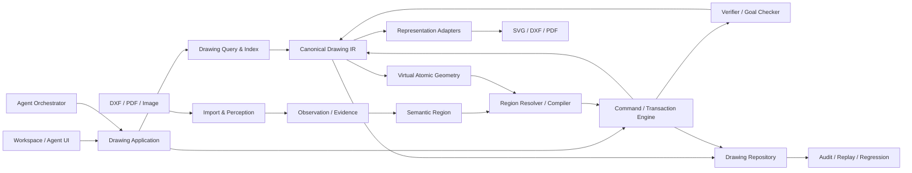

# VectorAI 技术架构（图纸即代码）

**状态：** 当前权威技术文档
**权威设计来源：** [`docs/superpowers/specs/2026-08-11-region-first-spatial-editing-design.md`](./superpowers/specs/2026-08-11-region-first-spatial-editing-design.md)（区域优先空间编辑）；[`docs/superpowers/specs/2026-08-11-vector-native-spatial-agent-engine-design.md`](./superpowers/specs/2026-08-11-vector-native-spatial-agent-engine-design.md)（共享渲染与空间 Agent 基座）；[`docs/superpowers/specs/2026-08-08-drawing-as-code-system-architecture-design.md`](./superpowers/specs/2026-08-08-drawing-as-code-system-architecture-design.md) 保留 Drawing Core 北极星原则。
**历史备份：** 旧 SpatialIntent / SpatialModel 0.2 / 文字步骤 Agent 架构已废弃，存档于 [`docs/superpowers/specs/2026-08-08-legacy-tech-architecture.md`](./superpowers/specs/2026-08-08-legacy-tech-architecture.md)，新开发不得扩展其中旧协议。

## 1. 愿景

VectorAI 的目标是让 AI 像理解、维护和修改代码一样理解、维护和修改真实二维图纸。

代码系统的可靠性来自稳定语法树、符号身份、查询工具、编译器、测试、Diff 和 Commit。VectorAI 对图纸提供对应能力：**Canonical Drawing IR、稳定实体 ID、空间与拓扑查询、类型化 Drawing Command、事务化 Patch、分层验证、Drawing Commit、审计回放和回归测试**。

AI 负责理解目标、选择工具和处理歧义；几何运算、正式修改、验证、版本记录和导出必须由确定性系统完成。

## 2. 三种“真相”

系统明确区分三类数据：

| 真相 | 载体 | 回答的问题 |
|---|---|---|
| 来源真相 | Source Artifact（原始 DXF/PDF/图片，按内容哈希不可变保存） | 数据从哪里来 |
| 编辑真相 | Canonical Drawing IR（`VectorAI-Drawing` 协议 v1.0） | 系统认为图纸是什么，如何修改 |
| 表示结果 | SVG / DXF / PDF（IR 的不同表现） | 如何展示/交付 |

表示结果不反向成为编辑权威；格式降级只发生在 Representation Adapter，并返回 Fidelity Report 和 warnings。

## 3. 总体架构与依赖规则



依赖规则：
- Drawing Core 不依赖 AI、React、Express、网络或文件系统。
- Agent 依赖公开工具和 Application 接口，不访问内部数组。
- UI 保存工作区投影与交互状态，不成为第二个 Drawing 权威。
- Importer 和 Perception 只产生 Observation/Evidence，不直接修改正式文档。
- SemanticRegion、Mask 和虚拟子图元是 revision-bound 运行证据，不成为第四种正式图纸真相。
- 所有入口最终汇入同一个 Drawing Application。

## 4. Canonical Drawing IR

序列化协议为 `VectorAI-Drawing`，MVP 初始 `schemaVersion` 为 `1.0`。

```
DrawingDocument
├── geometry     GeometryNode[]      （Point/Line/Ray/XLine/Circle/Arc/Ellipse/Polyline/Spline）
├── annotations  AnnotationNode[]    （Text、Dimension 先实现；Leader/Tolerance/Symbol 协议预留）
├── relations    DrawingRelation[]   （topology / constraint / association / semantic）
├── features     SemanticFeature[]   （状态为 confirmed / candidate，候选必须带置信度与 Evidence）
├── coordinateFrames / unitSystem
└── metadata
```

关键原则：
- 稳定身份：坐标/尺寸变化不改 ID；类型本质变化用 delete + add；新建用 UUID；导入基于 Drawing ID + 源 handle 生成；进程级递增计数不作正式身份。
- 坐标与单位：单位与 CoordinateFrame 明确保存，源/页面/视图/文档坐标变换可追踪，禁止把归一化图片坐标直接视为毫米坐标。
- 关系分 `topology`（连接/闭合/包含/相交）、`constraint`（水平/竖直/平行/正交/相切/同心/同值/距离/半径/角度/对称）、`association`（尺寸/文字/几何绑定）、`semantic`（Feature 组成），各为类型安全联合。

## 5. 唯一修改路径：Command → Transaction → Verify → Commit

AI 和 UI 不得直接改写 DrawingDocument。Command 表达“想做什么”，Patch 表达确定性编译后“具体改了什么”。

执行顺序固定为：
1. 检查 `baseRevision`。
2. 检查前置条件。
3. 将 Command 编译为 Patch。
4. 在临时 DrawingDocument 上应用 Patch。
5. 执行分层文档验证（Schema → Numeric → Reference → Geometry → Topology → Annotation → Semantic → Goal）。
6. 检查目标后置条件。
7. 生成 Preview Event。
8. 原子持久化 Commit 与 resulting revision。

任何阶段失败，正式文档都不变化；Revision 过期返回结构化冲突，不采用 last-write-wins。

- 系统默认自动执行；低置信度事务作为 candidate Commit 提交并在 UI 标红。
- Commit 保存正向 Patch、inversePatch、验证报告、outcome 报告与置信度，必须能不调用模型确定性重放。
- Undo/Redo 采用追加式历史：Undo 通过 `inversePatch` 创建 Revert Commit；Redo 撤销该 Revert 或重放原 Command。

## 6. Goal 驱动的 Agent Runtime（双通道执行）

- **Fast Command Lane**：创建、删除和明确对象修改；流程为理解目标 → 查询对象 → 类型化工具 → Preview → Commit。
- **Workflow Lane**：图片/PDF 感知、复杂多对象任务和分析后修改；流程为输入意图判断 → 感知/查询 → GoalSpec → Workflow Graph → 工具调用 → 持续验收。
- 图片和文字联合输入由 Input Interpreter 判断分析、重建、分析后修改或把图片作为参考，不要求用户操作业务开关。
- 视觉语义修改不再要求模型先选择完整 nodeId：模型先提出连续 SemanticRegion，系统再解析完整图元、局部参数片段、共享边界和保护对象。
- Strategy Router 自动选择 `geometric-edit`、`generative-redraw` 或 `hybrid-edit`，用户界面不提供技术策略开关。

Tool Registry 首批工具：`query_entities`、`inspect_entity`、`measure_geometry`、`query_topology`、`create_geometry`、`update_geometry`、`delete_geometry`、`create_annotation`、`preview_transaction`、`commit_transaction`、`verify_goal` 及图纸导入与感知工具。每个工具拥有严格 Schema、能力版本、读写属性、超时策略和 Receipt。

失败恢复顺序：Schema/参数错误同模型修正一次 → 目标过期重新查询 → 节点设计错误重新规划 → 模型明确 `confidence < 0.6` 才允许 Turbo 升级一次 → 仍不安全则暂停并保留已验证 Commit。普通 JSON 错误、工具异常和几何验证失败不触发 Turbo。

运行控制：安全点位于工具调用前、Preview 后和 Commit 后；支持暂停、继续、停止、追加指令。每次语义修改建立持久化 EditEpisode，保存区域、拆分、策略、Preview 和用户反馈版本；热上下文只包含当前有效版本、最近反馈、未解决缺陷和旧方案压缩摘要。

## 7. 图纸导入与感知

- **DXF**：确定性 Parser 读取原生 CAD 对象，handle 进入 Source Map；图层/图块/填充保存为 opaque records（首版不编辑）；不使用视觉模型重新识别结构化 CAD 内容；无法解析对象产生 Import Warning。
- **PDF**：优先提取矢量路径/文字/页面坐标，矢量不可靠时用页面或局部区域视觉感知；MVP 每次处理一页并提示剩余页。
- **图片**：流水线为页级分析 → 视图分割 → 基准检测 → 局部几何与 OCR → 拓扑 → 尺寸关联 → Resolver → Commands → 分批 Transaction。按视图、局部区域和拓扑组件处理，不按从上到下或对象名称拆解。
- **坐标标定**：归一化只负责媒体与坐标变换，不负责理解；完整变换链为 source → page → view → document；缺可靠比例时进入 provisional CoordinateFrame，解析出可靠尺寸后再通过显式 Transaction 标定。
- **局部失败**：每个拓扑组件独立成事务，单组件失败不回滚其他已验证组件；尺寸关联不唯一时保留候选，不猜测唯一目标。

## 8. 表示与保真度

每个实体或源对象的导出状态为：`native`（无损）/ `approximated`（明确近似）/ `opaque_passthrough`（未理解但原样保留）/ `omitted`（无法导出必须报告）/ `blocked`（阻止文件生成）。SVG 用于工作区显示，DXF 用于 CAD 交换，PDF 用于预览与交付。Core 不执行格式降级。

## 9. 验证与错误协议

事务按顺序执行 Schema、Numeric、Reference、Geometry、Topology、Annotation、Semantic、Goal 验证；Export Validation 在请求导出时执行。验证等级：`error`（阻止 Commit）/ `warning`（允许提交但展示与审计）/ `candidate`（允许候选提交并标红）/ `info`（解释性结果）。Agent 依据 `DrawingError` 的 `code`、`stage`、`retryable` 决定修正/重查/重规划/暂停，不解析错误字符串猜测行为。

## 10. 审计、回放与回归

- Run Manifest：记录 Drawing ID、基础 revision、GoalSpec、Source Artifact 哈希、Prompt 模板哈希、模型角色与版本、工具能力版本、IR/Command/Validator 版本、运行配置和时间。
- API Key、Authorization、媒体 base64 和隐藏思维链不写入审计正文。
- 回放模式：Deterministic Replay（不调模型重放 Commit）、Runtime Replay（用录制输出验证运行时）、Model Regression（重调当前模型比较目标结果、几何误差、实体集合和工具轨迹）。

## 11. 本地持久化

MVP 本地仓库至少分离保存：Source Artifact 媒体正文、Drawing Package metadata、当前与周期性 Snapshot、追加式 Commit、Observation/Evidence、Agent Event Log、Export Fidelity Report。Document revision 与 Commit 使用临时文件加原子替换持久化；Commit 成功前必须保证核心 revision 已持久化。

## 12. 性能预算

- HTTP 接受任务 < 1 秒；首个可见状态事件 < 1 秒。
- 活跃任务最长 25 秒产生一次进度或 heartbeat。
- 简单文字修改首个 Commit 目标 < 30 秒。
- 只读查询与独立视图感知可受控并行；审计写入和非关键 OCR 不阻塞 Commit 主链。
- 热上下文使用索引和局部查询，不发送完整文档。

## 13. MVP 明确不做

任何 3D 实体/曲面/网格/B-Rep/STEP；图层、图块、外部引用和填充的可编辑语义；DWG 原生读写；完整参数化约束求解器；分支/合并/远程同步/多人协作；旧 SpatialModel/SpatialIntent/Commit/审计数据的生产兼容；UI 展示模型名称或隐藏思维链。

## 14. 迁移计划与实施状态

迁移采用分阶段主链替换，每完成一条新主链即删除对应旧入口，不长期维护双协议或 Feature Flag。当前进度：

| 阶段 | 范围 | 状态 |
|---|---|---|
| 一 | Drawing Core V1（IR、稳定 ID、查询、类型化 Command、事务 Preview、可逆 Patch、分层 Validator、In-memory Repository、Revert Commit、确定性 Replay） | ✅ 已实现 |
| 二 | Drawing Application 与本地仓库（应用服务、原子文件快照、重启回放、HTTP Drawing API、浏览器 Client、手工 UI 事务切换） | ✅ 已实现 |
| 三 | Agent Runtime（Tool Registry、GoalSpec、Workflow Graph、Recovery、Run Control、SSE Progress） | ✅ 已实现 |
| 四 | 图片感知与线稿矢量化（Source Artifact、Agent 可调 CV、反馈 loop、增量 Preview） | ✅ MVP 主链已实现；DXF/PDF 深度导入仍待完善 |
| 五 | Vector-Native Spatial Agent（共享 SceneCompiler、服务端 VisualObservation、后端 Preview/Verify/Revise/Commit） | ✅ 已实现 |
| 六 | 审计与发布门禁（调用级原始回复、Observation/Intent/Verification/Commit、确定性 Replay、test2 语义编辑与 30 秒体验指标） | ✅ 代码已实现；真实模型结果以本地供应商门禁持续验收 |
| 七 | Region-First Spatial Editing（SemanticRegion、虚拟子图元、Region Resolver、EditEpisode、三策略自动路由） | ✅ 已实现；确定性工程与创意门禁通过 |

当前正式视觉语义主链是 `Observe → SemanticRegion → SpatialSelection → Strategy → Preview → Verify → Commit/Revise`。旧的 node-first VisualFeatureGraph/EditIntent 协议、适配器和编译器已删除；明确 ID 的 Fast Command Lane 继续保留。模型仍不能直接改仓库或绕过 Drawing IR 事务。

## 15. 模块目录速查

- `src/drawing/`：Canonical Drawing Core（command/transaction/validation/document/repository/query/preview）
- `src/drawing/scene/`：前后端共享的 RenderScene 编译与 SVG 路径序列化
- `src/contracts/`：Drawing 应用契约类型
- `src/services/drawing-client.ts`：浏览器 Drawing API Client
- `src/hooks/drawing-store.ts`：工作区投影、revision、commits 与交互状态（Zustand，非权威）
- `api/services/drawing-application/`：Drawing Application Service 与文件仓库
- `api/services/drawing-agent/`：空间 Agent 编排、模型协议、语义适配、预览验证、审计与进度
- `api/services/drawing-vision/`：服务端 VisualObservation、Grounding 和 revision 绑定图像 handle
- `api/services/drawing-spatial/`：虚拟原子几何、区域解析、按需拆分、空间编译与确定性验证
- `api/services/drawing-generation/`：可替换局部生图边界、生成资源落盘、矢量化和世界坐标投影
- `api/services/drawing-edit/`：区域外与保护对象内容哈希检查
- `api/services/drawing-render/`：RenderScene 的服务端栅格输出
- `api/services/drawing-perception/`、`drawing-feedback/`、`drawing-cv/`、`drawing-vectorization/`：图片重建工具与反馈 loop
- `api/services/drawing-benchmark/`：图元拟合和语义编辑发布门禁
- `api/routes/drawings.ts`、`agent-runs.ts`、`ai.ts`、`auth.ts`：HTTP 路由
- `docs/superpowers/`：权威设计文档与实施计划

## 16. 当前语义编辑发布门禁

`npm run test:test2-self-edit -- test2.png` 是不调用外部模型的 Region-First 工程系统门禁；`npm run e2e:region-hair-edit` 是使用确定性假提供方的生成式/混合式系统门禁。报告仅写入被忽略的 `.local/vectorai/baselines/`。两者从 Drawing IR、审计和真实 Commit 计算，不接受模型自报成功，必须同时满足：

- 被删除的旧目标不存在，新增或更新目标存在；
- 编辑结果与意图锚点在容差内连接；
- 目标集合外的图元内容没有变化；
- 成功的 before/preview/diff 视觉验证早于每次 Commit；
- 从编辑前 DrawingDocument 重放该 run 的 Commit 得到完全一致的最终文档；
- 记录任意两个用户可见进度事件的最大间隔及 `visibleFeedbackWithinTarget`；30 秒是体验目标，不覆盖几何正确性结论。

工程门禁额外验证连续右臂区域先于图元选择、共享 Polyline 只修改局部片段、身体保护片段不变、lineage 完整、修改后无意外悬空端点。创意门禁额外验证混合策略、眼睛/脸部保护、像素结果转为 Drawing IR、同一 Episode 的“头发短一点”Preview v2、Commit replay 与 revert。

`npm run e2e:test2-semantic-edit -- test2.png` 继续作为真实外部模型质量门禁。它失败时保留 runId、Episode、审计、Commit 和报告，不降低系统门禁，也不把供应商超时误判成 Drawing Core 错误。

## 17. 模型替换边界

模型不是 Drawing IR 的组成部分，也不是事务执行者。planner、decision、semantic-region、spatial-design、image-edit、preview verification 和 final acceptance 都是可注入 adapter；默认模型名称来自服务端环境。替换模型时不修改 Drawing Core、SceneCompiler、Spatial Compiler 或审计格式。

模型接收 JSON Schema 约束的结构化协议。协议错误会把精确路径反馈给同一个模型重试；预览缺陷和整图拒绝会进入下一轮 repair 上下文。几何语义任务的视觉 observation 默认移除自动标注，文字、尺寸和标注任务才包含 annotation 平面，从而避免无关 UI 信息污染空间判断。

系统门禁与供应商门禁分离：工程和创意系统门禁使用固定输入与确定性提供方验证架构；真实模型门禁只衡量当前模型能否提出足够准确的区域、策略和视觉结果。高推理能力主要用于 SemanticRegion、策略与最终视觉验收，求交、拆分、拟合、哈希、回放和 Commit 保持确定性。

## 18. 区域优先空间编辑

### 18.1 连续区域是 AI 的工作空间

视觉模型首先输出 revision-bound `SemanticRegion`，包括 Mask handle、世界坐标轮廓、正负选择点、语义锚点、置信度和证据。它回答“哪里是右臂/头发”，不在第一步枚举完整 nodeId。

Region Resolver 将区域与按需构建的 Virtual Atomic Geometry Graph 求交，形成 `SpatialSelection`：

- `wholeNodes`：完整位于区域内的图元。
- `partialSegments`：Polyline 顶点区间或曲线参数区间。
- `crossingNodes`：穿越区域边界、需要拆分的图元。
- `protectedNodes`：区域外或显式保护对象。
- `boundaryAnchors`：修改后必须重新连接的边界锚点。
- `splitPlan`：只在 Preview 中物化的虚拟拆分计划。

虚拟子图元按 `revision + nodeId + parameter range` 确定性引用，不预先打碎 Drawing IR。只有修改真正涉及共享图元时，编译器才创建拆分、保留、变换或重建 Commands，并记录 lineage。

### 18.2 自动策略路由

- `geometric-edit`：工程图和精度敏感任务，使用拆分、变换、约束变形、锚点吸附和解析图元拟合。
- `generative-redraw`：发型、表情和装饰等自由视觉任务，局部生图后线稿化、矢量化并对齐 Drawing IR 边界。
- `hybrid-edit`：确定性层保护安装孔、尺寸、眼睛等硬区域，生成模型只修改剩余自由区域。

用户不操作策略开关。三条路径共享同一个 Preview、验证、Commit、Undo 和审计协议。

### 18.3 EditEpisode 与多轮反馈

每次语义修改建立 EditEpisode，持久化原始目标、区域版本、选择版本、策略决定、Preview 版本、用户反馈和 Commit。用户反馈会使当前 Preview 失去自动提交资格，并在安全点基于同一 Episode 重新规划；已经提交的结果通过新的纠正 Commit 修改，不重写历史。

画布只显示最新 active Preview，任务详情可以查看历史区域、拆分理由、Diff 和验证结果。完整历史保存在本地审计中，模型热上下文只携带当前有效版本和压缩摘要。

### 18.4 验证与实施顺序

通用验证新增：区域/revision 一致、拆分片段覆盖完整、lineage 可追踪、区域外哈希不变、共享边界关系迁移、无意外悬空端点、生成结果不侵入保护区域。

三条垂直链已经落地并进入回归：

1. SemanticRegion + Virtual Atomic Geometry + Region Resolver，以 test2 闭合右臂为门禁。
2. EditEpisode + 多版本 Preview + 用户反馈重新规划，以“手再高一点”为门禁。
3. Generative/Hybrid Redraw，以“增加卷发且不遮挡眼睛，随后改短”为门禁。

旧 node-first 视觉修改路径已删除，不维护双主链或 Feature Flag。
