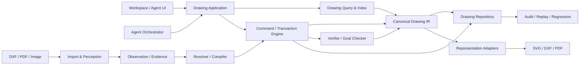

# VectorAI 技术架构（图纸即代码）

**状态：** 当前权威技术文档
**权威设计来源：** [`docs/superpowers/specs/2026-08-08-drawing-as-code-system-architecture-design.md`](./superpowers/specs/2026-08-08-drawing-as-code-system-architecture-design.md)（北极星系统架构）
**历史备份：** 旧 SpatialIntent / SpatialModel 0.2 / 文字步骤 Agent 架构已废弃，存档于 [`docs/superpowers/specs/2026-08-08-legacy-tech-architecture.md`](./superpowers/specs/2026-08-08-legacy-tech-architecture.md)，新开发不得扩展其中旧协议。

## 1. 愿景

VectorAI 的目标是让 AI 像理解、维护和修改代码一样理解、维护和修改真实二维图纸。

代码系统的可靠性来自稳定语法树、符号身份、查询工具、编译器、测试、Diff 和 Commit。VectorAI 对图纸提供对应能力：**Canonical Drawing IR、稳定实体 ID、空间与拓扑查询、类型化 Drawing Command、事务化 Patch、分层验证、Drawing Commit、审计回放和回归测试**。

AI 负责理解目标、选择工具和处理歧义；几何运算、正式修改、验证、版本记录和导出必须由确定性系统完成。

## 2. 三种“真相”

系统明确区分三类数据：

| 真相 | 载体 | 回答的问题 |
|---|---|---|
| 来源真相 | Source Artifact（原始 DXF/PDF/图片，按内容哈希不可变保存） | 数据从哪里来 |
| 编辑真相 | Canonical Drawing IR（`VectorAI-Drawing` 协议 v1.0） | 系统认为图纸是什么，如何修改 |
| 表示结果 | SVG / DXF / PDF（IR 的不同表现） | 如何展示/交付 |

表示结果不反向成为编辑权威；格式降级只发生在 Representation Adapter，并返回 Fidelity Report 和 warnings。

## 3. 总体架构与依赖规则



依赖规则：
- Drawing Core 不依赖 AI、React、Express、网络或文件系统。
- Agent 依赖公开工具和 Application 接口，不访问内部数组。
- UI 保存工作区投影与交互状态，不成为第二个 Drawing 权威。
- Importer 和 Perception 只产生 Observation/Evidence，不直接修改正式文档。
- 所有入口最终汇入同一个 Drawing Application。

## 4. Canonical Drawing IR

序列化协议为 `VectorAI-Drawing`，MVP 初始 `schemaVersion` 为 `1.0`。

```
DrawingDocument
├── geometry     GeometryNode[]      （Point/Line/Ray/XLine/Circle/Arc/Ellipse/Polyline/Spline）
├── annotations  AnnotationNode[]    （Text、Dimension 先实现；Leader/Tolerance/Symbol 协议预留）
├── relations    DrawingRelation[]   （topology / constraint / association / semantic）
├── features     SemanticFeature[]   （状态为 confirmed / candidate，候选必须带置信度与 Evidence）
├── coordinateFrames / unitSystem
└── metadata
```

关键原则：
- 稳定身份：坐标/尺寸变化不改 ID；类型本质变化用 delete + add；新建用 UUID；导入基于 Drawing ID + 源 handle 生成；进程级递增计数不作正式身份。
- 坐标与单位：单位与 CoordinateFrame 明确保存，源/页面/视图/文档坐标变换可追踪，禁止把归一化图片坐标直接视为毫米坐标。
- 关系分 `topology`（连接/闭合/包含/相交）、`constraint`（水平/竖直/平行/正交/相切/同心/同值/距离/半径/角度/对称）、`association`（尺寸/文字/几何绑定）、`semantic`（Feature 组成），各为类型安全联合。

## 5. 唯一修改路径：Command → Transaction → Verify → Commit

AI 和 UI 不得直接改写 DrawingDocument。Command 表达“想做什么”，Patch 表达确定性编译后“具体改了什么”。

执行顺序固定为：
1. 检查 `baseRevision`。
2. 检查前置条件。
3. 将 Command 编译为 Patch。
4. 在临时 DrawingDocument 上应用 Patch。
5. 执行分层文档验证（Schema → Numeric → Reference → Geometry → Topology → Annotation → Semantic → Goal）。
6. 检查目标后置条件。
7. 生成 Preview Event。
8. 原子持久化 Commit 与 resulting revision。

任何阶段失败，正式文档都不变化；Revision 过期返回结构化冲突，不采用 last-write-wins。

- 系统默认自动执行；低置信度事务作为 candidate Commit 提交并在 UI 标红。
- Commit 保存正向 Patch、inversePatch、验证报告、outcome 报告与置信度，必须能不调用模型确定性重放。
- Undo/Redo 采用追加式历史：Undo 通过 `inversePatch` 创建 Revert Commit；Redo 撤销该 Revert 或重放原 Command。

## 6. Goal 驱动的 Agent Runtime（双通道执行）

- **Fast Command Lane**：创建、删除和明确对象修改；流程为理解目标 → 查询对象 → 类型化工具 → Preview → Commit。
- **Workflow Lane**：图片/PDF 感知、复杂多对象任务和分析后修改；流程为输入意图判断 → 感知/查询 → GoalSpec → Workflow Graph → 工具调用 → 持续验收。
- 图片和文字联合输入由 Input Interpreter 判断分析、重建、分析后修改或把图片作为参考，不要求用户操作业务开关。

Tool Registry 首批工具：`query_entities`、`inspect_entity`、`measure_geometry`、`query_topology`、`create_geometry`、`update_geometry`、`delete_geometry`、`create_annotation`、`preview_transaction`、`commit_transaction`、`verify_goal` 及图纸导入与感知工具。每个工具拥有严格 Schema、能力版本、读写属性、超时策略和 Receipt。

失败恢复顺序：Schema/参数错误同模型修正一次 → 目标过期重新查询 → 节点设计错误重新规划 → 模型明确 `confidence < 0.6` 才允许 Turbo 升级一次 → 仍不安全则暂停并保留已验证 Commit。普通 JSON 错误、工具异常和几何验证失败不触发 Turbo。

运行控制：安全点位于工具调用前、Preview 后和 Commit 后；支持暂停、继续、停止、追加指令。热上下文只包含 GoalSpec、稳定规则、当前 revision、最近 Receipts、已完成目标摘要、当前查询结果、用户选择和必要的局部媒体引用。

## 7. 图纸导入与感知

- **DXF**：确定性 Parser 读取原生 CAD 对象，handle 进入 Source Map；图层/图块/填充保存为 opaque records（首版不编辑）；不使用视觉模型重新识别结构化 CAD 内容；无法解析对象产生 Import Warning。
- **PDF**：优先提取矢量路径/文字/页面坐标，矢量不可靠时用页面或局部区域视觉感知；MVP 每次处理一页并提示剩余页。
- **图片**：流水线为页级分析 → 视图分割 → 基准检测 → 局部几何与 OCR → 拓扑 → 尺寸关联 → Resolver → Commands → 分批 Transaction。按视图、局部区域和拓扑组件处理，不按从上到下或对象名称拆解。
- **坐标标定**：归一化只负责媒体与坐标变换，不负责理解；完整变换链为 source → page → view → document；缺可靠比例时进入 provisional CoordinateFrame，解析出可靠尺寸后再通过显式 Transaction 标定。
- **局部失败**：每个拓扑组件独立成事务，单组件失败不回滚其他已验证组件；尺寸关联不唯一时保留候选，不猜测唯一目标。

## 8. 表示与保真度

每个实体或源对象的导出状态为：`native`（无损）/ `approximated`（明确近似）/ `opaque_passthrough`（未理解但原样保留）/ `omitted`（无法导出必须报告）/ `blocked`（阻止文件生成）。SVG 用于工作区显示，DXF 用于 CAD 交换，PDF 用于预览与交付。Core 不执行格式降级。

## 9. 验证与错误协议

事务按顺序执行 Schema、Numeric、Reference、Geometry、Topology、Annotation、Semantic、Goal 验证；Export Validation 在请求导出时执行。验证等级：`error`（阻止 Commit）/ `warning`（允许提交但展示与审计）/ `candidate`（允许候选提交并标红）/ `info`（解释性结果）。Agent 依据 `DrawingError` 的 `code`、`stage`、`retryable` 决定修正/重查/重规划/暂停，不解析错误字符串猜测行为。

## 10. 审计、回放与回归

- Run Manifest：记录 Drawing ID、基础 revision、GoalSpec、Source Artifact 哈希、Prompt 模板哈希、模型角色与版本、工具能力版本、IR/Command/Validator 版本、运行配置和时间。
- API Key、Authorization、媒体 base64 和隐藏思维链不写入审计正文。
- 回放模式：Deterministic Replay（不调模型重放 Commit）、Runtime Replay（用录制输出验证运行时）、Model Regression（重调当前模型比较目标结果、几何误差、实体集合和工具轨迹）。

## 11. 本地持久化

MVP 本地仓库至少分离保存：Source Artifact 媒体正文、Drawing Package metadata、当前与周期性 Snapshot、追加式 Commit、Observation/Evidence、Agent Event Log、Export Fidelity Report。Document revision 与 Commit 使用临时文件加原子替换持久化；Commit 成功前必须保证核心 revision 已持久化。

## 12. 性能预算

- HTTP 接受任务 < 1 秒；首个可见状态事件 < 1 秒。
- 活跃任务最长 25 秒产生一次进度或 heartbeat。
- 简单文字修改首个 Commit 目标 < 30 秒。
- 只读查询与独立视图感知可受控并行；审计写入和非关键 OCR 不阻塞 Commit 主链。
- 热上下文使用索引和局部查询，不发送完整文档。

## 13. MVP 明确不做

任何 3D 实体/曲面/网格/B-Rep/STEP；图层、图块、外部引用和填充的可编辑语义；DWG 原生读写；完整参数化约束求解器；分支/合并/远程同步/多人协作；旧 SpatialModel/SpatialIntent/Commit/审计数据的生产兼容；UI 展示模型名称或隐藏思维链。

## 14. 迁移计划与实施状态

迁移采用分阶段主链替换，每完成一条新主链即删除对应旧入口，不长期维护双协议或 Feature Flag。当前进度：

| 阶段 | 范围 | 状态 |
|---|---|---|
| 一 | Drawing Core V1（IR、稳定 ID、查询、类型化 Command、事务 Preview、可逆 Patch、分层 Validator、In-memory Repository、Revert Commit、确定性 Replay） | ✅ 已实现 |
| 二 | Drawing Application 与本地仓库（应用服务、原子文件快照、重启回放、HTTP Drawing API、浏览器 Client、手工 UI 事务切换） | ✅ 已实现 |
| 三 | Agent Runtime 重建（Tool Registry、Fast Command Lane、GoalSpec、Workflow Graph、Runner、Recovery、Run Control、Progress） | ⬜ 未开始 |
| 四 | 导入与感知重建（Source Artifact Store、DXF Importer、PDF 解析与栅格回退、Image Observation Pipeline、Source Map、Resolver、坐标标定、拓扑组件事务） | ⬜ 未开始 |
| 五 | 表示、审计与回归闭环（SVG/DXF/PDF Adapter、Fidelity Report、统一 Drawing Audit、三种 Replay、黄金样例、性能预算、Preview/Commit Diff） | ⬜ 未开始 |

当前阶段一、二已完成；服务端旧 Agent Runtime、Agent 审计与模型适配仍依赖 SpatialModel/SpatialIntent（为隔离暂存，未删除），它们已与当前 UI 图纸修改主链隔离。迁移完成条件与详细设计见北极星文档第 18–20 节。

## 15. 模块目录速查

- `src/core/`：Spatial Core（旧协议，仅阶段三迁移前临时保留，与 UI 主链隔离）
- `src/drawing/`：Canonical Drawing Core（command/transaction/validation/document/repository/query/preview）
- `src/contracts/`：Drawing 应用契约类型
- `src/services/drawing-client.ts`：浏览器 Drawing API Client
- `src/hooks/drawing-store.ts`：工作区投影、revision、commits 与交互状态（Zustand，非权威）
- `api/services/drawing-application/`：Drawing Application Service 与文件仓库
- `api/services/drawing-agent/`：服务端旧 Agent Runtime（待阶段三重建）
- `api/services/drawing-perception/`：图纸感知（待阶段四重建）
- `api/routes/drawings.ts`、`agent-runs.ts`、`ai.ts`、`auth.ts`：HTTP 路由
- `docs/superpowers/`：权威设计文档与实施计划
