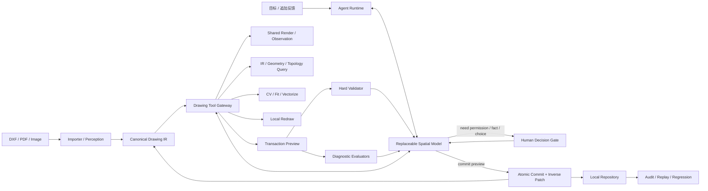

# VectorAI 技术架构：模型主导的二维空间 Agent

> 状态：当前权威技术文档
>
> 更新日期：2026-08-12
>
> 主设计：[`模型主导的二维空间 Agent 与 Human Decision Gate`](./superpowers/specs/2026-08-12-model-led-drawing-agent-and-human-decision-gate-design.md)
>
> 基础内核：[`图纸即代码系统架构`](./superpowers/specs/2026-08-08-drawing-as-code-system-architecture-design.md)

## 1. 架构目标

VectorAI 建立 AI 视觉语义与真实二维空间之间的可操作映射，让模型像编辑代码一样读取、修改、验证和维护图纸。

核心分工是：

- 模型负责智能决策：理解、规划、选工具、修改、观察 Preview 和修正。
- Drawing Core 负责唯一真相：协议、坐标、事务、revision、Patch、回滚和持久化。
- Tool Gateway 负责能力：渲染、空间查询、拓扑、CV、拟合、重绘、矢量化和诊断。
- Human Interaction Service 负责需要用户权限、事实或价值判断的暂停与恢复。

系统不再用低层 Harness 预先固定模型只能修改的选区或编辑方法。任何查询或感知结果都是证据，只有 Drawing Transaction 能改变正式状态。

## 2. 三种真相

| 类型 | 载体 | 职责 |
|---|---|---|
| 来源真相 | Source Artifact：DXF、PDF、图片及内容哈希 | 证明数据来源 |
| 编辑真相 | Canonical Drawing IR：`VectorAI-Drawing` v1.0 | 正式查询、修改、验证和版本化 |
| 派生表示 | SVG、PNG、Mask、DXF、PDF | 显示、模型观察和交付 |

派生表示不能直接覆盖 Drawing IR。图片、Mask、模型回复和工具结果都是 revision-bound Evidence，不是第四份图纸状态。

## 3. 总体架构



依赖规则：

- `src/drawing/` 不依赖 AI、React、Express、网络或文件系统。
- 前端与后端共用 SceneCompiler 和 Drawing IR 类型，不维护第二套几何解释。
- Importer、CV、模型和生成服务只产生 Evidence、Tool Result 或 Drawing Commands。
- Tool Gateway 不保存独立 Drawing Document，所有调用显式绑定 drawing ID 与 revision。
- 所有写入最终汇入 Drawing Application 的事务路径。

## 4. Canonical Drawing IR

```text
DrawingDocument
├── geometry      Point / Line / Ray / XLine / Circle / Arc / Ellipse / Polyline / Spline
├── annotations   Text / Dimension
├── relations     topology / constraint / association / semantic
├── features      CompoundPath 与持久语义 Feature
├── coordinateFrames / unitSystem
└── metadata
```

关键约束：

- 模型拥有四个 plane 的完整合法编辑能力。
- 坐标变化可以保留稳定 ID；类型变化或自由重建可以 delete + create。
- Lineage 记录来源关系，不强求旧节点与新节点一对一或同类型。
- `source → page → view → document` 仿射变换完整保存。
- 拓扑关系来自共享端点、显式关系或带证据的容差连接；视觉交叉不自动等于连接。
- candidate 节点保留置信度和 Evidence，UI 统一标红。

## 5. 来源重建与自适应矢量化

### 5.1 导入策略

- DXF：确定性读取原生对象；暂不编辑的层、块和填充可作为 opaque records 保留。
- PDF：优先提取矢量路径和文字；不可靠页面转入栅格感知。
- 图片：页级分析 → 清洁线稿 → 骨架/轮廓链 → 解析图元与 Polyline/Spline 兜底 → Drawing Transaction。

### 5.2 增量重建

每条来源链在进入事务前完成拟合：候选有效时生成 Line、Circle、Arc、Ellipse；候选无效时保留 Polyline/Spline。多 piece 链生成多个节点，并以 CompoundPath 和 lineage 保存逻辑整体。

链按最终节点数装入小批次。每批独立 Preview、校验、Commit、检查点和审计，因此复杂图纸能逐步显示、暂停和恢复。自动尺寸标注在几何重建后批量生成，不影响几何事务策略。

### 5.3 尺度无关算法

使用全图对角线 `D`、稳健线宽 `W` 与当前链弧长 `L` 生成无量纲阈值。分段由父子拟合误差、最短相对跨度和复杂度惩罚共同决定。算法记录实际尺度、候选点、拟合误差和接受理由，不使用样例坐标或固定像素特例。

来源重建的确定性算法不限制后续 Agent。模型可以通过工具重新拆分、合并、拟合或重建导入结果。

## 6. Agent Runtime

### 6.1 EditEpisode

每个任务建立 EditEpisode：

- 原始目标与追加指令。
- 当前 drawing/revision、工具证据和 Preview。
- 模型动作、诊断、Human Decision 和 Commit 历史。
- 预算、暂停点、恢复状态和最终结果。

### 6.2 模型动作

```ts
type DrawingAgentAction =
  | { type: 'tool'; toolCallId: string; tool: DrawingToolName; input: unknown }
  | { type: 'request-human-decision'; request: HumanDecisionDraft }
  | { type: 'commit'; previewHandle: string; summary: string; confidence?: number }
  | { type: 'finish'; summary: string };
```

模型每轮选择一个动作。Runtime 验证动作协议、执行工具、记录 receipt，并把结构化输出送回模型。固定 Workflow DAG 可以作为展示摘要，但不能限制下一工具或修改方式。

### 6.3 服务预算

Runtime 只施加通用资源限制：

- 单次图像像素和响应大小。
- 工具、模型与 Episode 总超时。
- 只读工具并发与写事务串行。
- 重复候选检测和最大无进展轮数。

预算不包含人体、建筑、动作、左右、图元类别或测试图规则。

## 7. Drawing Tool Gateway

所有工具版本化并返回统一 receipt：tool call ID、输入摘要、revision before/after、结果句柄、受影响节点、状态、耗时和可重试建议。

### 7.1 观察与查询工具

- `render_drawing`
- `query_nodes`
- `inspect_nodes`
- `measure_geometry`
- `compare_views`

渲染支持 overview、viewport、focus、before、preview 和 diff，并保存 world/image 坐标映射。前端画布与后端模型观察使用同一 SceneCompiler。

### 7.2 拓扑与路径工具

- `build_topology`
- `trace_paths`
- `find_interfaces`
- `inspect_fragment`
- `materialize_split`

全局 GeometryTopologyGraph 按 `revision + sampling config + tolerance` 缓存。拓扑工具返回路径、接口、局部间隙、参数范围和不确定性，不生成 `authorizationId`，也不决定最终哪些内容可写。

模型可以反复调用工具：从视觉种子追踪路径、发现断裂、扩大查询、提供第二接口、选择另一候选或放弃拓扑并重绘。

### 7.3 CV、拟合与生成工具

- `run_cv`
- `fit_geometry`
- `redraw_region`
- `vectorize_image`
- `recompute_annotations`

`redraw_region` 接收视图、模型目标、可选 Mask/接口/保护提示并返回图像候选。Mask 是生成上下文，不是 Drawing Transaction 写权限。生成结果必须经过矢量化并由模型明确编译成 Commands。

生成失败作为工具错误返回模型，不自动回退旋转、缩放或其他几何模板。

### 7.4 事务与评估工具

- `preview_transaction`
- `evaluate_preview`
- `commit_preview`

Preview handle 绑定 base revision、Commands digest、resulting document、Patch、inverse Patch、诊断和过期条件。Commit 只能引用仍有效的 Preview。

## 8. Drawing Transaction 与 Lineage

现有 Drawing Commands 继续作为唯一修改语言：

```text
geometry.create / update / delete
annotation.create / update / delete
relation.create / update / delete
feature.create / update / delete
history.revert
```

扩展事务 metadata：

```ts
interface DrawingTransactionMetadata {
  episodeId: string;
  summary: string;
  confidence?: number;
  lineage?: DrawingLineageRecord[];
  decisionGrantRefs?: string[];
  diagnosticAcknowledgements?: string[];
}
```

`DrawingLineageRecord` 支持 `preserve | transform | split | merge | replace | redraw`，保存 source IDs、result IDs、可选参数范围和 Evidence refs。

事务在临时 DrawingDocument 上执行。Commit 使用 compare-and-swap revision 并原子保存 Patch 与 inverse Patch。失败不改变正式状态；Undo 恢复四个 plane 和本次事务解除的约束。

## 9. Validation 与 Diagnostic 分离

### 9.1 Hard Validator

只拒绝：

- Drawing IR Schema、数值和基本几何非法。
- 节点、关系、标注或 Feature 引用不存在。
- Command precondition/postcondition 失败。
- base revision 或 Preview handle 过期。
- Human Interaction Policy 要求的 Permission Grant 缺失或不匹配。

### 9.2 Diagnostic Evaluators

返回结构化 warning 或 decision-required：

- 新增/消失端点、闭合度和拓扑连接变化。
- 局部间隙、分支、相交和尺寸变化。
- 约束影响与标注冲突。
- before/preview/diff 视觉目标达成度。
- 区域外差异、样式、尺度和伪影。

Diagnostic 不修改候选，不强制缩小选区、不强制切换编辑方式。模型根据结果继续修正、解释接受或请求用户决定。

## 10. 标注、约束与 Interaction Policy

### 10.1 标注

标注永远不参与编辑模式路由。几何变化后，模型可调用工具重算、重关联、标记 conflict 或删除重建标注。引用悬空属于 IR error；尺寸变化或布局不佳属于 diagnostic。

### 10.2 约束

约束是 Drawing IR 语义而不是编辑锁：

- 模型读取约束并判断保持、重新满足、更新或解除。
- constraint `violated/unsolved` 返回影响报告，不强制 geometric-edit。
- 删除、放宽或改变已有用户约束含义需要候选级 Permission Grant。

### 10.3 用户锁定与外部副作用

用户锁定内容、约束解除、覆盖导出文件或未来其他敏感动作均由通用 Interaction Policy 判定是否需要 Human Decision。Policy 只判断是否缺少权限，不替模型判断几何方案。

## 11. Human Decision Gate

### 11.1 请求类型

- `grant-permission`
- `choose-option`
- `confirm-intent`
- `provide-context`
- `accept-risk`

请求包含 Episode、revision、候选与事务摘要、问题、理由、选项、推荐项、影响资源和可选 Preview。

### 11.2 Permission Grant

授权绑定：

- request ID 与 Episode。
- 当前 revision。
- transaction digest。
- 精确 action 和 resource IDs。
- `allow` 或 `deny`。
- `candidate` scope。

任一绑定变化后 Grant 失效。MVP 不提供永久允许。

### 11.3 状态与恢复

新增 `waiting_for_user` run 状态。请求产生后在安全点暂停，保存 Episode、Preview 和证据；用户选择、拒绝或补充指令后继续同一上下文。用户主动追加指令与决策响应统一记录为 Human Interaction Event，但保持不同事件类型。

以下情况不得弹窗：普通断线、方向错误、样式漂移、拟合失败、可撤销的常规修改、自动标注重算或模型能通过工具消除的歧义。

## 12. Preview、提交与反馈 Loop

```text
模型调用 preview_transaction
→ Hard Validator
→ Diagnostic Evaluators
→ 后端统一渲染 before/preview/diff
→ UI 显示当前 Preview 与真实工具 Overlay
→ 模型读取全部事实
→ 修正 / 请求用户决定 / commit_preview
```

模型默认自动提交自己认可的候选。仍有 warning 时可以：

- 继续修正。
- 请求用户接受风险。
- 以 candidate 状态提交并标红。

同一失败候选连续重复时，Runtime 返回 digest 相同和诊断未改善的事实，模型必须换工具、换策略、升级模型或结束，不能静默重复。

## 13. UI 与实时事件

- 任务状态贴近输入框，只显示最新真实动作。
- 运行时发送按钮切换为暂停；用户可以追加新指令。
- 画布显示查询点、拓扑路径、Mask、考虑中的节点和当前 Preview。
- Overlay 只表示模型观察/考虑过程，不表示硬写授权。
- `waiting_for_user` 显示紧凑 Decision Card：问题、影响、选项、推荐和 Preview 入口。
- UI 不显示模型名称或隐藏推理；只显示动作摘要、工具结果和修改理由。
- 活跃任务最长约 25 秒产生真实进度或 heartbeat；30 秒不是正确性的硬超时。

## 14. 审计、回放与上下文管理

Run Manifest 记录 Drawing/revision、Goal、Source hash、模型角色、Prompt hash、工具版本、运行配置和时间。

Episode Event Log 记录：

- 用户目标、追加指令和 Human Decision。
- 模型结构化动作与协议修复。
- 工具调用、输入摘要、结果 handle 和 receipt。
- Observation、坐标变换、拓扑/CV/矢量化证据。
- Commands、lineage、Preview、diagnostics 和 commit decision。
- Permission Grant、Patch、inverse Patch 和进度耗时。

不保存 API Key、Authorization、媒体 base64 或隐藏思维链。

两种回放：

- 确定性事务回放：不调用模型，从起始 revision 得到相同 Drawing Document。
- Agent 回归回放：复用历史 Observation 与工具输出评估新模型的工具选择、事务和最终结果。

## 15. 本地持久化

MVP 本地仓库分离保存：

- Source Artifact 与 metadata。
- Drawing snapshot、Commit 和当前 revision。
- Observation/Evidence 与媒体 handle。
- EditEpisode、Tool Receipt、Human Interaction 和 Audit Event。
- Preview、Permission Grant 与 Export Fidelity Report。

核心 revision 与 Commit 使用临时文件和原子替换持久化。媒体正文不嵌入审计 JSON。

## 16. 模块目录与目标边界

- `src/drawing/`：Drawing IR、Command、Transaction、Patch、Validation、Repository、SceneCompiler。
- `src/contracts/drawing-agent.ts`：模型动作、工具 receipt、运行状态和 Human Decision 公共协议。
- `api/services/drawing-agent/`：模型 Loop、Episode、重试、状态与工具调度。
- `api/services/drawing-tools/`：新的模型工具 Gateway 与版本化注册表。
- `api/services/drawing-spatial/`：拓扑、路径、接口、拆分、拟合和 diagnostics；不拥有写授权。
- `api/services/drawing-generation/`：局部生成工具。
- `api/services/drawing-vectorization/`：矢量化与解析图元提升工具。
- `api/services/drawing-vision/`、`drawing-render/`：共享渲染、Observation 和 Diff。
- `api/services/human-interaction/`：Decision Request、Response、Grant、暂停与恢复。
- `api/services/drawing-audit/`、`drawing-episode/`：审计、回放和上下文摘要。

## 17. 架构迁移

### 17.1 保留

- Drawing Core、Application、Repository、SceneCompiler、Patch 和 inverse Patch。
- 自适应矢量化、全局 topology graph、局部拆分、几何拟合和生成服务。
- EditEpisode、审计、真实进度、暂停和恢复基础设施。

### 17.2 改造成工具或诊断

- `TopologyPartResolver` → `trace_paths/find_interfaces`。
- `split-materializer` → `materialize_split`。
- `spatial-validator` → Hard Validator 扩展 + Diagnostic Evaluators。
- `semantic region` → grounding/render/redraw 的可选视觉证据。
- `Strategy Router` → 删除强制路由，只保留模型工具能力描述。

### 17.3 删除旧主链责任

- 删除 Deterministic Spatial Authorization 作为编辑前置条件。
- 删除 accepted SpatialSelection 才能设计的条件。
- 删除 Dimension/constraint 强制 geometric-edit。
- 删除 generation failure 自动回退 geometric transform。
- 删除 locality/protected/boundary/dangling 一概阻断事务的耦合。
- 删除固定 workflow DAG 限制下一工具。

MVP 不保留双主链或长期 Feature Flag。新工具 Loop 与回归通过后直接删除旧入口。

## 18. 测试与发布门禁

### 18.1 核心测试

- 四个 plane 同事务原子修改与 inverse Patch。
- replace/redraw 的 lineage。
- revision/Preview/Grant 过期。
- Hard Validator 与 Diagnostic 分级边界。
- Human Decision 请求、授权、拒绝与恢复。

### 18.2 Agent 集成测试

- 模型可自由组合查询、拓扑、渲染、重绘、矢量化和事务工具。
- 自动标注不改变编辑方法。
- 约束解除进入等待；同意后提交，拒绝后重规划。
- 用户追加指令继续同一 Episode。
- 重复无改善候选能触发换策略而非相同重试。

### 18.3 真实流程基准

- `test1`：复杂来源逐步重建和自由编辑。
- `test2`：多接口语义部件可完整重建，不修改无关结构，不使用对象/动作特例。
- 工程图：精确约束影响、Human Decision 和事务回放。
- 重叠路径、自由形新增、大图分步工具调用与模型升级。

发布前必须使用真实浏览器、真实 Drawing IR 与配置模型跑通，不以 Mock 通过代替端到端效果。
